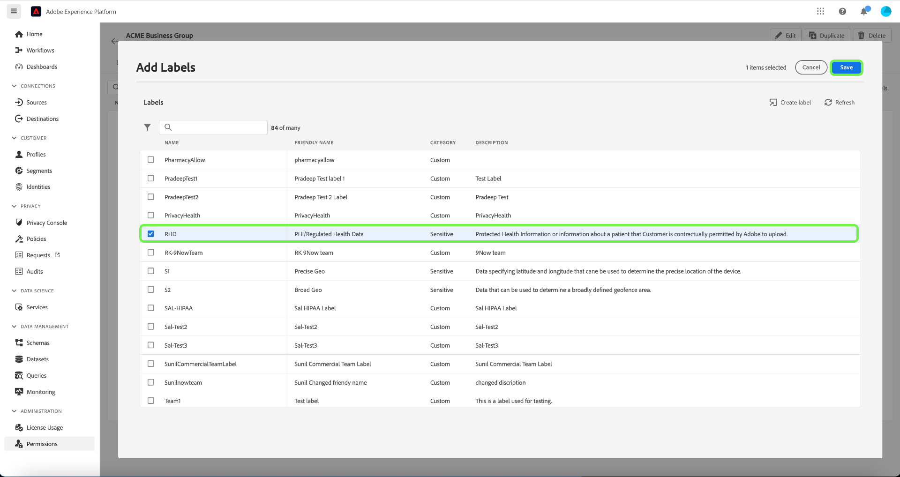
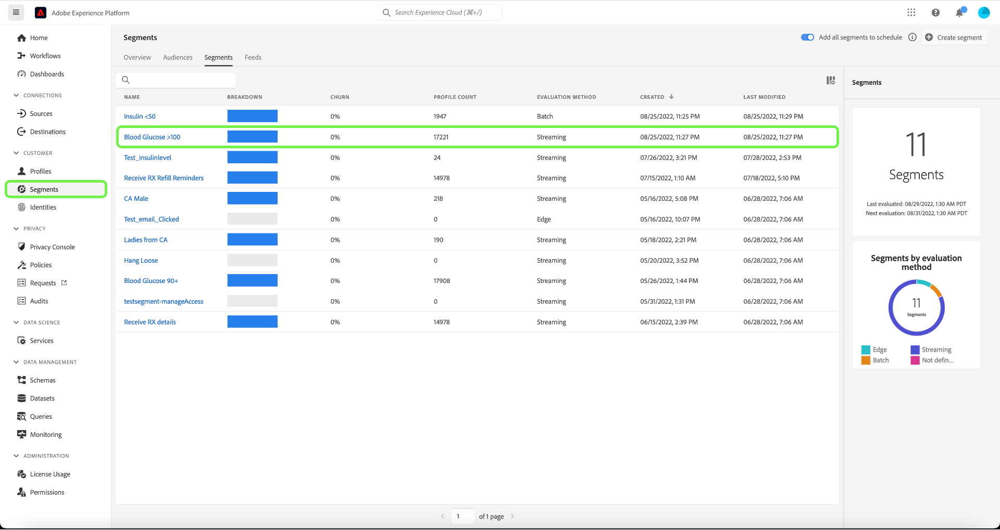
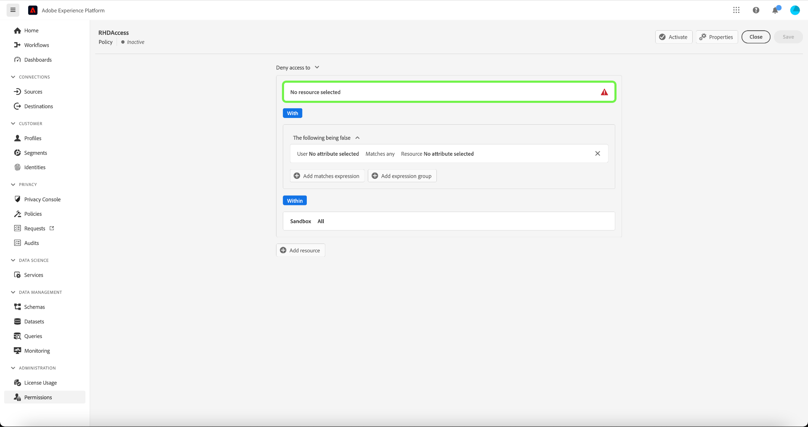

# Handbuch zur attributbasierten Zugriffskontrolle von Ende zu Ende

Die attributbasierte Zugriffskontrolle ist eine Adobe Experience Platform-Funktion, die datenschutzbewussten Marken mehr Flexibilität bei der Verwaltung des Benutzerzugriffs gibt. Einzelne Objekte wie Schemafelder und Segmente können Benutzerrollen zugewiesen werden. Mit dieser Funktion können Sie bestimmten Platform-Benutzern in Ihrer Organisation Zugriff auf einzelne Objekte gewähren oder sperren.

Mit dieser Funktion können Sie Schemafelder, Segmente usw. mit Bezeichnungen kategorisieren, die Organisations- oder Datennutzungsbereiche definieren. In Adobe Journey Optimizer können Sie dieselben Bezeichnungen auf Journey und Angebote anwenden. Parallel dazu können Administratoren Zugriffsrichtlinien für XDM-Schemafelder definieren und besser verwalten, welche Benutzer oder Gruppen (interne, externe oder Drittanbieter-Benutzer) auf diese Felder zugreifen können.

## Erste Schritte

Für dieses Tutorial werden Kenntnisse der folgenden Platform-Komponenten benötigt:

* [[!DNL Experience Data Model (XDM)] System](../../xdm/home.md): Das standardisierte Framework, mit dem Experience Platform Kundenerlebnisdaten organisiert.
   * [Grundlagen der Schemakomposition](../../xdm/schema/composition.md): Machen Sie sich mit den grundlegenden Bausteinen von XDM-Schemas vertraut, einschließlich der wichtigsten Prinzipien und Best Practices bei der Schemaerstellung.
   * [Tutorial zum Schema-Editor](../../xdm/tutorials/create-schema-ui.md): Erfahren Sie, wie Sie benutzerdefinierte Schemas mithilfe der Benutzeroberfläche des Schema-Editors erstellen können.
* [Adobe Experience Platform Segmentation Service](../../segmentation/home.md): Die Segmentierungsmaschine, die in [!DNL Platform] verwendet wird, um Zielgruppensegmente aus Ihren Kundenprofilen basierend auf Kundenverhalten und -attributen zu erstellen.

### Anwendungsfallübersicht

In diesem Handbuch wird ein Beispielanwendungsfall verwendet, bei dem der Zugriff auf vertrauliche Daten eingeschränkt wird, um den Workflow zu demonstrieren. Im Folgenden wird ein Beispiel für einen attribut-basierten Zugriffssteuerungs-Workflow beschrieben, in dem Sie Rollen, Titel und Richtlinien erstellen und zuweisen, um zu konfigurieren, ob Ihre Benutzer auf bestimmte Ressourcen in Ihrer Organisation zugreifen können oder nicht. Dieser Anwendungsfall wird nachfolgend beschrieben:

Sie sind Gesundheitsdienstleister und möchten den Zugriff auf Ressourcen in Ihrem Unternehmen konfigurieren.

* Ihr internes Marketing-Team sollte auf **[!UICONTROL PHI/Reguläre Gesundheitsdaten]** Daten.
* Ihre externe Agentur sollte nicht in der Lage sein, auf **[!UICONTROL PHI/Reguläre Gesundheitsdaten]** Daten.

Dazu müssen Sie Rollen, Ressourcen und Richtlinien konfigurieren.

Sie werden:

* [Rollen für Ihre Benutzer beschriften]{#label-roles}: Verwenden Sie das Beispiel eines Gesundheitsdienstleisters (ACME Business Group), dessen Marketinggruppe mit externen Agenturen zusammenarbeitet.
* [Ressourcen beschriften (Schemafelder und Segmente)]{#label-resources}: Zuweisen der **[!UICONTROL PHI/Reguläre Gesundheitsdaten]** -Beschriftung für Schemaressourcen und -segmente.
* [Erstellen Sie die Richtlinie, die sie miteinander verknüpft]{#policy}: Erstellen Sie eine Richtlinie, um die Beschriftungen in Ihren Ressourcen mit den Beschriftungen in Ihrer Rolle zu verknüpfen, wodurch der Zugriff auf Schemafelder und Segmente verweigert wird. Dadurch wird Benutzern ohne übereinstimmende Beschriftungen der Zugriff auf das Schemafeld und das Segment in allen Sandboxes verweigert.

## Berechtigungen

[!UICONTROL Berechtigungen sind der Bereich von Experience Cloud, in dem Administrierende Benutzerrollen und Zugriffsrichtlinien definieren können, um Zugriffsberechtigungen für Funktionen und Objekte in einem Produktprogramm zu verwalten.]

bis [!UICONTROL Berechtigungen]können Sie Rollen erstellen und verwalten sowie die gewünschten Ressourcenberechtigungen für diese Rollen zuweisen. [!UICONTROL Mit Berechtigungen können Sie auch die Bezeichnungen, Sandboxes und Benutzer*innen verwalten, die einer bestimmten Rolle zugeordnet sind.]

Wenn Sie keine Administratorrechte haben, wenden Sie sich an Ihren Systemadministrator, um Zugriff zu erhalten.

Sobald Sie über Administratorberechtigungen verfügen, wechseln Sie zu [Adobe Experience Cloud](https://experience.adobe.com/) und melden Sie sich mit Ihren Adobe-Anmeldedaten an. Nach der Anmeldung muss die **[!UICONTROL Übersicht]** für Ihre Organisation angezeigt, für die Sie Administratorrechte haben. Auf dieser Seite werden die Produkte angezeigt, die Ihr Unternehmen abonniert hat, sowie weitere Steuerelemente zum Hinzufügen von Benutzern und Administratoren zur Organisation als Ganzes. Auswählen **[!UICONTROL Berechtigungen]** , um den Arbeitsbereich für Ihre Platform-Integration zu öffnen.

Der Arbeitsbereich &quot;Berechtigungen&quot;für die Platform-Benutzeroberfläche wird angezeigt und öffnet sich im **[!UICONTROL Rollen]** Seite.

## Anwenden von Beschriftungen auf eine Rolle {#label-roles}

Rollen sind Möglichkeiten, die Typen von Benutzern zu kategorisieren, die mit Ihrer Platform-Instanz interagieren und Bausteine von Richtlinien zur Zugriffssteuerung sind. Eine Rolle verfügt über bestimmte Berechtigungen und Mitglieder Ihrer Organisation können je nach Umfang des benötigten Zugriffs einer oder mehreren Rollen zugewiesen werden.

Wählen Sie zunächst **[!UICONTROL ACME Business Group]** aus dem **[!UICONTROL Rollen]** Seite.

Wählen Sie als Nächstes **[!UICONTROL Bezeichnungen]** und wählen Sie **[!UICONTROL Hinzufügen von Bezeichnungen]**.

Eine Liste aller Beschriftungen in Ihrer Organisation wird angezeigt. Auswählen **[!UICONTROL RHD]** , um die Bezeichnung für **[!UICONTROL PHI/Reglementierte Gesundheitsdaten]**. Lassen Sie einige Augenblicke zu, bis ein blaues Häkchen neben der Beschriftung angezeigt wird, und wählen Sie dann **[!UICONTROL Speichern]**.

## Anwenden von Bezeichnungen auf Schemafelder {#label-resources}

Sie haben jetzt eine Benutzerrolle mit der [!UICONTROL RHD] -Beschriftung verwenden, besteht der nächste Schritt darin, denselben Titel zu den Ressourcen hinzuzufügen, die Sie für diese Rolle steuern möchten.

Auswählen **[!UICONTROL Schemas]** aus der linken Navigation und wählen Sie dann **[!UICONTROL ACME Gesundheitsfürsorge]** aus der Liste der angezeigten Schemas.

Wählen Sie als Nächstes **[!UICONTROL Bezeichnungen]** um eine Liste anzuzeigen, die die mit Ihrem Schema verknüpften Felder anzeigt. Von hier aus können Sie einem oder mehreren Feldern gleichzeitig Beschriftungen zuweisen. Wählen Sie die **[!UICONTROL BloodGlucose]** und **[!UICONTROL InsulinLevel]** und wählen Sie **[!UICONTROL Bearbeiten von Governance-Titeln]**.

Die **[!UICONTROL Bearbeiten von Bezeichnungen]** angezeigt, in dem Sie die Titel auswählen können, die Sie auf die Schemafelder anwenden möchten. Wählen Sie für diesen Anwendungsfall die **[!UICONTROL PHI/Reguläre Gesundheitsdaten]** Beschriftung und wählen Sie **[!UICONTROL Speichern]**.

>[!NOTE]
>
>Wenn einem Feld eine Beschriftung hinzugefügt wird, wird diese Beschriftung auf die übergeordnete Ressource dieses Felds angewendet (entweder auf eine Klasse oder eine Feldergruppe). Wenn die übergeordnete Klasse oder Feldergruppe von anderen Schemas verwendet wird, übernehmen diese Schemas dieselbe Beschriftung.

## Anwenden von Bezeichnungen auf Segmente

Nachdem Sie die Beschriftung Ihrer Schemafelder abgeschlossen haben, können Sie jetzt mit der Kennzeichnung Ihrer Segmente beginnen.

Auswählen **[!UICONTROL Segmente]** über die linke Navigation. Eine Liste der in Ihrem Unternehmen verfügbaren Segmente wird angezeigt. In diesem Beispiel sind die folgenden beiden Segmente zu kennzeichnen, da sie sensible Gesundheitsdaten enthalten:

* Blutzucker > 100
* Insulin &lt;50

Auswählen **[!UICONTROL Blutzucker > 100]** , um das Segment zu kennzeichnen.

Das Segment **[!UICONTROL Details]** angezeigt. Auswählen **[!UICONTROL Zugriff verwalten]**.

Die **[!UICONTROL Bearbeiten von Bezeichnungen]** angezeigt, sodass Sie die Beschriftungen auswählen können, die Sie auf das Segment anwenden möchten. Wählen Sie für diesen Anwendungsfall die **[!UICONTROL PHI/Reguläre Gesundheitsdaten]** Beschriftung und wählen Sie **[!UICONTROL Speichern]**.

Wiederholen Sie die obigen Schritte mit **[!UICONTROL Insulin &lt;50]**.

## Zugriffskontrollrichtlinie erstellen {#policy}

Zugriffssteuerungsrichtlinien nutzen Beschriftungen, um zu definieren, welche Benutzerrollen Zugriff auf bestimmte Platform-Ressourcen haben. Richtlinien können lokal oder global sein und andere Richtlinien überschreiben. In diesem Beispiel wird der Zugriff auf Schemafelder und Segmente in allen Sandboxes Benutzern verweigert, die nicht über die entsprechenden Beschriftungen im Schemafeld verfügen.

Um eine Zugriffskontrollrichtlinie zu erstellen, wählen Sie **[!UICONTROL Berechtigungen]** aus der linken Navigation und wählen Sie dann **[!UICONTROL Richtlinien]**. Wählen Sie als Nächstes **[!UICONTROL Richtlinie erstellen]**.

Die **[!UICONTROL Neue Richtlinie erstellen]** angezeigt, in dem Sie aufgefordert werden, einen Namen und eine optionale Beschreibung einzugeben. Auswählen **[!UICONTROL Bestätigen]** wenn fertig.

Um den Zugriff auf die Schemafelder zu verweigern, verwenden Sie den Dropdown-Pfeil und wählen Sie **[!UICONTROL Zugriff auf verweigern]** und wählen Sie **[!UICONTROL Keine Ressource ausgewählt]**. Wählen Sie als Nächstes **[!UICONTROL Schemafeld]** und wählen Sie **[!UICONTROL Alle]**.

Die folgende Tabelle zeigt die Bedingungen, die beim Erstellen einer Richtlinie verfügbar sind:

| Bedingungen | Beschreibung |
| --- | --- |
| Folgendes ist falsch | Wenn &quot;Zugriff auf verweigern&quot;festgelegt ist, wird der Zugriff eingeschränkt, wenn der Benutzer die ausgewählten Kriterien nicht erfüllt. |
| Folgendes ist wahr | Wenn die Option &quot;Zugriff auf gewähren&quot;festgelegt ist, wird der Zugriff eingeschränkt, wenn der Benutzer die ausgewählten Kriterien erfüllt. |
| Entspricht allen | Der Benutzer verfügt über eine Beschriftung, die allen auf eine Ressource angewendeten Bezeichnungen entspricht. |
| Entspricht allen | Der Benutzer verfügt über alle Bezeichnungen, die mit allen Bezeichnungen übereinstimmen, die auf eine Ressource angewendet werden. |
| Core-Bezeichnung | Eine Kernbeschriftung ist eine von der Adobe definierte Bezeichnung, die in allen Platform-Instanzen verfügbar ist. |
| Eigene Bezeichnung | Eine benutzerdefinierte Bezeichnung ist eine Bezeichnung, die von Ihrem Unternehmen erstellt wurde. |

Auswählen **[!UICONTROL Folgendes ist falsch]** und wählen Sie **[!UICONTROL Kein Attribut ausgewählt]**. Wählen Sie als Nächstes den Benutzer aus. **[!UICONTROL Core-Bezeichnung]**, wählen Sie **[!UICONTROL Entspricht allen]**. Ressource auswählen **[!UICONTROL Core-Bezeichnung]** und wählen Sie schließlich **[!UICONTROL Ressource hinzufügen]**.

>[!TIP]
>
>Eine Ressource ist das Asset oder Objekt, auf das ein Betreff zugreifen kann oder nicht. Ressourcen können Segmente oder Schemata sein.

Um den Zugriff auf die Segmente zu verweigern, verwenden Sie den Dropdown-Pfeil und wählen Sie **[!UICONTROL Zugriff auf verweigern]** und wählen Sie **[!UICONTROL Keine Ressource ausgewählt]**. Wählen Sie als Nächstes **[!UICONTROL Segment]** und wählen Sie **[!UICONTROL Alle]**.

Auswählen **[!UICONTROL Folgendes ist falsch]** und wählen Sie **[!UICONTROL Kein Attribut ausgewählt]**. Wählen Sie als Nächstes den Benutzer aus. **[!UICONTROL Core-Bezeichnung]**, wählen Sie **[!UICONTROL Entspricht allen]**. Ressource auswählen **[!UICONTROL Core-Bezeichnung]** und wählen Sie schließlich **[!UICONTROL Speichern]**.

Auswählen **[!UICONTROL Aktivieren]** um die Richtlinie zu aktivieren. Daraufhin wird ein Dialogfeld angezeigt, in dem Sie zur Bestätigung der Aktivierung aufgefordert werden. Auswählen **[!UICONTROL Bestätigen]** und wählen Sie **[!UICONTROL Schließen]**.

## Nächste Schritte

Sie haben die Anwendung von Bezeichnungen auf eine Rolle, Schemafelder und Segmente abgeschlossen. Die externe Agentur, die diesen Rollen zugewiesen ist, kann diese Beschriftungen und ihre Werte in der Schema-, Datensatz- und Profilansicht anzeigen. Diese Felder können bei Verwendung von Segment Builder auch nicht in der Segmentdefinition verwendet werden.

Weitere Informationen zur attributbasierten Zugriffssteuerung finden Sie unter [Attributbasierte Zugriffssteuerung – Übersicht](./overview.md).
