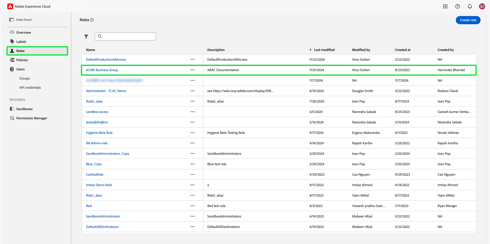

# Leitfaden zur attributbasierten Zugriffskontrolle von Ende zu Ende

Die attributbasierte Zugriffskontrolle ist eine Funktion von Adobe Experience Platform, die es Kunden mit mehreren Marken und datenschutzbewussten Kunden ermöglicht, den Benutzerzugriff flexibler zu verwalten. Der Zugriff auf einzelne Objekte wie Schemafelder und Segmente kann mit Richtlinien gewährt/verweigert werden, die auf den Attributen und der Rolle des Objekts basieren. Mit dieser Funktion können Sie bestimmten Platform-Benutzenden in Ihrer Organisation den Zugriff auf einzelne Objekte gewähren oder sperren.

Mit dieser Funktion können Sie Schemafelder, Segmente usw. mit Bezeichnungen kategorisieren, die Organisations- oder Datennutzungsbereiche definieren. Sie können diese Beschriftungen auf Journey, Angebote und andere Objekte in Adobe Journey Optimizer anwenden. Parallel dazu können Administratoren Zugriffsrichtlinien für Experience-Datenmodell (XDM)-Schemafelder definieren und besser verwalten, welche Benutzer oder Gruppen (interne, externe oder Drittanbieter-Benutzer) auf diese Felder zugreifen können.

>[!NOTE]
>
>Dieses Dokument konzentriert sich auf den Anwendungsfall von Zugriffskontrollrichtlinien. Wenn Sie versuchen, Richtlinien zur Steuerung der **use** Informationen zu Daten und nicht dazu, auf welche Platform-Benutzer Zugriff haben, finden Sie im End-to-End-Handbuch unter [Data Governance](../../data-governance/e2e.md) anstatt.

## Erste Schritte

Für dieses Tutorial werden Kenntnisse der folgenden Platform-Komponenten benötigt:

* [[!DNL Experience Data Model (XDM)] System](../../xdm/home.md): Das standardisierte Framework, mit dem Experience Platform Kundenerlebnisdaten organisiert.
   * [Grundlagen der Schemakomposition](../../xdm/schema/composition.md): Machen Sie sich mit den grundlegenden Bausteinen von XDM-Schemas vertraut, einschließlich der wichtigsten Prinzipien und Best Practices bei der Schemaerstellung.
   * [Tutorial zum Schema-Editor](../../xdm/tutorials/create-schema-ui.md): Erfahren Sie, wie Sie benutzerdefinierte Schemas mithilfe der Benutzeroberfläche des Schema-Editors erstellen können.
* [Adobe Experience Platform Segmentation Service](../../segmentation/home.md): Die Segmentierungsmaschine, die in [!DNL Platform] verwendet wird, um Zielgruppensegmente aus Ihren Kundenprofilen basierend auf Kundenverhalten und -attributen zu erstellen.

### Anwendungsfallübersicht

Im Folgenden wird ein Beispiel für einen attribut-basierten Zugriffssteuerungs-Workflow beschrieben, in dem Sie Rollen, Titel und Richtlinien erstellen und zuweisen, um zu konfigurieren, ob Ihre Benutzer auf bestimmte Ressourcen in Ihrer Organisation zugreifen können oder nicht. In diesem Handbuch wird ein Beispiel für die Beschränkung des Zugriffs auf vertrauliche Daten zur Veranschaulichung des Workflows verwendet. Dieser Anwendungsfall wird nachfolgend beschrieben:

Sie sind Gesundheitsdienstleister und möchten den Zugriff auf Ressourcen in Ihrem Unternehmen konfigurieren.

* Ihr internes Marketing-Team sollte auf **[!UICONTROL PHI/Reguläre Gesundheitsdaten]** Daten.
* Ihre externe Agentur sollte keinen Zugriff haben **[!UICONTROL PHI/Reguläre Gesundheitsdaten]** Daten.

Dazu müssen Sie Rollen, Ressourcen und Richtlinien konfigurieren.

Sie werden:

* [Rollen für Ihre Benutzer beschriften](#label-roles): Verwenden Sie das Beispiel eines Gesundheitsdienstleisters (ACME Business Group), dessen Marketinggruppe mit externen Agenturen zusammenarbeitet.
* [Ressourcen beschriften (Schemafelder und Segmente)](#label-resources): Weisen Sie die **[!UICONTROL PHI/Reguläre Gesundheitsdaten]** -Beschriftung für Schemaressourcen und -segmente.
* 
   * [Aktivieren Sie die Richtlinie, die sie miteinander verknüpft:](#policy): Aktivieren Sie die Standardrichtlinie, um den Zugriff auf Schemafelder und Segmente zu verhindern, indem Sie die Beschriftungen in Ihren Ressourcen mit den Beschriftungen in Ihrer Rolle verbinden. Benutzer mit übereinstimmenden Bezeichnungen erhalten dann Zugriff auf das Schemafeld und das Segment für alle Sandboxes.

## Berechtigungen

[!UICONTROL Berechtigungen] ist der Bereich des Experience Cloud, in dem Administratoren Benutzerrollen und Richtlinien definieren können, um Berechtigungen für Funktionen und Objekte in einer Produktanwendung zu verwalten.

bis [!UICONTROL Berechtigungen]können Sie Rollen erstellen und verwalten und die gewünschten Ressourcenberechtigungen für diese Rollen zuweisen. [!UICONTROL Mit Berechtigungen können Sie auch die Bezeichnungen, Sandboxes und Benutzende verwalten, die einer bestimmten Rolle zugeordnet sind.]

Wenden Sie sich an Ihren Systemadministrator, um Zugriff zu erhalten, wenn Sie nicht über Administratorberechtigungen verfügen.

Sobald Sie über Administratorberechtigungen verfügen, wechseln Sie zu [Adobe Experience Cloud](https://experience.adobe.com/) und melden Sie sich mit Ihren Adobe-Anmeldedaten an. Nach der Anmeldung muss die **[!UICONTROL Übersicht]** für Ihre Organisation angezeigt, für die Sie Administratorrechte haben. Auf dieser Seite werden die Produkte angezeigt, für die sich Ihr Unternehmen angemeldet hat, sowie weitere Steuerelemente zum Hinzufügen von Benutzern und Administratoren zur Organisation. Auswählen **[!UICONTROL Berechtigungen]** , um den Arbeitsbereich für Ihre Platform-Integration zu öffnen.

Der Arbeitsbereich &quot;Berechtigungen&quot;für die Platform-Benutzeroberfläche wird angezeigt und öffnet sich im **[!UICONTROL Rollen]** Seite.

## Anwenden von Beschriftungen auf eine Rolle {#label-roles}

>[!CONTEXTUALHELP]
>id="platform_permissions_labels_about"
>title="Was sind Kennzeichnungen?"
>abstract="Mit Kennzeichnungen können Sie Datensätze und Felder entsprechend den für diese Daten geltenden Nutzungsrichtlinien kategorisieren. Platform bietet einige von Adobe definierte Kennzeichnungen für die Datennutzung, die eine Vielzahl häufiger Einschränkungen beim Daten-Management abdecken. Beispielsweise können Sie mit der Kennzeichnung „S“ sensible Daten kategorisieren, wie etwa RHD (Regulated Health Data, gesetzlich geregelte Gesundheitsdaten), die geschützte Gesundheitsinformationen (Protected Health Information, PHI) enthalten. Sie können auch eigene Kennzeichnungen entsprechend den Anforderungen Ihres Unternehmens definieren."
>additional-url="https://experienceleague.adobe.com/docs/experience-platform/data-governance/labels/overview.html#understanding-data-usage-labels" text="Datennutzungskennzeichnungen – Übersicht"

>[!CONTEXTUALHELP]
>id="platform_permissions_labels_about_create"
>title="Erstellen neuer Kennzeichnungen"
>abstract="Sie können eigene Kennzeichnungen entsprechend den Anforderungen Ihres Unternehmens definieren. Mithilfe benutzerdefinierter Kennzeichnungen können Sie auf Ihre Daten Konfigurationen für Data Governance und Zugriffssteuerung anwenden."
>additional-url="https://experienceleague.adobe.com/docs/experience-platform/data-governance/labels/overview.html#manage-labels" text="Verwalten von benutzerdefinierten Kennzeichnungen"

>[!CONTEXTUALHELP]
>id="platform_permissions_roles_about"
>title="Was sind Rollen?"
>abstract="Rollen sind Möglichkeiten, die Typen von Benutzenden zu kategorisieren, die mit Ihrer Platform-Instanz interagieren, und stellen Bausteine von Richtlinien zur Zugriffssteuerung dar. Eine Rolle verfügt über bestimmte Berechtigungen, wobei Mitglieder Ihrer Organisation je nach dem Umfang des Lese- oder Schreibzugriffs, den sie benötigen, einer oder mehreren Rollen zugewiesen werden können."
>additional-url="https://experienceleague.adobe.com/docs/experience-platform/access-control/abac/permissions-ui/roles.html?lang=de" text="Verwalten von Rollen"

>[!CONTEXTUALHELP]
>id="platform_permissions_roles_about_create"
>title="Erstellen einer neuen Rolle"
>abstract="Sie können eine neue Rolle erstellen, um Benutzende, die auf Ihre Platform-Instanz zugreifen, besser zu kategorisieren. So können Sie beispielsweise eine Rolle für ein internes Marketing-Team erstellen und die RHD-Kennzeichnung auf diese Rolle anwenden, sodass Ihr internes Marketing-Team auf geschützte Gesundheitsinformationen (PHI) zugreifen kann. Alternativ können Sie auch eine Rolle für eine externe Agentur erstellen und dieser Rolle den Zugriff auf PHI-Daten verweigern, indem Sie die RHD-Kennzeichnung nicht auf diese Rolle anwenden."
>additional-url="https://experienceleague.adobe.com/docs/experience-platform/access-control/abac/permissions-ui/roles.html#create-a-new-role" text="Erstellen einer neuen Rolle"

>[!CONTEXTUALHELP]
>id="platform_permissions_roles_details"
>title="Rollenübersicht"
>abstract="Im Dialogfenster „Rollenübersicht“ werden die Ressourcen und Sandboxes angezeigt, auf die eine bestimmte Rolle zugreifen darf."

Rollen dienen der Kategorisierung der Arten von Benutzern, die mit Ihrer Platform-Instanz interagieren, und bilden Bausteine von Richtlinien zur Zugriffssteuerung. Eine Rolle verfügt über bestimmte Berechtigungen und Mitglieder Ihrer Organisation können je nach Umfang des benötigten Zugriffs einer oder mehreren Rollen zugewiesen werden.

Wählen Sie zunächst **[!UICONTROL ACME Business Group]** aus dem **[!UICONTROL Rollen]** Seite.

Wählen Sie als Nächstes **[!UICONTROL Bezeichnungen]** und wählen Sie **[!UICONTROL Hinzufügen von Bezeichnungen]**.

Eine Liste aller Beschriftungen in Ihrer Organisation wird angezeigt. Auswählen **[!UICONTROL RHD]** , um die Bezeichnung für **[!UICONTROL PHI/Reglementierte Gesundheitsdaten]**. Lassen Sie einige Augenblicke zu, bis ein blaues Häkchen neben der Beschriftung angezeigt wird, und wählen Sie dann **[!UICONTROL Speichern]**.

>[!NOTE]
>
>Beim Hinzufügen einer Organisationsgruppe zu einer Rolle werden alle Benutzer dieser Gruppe zur Rolle hinzugefügt. Änderungen an der Organisationsgruppe (Benutzer werden entfernt oder hinzugefügt) werden automatisch in der Rolle aktualisiert.

## Anwenden von Bezeichnungen auf Schemafelder {#label-resources}

Sie haben jetzt eine Benutzerrolle mit der [!UICONTROL RHD] -Beschriftung verwenden, besteht der nächste Schritt darin, denselben Titel zu den Ressourcen hinzuzufügen, die Sie für diese Rolle steuern möchten.

Auswählen **[!UICONTROL Schemas]** aus der linken Navigation und wählen Sie dann **[!UICONTROL ACME Gesundheitsfürsorge]** aus der Liste der angezeigten Schemas.

Wählen Sie als Nächstes **[!UICONTROL Bezeichnungen]** um eine Liste anzuzeigen, die die mit Ihrem Schema verknüpften Felder anzeigt. Von hier aus können Sie einem oder mehreren Feldern gleichzeitig Beschriftungen zuweisen. Wählen Sie die **[!UICONTROL BloodGlucose]** und **[!UICONTROL InsulinLevel]** und wählen Sie **[!UICONTROL Anwenden von Zugriffs- und Data Governance-Beschriftungen]**.

Die **[!UICONTROL Bearbeiten von Bezeichnungen]** angezeigt, in dem Sie die Titel auswählen können, die Sie auf die Schemafelder anwenden möchten. Wählen Sie für diesen Anwendungsfall die **[!UICONTROL PHI/Reguläre Gesundheitsdaten]** Beschriftung und wählen Sie **[!UICONTROL Speichern]**.

>[!NOTE]
>
>Wenn einem Feld eine Beschriftung hinzugefügt wird, wird diese Beschriftung auf die übergeordnete Ressource dieses Felds angewendet (entweder auf eine Klasse oder eine Feldergruppe). Wenn die übergeordnete Klasse oder Feldergruppe von anderen Schemas verwendet wird, übernehmen diese Schemas dieselbe Beschriftung.

## Anwenden von Bezeichnungen auf Segmente

Nachdem Sie die Beschriftung Ihrer Schemafelder abgeschlossen haben, können Sie jetzt mit der Kennzeichnung Ihrer Segmente beginnen.

Auswählen **[!UICONTROL Segmente]** über die linke Navigation. Eine Liste der in Ihrem Unternehmen verfügbaren Segmente wird angezeigt. In diesem Beispiel sind die folgenden beiden Segmente zu kennzeichnen, da sie sensible Gesundheitsdaten enthalten:

* Blutzucker > 100
* Insulin &lt;50

Auswählen **[!UICONTROL Blutzucker > 100]** , um das Segment zu kennzeichnen.

Das Segment **[!UICONTROL Details]** angezeigt. Auswählen **[!UICONTROL Zugriff verwalten]**.

Die **[!UICONTROL Bearbeiten von Bezeichnungen]** angezeigt, sodass Sie die Beschriftungen auswählen können, die Sie auf das Segment anwenden möchten. Wählen Sie für diesen Anwendungsfall die **[!UICONTROL PHI/Reguläre Gesundheitsdaten]** Beschriftung und wählen Sie **[!UICONTROL Speichern]**.

Wiederholen Sie die obigen Schritte mit **[!UICONTROL Insulin &lt;50]**.

## Zugriffssteuerungsrichtlinie aktivieren {#policy}

Die standardmäßige Zugriffssteuerungsrichtlinie nutzt Beschriftungen, um zu definieren, welche Benutzerrollen Zugriff auf bestimmte Platform-Ressourcen haben. In diesem Beispiel wird der Zugriff auf Schemafelder und -segmente in allen Sandboxes Benutzern verweigert, die sich nicht in einer Rolle befinden, die über die entsprechenden Beschriftungen im Schemafeld verfügt.

Um die Zugriffskontrollrichtlinie zu aktivieren, wählen Sie [!UICONTROL Berechtigungen] aus der linken Navigation und wählen Sie dann **[!UICONTROL Richtlinien]**.

Wählen Sie als Nächstes die Auslassungszeichen (`...`) neben dem Richtliniennamen und in einem Dropdown-Menü werden Steuerelemente zum Bearbeiten, Aktivieren, Löschen oder Duplizieren der Rolle angezeigt. Auswählen **[!UICONTROL Aktivieren]** aus dem Dropdown-Menü aus.

Das Dialogfeld Richtlinie aktivieren wird angezeigt, in dem Sie zur Bestätigung der Aktivierung aufgefordert werden. Auswählen **[!UICONTROL Bestätigen]**.

Die Aktivierung der Richtlinie wird bestätigt und Sie werden zum [!UICONTROL Richtlinien] Seite.

<!-- ## Create an access control policy {#policy}

>[!CONTEXTUALHELP]
>id="platform_permissions_policies_about"
>title="What are policies?"
>abstract="Policies are statements that bring attributes together to establish permissible and impermissible actions. Every organization comes with a default policy that you must activate to define rules for resources like segments and schema fields. Default policies can neither be edited nor deleted. However, default policies can be activated or deactivated."
>additional-url="https://experienceleague.adobe.com/docs/experience-platform/access-control/abac/permissions-ui/policies.html" text="Manage policies"

>[!CONTEXTUALHELP]
>id="platform_permissions_policies_about_create"
>title="Create a policy"
>abstract="Create a policy to define the actions that your users can and cannot take against your segments and schema fields."
>additional-url="https://experienceleague.adobe.com/docs/experience-platform/access-control/abac/permissions-ui/policies.html#create-a-new-policy" text="Create a policy"

>[!CONTEXTUALHELP]
>id="platform_permissions_policies_edit_permitdeny"
>title="Configure permissible and impermissible actions for a policy"
>abstract="A <b>deny access to</b> policy will deny users access when the criteria is met. Combined with <b>The following being false</b> - all users will be denied access unless they meet the matching criteria set. This type of policy allows you to protect a sensitive resource and only allow access to users with matching labels.  A <b>permit access to</b> policy will permit users access when the criteria are met. When combined with <b>The following being true</b> - users will be given access if they meet the matching criteria set. This does not explicitly deny access to users, but adds a permit access. This type of policy allows you to give additional access to resource and in addition to those users who might already have access through role permissions."
>additional-url="https://experienceleague.adobe.com/docs/experience-platform/access-control/abac/permissions-ui/policies.html#edit-a-policy" text="Edit a policy"

>[!CONTEXTUALHELP]
>id="platform_permissions_policies_edit_resource"
>title="Configure permissions for a resource"
>abstract="A resource is the asset or object that a user can or cannot access. Resources can be segments or schemas fields. You can configure write, read, or delete permissions for segments and schema fields."

>[!CONTEXTUALHELP]
>id="platform_permissions_policies_edit_condition"
>title="Edit conditions"
>abstract="Apply conditional statements to your policy to configure user access to certain resources. Select match all to require users to have roles with the same labels as a resource to be permitted access. Select match any to require users to have a role with just one label matching a label on a resource. Labels can either be defined as core or custom labels, with core labels representing labels created and provided by Adobe and custom labels representing labels that you created for your organization."

Access control policies leverage labels to define which user roles have access to specific Platform resources. Policies can either be local or global and can override other policies. In this example, access to schema fields and segments will be denied in all sandboxes for users who don't have the corresponding labels in the schema field.

>[!NOTE]
>
>A "deny policy" is created to grant access to sensitive resources because the role grants permission to the subjects. The written policy in this example **denies** you access if you are missing the required labels.

To create an access control policy, select **[!UICONTROL Permissions]** from the left navigation and then select **[!UICONTROL Policies]**. Next, select **[!UICONTROL Create policy]**.

The **[!UICONTROL Create new policy]** dialog appears, prompting you to enter a name and an optional description. Select **[!UICONTROL Confirm]** when finished.

To deny access to the schema fields, use the dropdown arrow and select **[!UICONTROL Deny access to]** and then select **[!UICONTROL No resource selected]**. Next, select **[!UICONTROL Schema Field]** and then select **[!UICONTROL All]**.

The table below shows the conditions available when creating a policy:

| Conditions | Description |
| --- | --- |
| The following being false| When 'Deny access to' is set, access will be restricted if the user does not meet the criteria selected. |
| The following being true| When 'Permit access to' is set, access will be permitted if the user meets the selected criteria. |
| Matches any| The user has a label that matches any label applied to a resource. |
| Matches all| The user has all labels that matches all labels applied to a resource. |
| Core label| A core label is an Adobe-defined label that is available in all Platform instances.|
| Custom label| A custom label is a label that has been created by your organization.|

Select **[!UICONTROL The following being false]** and then select **[!UICONTROL No attribute selected]**. Next, select the user **[!UICONTROL Core label]**, then select **[!UICONTROL Matches all]**. Select the resource **[!UICONTROL Core label]** and finally select **[!UICONTROL Add resource]**.

>[!TIP]
>
>A resource is the asset or object that a subject can or cannot access. Resources can be segments or schemas.

To deny access to the segments, use the dropdown arrow and select **[!UICONTROL Deny access to]** and then select **[!UICONTROL No resource selected]**. Next, select **[!UICONTROL Segment]** and then select **[!UICONTROL All]**.

Select **[!UICONTROL The following being false]** and then select **[!UICONTROL No attribute selected]**. Next, select the user **[!UICONTROL Core label]**, then select **[!UICONTROL Matches all]**. Select the resource **[!UICONTROL Core label]** and finally select **[!UICONTROL Save]**.

Select **[!UICONTROL Activate]** to activate the policy, and a dialog appears which prompts you to confirm activation. Select **[!UICONTROL Confirm]** and then select **[!UICONTROL Close]**.

 -->

## Nächste Schritte

Sie haben die Anwendung von Bezeichnungen auf eine Rolle, Schemafelder und Segmente abgeschlossen. Die externe Agentur, die diesen Rollen zugewiesen ist, kann diese Bezeichnungen und ihre Werte in der Schema-, Datensatz- und Profilansicht nicht anzeigen. Diese Felder können bei Verwendung von Segment Builder auch nicht in der Segmentdefinition verwendet werden.

Weitere Informationen zur attributbasierten Zugriffssteuerung finden Sie unter [Attributbasierte Zugriffssteuerung – Übersicht](./overview.md).

Im folgenden Video wird beschrieben, wie Sie die attributbasierte Zugriffskontrolle verstehen und Rollen, Ressourcen und Richtlinien konfigurieren.

>[!VIDEO](https://video.tv.adobe.com/v/345641?learn=on)
