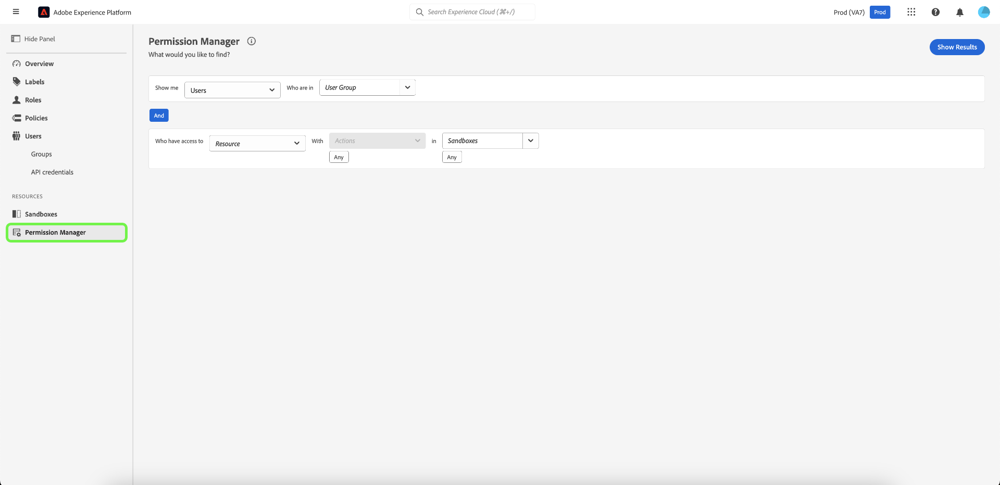

# Übersicht über den Berechtigungs-Manager {#attribute-based-access-control-overview}

>[!NOTE]
>
>Um auf [!UICONTROL Berechtigungs-Manager] zugreifen zu können, müssen Sie ein Produktadministrator sein. Wenn Sie keine Administratorrechte haben, wenden Sie sich an Ihren Systemadministrator, um Zugriff zu erhalten.

Die [!UICONTROL Berechtigungs-Manager]-Funktion bietet Berichterstellung und ermöglicht es Ihnen, die vollständige Zugriffssteuerungsumgebung anzuzeigen. Mithilfe einfacher Abfragen können Sie klare Berichte erstellen, die Ihnen das Verständnis der Zugriffsverwaltung erleichtern und Ihnen weniger Zeit bei der Überprüfung von Zugriffsberechtigungen auf zahlreichen Workflows und Granularitätsstufen widmen.

Mit [!UICONTROL Permission Manager] können Sie nach folgenden Kriterien suchen:

* [Benutzer und Benutzergruppe](./permissions.md)
* [Rollen und Beschriftungen](./permissions.md)

Sie können Ihre Suche einschränken, indem Sie bestimmte Ressourcen, Aktionen und Sandboxes auswählen.

Um auf [!UICONTROL Berechtigungs-Manager] für [!DNL Experience Platform] zugreifen zu können, müssen Sie Administrator einer Organisation sein, die Zugriff auf Experience Platform hat. Adobe ermöglicht zwar anpassbare Administratorhierarchien innerhalb Ihrer Organisation, Sie müssen jedoch ein Produktadministrator für das [!DNL Adobe Experience Platform] sein. Weitere Informationen finden Sie im Adobe Help Center-Artikel zu [Administrationsrollen](https://helpx.adobe.com/de/enterprise/using/admin-roles.html).

Melden Sie sich mit Ihren [!DNL Adobe] Anmeldeinformationen bei [&#128279;](https://experience.adobe.com/)0&rbrace;Adobe Experience Platform an.    Nach der Anmeldung sehen Sie die Seite **[!UICONTROL Übersicht]** für Ihre Organisation. Auf dieser Seite werden die Produkte angezeigt, die Ihr Unternehmen abonniert hat. Um den Arbeitsbereich für die attributbasierte Zugriffssteuerung für die Platform-Integration zu starten, wählen Sie **[!UICONTROL Berechtigungen]** aus.

Der Arbeitsbereich Attributbasierte Zugriffssteuerung für Experience Platform wird angezeigt, indem er auf der Seite **[!UICONTROL Übersicht]** geöffnet wird. Auf dieser Seite können Sie alle Rollen anzeigen und verschiedene Einstellungen verwalten, wie in diesem Dokument beschrieben.

Wählen **[!UICONTROL Berechtigungs-Manager]** im linken Navigationsbereich aus.

## Nächste Schritte

Nachdem Sie zum Arbeitsbereich [!UICONTROL Berechtigungs-Manager] navigiert sind, fahren Sie mit dem nächsten Schritt fort, um mehr darüber zu erfahren, wie Sie ([ und Rollen) ](./permissions.md) können.
