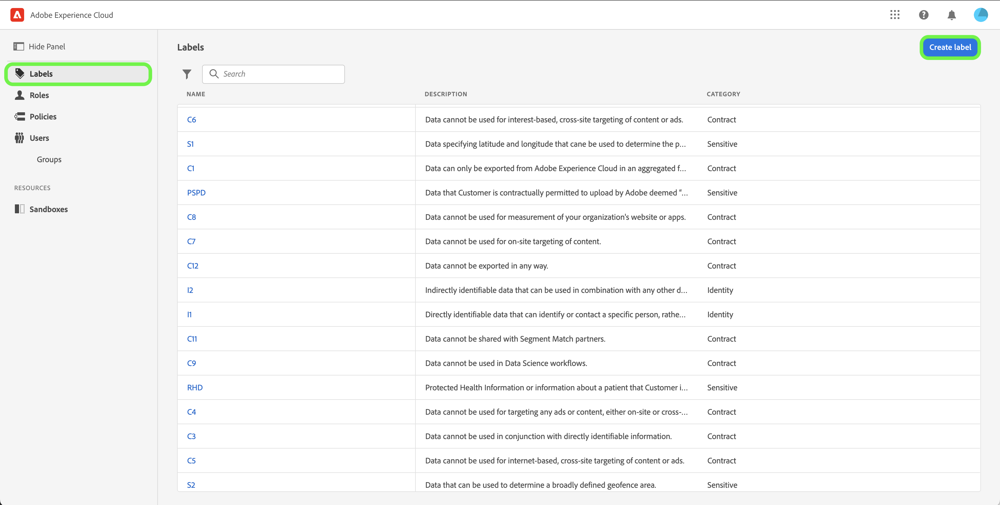

# Verwalten von Labels

>[!NOTE]
>
>Um berechnete Attribute mit Feldern zu erstellen oder anzuzeigen, die eine bestimmte Kennzeichnung enthalten, benötigen Sie Zugriff auf diese Kennzeichnung.

Mit Kennzeichnungen können Sie Datensätze und Felder entsprechend den für diese Daten geltenden Datennutzungs- und Zugriffsrichtlinien kategorisieren. Labels können jederzeit angewendet werden, was eine flexible Handhabung der Daten ermöglicht. Best Practices legen nahe, Daten direkt bei ihrer Aufnahme in Experience Platform oder ab dem Zeitpunkt ihrer Nutzbarkeit in Experience Platform mit einer Beschriftung zu versehen.

## Erstellen einer neuen Kennzeichnung {#create-new-label}

>[!CONTEXTUALHELP]
>id="platform_abac_labelusage"
>title="Verwendung von Kennzeichnungen"
>abstract="Sie können benutzerdefinierte Kennzeichnungen verwenden, um Data-Governance- und Zugriffssteuerungs-Konfigurationen auf Ihre Daten anzuwenden."

>[!CONTEXTUALHELP]
>id="platform_permissions_labels_about_create"
>title="Erstellen neuer Kennzeichnungen"
>abstract="Sie können eigene Kennzeichnungen entsprechend den Anforderungen Ihres Unternehmens definieren. Mithilfe benutzerdefinierter Kennzeichnungen können Sie auf Ihre Daten Konfigurationen für Data Governance und Zugriffssteuerung anwenden."
>additional-url="https://experienceleague.adobe.com/docs/experience-platform/data-governance/labels/overview.html?lang=de#manage-labels" text="Verwalten von benutzerdefinierten Labels"

>[!NOTE]
>
>Es gibt nur eine Kennzeichnungsliste für eine gesamte Organisation. Um eine benutzerdefinierte Kennzeichnung zu erstellen, benötigen Sie **[!UICONTROL Manage Usage Labels]** für die Produktions-Sandbox. Das Löschen von Kennzeichnungen wird derzeit nicht unterstützt.

Um eine neue Beschriftung zu erstellen, wählen Sie die Registerkarte **[!UICONTROL Labels]** in der Seitenleiste aus und klicken Sie auf **[!UICONTROL Create Label]**.

Das Dialogfeld **[!UICONTROL Create a new label]** wird angezeigt und fordert Sie zur Eingabe eines Namens, eines optionalen Anzeigenamens und einer optionalen Beschreibung auf.

Wenn Sie fertig sind, wählen Sie **[!UICONTROL Confirm]** aus.
