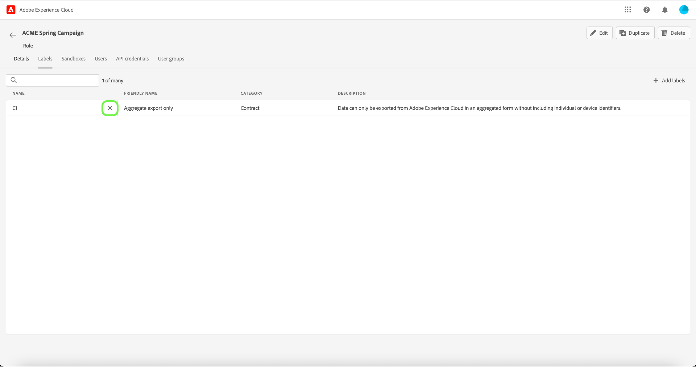
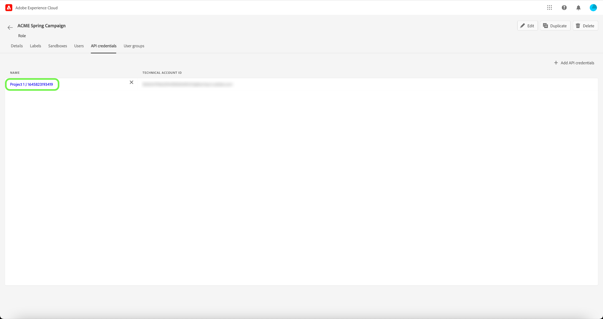

# Berechtigungen für eine Rolle verwalten

>[!IMPORTANT]
>
>Die attribut-basierte Zugriffskontrolle ist derzeit in einer eingeschränkten Version für US-Kunden im Gesundheitswesen verfügbar. Diese Funktion steht allen Real-time Customer Data Platform-Kunden nach der vollständigen Veröffentlichung zur Verfügung.

>[!IMPORTANT]
>
>Die Zugriffskontrolle verwendet die Benutzer-ID (eine interne eindeutige ID, die einem Benutzer zugewiesen ist) für die Erteilung von Berechtigungen. Wenn eine Organisation von Adobe ID zu Business ID migriert wird, gehen alle für ihre Benutzer festgelegten Berechtigungen verloren, da sich die Benutzer-ID ändert und die Zugriffskontrolle die neu generierte Benutzer-ID verwendet. Wenn Ihr Unternehmen zu einer Business ID migriert wird, wenden Sie sich an Ihren Kundenbetreuer, um Ihre Adobe-ID von Adobe ID zu Business ID zu migrieren.

Berechtigungen sind der Bereich des Experience Cloud, in dem Administratoren Benutzerrollen und Zugriffsrichtlinien definieren können, um Zugriffsberechtigungen für Funktionen und Objekte in einer Produktanwendung zu verwalten.

Über Berechtigungen können Sie Rollen erstellen und verwalten sowie die gewünschten Ressourcenberechtigungen für diese Rollen zuweisen. Mit Berechtigungen können Sie auch die Bezeichnungen, Sandboxes und Benutzer verwalten, die einer bestimmten Rolle zugeordnet sind.

Sofort nach [Erstellen einer neuen Rolle](#create-a-new-role), kehren Sie zum **[!UICONTROL Rollen]** Registerkarte. Wenn Sie Berechtigungen für eine vorhandene Rolle bearbeiten, wählen Sie die Rolle aus der **[!UICONTROL Rollen]** Registerkarte. Alternativ können Sie die Filteroption verwenden, um die Ergebnisse zu filtern und nach einer Rolle zu suchen.

## Rollen filtern

Wählen Sie das Trichtersymbol (), um eine Liste von Filtersteuerelementen anzuzeigen, die die Eingrenzung der Ergebnisse unterstützen.

Die folgenden Filter sind für Rollen in der Benutzeroberfläche verfügbar:

| Filter | Beschreibung |
| --- | --- |
| [!UICONTROL Erstellt zwischen] | Wählen Sie ein Startdatum und/oder ein Enddatum aus, um einen Datumsbereich zu definieren, nach dem die Ergebnisse gefiltert werden sollen. |
| [!UICONTROL Erstellt von] | Filtern Sie nach Rollenersteller, indem Sie einen Benutzer aus der Dropdown-Liste auswählen. |
| [!UICONTROL Geändert zwischen] | Wählen Sie ein Startdatum und/oder ein Enddatum aus, um einen Datumsbereich zu definieren, nach dem die Ergebnisse gefiltert werden sollen. |
| [!UICONTROL Modified by] | Filtern Sie nach Rollenmodifikator, indem Sie einen Benutzer aus der Dropdown-Liste auswählen. |

Um einen Filter zu entfernen, wählen Sie das &quot;X&quot;auf dem Pillensymbol für den betreffenden Filter aus oder wählen Sie **[!UICONTROL Alle löschen]** um alle Filter zu entfernen.

## Rollendetails

Wählen Sie die Rolle aus dem **[!UICONTROL Rollen]** -Registerkarte, auf der die Detailseite der Rolle geöffnet wird.

Die Registerkarte &quot;Details&quot;bietet einen Überblick über die Rolle. In der Übersicht werden der Rollenname, die Rollenbeschreibung, der Name des Benutzers, der die Rolle erstellt und geändert hat, der Zeitpunkt, zu dem die Rolle erstellt und geändert wurde, und die der Rolle zugewiesenen Berechtigungen angezeigt. Der Rollenname und die Rollenbeschreibung können bei Bedarf geändert werden.

## Verwalten von Bezeichnungen für eine Rolle

Wählen Sie die **[!UICONTROL Bezeichnungen]** Registerkarte, um die Seite mit den Rollen-Bezeichnungen zu öffnen, und wählen Sie **[!UICONTROL Hinzufügen von Bezeichnungen]** , um der Rolle Beschriftungen zuzuweisen.

Beschriftungen werden auf dieser Seite aufgelistet. In der Liste werden der Titel, der Anzeigename, die Kategorie und die Beschreibung angezeigt.

Wählen Sie die Titel aus der Liste aus, die Sie der Rolle hinzufügen möchten, und wählen Sie dann **[!UICONTROL Speichern]**

Hinzugefügte Beschriftungen werden unter **[!UICONTROL Bezeichnungen]** Registerkarte.

Um eine Bezeichnung aus einer Rolle zu entfernen, wählen Sie die **X** neben dem Namen der Beschriftung.

## Verwalten von Sandboxes für Rollen

Wählen Sie die **[!UICONTROL Sandboxes]** Registerkarte , um die Seite mit den Rollen-Sandboxes zu öffnen. Hier sehen Sie eine Liste der Sandboxes, die der Rolle hinzugefügt wurden.

Um weitere Sandboxes zur Rollenauswahl hinzuzufügen **[!UICONTROL Bearbeiten]**.

Im nächsten Bildschirm werden Sie aufgefordert, die Ressourcenberechtigungen zu wählen, die in Sandboxes vorhanden sind, die mithilfe des Dropdown-Menüs in die Rolle aufgenommen werden sollen. Wenn Sie fertig sind, wählen Sie **[!UICONTROL Speichern und beenden]**.

## Verwalten von Benutzern für Rollen

Wählen Sie die **[!UICONTROL Benutzer]** Registerkarte, um die Benutzerseite für die Rollen zu öffnen, und wählen Sie **[!UICONTROL Benutzer hinzufügen]** , um Benutzer der Rolle zuzuweisen.

Wählen Sie die Benutzer aus der Liste aus, die Sie der Rolle hinzufügen möchten. Alternativ können Sie in der Suchleiste nach dem Benutzer suchen, indem Sie dessen Namen oder E-Mail-Adresse eingeben und dann **[!UICONTROL Speichern]**

Hinzugefügte Benutzer werden unter **[!UICONTROL Benutzer]** Registerkarte.

Um einen Benutzer aus einer Rolle zu entfernen, wählen Sie die **X** neben dem Benutzernamen.

## Verwalten von API-Anmeldeinformationen für Rollen

Wählen Sie die **[!UICONTROL API-Anmeldeinformationen]** Registerkarte, um die Seite mit den Rollen-API-Anmeldeinformationen zu öffnen, und wählen Sie **[!UICONTROL API-Anmeldeinformationen hinzufügen]** , um der Rolle API-Anmeldeinformationen zuzuweisen.

Wählen Sie die API-Anmeldeinformationen aus der Liste aus, die Sie der Rolle hinzufügen möchten, und wählen Sie dann **[!UICONTROL Speichern]**

Hinzugefügte API-Anmeldeinformationen werden unter **[!UICONTROL API-Anmeldeinformationen]** Registerkarte.

Um API-Anmeldeinformationen aus einer Rolle zu entfernen, wählen Sie die **X** neben dem Namen der API-Anmeldedaten.

Die **[!UICONTROL API-Anmeldeinformationen löschen]** angezeigt, in dem Sie aufgefordert werden, den Löschvorgang zu bestätigen.

Sie werden zum **[!UICONTROL API-Anmeldeinformationen]** Registerkarte.

## Verwalten von Benutzergruppen für Rollen

Benutzergruppen sind mehrere Benutzer, die gruppiert wurden und Zugriff haben, um dieselben Funktionen auszuführen.

Wählen Sie die **[!UICONTROL Benutzergruppen]** Registerkarte, um die Seite mit den Benutzergruppen für Rollen zu öffnen, und wählen Sie **[!UICONTROL Gruppen hinzufügen]** , um der Rolle Benutzergruppen zuzuweisen.

Wählen Sie die Benutzergruppen aus der Liste aus, die Sie der Rolle hinzufügen möchten. Alternativ können Sie über die Suchleiste nach der Benutzergruppe suchen, indem Sie den Namen der Gruppe eingeben und dann **[!UICONTROL Speichern]**

Hinzugefügte Benutzergruppe wird unter **[!UICONTROL Benutzergruppen]** Registerkarte.

Um eine Benutzergruppe aus einer Rolle zu entfernen, wählen Sie die **X** neben dem Benutzergruppennamen.

Die **[!UICONTROL Benutzergruppe löschen]** angezeigt, in dem Sie aufgefordert werden, den Löschvorgang zu bestätigen.

Sie werden zum **[!UICONTROL Benutzergruppen]** Registerkarte.

## Nächste Schritte

Nachdem Sie die Berechtigungen festgelegt haben, können Sie mit dem nächsten Schritt fortfahren, um [Benutzer verwalten](users.md).
