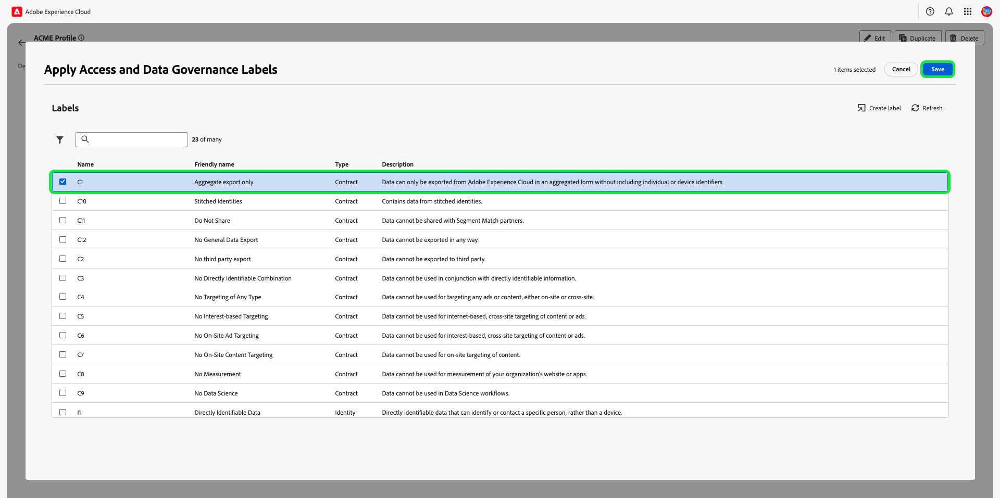

# Verwalten der Berechtigungen für eine Rolle

>[!IMPORTANT]
>
>Die Zugriffssteuerung verwendet die Benutzer-ID (eine interne eindeutige ID, die einem Benutzer zugewiesen ist) zum Gewähren von Berechtigungen. Wenn eine Organisation von Adobe ID zu Business ID migriert wird, gehen alle für ihre Benutzer festgelegten Berechtigungen verloren, da sich die Benutzer-ID ändert und die Zugriffssteuerung die neu generierte Benutzer-ID verwendet. Wenn Ihre Organisation zu Business ID migriert wird, wenden Sie sich an den Adobe-Support-Mitarbeiter, um Ihre Benutzer-ID von Adobe ID zu Business ID zu migrieren.

Berechtigungen sind der Bereich von Experience Cloud, in dem Admins Benutzerrollen und Zugriffsrichtlinien definieren können, um Zugriffsberechtigungen für Funktionen und Objekte in einem Produktprogramm zu verwalten.

Über Berechtigungen können Sie Rollen erstellen und verwalten sowie die gewünschten Ressourcenberechtigungen für diese Rollen zuweisen. Mit Berechtigungen können Sie auch die Bezeichnungen, Sandboxes und Benutzende verwalten, die einer bestimmten Rolle zugeordnet sind. 

Nach dem [Erstellen einer neuen Rolle](#create-a-new-role) werden Sie sofort zur Registerkarte **[!UICONTROL Rollen]** zurückgeleitet. Wenn Sie Berechtigungen für eine vorhandene Rolle bearbeiten, wählen Sie die Rolle auf der Registerkarte **[!UICONTROL Rollen]** aus. Alternativ können Sie die Filteroption verwenden, um die Ergebnisse zu filtern und nach einer Rolle zu suchen.

## Filtern von Rollen

Wählen Sie das Trichtersymbol () aus, um eine Liste von Filterfeldern anzuzeigen, mit denen die Ergebnisse eingegrenzt werden können.

In der Benutzeroberfläche sind folgende Filter für Rollen verfügbar:

| Filter | Beschreibung |
| --- | --- |
| [!UICONTROL Erstellt zwischen] | Wählen Sie ein Startdatum und/oder ein Enddatum aus, um einen Datumsbereich zu definieren, nach dem die Ergebnisse gefiltert werden sollen. |
| [!UICONTROL Erstellt von] | Filtern Sie nach dem Rollenersteller, indem Sie einen Benutzer aus der Dropdown-Liste auswählen. |
| [!UICONTROL Geändert zwischen] | Wählen Sie ein Startdatum und/oder ein Enddatum aus, um einen Datumsbereich zu definieren, nach dem die Ergebnisse gefiltert werden sollen. |
| [!UICONTROL Geändert von] | Filtern Sie nach dem Rollenmodifikator, indem Sie einen Benutzer aus der Dropdown-Liste auswählen. |

Um einen Filter zu entfernen, klicken Sie auf das „X“ auf dem Symbol für den betreffenden Filter, oder wählen Sie **[!UICONTROL Alle löschen]** aus, um alle Filter zu entfernen.

## Rollendetails

Wählen Sie auf der Registerkarte **[!UICONTROL Rollen]** die Rolle aus. Daraufhin wird die Detailseite der Rolle geöffnet.

Die Registerkarte „Details“ bietet einen Überblick über die Rolle. In dieser Übersicht werden der Rollenname, die Rollenbeschreibung, der Name des Benutzers, der die Rolle erstellt und geändert hat, der Zeitpunkt, zu dem die Rolle erstellt und geändert wurde, und die der Rolle zugewiesenen Berechtigungen angezeigt. Der Rollenname und die Rollenbeschreibung können bei Bedarf geändert werden.

## Verwalten von Beschriftungen für eine Rolle

Wählen Sie die Registerkarte **[!UICONTROL Bezeichnungen]** aus, um die Seite mit den Rollenbezeichnungen zu öffnen, und wählen Sie **[!UICONTROL Beschriftungen hinzufügen]** aus, um der Rolle Beschriftungen zuzuweisen.

Die Beschriftungen werden auf dieser Seite aufgelistet. In der Liste werden der Name der Beschriftung, der Anzeigename, die Kategorie und die Beschreibung angezeigt.

Wählen Sie in der Liste die Beschriftungen aus, die Sie der Rolle hinzufügen möchten, und klicken Sie dann auf **[!UICONTROL Speichern]**.

Hinzugefügte Beschriftungen werden auf der Registerkarte **[!UICONTROL Beschriftungen]** angezeigt.

Um eine Beschriftung von einer Rolle zu entfernen, klicken Sie auf das **X** neben dem Namen der Beschriftung.

## Verwalten von Sandboxes für Rollen

Wählen Sie die Registerkarte **[!UICONTROL Sandboxes]** aus, um die Seite mit den Rollen-Sandboxes zu öffnen. Hier sehen Sie eine Liste der Sandboxes, die der Rolle hinzugefügt wurden.

Um einer Rolle weitere Sandboxes hinzuzufügen, wählen Sie **[!UICONTROL Bearbeiten]** aus.

Im nächsten Bildschirm werden Sie aufgefordert, über die Dropdown-Liste auszuwählen, welche in Sandboxes vorhandenen Ressourcenberechtigungen in die Rolle aufgenommen werden sollen. Wenn Sie fertig sind, klicken Sie auf **[!UICONTROL Speichern und beenden]**.

## Verwalten von Benutzenden für Rollen

Wählen Sie die Registerkarte **[!UICONTROL Benutzer]**, um die Benutzerseite für Rollen zu öffnen, und klicken Sie auf **[!UICONTROL Benutzer hinzufügen]**, um Benutzende der Rolle zuzuweisen.

Wählen Sie die Benutzenden aus der Liste aus, die Sie der Rolle hinzufügen möchten. Alternativ können Sie in der Suchleiste nach dem Benutzer suchen, indem Sie dessen Namen oder E-Mail-Adresse eingeben. Klicken Sie dann auf **[!UICONTROL Speichern]**.

Hinzugefügte Benutzer erscheinen auf der Registerkarte **[!UICONTROL Benutzer]**.

Um einen Benutzer aus einer Rolle zu entfernen, klicken Sie auf das Symbol **X** neben dem Namen des Benutzers.

## Verwalten von API-Anmeldeinformationen für Rollen {#manage-api-credentials-for-role}

Wählen Sie die Registerkarte **[!UICONTROL API-Anmeldeinformationen]** aus, um die Seite mit den Rollen-API-Anmeldeinformationen zu öffnen, und klicken Sie auf **[!UICONTROL API-Anmeldeinformationen hinzufügen]**, um der Rolle API-Anmeldeinformationen zuzuweisen.

Wählen Sie die API-Anmeldeinformationen aus der Liste aus, die Sie der Rolle hinzufügen möchten, und klicken Sie auf **[!UICONTROL Speichern]**.

Hinzugefügte API-Anmeldeinformationen erscheinen auf der Registerkarte **[!UICONTROL API-Anmeldeinformationen]**.

Um API-Anmeldeinformationen aus einer Rolle zu entfernen, klicken Sie auf das Symbol **X** neben dem Namen der API-Anmeldeinformation.

Der Dialog **[!UICONTROL API-Anmeldeinformationen entfernen]** wird angezeigt, in dem Sie aufgefordert werden, den Löschvorgang zu bestätigen.

Sie werden zur Registerkarte **[!UICONTROL API-Anmeldeinformationen]** zurückgeleitet.

## Verwalten von Benutzergruppen für Rollen

Benutzergruppen sind mehrere Benutzer, die gruppiert wurden und Zugriff haben, um dieselben Funktionen auszuführen.

Wählen Sie die Registerkarte **[!UICONTROL Benutzergruppen]** aus, um die Seite mit den Benutzergruppen für Rollen zu öffnen, und klicken Sie auf **[!UICONTROL Gruppen hinzufügen]**, um der Rolle Benutzergruppen zuzuweisen.

Wählen Sie aus der Liste die Benutzergruppen aus, die Sie der Rolle hinzufügen möchten. Alternativ können Sie über die Suchleiste nach der Benutzergruppe suchen, indem Sie den Namen der Gruppe eingeben. Klicken Sie dann auf **[!UICONTROL Speichern]**.

Hinzugefügte Benutzergruppe erscheinen auf der Registerkarte **[!UICONTROL Benutzergruppen]**.

Um eine Benutzergruppe aus einer Rolle zu entfernen, wählen Sie das Symbol **X** neben dem Namen der Benutzergruppe aus.

Der Dialog **[!UICONTROL Benutzergruppe entfernen]** wird angezeigt, in dem Sie aufgefordert werden, den Löschvorgang zu bestätigen.

Sie werden zur Registerkarte **[!UICONTROL Benutzergruppen]** zurückgeleitet.

## Hinzufügen von Benutzenden zur Experience Platform über ein Produktprofil

Um einen Benutzer zu einem Produktprofil hinzuzufügen, melden Sie sich bei der Admin Console an und wählen Sie **[!UICONTROL Benutzer hinzufügen]** aus.

Der Dialog **[!UICONTROL Benutzer zu Ihrem Team hinzufügen]** wird angezeigt. Geben Sie die E-Mail-Adresse des Benutzers, den Vornamen (optional) und den Nachnamen (optional) ein.

Wählen Sie das Stiftsymbol aus, um Produkte und Benutzergruppen auszuwählen. Wählen Sie **[!UICONTROL Adobe Experience Platform]**, wählen Sie **[!UICONTROL AEP-Default-All-Users]**, wählen Sie  **[!UICONTROL Speichern]**.

## Nächste Schritte

Nachdem Sie die Berechtigungen festgelegt haben, können Sie mit dem nächsten Schritt, [Benutzer verwalten](users.md), fortfahren.
