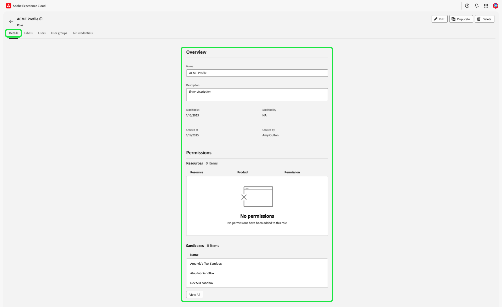
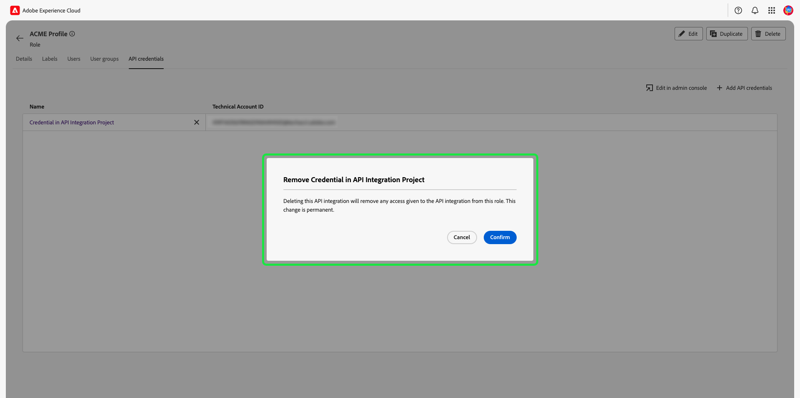

# Verwalten der Berechtigungen für eine Rolle {#manage-role-permissions}

>[!CONTEXTUALHELP]
>id="platform_permissions_roles_about"
>title="Was sind Rollen?"
>abstract="Rollen definieren den Zugriff, den ein Administrator, ein Spezialist oder ein Endbenutzer auf Ressourcen in Ihrer Organisation hat. Sie kategorisieren die Benutzer, die mit Ihrer Platform-Instanz interagieren, und sind die Bausteine von Richtlinien zur Zugriffssteuerung. Eine Rolle verfügt über bestimmte Berechtigungen, wobei Mitglieder Ihrer Organisation je nach dem Umfang des Lese- oder Schreibzugriffs, den sie benötigen, einer oder mehreren Rollen zugewiesen werden können."
>additional-url="https://experienceleague.adobe.com/docs/experience-platform/access-control/abac/permissions-ui/roles.html?lang=de" text="Verwalten von Rollen"

>[!IMPORTANT]
>
>Die Zugriffssteuerung verwendet die Benutzer-ID (eine interne eindeutige ID, die einem Benutzer zugewiesen ist) zum Gewähren von Berechtigungen. Wenn eine Organisation von Adobe ID zu Business ID migriert wird, gehen alle für ihre Benutzer festgelegten Berechtigungen verloren, da sich die Benutzer-ID ändert und die Zugriffssteuerung die neu generierte Benutzer-ID verwendet. Wenn Ihre Organisation zu Business ID migriert wird, wenden Sie sich an den Adobe-Support-Mitarbeiter, um Ihre Benutzer-ID von Adobe ID zu Business ID zu migrieren.

Berechtigungen sind der Bereich von Experience Cloud, in dem Admins Benutzerrollen und Zugriffsrichtlinien definieren können, um Zugriffsberechtigungen für Funktionen und Objekte in einem Produktprogramm zu verwalten.

Über Berechtigungen können Sie Rollen erstellen und verwalten sowie die gewünschten Ressourcenberechtigungen für diese Rollen zuweisen. Mit Berechtigungen können Sie auch die Bezeichnungen, Sandboxes und Benutzende verwalten, die einer bestimmten Rolle zugeordnet sind. 

Nach dem [Erstellen einer neuen Rolle](#create-a-new-role) werden Sie sofort zur Registerkarte **[!UICONTROL Rollen]** zurückgeleitet. Wenn Sie Berechtigungen für eine vorhandene Rolle bearbeiten, wählen Sie die Rolle auf der Registerkarte **[!UICONTROL Rollen]** aus. Alternativ können Sie die Filteroption verwenden, um die Ergebnisse zu filtern und nach einer Rolle zu suchen.

## Filtern von Rollen

Wählen Sie das Trichtersymbol () aus, um eine Liste von Filterfeldern anzuzeigen, mit denen die Ergebnisse eingegrenzt werden können.

In der Benutzeroberfläche sind folgende Filter für Rollen verfügbar:

| Filter | Beschreibung |
| --- | --- |
| [!UICONTROL Erstellt zwischen] | Wählen Sie ein Startdatum und/oder ein Enddatum aus, um einen Datumsbereich zu definieren, nach dem die Ergebnisse gefiltert werden sollen. |
| [!UICONTROL Erstellt von] | Filtern Sie nach dem Rollenersteller, indem Sie einen Benutzer aus der Dropdown-Liste auswählen. |
| [!UICONTROL Geändert zwischen] | Wählen Sie ein Startdatum und/oder ein Enddatum aus, um einen Datumsbereich zu definieren, nach dem die Ergebnisse gefiltert werden sollen. |
| [!UICONTROL Geändert von] | Filtern Sie nach dem Rollenmodifikator, indem Sie einen Benutzer aus der Dropdown-Liste auswählen. |

Um einen Filter zu entfernen, klicken Sie auf das „X“ auf dem Symbol für den betreffenden Filter, oder wählen Sie **[!UICONTROL Alle löschen]** aus, um alle Filter zu entfernen.

## Rollendetails {#role-details}

>[!CONTEXTUALHELP]
>id="platform_permissions_roles_details"
>title="Rollenübersicht"
>abstract="Das Dialogfeld „Rollenübersicht“ zeigt die Details der Rolle an, einschließlich der Ressourcen und Sandboxes, auf die eine bestimmte Rolle zugreifen darf. Sie können Beschriftungen, Benutzer, Benutzergruppen und API-Anmeldeinformationen für die Rolle verwalten, indem Sie zur entsprechenden Registerkarte im Arbeitsbereich der Rolle navigieren."
>additional-url="https://experienceleague.adobe.com/en/docs/experience-platform/access-control/abac/permissions-ui/permissions#manage-labels-for-a-role" text="Verwalten von Beschriftungen für eine Rolle"
>additional-url="https://experienceleague.adobe.com/en/docs/experience-platform/access-control/abac/permissions-ui/permissions#manage-users-for-a-role" text="Verwalten von Benutzern für eine Rolle"

Wählen Sie auf der Registerkarte **[!UICONTROL Rollen]** die Rolle aus. Daraufhin wird das Dashboard [!UICONTROL Details] der Rolle geöffnet.

Das [!UICONTROL Details]-Dashboard bietet einen Überblick über die Rolle. In der Übersicht werden der Rollenname, die Beschreibung, der Ersteller und der letzte Modifikator sowie das Erstellungs- und Änderungsdatum angezeigt. Außerdem werden die mit der Rolle verbundenen Berechtigungen und die Liste der zugewiesenen Sandboxes angezeigt. Der Rollenname und die Beschreibung können bei Bedarf geändert werden.

## Verwalten von Beschriftungen für eine Rolle

Wählen Sie die Registerkarte **[!UICONTROL Bezeichnungen]** aus, um den Arbeitsbereich für Rollenbezeichnungen zu öffnen, und wählen Sie **[!UICONTROL Beschriftungen hinzufügen]** aus, um der Rolle Beschriftungen zuzuweisen.

Das **[!UICONTROL Anwenden von Zugriffs- und Data Governance]** Beschriftungen“ wird angezeigt, das eine Liste von Beschriftungen enthält. In der Liste werden der Name der Beschriftung, der Anzeigename, die Kategorie und die Beschreibung angezeigt.

Wählen Sie in der Liste die Beschriftungen aus, die Sie der Rolle hinzufügen möchten, und klicken Sie dann auf **[!UICONTROL Speichern]**.

Hinzugefügte Beschriftungen werden auf der Registerkarte **[!UICONTROL Beschriftungen]** angezeigt.

Um eine Beschriftung von einer Rolle zu entfernen, wählen Sie die Beschriftung aus und klicken Sie dann auf **[!UICONTROL Beschriftungen entfernen]**.

## Verwalten von Sandboxes für eine Rolle

Wählen Sie die **[!UICONTROL Details]** aus und navigieren Sie zum Abschnitt **[!UICONTROL Sandboxes]**. Wählen Sie **[!UICONTROL Alle anzeigen]** aus, um die vollständige Liste der der Rolle hinzugefügten Sandboxes anzuzeigen.

Um einer Rolle weitere Sandboxes hinzuzufügen, wählen Sie **[!UICONTROL Bearbeiten]** oben rechts in der Benutzeroberfläche aus.

Im nächsten Bildschirm werden Sie aufgefordert, über die Dropdown-Liste auszuwählen, welche Sandbox-Ressourcen in die Rolle aufgenommen werden sollen. Klicken Sie abschließend auf **[!UICONTROL Speichern]** und dann auf **[!UICONTROL Schließen]**.

## Verwalten von Benutzern für eine Rolle

Wählen Sie die Registerkarte **[!UICONTROL Benutzer]** aus, um die Rollen [!UICONTROL Benutzer] zu öffnen, und klicken Sie dann auf **[!UICONTROL Benutzer hinzufügen]**, um der Rolle Benutzer zuzuweisen.

Das **[!UICONTROL „Benutzer hinzufügen]** wird angezeigt. Wählen Sie die Benutzenden aus der Liste aus, die Sie der Rolle hinzufügen möchten. Alternativ können Sie in der Suchleiste nach dem Benutzer suchen, indem Sie dessen Namen oder E-Mail-Adresse eingeben. Klicken Sie dann auf **[!UICONTROL Speichern]**.

Hinzugefügte Benutzer erscheinen auf der Registerkarte **[!UICONTROL Benutzer]**.

Um einen Benutzer aus einer Rolle zu entfernen, klicken Sie auf das Symbol **X** neben dem Namen des Benutzers.

Im folgenden Video erfahren Sie, wie Sie eine neue Rolle erstellen und Benutzer für diese Rolle verwalten.

>[!VIDEO](https://video.tv.adobe.com/v/336081/?learn=on)

## Verwalten von API-Anmeldeinformationen für eine Rolle {#manage-api-credentials-for-role}

>[!IMPORTANT]
>
> Um API-Anmeldeinformationen in „Berechtigungen[!UICONTROL  verwenden ] verwalten zu können, müssen Benutzerinnen und Benutzer über Systemadministratorrechte verfügen.

Um Experience Platform-APIs als Anwender oder Entwickler verwenden zu können, muss ein Systemadministrator zusätzlich zu den einer Rolle zugewiesenen Berechtigungen API-Anmeldeinformationen hinzufügen. Eine vollständige Anleitung zum Erstellen und Zuweisen von API-Anmeldeinformationen sowie die erforderlichen Berechtigungen finden Sie im schrittweisen Tutorial unter [Authentifizieren und Zugreifen auf Experience Platform-APIs](../../../landing/api-authentication.md#generate-credentials).

Wählen Sie die Registerkarte **[!UICONTROL API-Anmeldeinformationen]** aus, um den Arbeitsbereich mit den Rollen-API-Anmeldeinformationen zu öffnen, und wählen Sie **[!UICONTROL API-Anmeldeinformationen hinzufügen]** aus, um der Rolle API-Anmeldeinformationen zuzuweisen.

Das **[!UICONTROL API-Anmeldeinformationen hinzufügen]** wird angezeigt. Wählen Sie API-Anmeldeinformationen aus der Liste aus, um der Rolle hinzuzufügen, und wählen Sie dann **[!UICONTROL Speichern]**

Hinzugefügte API-Anmeldeinformationen erscheinen auf **[!UICONTROL Registerkarte]** API-Anmeldeinformationen“.

Um API-Anmeldeinformationen aus einer Rolle zu entfernen, klicken Sie auf das Symbol **X** neben dem Namen der API-Anmeldeinformationen.

Das **[!UICONTROL API-Anmeldeinformationen entfernen]** wird angezeigt, in dem Sie aufgefordert werden, den Löschvorgang zu bestätigen. Wählen Sie **[!UICONTROL Bestätigen]** aus, um das Entfernen der ausgewählten Berechtigung abzuschließen.

Sie werden zur Registerkarte **[!UICONTROL API-Anmeldedaten]** zurückgeleitet.

## Verwalten von Benutzergruppen für eine Rolle

Benutzergruppen sind mehrere Benutzer, die gruppiert wurden und Zugriff haben, um dieselben Funktionen auszuführen.

Wählen Sie die **[!UICONTROL Benutzergruppen]** aus, um den Arbeitsbereich Benutzergruppen der Rolle zu öffnen, und wählen Sie dann **[!UICONTROL Gruppen hinzufügen]**, um der Rolle Benutzergruppen zuzuweisen.

Das **[!UICONTROL Gruppen hinzufügen]** wird angezeigt. Wählen Sie aus der Liste die Benutzergruppen aus, die Sie der Rolle hinzufügen möchten. Alternativ können Sie über die Suchleiste nach der Benutzergruppe suchen, indem Sie den Namen der Gruppe eingeben. Klicken Sie dann auf **[!UICONTROL Speichern]**.

Hinzugefügte Benutzergruppe erscheinen auf der Registerkarte **[!UICONTROL Benutzergruppen]**.

Um eine Benutzergruppe aus einer Rolle zu entfernen, wählen Sie das Symbol **X** neben dem Namen der Benutzergruppe aus.

Der **[!UICONTROL Benutzergruppe entfernen]** erscheint, in dem Sie aufgefordert werden, den Löschvorgang zu bestätigen. Klicken Sie **[!UICONTROL Bestätigen]**, um die ausgewählte Benutzergruppe zu entfernen.

Sie werden zur Registerkarte **[!UICONTROL Benutzergruppen]** zurückgeleitet.

## Benutzer zum Experience Platform hinzufügen

Als Systemadministrator können Sie einem Benutzer Entwicklerzugriff gewähren, damit er in der Adobe Developer Console [Integrationen ](../../../landing/api-authentication.md#generate-credentials) kann.

Um eine Benutzer-Experience Platform hinzuzufügen, melden Sie sich bei der Admin Console  an und wählen Sie **[!UICONTROL Benutzer hinzufügen]** aus.

Das Dialogfeld **[!UICONTROL Benutzer zum Team hinzufügen]** wird angezeigt. Geben Sie die E-Mail-Adresse, den Vornamen (optional) und den Nachnamen (optional) des Benutzers ein. Wählen Sie dann **[!UICONTROL Produkte]** aus.

Das **[!UICONTROL Produkte auswählen]** wird angezeigt. **[!UICONTROL Adobe Experience Platform]**.

Das **[!UICONTROL Produktprofile auswählen]** wird angezeigt. Wählen Sie **[!UICONTROL AEP-Default-All-Users]** und dann **[!UICONTROL Speichern]** aus.

Überprüfen Sie die Informationen und wählen Sie dann **[!UICONTROL Speichern]** aus, um den Benutzer hinzuzufügen.

## Nächste Schritte

Nachdem Sie die Berechtigungen festgelegt haben, können Sie mit dem nächsten Schritt, [Benutzer verwalten](users.md), fortfahren.
