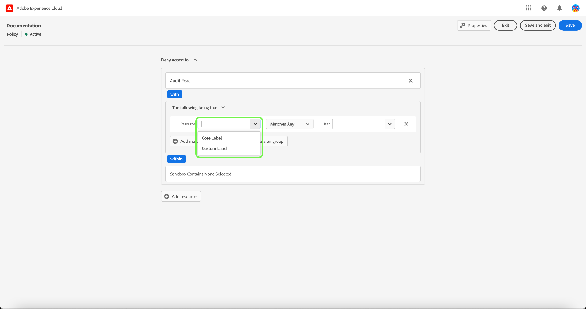

# Richtlinien verwalten

Richtlinien sind Aussagen, die Attribute zusammenbringen, um zulässige und unzulässige Handlungen festzustellen. Richtlinien können lokal oder global sein und andere Richtlinien überschreiben.

## Neue Richtlinie erstellen

Um eine neue Richtlinie zu erstellen, wählen Sie die **[!UICONTROL Richtlinien]** Registerkarte in der Seitenleiste und wählen Sie **[!UICONTROL Richtlinie erstellen]**.

Die **[!UICONTROL Neue Richtlinie erstellen]** angezeigt, in dem Sie aufgefordert werden, einen Namen und eine optionale Beschreibung einzugeben. Wenn Sie fertig sind, wählen Sie **[!UICONTROL Bestätigen]**.

Wählen Sie mithilfe des Dropdown-Pfeils aus, ob Sie **Zugriff auf** () eine Ressource oder **Zugriff auf verweigern** () eine Ressource.

Wählen Sie anschließend über das Dropdown-Menü die Ressource aus, die Sie in die Richtlinie aufnehmen möchten, und suchen Sie nach dem Zugriffstyp (Lesen oder Schreiben).

Wählen Sie anschließend mithilfe des Dropdown-Pfeils die Bedingung aus, die Sie auf diese Richtlinie anwenden möchten. **Folgendes ist wahr** () oder **Folgendes ist falsch** ().

Wählen Sie das Pluszeichen aus, um **Ausdruck für Übereinstimmungen hinzufügen** oder **Ausdrucksgruppe hinzufügen** für die Ressource.

Wählen Sie mithilfe des Dropdown-Menüs die **Ressource**.

Wählen Sie anschließend mithilfe der Dropdown-Liste die **Stimmt überein mit**.

Wählen Sie anschließend mithilfe des Dropdown-Menüs den Titel (**[!UICONTROL Core-Bezeichnung]** oder **[!UICONTROL Eigene Bezeichnung]**), um die dem Benutzer in den Rollen zugewiesene Bezeichnung zu übernehmen.

Wählen Sie abschließend die **Sandbox** die mithilfe des Dropdown-Menüs angewendet werden sollen.

Auswählen **Ressource hinzufügen** , um weitere Ressourcen hinzuzufügen. Wählen Sie nach Abschluss **[!UICONTROL Speichern und beenden]**.

Die neue Richtlinie wurde erfolgreich erstellt und Sie werden zum **[!UICONTROL Richtlinien]** -Registerkarte, wo die neu erstellte Richtlinie in der Liste angezeigt wird.

## Richtlinie bearbeiten

Um eine vorhandene Richtlinie zu bearbeiten, wählen Sie die Richtlinie aus dem **[!UICONTROL Richtlinien]** Registerkarte. Alternativ können Sie die Filteroption verwenden, um die Ergebnisse zu filtern und die Richtlinie zu finden, die Sie bearbeiten möchten.

Wählen Sie als Nächstes die Auslassungszeichen (`…`) neben dem Richtliniennamen und in einem Dropdown-Menü werden Steuerelemente zum Bearbeiten, Deaktivieren, Löschen oder Duplizieren der Rolle angezeigt. Wählen Sie im Dropdown-Menü Bearbeiten aus.

Der Bildschirm &quot;Richtlinienberechtigungen&quot;wird angezeigt. Nehmen Sie die Aktualisierungen vor und wählen Sie **[!UICONTROL Speichern und beenden]**.

Die Richtlinie wurde erfolgreich aktualisiert und Sie werden zum **[!UICONTROL Richtlinien]** Registerkarte.

## Richtlinie duplizieren

Um eine vorhandene Richtlinie zu duplizieren, wählen Sie die Richtlinie aus dem **[!UICONTROL Richtlinien]** Registerkarte. Alternativ können Sie die Filteroption verwenden, um die Ergebnisse zu filtern und die Richtlinie zu finden, die Sie bearbeiten möchten.

Wählen Sie als Nächstes die Auslassungszeichen (`…`) neben einem Richtliniennamen und in einem Dropdown-Menü werden Steuerelemente zum Bearbeiten, Deaktivieren, Löschen oder Duplizieren der Rolle angezeigt. Wählen Sie Duplikat aus der Dropdown-Liste aus.

Die **[!UICONTROL Richtlinie duplizieren]** angezeigt, in dem Sie aufgefordert werden, die Duplizierung zu bestätigen.

Die neue Richtlinie wird in der Liste als Kopie des Originals auf der **[!UICONTROL Richtlinien]** Registerkarte.

## Löschen einer Richtlinie

Um eine vorhandene Richtlinie zu löschen, wählen Sie die Richtlinie aus dem **[!UICONTROL Richtlinien]** Registerkarte. Alternativ können Sie die Filteroption verwenden, um die Ergebnisse zu filtern und die Richtlinie zu finden, die Sie löschen möchten.

Wählen Sie als Nächstes die Auslassungszeichen (`…`) neben einem Richtliniennamen und in einem Dropdown-Menü werden Steuerelemente zum Bearbeiten, Deaktivieren, Löschen oder Duplizieren der Rolle angezeigt. Wählen Sie Löschen aus der Dropdown-Liste aus.

Die **[!UICONTROL Benutzerrichtlinie löschen]** angezeigt, in dem Sie aufgefordert werden, den Löschvorgang zu bestätigen.

Sie kehren zum **[!UICONTROL policies]** und ein Popup-Fenster zum Löschen wird angezeigt.

## Richtlinie aktivieren

Um eine vorhandene Richtlinie zu aktivieren, wählen Sie die Richtlinie aus dem **[!UICONTROL Richtlinien]** Registerkarte. Alternativ können Sie die Filteroption verwenden, um die Ergebnisse zu filtern und die Richtlinie zu finden, die Sie löschen möchten.

Wählen Sie als Nächstes die Auslassungszeichen (`…`) neben einem Richtliniennamen und in einem Dropdown-Menü werden Steuerelemente zum Bearbeiten, Aktivieren, Löschen oder Duplizieren der Rolle angezeigt. Wählen Sie im Dropdown-Menü Aktivieren aus.

Die **[!UICONTROL Benutzerrichtlinie aktivieren]** angezeigt, in dem Sie aufgefordert werden, die Aktivierung zu bestätigen.

Sie kehren zum **[!UICONTROL policies]** und ein Aktivierungs-Pop-over wird angezeigt. Der Richtlinienstatus wird als aktiv angezeigt.

## Nächste Schritte

Nachdem Sie eine neue Richtlinie erstellt haben, können Sie mit dem nächsten Schritt fortfahren, um [Berechtigungen für eine Rolle verwalten](permissions.md).
