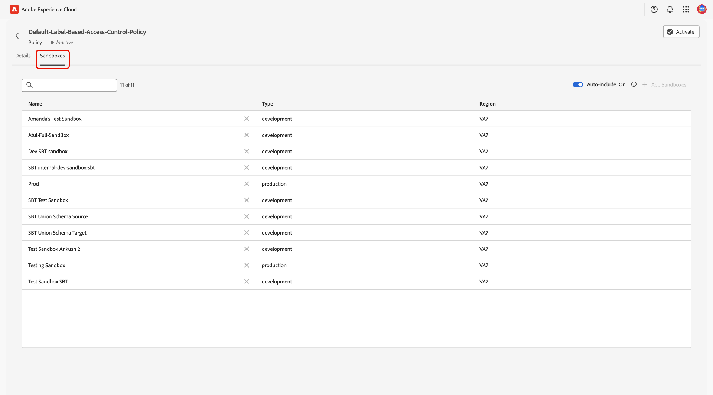
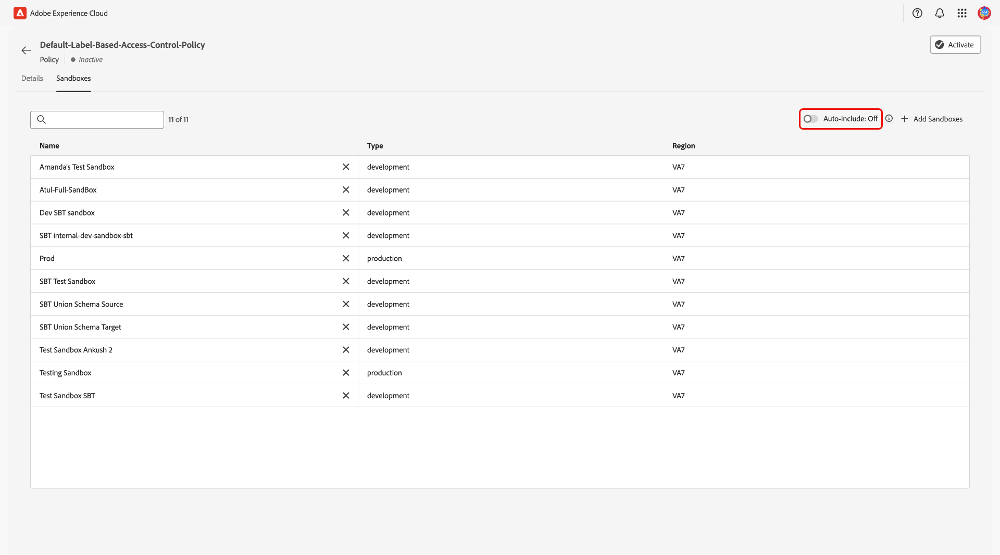
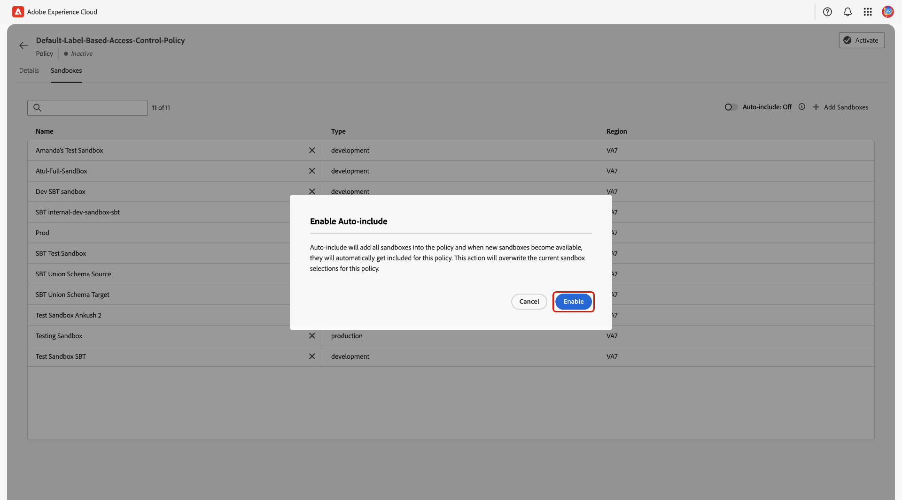
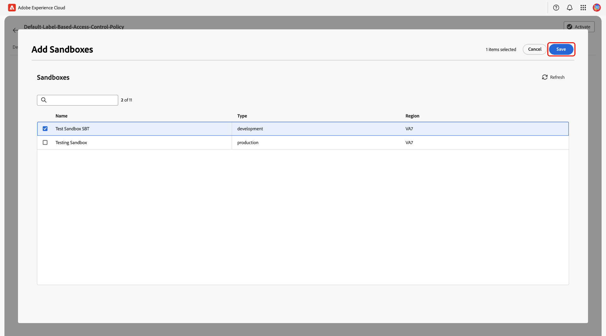
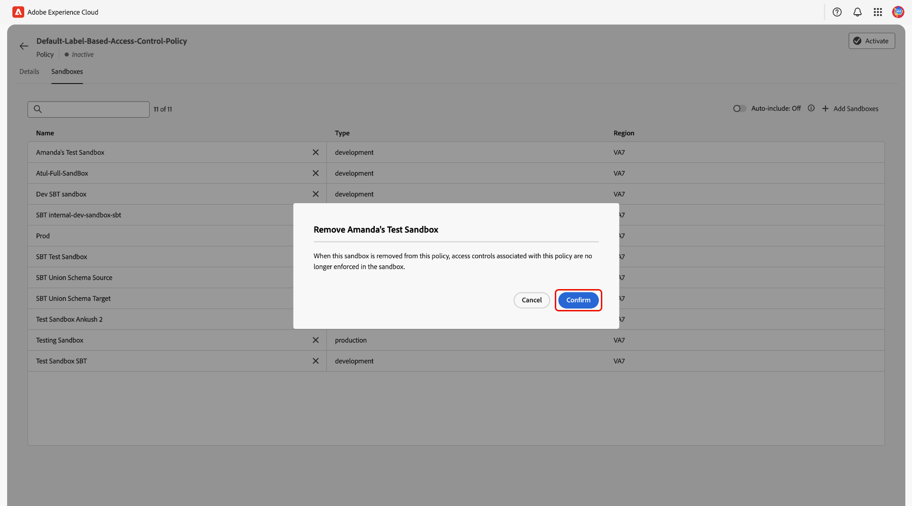

# Verwalten von Zugriffssteuerungsrichtlinien

Zugriffssteuerungsrichtlinien sind Anweisungen, die Attribute zusammenführen, um zulässige und unzulässige Aktionen festzulegen. Adobe bietet eine Standardrichtlinie, die sofort oder aktiviert werden kann, wenn Ihr Unternehmen bereit ist, den Zugriff auf bestimmte Objekte anhand von [Kennzeichnungen](./labels.md){target="_blank"} zu steuern. Die Standardrichtlinie **[!UICONTROL Default-Label-Based-Access-Control-Policy]** nutzt Kennzeichnungen, die auf Ressourcen angewendet werden, um den Zugriff zu verweigern, es sei denn, Benutzer befinden sich in einer Rolle mit einer entsprechenden Kennzeichnung.

>[!IMPORTANT]
>
>Zugriffssteuerungsrichtlinien sollten nicht mit Datennutzungsrichtlinien verwechselt werden, die steuern, wie Daten in Adobe Experience Platform verwendet werden. Weitere Informationen finden Sie im Handbuch [&#x200B; Erstellen &#x200B;](../../../data-governance/policies/create.md){target="_blank"} Datennutzungsrichtlinien .

## Konfigurieren der Richtlinie für eine Sandbox {#configure-policy}

>[!NOTE]
>
>Die **[!UICONTROL Default-Label-Based-Access-Control-Policy]** ist derzeit die einzige zur Konfiguration verfügbare Richtlinie.

Um mit der Konfiguration einer Richtlinie zu beginnen, navigieren Sie zu **[!UICONTROL Permissions]** in [Adobe Experience Cloud](https://experience.adobe.com/){target="_blank"}. Wählen Sie **[!UICONTROL Policies]** im linken Bedienfeld aus. Wählen Sie die **[!UICONTROL Default-Label-Based-Access-Control-Policy]** aus der Liste aus.

{zoomable="yes"}

Der Arbeitsbereich Details der Richtlinie wird angezeigt. Wählen Sie die **[!UICONTROL Sandboxes]** aus. Eine Liste der mit der Richtlinie verknüpften Sandboxes wird angezeigt.

{zoomable="yes"}

### Richtlinie zu allen Sandboxes hinzufügen {#add-policy-to-all}

>[!IMPORTANT]
>
>Standardmäßig ist **[!UICONTROL Auto-include]** aktiviert, d. h. alle aktuellen und zukünftigen Sandboxes werden automatisch zur Richtlinie hinzugefügt.

Schalten Sie die **[!UICONTROL Auto-include]**-Funktion aus, damit zukünftige Sandboxes nicht automatisch zur Richtlinie hinzugefügt werden. Durch Deaktivieren der Funktion **werden** Sandboxes aus der Richtlinie entfernt.

{zoomable="yes"}

Wenn **[!UICONTROL Auto-include]** in einer Richtlinie nicht aktiv ist, können Sie sie mit dem Umschalter wieder aktivieren. Das Dialogfeld **[!UICONTROL Enable Auto-include]** wird angezeigt und Sie werden aufgefordert, Ihre Auswahl zu bestätigen. Wählen Sie **[!UICONTROL Enable]** aus, um die Konfigurationseinstellung abzuschließen.

>[!NOTE]
>
>Alle Sandboxes, die Sie aus der Richtlinie entfernt haben, während **[!UICONTROL Auto-include]** deaktiviert wurde, werden erneut hinzugefügt.

{zoomable="yes"}

### Manuelles Auswählen von Sandboxes für eine Richtlinie {#manually-select-sandboxes}

Um Sandboxes manuell zu einer Richtlinie hinzuzufügen oder zu entfernen, muss der **[!UICONTROL Auto-include]**-Umschalter **muss** deaktiviert sein.

#### Hinzufügen von Sandboxes

Um Sandboxes zu einer Richtlinie hinzuzufügen, wählen Sie **[!UICONTROL Add Sandboxes]** aus.

{zoomable="yes"}

Das Dialogfeld **[!UICONTROL Add Sandboxes]** wird angezeigt. Wählen Sie die Sandbox(es) aus, die Sie der Richtlinie hinzufügen möchten, und klicken Sie dann auf **[!UICONTROL Save]**.

{zoomable="yes"}

>[!NOTE]
>
>Wenn alle verfügbaren Sandboxes bereits zur Richtlinie hinzugefügt wurden, wird im Dialogfeld die Meldung „Sie haben nichts in Ihrer Bibliothek“ angezeigt.

#### Entfernen von Sandboxes

Um Sandboxes aus einer Richtlinie zu entfernen, suchen Sie die Sandbox, die Sie aus der Liste entfernen möchten, und wählen Sie dann das Symbol **X** aus.

{zoomable="yes"}

Ein Bestätigungsdialogfeld wird angezeigt. Wählen Sie **[!UICONTROL Confirm]** aus, um das Entfernen der Sandbox aus der Richtlinie abzuschließen.

{zoomable="yes"}

## Aktivieren von Richtlinien {#activate-policy}

>[!CONTEXTUALHELP]
>id="platform_permissions_policies_about"
>title="Was sind Richtlinien?"
>abstract="Richtlinien sind Anweisungen, die Attribute zusammenbringen, um zulässige und unzulässige Aktionen festzustellen. Jede Organisation verfügt über eine Standardrichtlinie, die Sie aktivieren müssen, um den Zugriff auf bestimmte Objekte anhand von Kennzeichnungen zu steuern. Auf Ressourcen angewendete Kennzeichnungen verweigern den Zugriff, es sei denn, Benutzende werden einer Rolle mit einer entsprechenden Kennzeichnung zugewiesen. Richtlinien können nicht bearbeitet oder gelöscht werden, sie können jedoch aktiviert oder deaktiviert werden."
>additional-url="https://experienceleague.adobe.com/de/docs/experience-platform/access-control/abac/permissions-ui/labels" text="Verwalten von Labels"

Um eine vorhandene Richtlinie zu aktivieren, wählen Sie die Richtlinie auf der Registerkarte **[!UICONTROL Policies]** in **[!UICONTROL Permissions]** aus. Der Aktivierungsstatus der Richtlinie wird im Abschnitt **[!UICONTROL Status]** angezeigt.

{zoomable="yes"}

Der Arbeitsbereich Details der Richtlinie wird angezeigt. Wählen Sie **[!UICONTROL Activate]** aus.

{zoomable="yes"}

Das Dialogfeld **[!UICONTROL Activate Policy]** wird angezeigt. Wählen Sie **[!UICONTROL Confirm]** aus, um die Aktivierung der Richtlinie abzuschließen.

{zoomable="yes"}

## Nächste Schritte

Wenn eine Richtlinie aktiviert ist, können Sie mit dem nächsten Schritt fortfahren, um [Berechtigungen für eine Rolle verwalten](permissions.md).

<!--Policies are applied at the sandbox level to control which sandboxes enforce label-based access control. By default, the **[!UICONTROL Auto-include]** feature is turned on, which means all current and future sandboxes are automatically added to the policy. When **[!UICONTROL Auto-include]** is turned off, only the sandboxes you manually add will be subject to the policy's access control rules.

To begin configuring a policy's sandboxes, navigate to **[!UICONTROL Permissions]** in [Adobe Experience Cloud](https://experience.adobe.com/){target="_blank"}. Select **[!UICONTROL Policies]** from the left panel, then select the **[!UICONTROL Default-Label-Based-Access-Control-Policy]** from the list.

The policy's details workspace appears. Select the **[!UICONTROL Sandboxes]** tab to view the list of sandboxes associated with the policy and access the sandbox configuration options.

### Manage Auto-include {#manage-auto-include}

To control which sandboxes are included in a policy, you can toggle the **[!UICONTROL Auto-include]** feature on or off. When you toggle off **[!UICONTROL Auto-include]**, future sandboxes will not be automatically added to the policy. However, toggling off the feature **will not** remove any sandboxes that are already included in the policy.

To re-enable **[!UICONTROL Auto-include]**, use the toggle to turn it back on. The **[!UICONTROL Enable Auto-include]** dialog appears prompting you to confirm your selection. Select **[!UICONTROL Enable]** to complete the configuration setting.

>[!NOTE]
>
>When you re-enable **[!UICONTROL Auto-include]**, any sandboxes you previously removed from the policy will be re-added.

### Manually manage sandboxes {#manually-manage-sandboxes}

When **[!UICONTROL Auto-include]**is turned off, you can manually add or remove specific sandboxes from the policy. This gives you precise control over which sandboxes enforce the policy's access control rules.

>[!NOTE]
>
>To manually add or remove sandboxes, the **[!UICONTROL Auto-include]** toggle **must** be off.

**To add sandboxes:**

Select **[!UICONTROL Add Sandboxes]** from the policy's sandbox workspace.

The **[!UICONTROL Add Sandboxes]** dialog appears, displaying your library of available sandboxes. Select the sandbox(es) you wish to add to the policy and then select **[!UICONTROL Save]**.

>[!NOTE]
>
>If all available sandboxes are already included in the policy, you will see a "You have nothing in your library" message within the dialog.

**To remove sandboxes:**

Find the sandbox you wish to remove from the list and select the **X** icon next to its name.

A confirmation dialog will appear. Select **[!UICONTROL Confirm]** to finish removing the sandbox from the policy.

-->