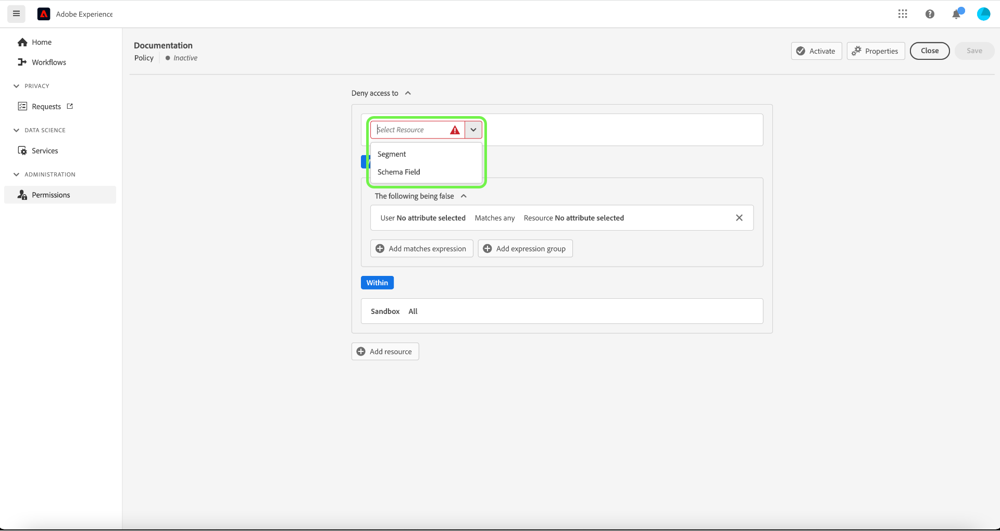
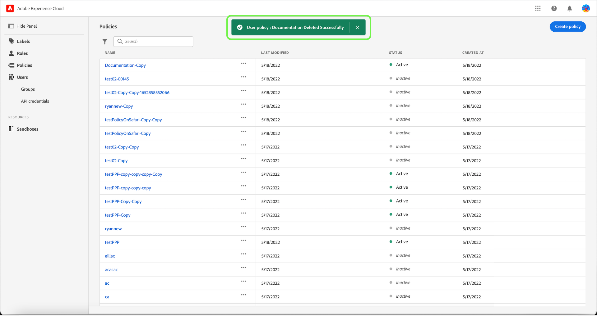

# Richtlinien zur Zugriffskontrolle verwalten

Zugriffskontrollrichtlinien sind Anweisungen, die Attribute zusammenführen, um zulässige und unzulässige Maßnahmen festzulegen. Zugriffsrichtlinien können entweder lokal oder global sein und andere Richtlinien überschreiben. Adobe bietet eine Standardrichtlinie, die sofort aktiviert werden kann oder wann immer Ihr Unternehmen bereit ist, den Zugriff auf bestimmte Objekte anhand von Bezeichnungen zu steuern. Die Standardrichtlinie nutzt Beschriftungen, die auf Ressourcen angewendet werden, um den Zugriff zu verweigern, es sei denn, die Benutzer haben eine Rolle mit einer übereinstimmenden Beschriftung.

>[!IMPORTANT]
>
>Zugriffsrichtlinien dürfen nicht mit Datennutzungsrichtlinien verwechselt werden, die steuern, wie Daten in Adobe Experience Platform verwendet werden, anstatt welche Benutzer in Ihrem Unternehmen Zugriff darauf haben. Weitere Informationen finden Sie im Handbuch zum Erstellen von [Datennutzungsrichtlinien](../../../data-governance/policies/create.md) .

<!-- ## Create a new policy

To create a new policy, select the **[!UICONTROL Policies]** tab in the sidebar and select **[!UICONTROL Create Policy]**.

The **[!UICONTROL Create a new policy]** dialog appears, prompting you to enter a name, and an optional description. When finished, select **[!UICONTROL Confirm]**.

Using the dropdown arrow select if you would like to **Permit access to** () a resource or **Deny access to** () a resource.

Next, select the resource that you would like to include in the policy using the dropdown menu and search access type, read or write.

Next, using the dropdown arrow select the condition you would like to apply to this policy, **The following being true** () or **The following being false** ().

Select the plus icon to **Add matches expression** or **Add expression group** for the resource. 

Using the dropdown, select the **Resource**.

Next, using the dropdown select the **Matches**.

Next, using the dropdown, select the type of label (**[!UICONTROL Core label]** or **[!UICONTROL Custom label]**) to match the label assigned to the User in roles.

Finally, select the **Sandbox** that you would like the policy conditions to apply to, using the dropdown menu.

Select **Add resource** to add more resources. Once finished, select **[!UICONTROL Save and exit]**.

The new policy is successfully created, and you are redirected to the **[!UICONTROL Policies]** tab, where you will see the newly created policy appear in the list. 

## Edit a policy

To edit an existing policy, select the policy from the **[!UICONTROL Policies]** tab. Alternatively, use the filter option to filter the results to find the policy you want to edit.

Next, select the ellipsis (`…`) next to the policies name, and a dropdown displays controls to edit, deactivate, delete, or duplicate the role. Select edit from the dropdown.

The policy permissions screen appears. Make the updates then select **[!UICONTROL Save and exit]**.

The policy is successfully updated, and you are redirected to the **[!UICONTROL Policies]** tab.

## Duplicate a policy

To duplicate an existing policy, select the policy from the **[!UICONTROL Policies]** tab. Alternatively, use the filter option to filter the results to find the policy you want to edit.

Next, select the ellipsis (`…`) next to a policies name, and a dropdown displays controls to edit, deactivate, delete, or duplicate the role. Select duplicate from the dropdown.

The **[!UICONTROL Duplicate policy]** dialog appears, prompting you to confirm the duplication. 

The new policy appears in the list as a copy of the original on the **[!UICONTROL Policies]** tab.

## Delete a policy

To delete an existing policy, select the policy from the **[!UICONTROL Policies]** tab. Alternatively, use the filter option to filter the results to find the policy you want to delete.

Next, select the ellipsis (`…`) next to a policies name, and a dropdown displays controls to edit, deactivate, delete, or duplicate the role. Select delete from the dropdown.

The **[!UICONTROL Delete user policy]** dialog appears, prompting you to confirm the deletion. 

You are returned to the **[!UICONTROL policies]** tab and a confirmation of deletion pop over appears.

 -->

## Richtlinien für Sandboxes konfigurieren

>[!IMPORTANT]
>
>Standardmäßig ist die Funktion [!UICONTROL Automatisches Einschließen] für alle Kunden aktiviert. Dies bedeutet, dass alle Sandboxes zur Richtlinie hinzugefügt werden.

>[!NOTE]
>
>Die Richtlinie **[!UICONTROL default-label-based-Access-Control-Policy]** ist derzeit die einzige für die Konfiguration verfügbare Richtlinie.

Um mit einer Richtlinie verknüpfte Sandboxes anzuzeigen, wählen Sie die Richtlinie auf der Registerkarte **[!UICONTROL Richtlinien]** aus.

Wählen Sie anschließend die Richtlinie und dann die Registerkarte **[!UICONTROL Sandboxes]** aus. Eine Liste der mit der Richtlinie verknüpften Sandboxes wird angezeigt.

### Richtlinie zu allen Sandboxes hinzufügen

Verwenden Sie den Umschalter **[!UICONTROL Automatisches Einschließen]** auf der Registerkarte **[!UICONTROL Sandboxes]** , um die Richtlinie für alle Sandboxes zu aktivieren.

![Die Registerkarte [!UICONTROL Sandboxes], auf der der Umschalter [!UICONTROL Automatisches Einschließen] angezeigt wird.](../../images/flac-ui/abac-policies-auto-include.png)

Das Dialogfeld **[!UICONTROL Automatisches Einschließen aktivieren]** wird angezeigt und fordert Sie auf, Ihre Auswahl zu bestätigen. Wählen Sie **[!UICONTROL Aktivieren]** aus, um die Konfigurationseinstellung abzuschließen.

![Das Dialogfeld [!UICONTROL Automatisches Einschließen aktivieren] , in dem [!UICONTROL Aktivieren] hervorgehoben wird.](../../images/flac-ui/abac-policies-auto-include-enable.png)

>[!SUCCESS]
>
>Die Richtlinie wird für alle vorhandenen Sandboxes aktiviert und automatisch zu allen neuen Sandboxes hinzugefügt, sobald sie verfügbar werden.

### Richtlinie zur Auswahl von Sandboxes hinzufügen

>[!IMPORTANT]
>
>Zukünftige Sandboxes werden standardmäßig nicht in die Richtlinie aufgenommen, wenn der Umschalter [!UICONTROL Automatisches Einschließen] deaktiviert ist. Sie müssen Sandboxes manuell verwalten und der Richtlinie hinzufügen.

Mit dem Umschalter **[!UICONTROL Automatisches Einschließen]** auf der Registerkarte **[!UICONTROL Sandboxes]** können Sie die Richtlinie für alle Sandboxes deaktivieren.

![Die Registerkarte [!UICONTROL Sandboxes], auf der der Umschalter [!UICONTROL Automatisches Einschließen] angezeigt wird.](../../images/flac-ui/abac-policies-auto-include.png)

Wählen Sie auf der Registerkarte **[!UICONTROL Sandboxes]** die Option **[!UICONTROL Sandboxes hinzufügen]** aus, um Sandboxes auszuwählen, für die diese Richtlinie gelten soll.

![Die Registerkarte [!UICONTROL Sandboxes] mit einer Liste von Sandboxes, die der Richtlinie hinzugefügt wurden.](../../images/flac-ui/abac-policies-sandboxes-tab-add.png)

Eine Liste von Sandboxes wird angezeigt. Wählen Sie die Sandbox aus, die Sie der Liste hinzufügen möchten. Alternativ können Sie die Suchleiste verwenden, um nach der Sandbox zu suchen. Wählen Sie **[!UICONTROL Speichern]** aus.

![Die Seite [!UICONTROL Sandboxes hinzufügen] , auf der eine Liste der vorhandenen Sandboxes angezeigt wird, die zur Richtlinie hinzugefügt werden können.](../../images/flac-ui/abac-policies-sandboxes-list.png)

>[!SUCCESS]
>
>Die ausgewählten Sandboxes wurden der Richtlinie erfolgreich hinzugefügt.

### Entfernen von Sandboxes aus einer Richtlinie

Um eine Sandbox zu entfernen, wählen Sie das Symbol **X** neben dem Sandbox-Namen aus.

![Die Registerkarte [!UICONTROL Sandboxes] zeigt eine Liste von Sandboxes an und markiert den zu löschenden [!UICONTROL X].](../../images/flac-ui/abac-policies-remove-sandbox-x.png)

Das Dialogfeld **[!UICONTROL Entfernen]** wird angezeigt, in dem Sie aufgefordert werden, Ihre Auswahl zu bestätigen. Wählen Sie **[!UICONTROL Bestätigen]** aus, um die Entfernung abzuschließen.

![Das Dialogfeld [!UICONTROL Entfernen], in dem [!UICONTROL Bestätigen] hervorgehoben wird.](../../images/flac-ui/abac-policies-remove-sandbox.png)

>[!SUCCESS]
>
>Die ausgewählte Sandbox wurde erfolgreich aus der Richtlinie entfernt.

## Aktivieren von Richtlinien

Um eine vorhandene Richtlinie zu aktivieren, wählen Sie sie auf der Registerkarte **[!UICONTROL Richtlinien]** aus.

Klicken Sie als Nächstes auf das Auslassungszeichen (`…`) neben einem Richtliniennamen. Daraufhin werden in einem Dropdown-Menü Steuerelemente zum Bearbeiten, Aktivieren, Löschen oder Duplizieren der Rolle angezeigt. Wählen Sie im Dropdown-Menü die Option „Aktivieren“ aus.

Das Dialogfeld **[!UICONTROL Richtlinie aktivieren]** wird angezeigt und fordert Sie auf, die Aktivierung zu bestätigen.

Sie kehren zur Registerkarte **[!UICONTROL Richtlinien]** zurück, und ein Popup-Fenster mit einer Bestätigung der Aktivierung wird angezeigt. Als Richtlinienstatus wird „aktiv“ angegeben.

## Nächste Schritte

Wenn eine Richtlinie aktiviert ist, können Sie mit dem nächsten Schritt [Berechtigungen für eine Rolle verwalten](permissions.md) fortfahren.
