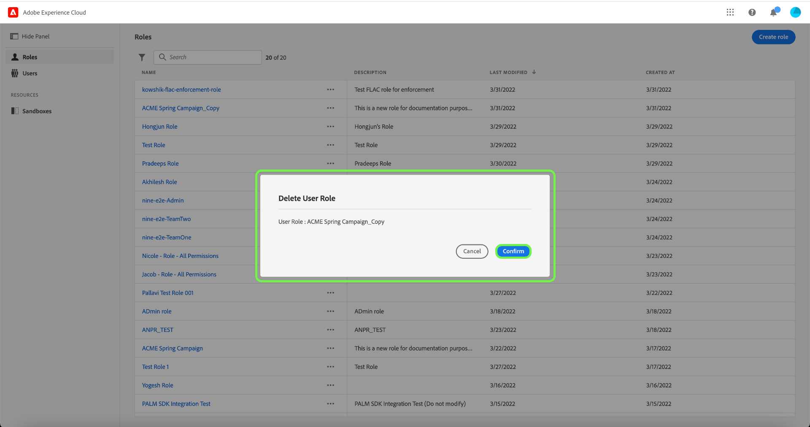

# Verwalten von Rollen

Rollen definieren den Zugriff, den ein Administrator, ein Spezialist oder ein Endbenutzer auf Ressourcen in Ihrem Unternehmen hat. In einer rollenbasierten Zugriffssteuerungsumgebung erfolgt die Bereitstellung des Benutzerzugriffs über gemeinsame Zuständigkeiten und Anforderungen. Eine Rolle verfügt über bestimmte Berechtigungen, wobei Mitglieder Ihrer Organisation je nach dem Umfang des Lese- oder Schreibzugriffs, den sie benötigen, einer oder mehreren Rollen zugewiesen werden können.

## Erstellen einer neuen Rolle

Um eine neue Rolle zu erstellen, wählen Sie die **[!UICONTROL Rollen]** Registerkarte in der Seitenleiste und wählen Sie **[!UICONTROL Rolle erstellen]**.

Die **[!UICONTROL Neue Rolle erstellen]** angezeigt, in dem Sie aufgefordert werden, einen Namen und eine optionale Beschreibung einzugeben.

Wenn Sie fertig sind, klicken Sie auf **[!UICONTROL Bestätigen]**.

Wählen Sie anschließend mithilfe des Dropdown-Menüs die Ressourcenberechtigungen aus, die Sie in die Rolle einbeziehen möchten.

Um weitere Ressourcen hinzuzufügen, wählen Sie **[!UICONTROL Adobe Experience Platform]** über das linke Navigationsfenster, das eine Liste der Ressourcen anzeigt. Geben Sie alternativ den Ressourcennamen in die Suchleiste im linken Navigationsbereich ein.

Klicken Sie auf die gewünschte Ressource und ziehen Sie sie in den Hauptbereich.

Wählen Sie im Dropdown-Menü die Ressourcenberechtigungen aus, die Sie in die Rolle einbeziehen möchten. Wiederholen Sie diesen Vorgang für alle Ressourcen, die Sie für die Rolle einbeziehen möchten. Wenn Sie fertig sind, klicken Sie auf **[!UICONTROL Speichern und beenden]**.

Die neue Rolle wurde erfolgreich erstellt und Sie werden zum **[!UICONTROL Rollen]** -Seite, auf der die neu erstellte Rolle in der Liste angezeigt wird.

Siehe die Abschnitte unter [Verwalten von Berechtigungen für eine Rolle](#manage-permissions-for-a-role) Weitere Informationen zum Verwalten von Rollenberechtigungen nach deren Erstellung.

## Rolle duplizieren

Um eine vorhandene Rolle zu duplizieren, wählen Sie die Rolle aus dem **[!UICONTROL Rollen]** Registerkarte. Alternativ können Sie die Filteroption verwenden, um die Ergebnisse zu filtern und die Rolle zu finden, die Sie duplizieren möchten.

Wählen Sie als Nächstes **[!UICONTROL Duplizieren]** oben rechts im Bildschirm.

Die **[!UICONTROL Rolle duplizieren]** angezeigt, in dem Sie aufgefordert werden, die Duplizierung zu bestätigen.

Anschließend gelangen Sie zur Detailseite der Rolle, auf der Sie den Namen und die Berechtigungen für die Rolle ändern können. Die Details, Beschriftungen und Sandboxes werden aus der vorherigen Rolle dupliziert. Benutzer müssen über den Tab Benutzer hinzugefügt werden. Sie können die [Berechtigungen für eine Rolle verwalten](permissions.md) -Dokument, um mehr über das Hinzufügen von Details, Beschriftungen, Sandboxes und Benutzern zu einer Rolle zu erfahren.

Klicken Sie auf den linken Pfeil, um zum **[!UICONTROL Rollen]** Registerkarte.

Die neue Rolle wird in der Liste auf der **[!UICONTROL Rollen]** Seite.

## Rollen löschen

Wählen Sie die Auslassungszeichen (`…`) neben dem Namen einer Rolle angezeigt. In einer Dropdown-Liste werden Steuerelemente zum Bearbeiten, Löschen oder Duplizieren der Rolle angezeigt. Wählen Sie im Dropdown-Menü die Option „Löschen“ aus.

Die **[!UICONTROL Benutzerrolle löschen]** angezeigt, in dem Sie aufgefordert werden, den Löschvorgang zu bestätigen.

Sie werden zum **[!UICONTROL Rollen]** Registerkarte.

## Nächste Schritte

Nachdem Sie eine neue Rolle erstellt haben, können Sie mit dem nächsten Schritt fortfahren, um [Berechtigungen für eine Rolle verwalten](permissions.md).
