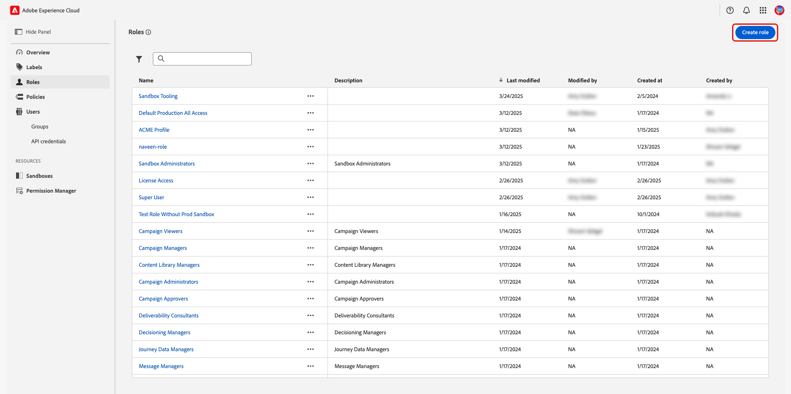
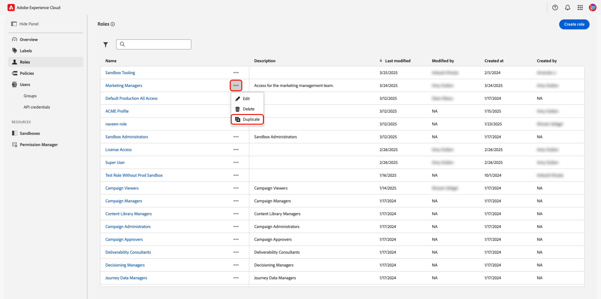
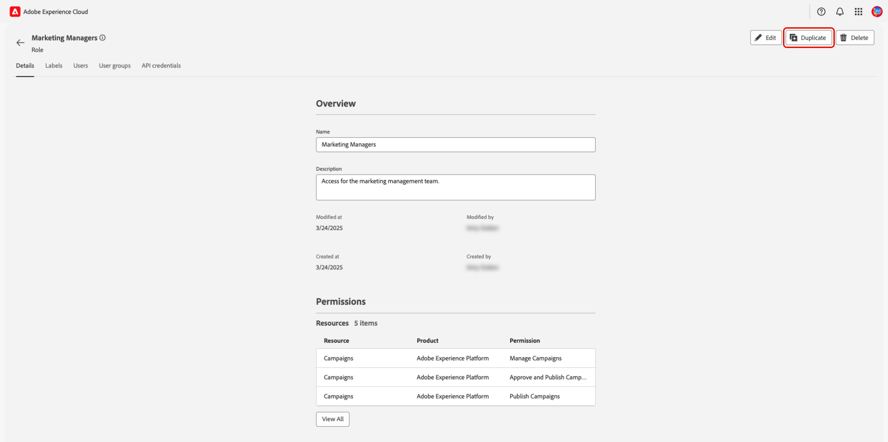

# Verwalten von Rollen

<!-- UPDATE ROLES WITH A MORE COMPREHENSIVE EXPLANATION -->

Um mit der Verwaltung von Rollen zu beginnen, navigieren Sie zu **[!UICONTROL Permissions]** in [Adobe Experience Cloud](https://experience.adobe.com/){target="_blank"} und wählen Sie **[!UICONTROL Roles]** im linken Bereich aus.

## Erstellen einer neuen Rolle {#create-new-role}

>[!CONTEXTUALHELP]
>id="platform_permissions_roles_about_create"
>title="Erstellen einer neuen Rolle"
>abstract="Erstellen Sie neue Rollen, um Benutzende, die mit Ihrer Experience Platform-Instanz interagieren, besser zu kategorisieren. Sie können beispielsweise eine Rolle für ein internes Marketing-Team erstellen und auf diese Rolle die Kennzeichnung „RHD“ (Regulated Health Data, regulierte Gesundheitsdaten) anwenden, sodass Ihr internes Marketing-Team auf PHI-Daten (Protected Health Information, geschützte Gesundheitsinformationen) zugreifen kann. Alternativ können Sie auch eine Rolle für eine externe Agentur erstellen und ihr diesen Rollenzugriff auf PHI-Daten verweigern, indem Sie die RHD-Kennzeichnung nicht auf diese Rolle anwenden."
>additional-url="https://experienceleague.adobe.com/docs/experience-platform/access-control/abac/permissions-ui/roles.html?lang=de" text="Verwalten einer Rolle"
>additional-url="https://experienceleague.adobe.com/de/docs/experience-platform/access-control/abac/end-to-end-guide#label-roles" text="Anwenden von Kennzeichnungen auf eine Rolle"

Um eine neue Rolle zu erstellen, wählen Sie **[!UICONTROL Create role]** aus.

>[!TIP]
>
>Schreibgeschützte Rollen sind standardmäßig verfügbar. Eine schreibgeschützte Rolle ist eine Rolle, die einem Benutzer die Möglichkeit gibt, Daten, Konfigurationen und Benutzeroberflächenfunktionen anzuzeigen, ohne den Systemstatus ändern zu können. Administratoren können diese Rollen nicht bearbeiten, aber Benutzer mit den Rollen verknüpfen.

Das Dialogfeld **[!UICONTROL Create new role]** wird angezeigt. Geben Sie einen **[!UICONTROL Name]** für die Rolle und optional eine **[!UICONTROL Description]** ein, und wählen Sie dann **[!UICONTROL Confirm]** aus.

Der **[!UICONTROL Resources]** Arbeitsbereich wird angezeigt. Suchen Sie die benötigte Ressource, indem Sie scrollen oder indem Sie den Namen der Ressource in die Suchleiste im linken Bereich eingeben. Fügen Sie Ressourcen hinzu, indem Sie  dem Namen der Ressource auswählen.

<!-- ADD IN NOTE ABOUT THE DEFAULT SANDBOX - THIS SHOULD BE MENTIONED IN THE HIGHER LEVEL DOCS, WE MAY BE ABLE TO LINK TO IT -->

Die Ressource wird zum Hauptarbeitsbereich hinzugefügt. Wählen Sie das Dropdown-Menü neben dem Namen der Ressource und anschließend die Berechtigungen aus, die Sie der Rolle hinzufügen möchten. Sie können sie einzeln auswählen, **[!UICONTROL Add all]** auswählen oder bestimmte Berechtigungen suchen, indem Sie den Berechtigungsnamen in die Suchleiste eingeben.

Wählen Sie weiterhin alle Ressourcen und Berechtigungen aus, die Sie der Rolle hinzufügen möchten. Wenn Sie fertig sind, wählen Sie **[!UICONTROL Save]** aus.

Sie erhalten einen Warnhinweis, der anzeigt, dass die Rolle erfolgreich gespeichert wurde. Wählen Sie **[!UICONTROL Close]** aus, um zum Arbeitsbereich **[!UICONTROL Roles]** zurückzukehren.

Die neue Rolle wurde erfolgreich erstellt und Sie werden zur Seite **[!UICONTROL Roles]** weitergeleitet, wo die neu erstellte Rolle in der Liste angezeigt wird.

<!-- 
The following video is intended to support your understanding of creating a new role and managing users for that role.

>[!VIDEO](https://video.tv.adobe.com/v/3475982/?captions=ger&learn=on) 
-->

## Duplizieren einer Rolle

Durch das Duplizieren einer Rolle werden Details, Berechtigungen, Beschriftungen und Sandboxes kopiert. Benutzer, Benutzergruppen und API-**(werden nicht**) werden kopiert und müssen der Rolle manuell hinzugefügt werden.

Um eine vorhandene Rolle zu duplizieren, suchen Sie die Rolle, die Sie duplizieren möchten, auf der Registerkarte **[!UICONTROL Roles]** . Wählen Sie das  neben dem Namen der Rolle und dann **[!UICONTROL Duplicate]** aus dem Dropdown-Menü aus.

Das Bestätigungsdialogfeld für Duplikate wird angezeigt. Wählen Sie **[!UICONTROL Confirm]** aus, um das Duplizieren der Rolle abzuschließen. Die neue Rolle wird unter demselben Namen gespeichert, wobei `_Copy` als Suffix hinzugefügt wird.

Alternativ können Sie eine Rolle auch aus dem Arbeitsbereich einer einzelnen Rolle duplizieren. Wählen Sie im Arbeitsbereich **[!UICONTROL Roles]** die Rolle aus, die Sie duplizieren möchten, und klicken Sie dann auf **[!UICONTROL Duplicate]**.

Das Bestätigungsdialogfeld für Duplikate wird angezeigt. Wählen Sie **[!UICONTROL Confirm]** aus, um das Duplizieren der Rolle abzuschließen. Sie werden zur neuen Rolle weitergeleitet.

## Löschen einer Rolle

Um eine Rolle zu löschen, suchen Sie auf der Registerkarte **[!UICONTROL Roles]** nach der Rolle, die Sie löschen möchten. Wählen Sie das  neben dem Namen der Rolle und dann **[!UICONTROL Delete]** aus dem Dropdown-Menü aus.

Das Bestätigungsdialogfeld für das Löschen wird angezeigt. **[!UICONTROL Confirm]** auswählen, um das Löschen der Rolle abzuschließen.

Alternativ können Sie eine Rolle auch aus dem Arbeitsbereich einer einzelnen Rolle löschen. Wählen Sie die Rolle aus, die Sie aus dem Arbeitsbereich **[!UICONTROL Roles]** löschen möchten, und klicken Sie dann auf **[!UICONTROL Delete]**.

Das Bestätigungsdialogfeld für das Löschen wird angezeigt. **[!UICONTROL Confirm]** auswählen, um das Löschen der Rolle abzuschließen.

<!-- ADD PERMISSIONS TO THIS PAGE -->

## Nächste Schritte

Nachdem eine neue Rolle erstellt wurde, können Sie mit dem nächsten Schritt fortfahren, um [Berechtigungen für eine Rolle verwalten](permissions.md).
