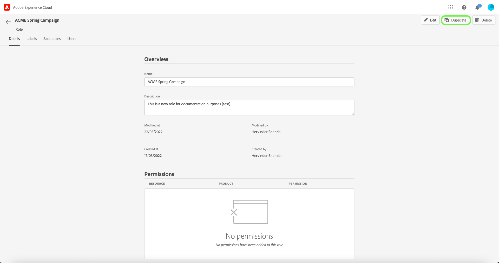
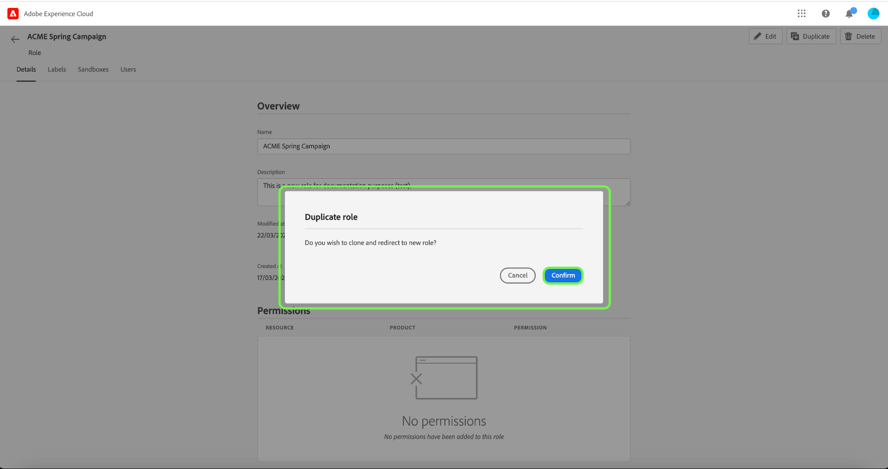

# Verwalten von Rollen

Rollen definieren den Zugriff, den ein Administrator, ein Spezialist oder ein Endbenutzer auf Ressourcen in Ihrem Unternehmen hat. In einer rollenbasierten Zugriffssteuerungsumgebung erfolgt die Bereitstellung des Benutzerzugriffs über gemeinsame Zuständigkeiten und Anforderungen. Eine Rolle verfügt über bestimmte Berechtigungen, wobei Mitglieder Ihrer Organisation je nach dem Umfang des Lese- oder Schreibzugriffs, den sie benötigen, einer oder mehreren Rollen zugewiesen werden können.

## Erstellen einer neuen Rolle

Um eine neue Rolle zu erstellen, wählen Sie in der Seitenleiste die Registerkarte **[!UICONTROL Rollen]** und danach **[!UICONTROL Rolle erstellen]** aus.

Das Dialogfeld **[!UICONTROL Neue Rolle erstellen]** wird angezeigt, in dem Sie zur Eingabe eines Namens und einer optionalen Beschreibung aufgefordert werden.

Wenn Sie fertig sind, klicken Sie auf **[!UICONTROL Bestätigen]**.

Wählen Sie anschließend mithilfe des Dropdown-Menüs die Ressourcenberechtigungen aus, die Sie in die Rolle einbeziehen möchten.

Um weitere Ressourcen hinzuzufügen, wählen Sie im linken Navigationsbereich die Option **[!UICONTROL Adobe Experience Platform]** aus, wo eine Ressourcenliste angezeigt wird. Geben Sie alternativ den Ressourcennamen in die Suchleiste im linken Navigationsbereich ein.

Klicken Sie auf die gewünschte Ressource und ziehen Sie sie in den Hauptbereich.

Wählen Sie im Dropdown-Menü die Ressourcenberechtigungen aus, die Sie in die Rolle einbeziehen möchten. Wiederholen Sie diesen Vorgang für alle Ressourcen, die Sie für die Rolle einbeziehen möchten. Wenn Sie fertig sind, klicken Sie auf **[!UICONTROL Speichern und beenden]**.

Die neue Rolle wurde erfolgreich erstellt und Sie werden zur Seite **[!UICONTROL Rollen]** weitergeleitet, auf der die neu erstellte Rolle in der Liste angezeigt wird.

Weitere Informationen zum Verwalten von Rollenberechtigungen nach ihrer Erstellung finden Sie in den Abschnitten zum [Verwalten von Berechtigungen für eine Rolle](#manage-permissions-for-a-role) .

Das folgende Video soll Ihnen dabei helfen, eine neue Rolle zu erstellen und Benutzer für diese Rolle zu verwalten.

>[!VIDEO](https://video.tv.adobe.com/v/336081/?learn=on)

## Rolle duplizieren

Um eine vorhandene Rolle zu duplizieren, wählen Sie die Rolle auf der Registerkarte **[!UICONTROL Rollen]** aus. Alternativ können Sie die Filteroption verwenden, um die Ergebnisse zu filtern und die Rolle zu finden, die Sie duplizieren möchten.

Wählen Sie dann oben rechts im Bildschirm **[!UICONTROL Duplizieren]** aus.

Das Dialogfeld **[!UICONTROL Rolle duplizieren]** wird angezeigt und fordert Sie auf, die Duplizierung zu bestätigen.

Anschließend gelangen Sie zur Detailseite der Rolle, auf der Sie den Namen und die Berechtigungen für die Rolle ändern können. Die Details, Beschriftungen und Sandboxes werden aus der vorherigen Rolle dupliziert. Benutzer müssen über den Tab Benutzer hinzugefügt werden. Sie können das Dokument [Berechtigungen für eine Rolle verwalten](permissions.md) anzeigen, um mehr über das Hinzufügen von Details, Beschriftungen, Sandboxes und Benutzern zu einer Rolle zu erfahren.

Klicken Sie auf den linken Pfeil, um zur Registerkarte **[!UICONTROL Rollen]** zurückzukehren.

Die neue Rolle wird in der Liste auf der Seite **[!UICONTROL Benutzerrollen]** angezeigt.

## Rollen löschen

Wählen Sie die Auslassungszeichen (`…`) neben dem Namen einer Rolle aus. Eine Dropdown-Liste zeigt Steuerelemente zum Bearbeiten, Löschen oder Duplizieren der Rolle an. Wählen Sie im Dropdown-Menü die Option „Löschen“ aus.

Das Dialogfeld **[!UICONTROL Benutzerrolle löschen]** wird angezeigt und fordert Sie auf, den Löschvorgang zu bestätigen.

Sie werden zur Registerkarte **[!UICONTROL Rollen]** zurückgeleitet.

## Nächste Schritte

Nachdem eine neue Rolle erstellt wurde, können Sie mit dem nächsten Schritt &quot;[Berechtigungen für eine Rolle verwalten](permissions.md)&quot;fortfahren.
