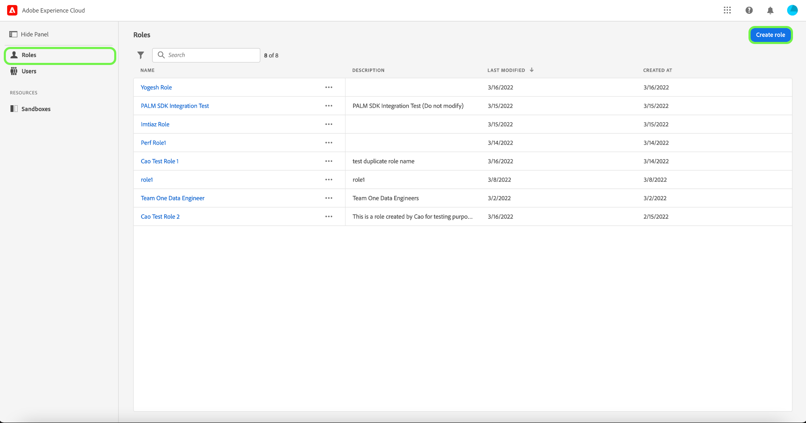
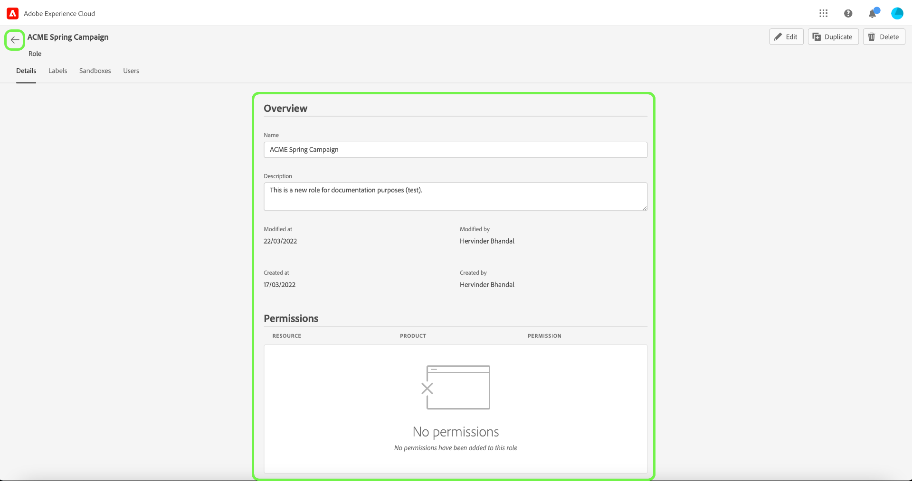

# Verwalten von Rollen

Rollen definieren den Zugriff, den ein Administrator, ein Spezialist oder ein Endbenutzer auf Ressourcen in Ihrer Organisation hat. In einer rollenbasierten Zugriffssteuerungsumgebung erfolgt die Bereitstellung des Benutzerzugriffs über gemeinsame Zuständigkeiten und Anforderungen. Eine Rolle verfügt über bestimmte Berechtigungen, wobei Mitglieder Ihrer Organisation je nach dem Umfang des Lese- oder Schreibzugriffs, den sie benötigen, einer oder mehreren Rollen zugewiesen werden können.

## Erstellen einer neuen Rolle

Um eine neue Rolle zu erstellen, wählen Sie die Registerkarte **[!UICONTROL Rollen]** in der Seitenleiste aus und klicken Sie auf **[!UICONTROL Rolle erstellen]**.

Das **[!UICONTROL Neue Rolle erstellen]** wird angezeigt, in dem Sie aufgefordert werden, einen Namen und eine optionale Beschreibung einzugeben.

Wenn Sie fertig sind, klicken Sie auf **[!UICONTROL Bestätigen]**.

Wählen Sie anschließend mithilfe des Dropdown-Menüs die Ressourcenberechtigungen aus, die Sie in die Rolle aufnehmen möchten.

Um zusätzliche Ressourcen hinzuzufügen, wählen Sie **[!UICONTROL Adobe Experience Platform]** im linken Navigationsbereich aus, der eine Liste mit Ressourcen anzeigt. Geben Sie alternativ den Ressourcennamen in die Suchleiste im linken Navigationsbereich ein.

Klicken und ziehen Sie die entsprechende Ressource in das Hauptbedienfeld.

Wählen Sie mithilfe des Dropdown-Menüs die Ressourcenberechtigungen aus, die Sie in die Rolle aufnehmen möchten. Wiederholen Sie dies für alle Ressourcen, die Sie für die Rolle einbeziehen möchten. Wenn Sie fertig sind, klicken Sie auf **[!UICONTROL Speichern und beenden]**.

Die neue Rolle wurde erfolgreich erstellt und Sie werden zur Seite **[!UICONTROL Rollen]** weitergeleitet, wo die neu erstellte Rolle in der Liste angezeigt wird.

Weitere Informationen zum Verwalten [ Rollenberechtigungen nach deren Erstellung finden ](#manage-permissions-for-a-role) in den Abschnitten zum Verwalten von Berechtigungen für eine Rolle .

Im folgenden Video erfahren Sie, wie Sie eine neue Rolle erstellen und Benutzer für diese Rolle verwalten.

>[!VIDEO](https://video.tv.adobe.com/v/336081/?learn=on)

## Duplizieren einer Rolle

Um eine vorhandene Rolle zu duplizieren, wählen Sie die Rolle auf der Registerkarte **[!UICONTROL Rollen]** aus. Alternativ können Sie die Filteroption verwenden, um die Ergebnisse zu filtern und die Rolle zu finden, die Sie duplizieren möchten.

Wählen Sie anschließend **[!UICONTROL Duplizieren]** oben rechts im Bildschirm aus.

Das Dialogfeld **[!UICONTROL Rolle duplizieren]** wird angezeigt, in dem Sie aufgefordert werden, die Duplizierung zu bestätigen.

Als Nächstes gelangen Sie zur Detailseite der Rolle, auf der Sie den Namen und die Berechtigungen für die Rolle ändern können. Die Details, Beschriftungen und Sandboxes werden aus der vorherigen Rolle dupliziert. Benutzer müssen über die Registerkarte Benutzer hinzugefügt werden. Sie können das Dokument [Berechtigungen für eine Rolle verwalten](permissions.md) anzeigen, um mehr über das Hinzufügen von Details, Beschriftungen, Sandboxes und Benutzern zu einer Rolle zu erfahren.

Klicken Sie auf den Pfeil nach links, um zur Registerkarte **[!UICONTROL Rollen]** zurückzukehren.

Die neue Rolle wird in der Liste auf der Seite **[!UICONTROL Rollen]** angezeigt.

## Löschen einer Rolle

Klicken Sie auf das Auslassungszeichen (`…`) neben dem Namen einer Rolle. In einem Dropdown-Menü werden dann Steuerelemente zum Bearbeiten, Löschen oder Duplizieren der Rolle angezeigt. Wählen Sie im Dropdown-Menü die Option „Löschen“ aus.

Das Dialogfeld **[!UICONTROL Benutzerrolle löschen]** wird angezeigt, in dem Sie aufgefordert werden, den Löschvorgang zu bestätigen.

Sie werden zur Registerkarte **[!UICONTROL Rollen]** zurückgeleitet.

## Nächste Schritte

Nachdem eine neue Rolle erstellt wurde, können Sie mit dem nächsten Schritt fortfahren, um [Berechtigungen für eine Rolle verwalten](permissions.md).
