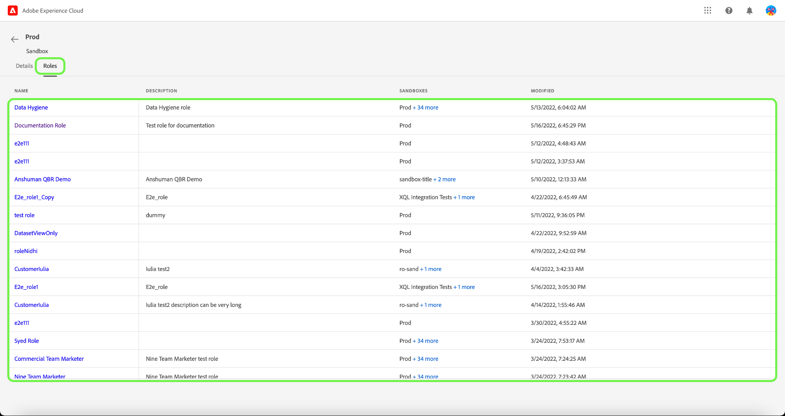

# Verwalten von Sandboxes

>[!IMPORTANT]
>
>Die attribut-basierte Zugriffskontrolle ist derzeit in einer eingeschränkten Version für US-Kunden im Gesundheitswesen verfügbar. Diese Funktion steht allen Real-time Customer Data Platform-Kunden nach der vollständigen Veröffentlichung zur Verfügung.

Um Details und Rollen anzuzeigen, die einer Sandbox zugewiesen sind, wählen Sie die **[!UICONTROL Sandboxes]** Registerkarte.

Eine Liste von Sandboxes wird angezeigt. Wählen Sie die Sandbox aus, die Sie in der Liste anzeigen möchten. Alternativ können Sie über die Suchleiste nach der Sandbox suchen, indem Sie den Sandbox-Namen eingeben.

Die Registerkarte &quot;Details&quot;bietet einen Überblick über die Sandbox. In der Übersicht werden der Sandbox-Name, der Typ, die Region, das Datum der Änderung, der Benutzer, der die Sandbox geändert hat, und der Status der Sandbox angezeigt.

Wählen Sie die **[!UICONTROL Rollen]** -Tab, um die Rollen anzuzeigen, denen die Sandbox zugewiesen ist.

## Nächste Schritte

Sie haben jetzt erfahren, wie Sie Sandbox-Details und die Rollen anzeigen können, denen sie derzeit zugewiesen ist. Eine allgemeine Übersicht über Sandboxes in Experience Platform finden Sie im Abschnitt [Sandbox-Übersichtsdokumentation](../../sanboxes/../ui/overview.md).
