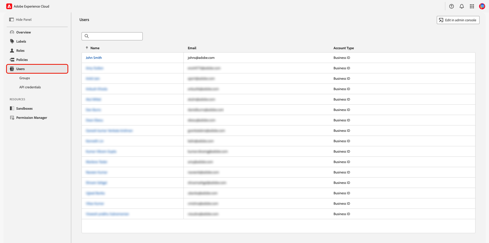
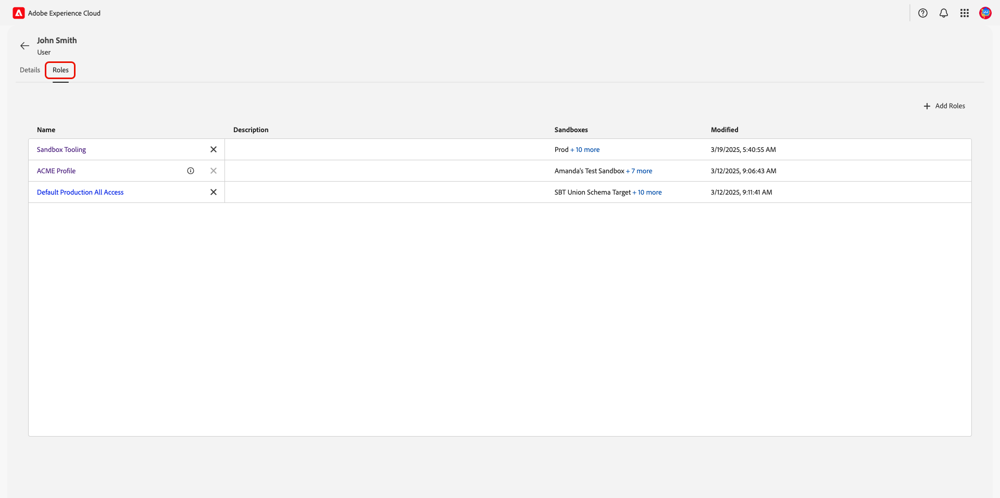
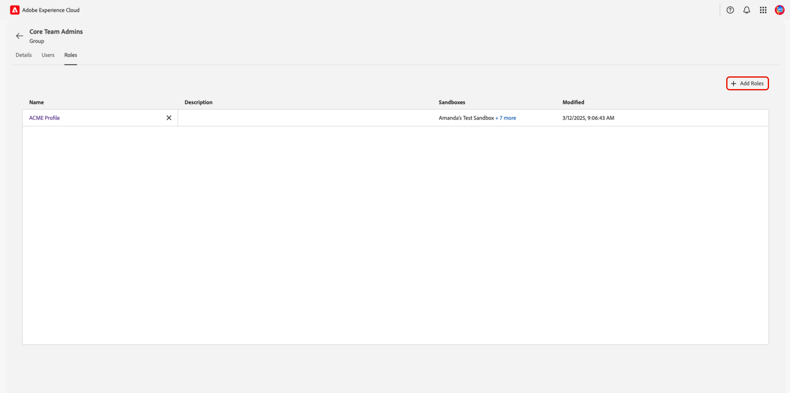
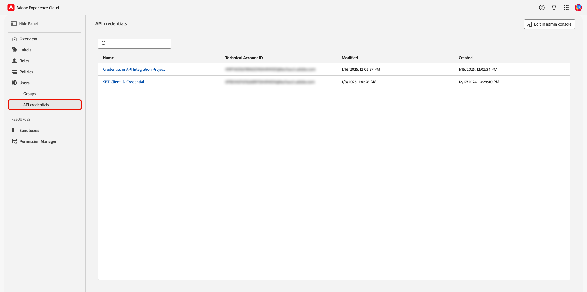
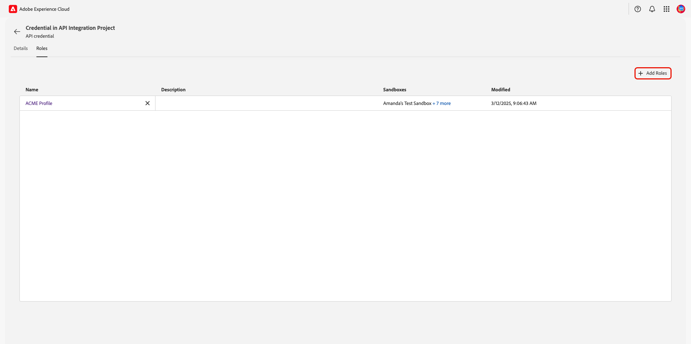

# Verwalten von Benutzern und Hinzufügen von Benutzergruppen {#manage-users}

>[!CONTEXTUALHELP]
>id="platform_permissions_users_about"
>title="Was sind Benutzende?"
>abstract="Benutzende sind Personen, die Zugriff auf Experience Platform haben. Der Zugriff von einzelnen Benutzenden auf die Ressourcen einer Organisation wird über Rollen verwaltet."
>additional-url="https://experienceleague.adobe.com/de/docs/experience-platform/access-control/abac/permissions-ui/roles" text="Verwalten von Rollen"

Benutzer sind die Einzelpersonen, die Zugriff auf Adobe Experience Platform haben. Der Zugriff eines einzelnen Benutzers auf die Ressourcen einer Organisation wird über „Rollen[ verwaltet](./roles.md){target="_blank"}. Ein Unternehmen kann auch [Benutzergruppen](#user-groups) erstellen, um mehreren Benutzern gleichzeitig nahtlosen Zugriff zu gewähren. Benutzende werden in der Admin Console verwaltet und Benutzende, die mit der Adobe Experience Platform-Produktkarte verknüpft sind, werden als Teil der Benutzerliste in Experience Platform angezeigt.

## Verwalten von Benutzenden

<!-- ADD LINKS INTO IMPORTANT NOTE BELOW
>[!IMPORTANT]
>
>[!UICONTROL Permissions] manages access control for existing Experience Platform users. To add users to Experience Platform, navigate to Adobe Admin Console through the **[!UICONTROL Edit in admin console]** option. To learn how to add users through the Admin Console, follow the [adding users to Experience Platform](...){#target="_blank"} guide.
-->

Um die Benutzer Ihrer Organisation anzuzeigen, navigieren Sie zu **[!UICONTROL Permissions]** in [Adobe Experience Cloud](https://experience.adobe.com/){target="_blank"}. Wählen Sie **[!UICONTROL Users]** im linken Bedienfeld aus.

{zoomable="yes"}

Eine Liste mit Benutzern wird angezeigt. Wählen Sie in der Liste den Benutzer aus, den Sie anzeigen möchten. Alternativ können Sie in der Suchleiste nach dem Benutzer suchen, indem Sie dessen Namen oder E-Mail-Adresse eingeben.

Die Registerkarte **[!UICONTROL Details]** bietet einen Überblick über den Benutzer. In der Übersicht werden **[!UICONTROL Name]**, **[!UICONTROL Preferred languages]**, **[!UICONTROL Account Type]**, **[!UICONTROL Authentication ID]**, **[!UICONTROL Email]**, **[!UICONTROL Email verified]**, **[!UICONTROL Country code]** und **[!UICONTROL Phone number]** des Benutzers angezeigt.

{zoomable="yes"}

Wählen Sie die Registerkarte **[!UICONTROL Roles]** aus, um die Rollen anzuzeigen, denen der Benutzer zugewiesen ist.

{zoomable="yes"}

### Hinzufügen einer Rolle zu einem Benutzer {#add-user-role}

Um dem Benutzer eine Rolle hinzuzufügen, wählen Sie **[!UICONTROL Add Roles]** aus.

{zoomable="yes"}

Das Dialogfeld **[!UICONTROL Add Roles]** wird angezeigt. Wählen Sie die Rolle(n) aus, die Sie dem Benutzer hinzufügen möchten, und klicken Sie dann auf **[!UICONTROL Save]**.

{zoomable="yes"}

### Entfernen einer Rolle aus einem Benutzer {#remove-user-role}

Um eine Rolle aus dem Benutzer zu entfernen, klicken Sie auf **X** neben dem Namen der Rolle.

<!-- ADD LINKS INTO IMPORTANT NOTE BELOW

>[!NOTE]
>
>Role's that have been added to a user through a user group cannot be removed through the user's role workspace. Role's that have been added through a user group will have an [!Info icon](/help/images/icons/info.png) beside the **X** containing information about the associated user group. To remove the role, the role would need to be [removed from the user group](#remove-user-group-role).
-->

{zoomable="yes"}

Ein Dialogfeld zum Bestätigen wird angezeigt. Wählen Sie **[!UICONTROL Confirm]** aus, um das Entfernen der Rolle abzuschließen.

{zoomable="yes"}

## Verwalten von Benutzergruppen {#user-groups}

Benutzergruppen sind mehrere Benutzer, die gruppiert wurden und Zugriff haben, um dieselben Funktionen auszuführen.

<!-- ADD LINKS INTO IMPORTANT NOTE BELOW
>[!IMPORTANT]
>
>[!UICONTROL Permissions] manages access control for existing Experience Platform user groups. To add user groups to Experience Platform, navigate to Admin Console through the **[!UICONTROL Edit in admin console]** option. To learn how to add user groups in the Admin Console, follow the [adding user groups to Experience Platform](...){#target="_blank"} guide.
 -->

Um die Benutzer Ihres Unternehmens anzuzeigen, navigieren Sie zu **[!UICONTROL Permissions]** in [Adobe Experience Cloud](https://experience.adobe.com/){target="_blank"}.Wählen Sie **[!UICONTROL Groups]** aus dem Abschnitt **[!UICONTROL Users]** im linken Bereich.

{zoomable="yes"}

Eine Liste mit Benutzergruppen wird angezeigt. Wählen Sie aus der Liste die Gruppe aus, die Sie anzeigen möchten.

Die Registerkarte **[!UICONTROL Details]** bietet einen Überblick über die Benutzergruppe. In der Übersicht werden die **[!UICONTROL Name]**, **[!UICONTROL Description]**, **[!UICONTROL User Count]** und **[!UICONTROL Admin count]** der Gruppen angezeigt.

{zoomable="yes"}

Wählen Sie die Registerkarte **[!UICONTROL Users]** aus, um eine Liste der der Gruppe zugewiesenen Benutzer anzuzeigen.

{zoomable="yes"}

Wählen Sie die Registerkarte **[!UICONTROL Roles]** aus, um die Liste der Rollen anzuzeigen, die der Gruppe derzeit zugewiesen sind.

{zoomable="yes"}

### Hinzufügen von Rollen zu einer Benutzergruppe {#add-user-group-role}

Um der Gruppe eine neue Rolle hinzuzufügen, wählen Sie **[!UICONTROL Add Roles]** aus.

{zoomable="yes"}

Das Dialogfeld **[!UICONTROL Add Roles]** wird angezeigt. Wählen Sie die Rolle(n) aus, die Sie hinzufügen möchten, und klicken Sie dann auf **[!UICONTROL Save]**. Die Rollen werden für alle Benutzer hinzugefügt, die zur Benutzergruppe gehören.

{zoomable="yes"}

### Entfernen von Rollen aus einer Benutzergruppe {#remove-user-group-role}

Um eine Rolle aus der Benutzergruppe zu entfernen, klicken Sie auf **X** neben dem Namen der Rolle.

{zoomable="yes"}

Ein Dialogfeld zum Bestätigen wird angezeigt. Wählen Sie **[!UICONTROL Confirm]** aus, um das Entfernen der Rolle abzuschließen.

{zoomable="yes"}

## API-Anmeldedaten

>[!IMPORTANT]
>
>Nur Systemadministratoren können API-Anmeldeinformationen in Berechtigungen anzeigen und verwalten.

Um Experience Platform-APIs als Benutzer oder Entwickler verwenden zu können, muss ein Systemadministrator zusätzlich zu den einer Rolle zugewiesenen Berechtigungen API-Anmeldeinformationen hinzufügen. Mit Berechtigungen können Sie zuvor erstellte API-Anmeldeinformationen, die dem Experience Platform-Produkt zugewiesen wurden, Rollen zuweisen. Eine vollständige Anleitung zum Erstellen und Zuweisen von API-Anmeldeinformationen sowie die erforderlichen Berechtigungen finden Sie im schrittweisen Tutorial unter [Authentifizieren und Zugreifen auf Experience Platform-APIs](/help/landing/api-authentication.md){target="_blank"}.

Um die mit Experience Platform verknüpften API-Anmeldeinformationen Ihres Unternehmens anzuzeigen, navigieren Sie zu **[!UICONTROL Permissions]** in [Adobe Experience Cloud](https://experience.adobe.com/){target="_blank"}. Wählen Sie **[!UICONTROL API Credentials]** aus dem Abschnitt **[!UICONTROL Users]** im linken Bedienfeld aus.

{zoomable="yes"}

>[!NOTE]
>
> Um die API-Anmeldeinformationen Ihres Unternehmens für alle Produkte in Ihrem Unternehmen oder für weitere Informationen zu den Anmeldeinformationen anzuzeigen, wählen Sie **[!UICONTROL Edit in admin console]** aus.

Eine Liste der API-Anmeldeinformationen wird angezeigt. Wählen Sie die API-Anmeldedaten aus der Liste aus, die Sie anzeigen möchten.

Die Registerkarte **[!UICONTROL Details]** bietet einen Überblick über die API-Anmeldeinformationen. In der Übersicht werden **[!UICONTROL Name]**, **[!UICONTROL Modified]**, **[!UICONTROL Modified By]**, **[!UICONTROL Created]**, **[!UICONTROL Created by]**, **[!UICONTROL API key]**, **[!UICONTROL Technical ID]** und **[!UICONTROL Email]** der Anmeldeinformationen angezeigt.

{zoomable="yes"}

Wählen Sie die Registerkarte **[!UICONTROL Roles]** aus. Eine Liste der Rollen, die mit den API-Anmeldeinformationen verknüpft sind, wird angezeigt.

{zoomable="yes"}

### Hinzufügen einer Rolle zu einer API-Berechtigung {#add-api-credential-role}

Um der API-Berechtigung eine Rolle hinzuzufügen, wählen Sie **[!UICONTROL Add Roles]** aus.

{zoomable="yes"}

Das Dialogfeld **[!UICONTROL Add Roles]** wird angezeigt. Wählen Sie die Rolle(n) aus, die Sie dem Benutzer hinzufügen möchten, und klicken Sie dann auf **[!UICONTROL Save]**.

{zoomable="yes"}

### Entfernen einer Rolle aus einer API-Berechtigung {#remove-api-credential-role}

Um eine Rolle aus den API-Anmeldeinformationen zu entfernen, klicken Sie auf **X** neben dem Namen der API-Anmeldeinformationen.

{zoomable="yes"}

Ein Dialogfeld zum Bestätigen wird angezeigt. Wählen Sie **[!UICONTROL Confirm]** aus, um das Entfernen der Rolle abzuschließen.

{zoomable="yes"}

## Nächste Schritte

Sie wissen jetzt, wie Sie die Details und Rollen für einen Benutzer, eine Benutzergruppe und API-Anmeldeinformationen anzeigen können. Weitere Informationen zur attributbasierten Zugriffssteuerung finden Sie unter &quot;[ Zugriffssteuerung - Übersicht](../overview.md).

<!--
The following video is intended to support your understanding of developer and API credentials.

>[!VIDEO](https://video.tv.adobe.com/v/3426407/?learn=on)
-->