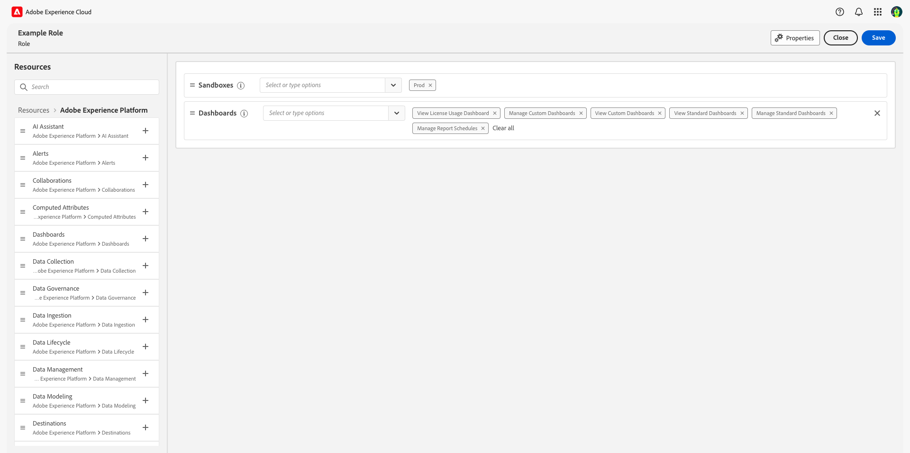

# Zugangssteuerung – Übersicht

Die Zugriffssteuerung für Adobe Experience Platform erfolgt über die **[!UICONTROL Berechtigungen]** in [Adobe Experience Cloud](https://experience.adobe.com/). Diese Funktion nutzt Produktprofile und Richtlinien, um Benutzende mit Berechtigungen und Sandboxes zu verknüpfen.

## Zugangssteuerung zu Hierarchie und Workflow

Zum Konfigurieren der Zugriffssteuerung für Experience Platform müssen Sie system- oder produkbezogene Administratorrechte für ein Unternehmen besitzen, das über ein Experience Platform-Produkt verfügt. Zum Erteilen oder Entziehen von Berechtigungen ist mindestens eine Produktadmin-Rolle erforderlich. Zu einer anderen Administratorrolle, die Berechtigungen verwalten können, gehören die Systemadmins (keine Einschränkungen). Weitere Informationen zu [Administratorrollen](https://helpx.adobe.com/de/enterprise/using/admin-roles.html) finden Sie im Adobe Help Center-Artikel.

>[!NOTE]
>
>Von hier an beziehen sich alle Erwähnungen von Administrierenden in diesem Dokument auf Produktadmins oder höhere Rollen (wie oben beschrieben).

Ein Workflow auf hoher Ebene zum Abrufen und Zuweisen von Zugriffsberechtigungen kann wie folgt zusammengefasst werden:

- Nach der Lizenzierung von Adobe Experience Platform oder einem Programm-Service, der Experience Platform verwendet, wird eine E-Mail an den Administrator gesendet, der während der Lizenzierung angegeben wurde.
- Administrierende melden sich bei der [Adobe Admin Console](#adobe-admin-console) an und wählen **Adobe Experience Platform** aus der Liste der Produkte auf der Übersichtsseite aus.
- Um Zugriff auf Experience Platform zu gewähren, wird empfohlen, dass der Administrator Benutzer zum Standardproduktprofil hinzufügt: `AEP-Default-All-Users`.
- Über Experience Platform-Berechtigungen können Administrierende neue Rollen erstellen oder die Berechtigungen und Benutzenden für vorhandene Rollen bearbeiten.
- Beim Erstellen oder Bearbeiten einer Rolle fügen Administrierende der Rolle über die Registerkarte **[!UICONTROL Benutzende]** Benutzende hinzu und gewähren durch Bearbeiten der Rollenberechtigungen diesen Benutzenden Berechtigungen (z. B. [!UICONTROL Datensätze lesen] oder [!UICONTROL Schemata verwalten]). Ebenso können Administrierende mithilfe derselben Bearbeitungsoption Zugriff auf Sandboxes zuweisen.
- Wenn sich Benutzende bei der Benutzeroberfläche von Experience Platform anmelden, wird ihr Zugriff auf Experience Platform-Funktionen durch die Berechtigungen gesteuert, die ihnen im vorherigen Schritt erteilt wurden. Wenn eine Benutzerin oder ein Benutzer beispielsweise nicht über die Berechtigung [!UICONTROL Datensätze anzeigen] verfügt, ist im Seitenmenü die Registerkarte **[!UICONTROL Datensätze]** für diese Benutzerin oder diesen Benutzer nicht sichtbar.

Detailliertere Anweisungen zum Verwalten der Zugriffskontrolle in Experience Platform finden Sie im [Benutzerhandbuch für die Zugriffskontrolle](./ui/overview.md).

Alle Aufrufe von Experience Platform-APIs werden auf Berechtigungen überprüft und geben Fehler zurück, wenn die entsprechenden Berechtigungen im aktuellen Benutzerkontext nicht gefunden wurden. In der Benutzeroberfläche werden Elemente je nach den dem aktuellen Benutzer zugewiesenen Berechtigungen ausgeblendet oder geändert.

## Berechtigungen {#platform-permissions}

Der Bereich [!UICONTROL Berechtigungen] bietet einen zentralen Ort für die Verwaltung des Experience Platform-Zugriffs für Ihr Unternehmen. Über [!UICONTROL Berechtigungen] können Sie Benutzergruppen Zugriffsberechtigungen für verschiedene Experience Platform-Funktionen erteilen, wie z. B. [!UICONTROL Datensätze verwalten], [!UICONTROL Datensätze anzeigen] oder [!UICONTROL Profile verwalten].

### Rollen

Im Abschnitt [!UICONTROL Rollen] werden Benutzenden durch die Verwendung von Rollen Berechtigungen zugewiesen. Mithilfe von Rollen können Sie einer Benutzerin oder einem Benutzer bzw. mehreren Benutzenden Berechtigungen erteilen und zudem deren Zugriff auf die Sandboxes beschränken, die ihnen über Rollen zugewiesen sind. Benutzende können einer oder mehreren Rollen Ihres Unternehmens zugewiesen werden.

### Standardrollen

Experience Platform verfügt über zwei vorkonfigurierte Standardrollen. Die folgende Tabelle zeigt, was in den einzelnen Standardprofilen bereitgestellt wird, einschließlich der Sandbox, auf die sie Zugriff gewähren, sowie der Berechtigungen, die sie im Rahmen dieser Sandbox gewähren.

| Rolle | Sandbox-Zugriff | Berechtigungen |
| --- | --- | --- |
| Standardproduktion – Zugriff auf alles | prod | Alle für Experience Platform geltenden Berechtigungen mit Ausnahme der Sandbox-Administratorberechtigungen. |
| Sandbox-Administratoren | K. A. | Ermöglicht den Zugriff auf die Sandbox `Prod` und auf Sandbox-Administrationsberechtigungen. |

## Sandboxes und Berechtigungen

Nicht-Produktion-Sandboxes sind eine Form der Datenvirtualisierung, mit der Sie Daten von anderen Sandboxes isolieren können und die üblicherweise für Entwicklungsexperimente, Tests oder Versuche verwendet werden. Die Berechtigungen einer Rolle geben den Benutzenden der Rolle Zugriff auf Experience Platform-Funktionen innerhalb der Sandbox-Umgebungen, auf die ihnen Zugriff gewährt wurde. Mit einer Standardlizenz für Experience Platform erhalten Sie fünf Sandboxes (eine zur Produktion und vier zur Nicht-Produktion). Sie können Pakete von jeweils zehn Nicht-Produktions-Sandboxes bis zu insgesamt maximal 75 Sandboxes hinzufügen. Wenden Sie sich an die Admins Ihrer Organisation oder das Adobe-Vertriebspersonal, um weitere Informationen zu erhalten.

Weitere Informationen zu Sandboxes in Experience Platform finden Sie in der [Sandbox-Übersicht](../sandboxes/home.md).

### Zugriff auf Sandboxes

Der Zugriff auf Sandboxes wird über Rollen verwaltet. Ausführliche Anweisungen zum Aktivieren des Zugriffs auf eine Sandbox für eine Rolle finden Sie unter [„Rollen“ im Handbuch zur attributbasierten Zugriffssteuerung](./abac/ui/roles.md).

Benutzenden kann Zugriff auf eine oder mehrere Sandboxes innerhalb einer Rolle gewährt werden. Wenn eine Benutzerin oder ein Benutzer in zwei oder mehr Rollen enthalten ist, hat diese Person Zugriff auf alle in diesen Rollen enthaltenen Sandboxes.

Die Berechtigung „Sandbox-Verwaltung“ ermöglicht Benutzenden das Verwalten, Anzeigen oder Zurücksetzen von Sandboxes.

### Ressourcenberechtigungen {#permissions}

Ressourcenberechtigungen gewähren Zugriff auf bestimmte Experience Platform-Funktionen. Ressourcen sind in Kategorien unterteilt, die einen Satz relevanter Berechtigungen enthalten, die Rollen einzeln zugewiesen werden können.

In [!UICONTROL Berechtigungen] zeigt der Arbeitsbereich Ressourcen einer Rolle die Sandboxes und Berechtigungen an, die für diese Rolle aktiv sind:

In der folgenden Tabelle sind die verfügbaren Ressourcenkategorien für Experience Platform und Programme aufgeführt, die über Berechtigungen verwaltet werden:

| Kategorie | Beschreibung |
| --- | --- |
| [!DNL Adobe Mix Modeler] | Konfigurieren, Verwalten und Anzeigen von Berechtigungen für [!DNL Adobe Mix Modeler]. |
| [!DNL AI Assistant] | Konfigurieren Sie Berechtigungen für [!DNL AI Assistant]. |
| [!DNL Alerts] | Konfigurieren, Verwalten, Auflösen und Anzeigen von Berechtigungen für Warnhinweise und den Warnhinweisverlauf. |
| [!DNL B2B Account Lists] | Konfigurieren, Verwalten, Anzeigen und Veröffentlichen von Berechtigungen für B2B-Kontolisten, einschließlich Aktionen wie Hinzufügen, Entfernen, Importieren und Löschen von Konten aus Kontolisten. |
| [!DNL B2B Admin Configurations] | Konfigurieren und verwalten Sie Berechtigungen für B2B-Admin-Konfigurationen, einschließlich Digital-Asset-Management-Verbindungen, Asset-Repositorys und Ereignissen. |
| [!DNL B2B Assets] | Konfigurieren und verwalten Sie Berechtigungen für B2B-Assets, einschließlich E-Mails, SMS, Landingpages, Fragmente, Vorlagen und Bildern. |
| [!DNL B2B Buying Groups] | Konfigurieren und verwalten Sie Berechtigungen für B2B-Einkaufsgruppen, einschließlich Funktionen wie Lösungsinteressen, Rollenvorlagen und Kaufgruppenstatus. |
| [!DNL B2B Channel Configurations] | Konfigurieren und verwalten Sie Berechtigungen für B2B-Kanal-Konfigurationen, einschließlich Einstellungen wie Kommunikationsbeschränkungen, API-Anmeldeinformationen und Sicherheitseinstellungen. |
| [!DNL B2B Dashboards] | Konfigurieren Sie Ansichtsberechtigungen für B2B-Dashboards, einschließlich Funktionen wie Kontointeraktion, Kaufgruppenphasen, steigende Anzahl von Konten und Kontaktabdeckung. |
| [!DNL B2B Journeys] | Konfigurieren und verwalten Sie Berechtigungen zum Anzeigen und Veröffentlichen für B2B-Journey, einschließlich Funktionen wie Konto- und Personenaktionen, Ereignis-Listener und Aufspaltungspfade. |
| [!DNL Campaigns] | Konfigurieren, Verwalten, Veröffentlichen und Anzeigen von Berechtigungen für Kampagnen in Journey Optimizer. |
| [!DNL Channel Configurations] | Konfigurieren, Verwalten und Exportieren von Kanalkonfigurationsfunktionen wie Subdomains, IP-Pools, Nachrichtenvoreinstellungen, PTR-Einträge, Unterdrückungslisten, Landingpage-Einstellungen, SMS-Einstellungen und Datei-Routing. |
| [!DNL Collaborations] | Konfigurieren und Verwalten von Berechtigungen für Funktionen von Real-time Customer Data Profile Collaboration. |
| [!DNL Computed Attributes] | Konfigurieren und verwalten Sie Berechtigungen zum Entwerfen oder Veröffentlichen berechneter Attribute. |
| [!DNL Customer Managed Keys] | Konfigurieren und Verwalten von Berechtigungen für kundenverwaltete Schlüssel. |
| [!DNL Dashboards] | Konfigurieren und Verwalten von Berechtigungen für standardmäßige, benutzerdefinierte und lizenzierte Dashboards. |
| [!DNL Data Collection] | Konfigurieren und Verwalten von Berechtigungen für Datenströme. |
| [!DNL Data Governance] | Konfigurieren, Verwalten, Anwenden und Anzeigen von Berechtigungen für Data-Governance-Funktionen wie Beschriftungen, Richtlinien und Aktivitätsprotokolle. |
| [!DNL Data Ingestion] | Konfigurieren und Verwalten von Berechtigungen für Datenaufnahmefunktionen wie Quellen und Zielgruppenfreigabe. |
| [!DNL Data Lifecycle] | Konfigurieren und Verwalten von Berechtigungen für Datenhygiene-Funktionen. |
| [!DNL Data Management] | Konfigurieren und verwalten Sie Berechtigungen für Datenverwaltungsfunktionen wie Datensätze und überwachen Sie Datensätze und Streams. |
| [!DNL Data Modeling] | Konfigurieren und verwalten Sie Berechtigungen für Datenmodellierungsfunktionen wie Schemata, Beziehungen und Identitätsmetadaten. |
| [!DNL Data Science Workspace] | Konfigurieren und Verwalten von Berechtigungen zum [!DNL Data Science Workspace]. |
| [!DNL Decision Management] | Konfigurieren und verwalten Sie Berechtigungen für Entscheidungen, Angebote und Ranking-Strategie-Funktionen im Entscheidungs-Management. |
| [!DNL Destinations] | Konfigurieren und verwalten Sie Berechtigungen für Ziele, einschließlich Funktionen wie Aktivierung und Authoring mit Destinations SDK. |
| [!DNL Federated Data] | Konfigurieren und Verwalten von Berechtigungen für Federated Data-Funktionen. |
| [!DNL Identity Management] | Konfigurieren und verwalten Sie Berechtigungen für Identity Service-Funktionen wie Identity-Namespaces und das Identitätsdiagramm. |
| [!DNL Intelligent Service] | Konfigurieren und verwalten Sie Berechtigungen für Attributions-KI und Kunden-KI in Intelligent Service. |
| [!DNL IP Warmup Configurations] | Konfigurieren und verwalten Sie Berechtigungen für IP-Aufwärmpläne und zeigen Sie Berechtigungen zum Anzeigen von IP-Aufwärmberichten an. |
| [!DNL Journey Optimizer Library] | Konfigurieren und Verwalten von Berechtigungen für Bibliothekselemente in Adobe Journey Optimizer. |
| [!DNL Journey Optimizer Rules] | Konfigurieren und Verwalten von Berechtigungen für Häufigkeitsregeln in Adobe Journey Optimizer. |
| [!DNL Journeys] | Konfigurieren Sie Berechtigungen zum Verwalten, Veröffentlichen und Anzeigen für Journey, einschließlich Funktionen wie Journey-Berichte, Ereignisse, Datenquellen und Aktionen. |
| [!DNL Messages] | Konfigurieren Sie Berechtigungen zum Verwalten, Veröffentlichen und Anzeigen von Nachrichten, einschließlich Funktionen wie Nachrichtenvorschau und Tests. |
| [!DNL Privacy Service] | Konfigurieren und Verwalten von Berechtigungen für Privacy Service-Funktionen. |
| [!DNL Profile Management] | Konfigurieren Sie Berechtigungen zum Verwalten, Anzeigen, Exportieren und Auswerten für Profil-Service-Funktionen wie Zielgruppen, Profile und Zusammenführungsrichtlinien. |
| [!DNL Prospects] | Konfigurieren und verwalten Sie Berechtigungen für Interessenten, Schemata, Profile und Audiences, einschließlich Funktionen wie der Anzeige des Akkordeons „Interessent“. |
| [!DNL Query Service] | Konfigurieren und verwalten Sie Berechtigungen für Abfrage-Service-Funktionen wie nicht ablaufende Anmeldedaten und strukturierte SQL-Abfragen. |
| [!DNL Reports] | Konfigurieren Sie Ansichtsberechtigungen für Kanalberichte. |
| [!DNL Sandbox Administration] | Konfigurieren, Verwalten, Anzeigen und Zurücksetzen von Berechtigungen beim Verwalten von Sandboxes. |
| [!DNL Traits Configuration] | Konfigurieren und verwalten Sie Eigenschaften über die Benutzeroberfläche für berechnete Attribute. |
| [!DNL Translation Services] | Konfigurieren und verwalten Sie Berechtigungen für Übersetzungs-Services für Projekte, Aufgaben, Überprüfungen, interne Tests, Einstellungen und Anbieter. |

In der folgenden Tabelle stehen die verfügbaren Berechtigungen für Experience Platform in der Rolle, einschließlich Beschreibungen der spezifischen Experience Platform-Funktionen, auf die sie Zugriff gewähren. Ausführliche Anweisungen zum Hinzufügen von Berechtigungen zu einer Rolle finden Sie unter [„Rollen“ im Handbuch zur attributbasierten Zugangssteuerung](./abac/ui/roles.md).

| Kategorie | Berechtigung | Beschreibung |
| --- | --- | --- |
| [!DNL Adobe Mix Modeler] | [!UICONTROL Verwalten von Adobe Mix Modeler-harmonisierten Daten] | Die Möglichkeit, harmonisierte Daten anzuzeigen und zu ändern. |
| [!DNL Adobe Mix Modeler] | [!UICONTROL Anzeigen von in Adobe Mix Modeler harmonisierten Daten] | Schreibgeschützter Zugriff auf harmonisierte Daten. |
| [!DNL Adobe Mix Modeler] | [!UICONTROL Verwalten von Adobe Mix Modeler-Modellkonfigurationen] | Die Möglichkeit, Modellkonfigurationen anzuzeigen und zu ändern. |
| [!DNL Adobe Mix Modeler] | [!UICONTROL Anzeigen von Adobe Mix Modeler-Modellkonfigurationen] | Schreibgeschützter Zugriff auf Modellkonfigurationen. |
| [!DNL Adobe Mix Modeler] | [!UICONTROL Verwalten von Konfigurationen für Adobe Mix Modeler-Modellpläne] | Die Möglichkeit, Pläne und Konfigurationen anzuzeigen und zu ändern. |
| [!DNL Adobe Mix Modeler] | [!UICONTROL Anzeigen der Konfigurationen für Adobe Mix Modeler-Modellpläne] | Schreibgeschützter Zugriff auf Plankonfigurationen. |
| [!DNL AI Assistant] | [!UICONTROL KI-Assistenten aktivieren] | Möglichkeit, die [!DNL [AI assistant]](../ai-assistant/access.md) Fragen zu stellen. |
| [!DNL AI Assistant] | [!UICONTROL Anzeigen operativer Einblicke] | Zugriff auf den Abruf von Antworten [ Abfragen ](../ai-assistant/home.md##operational-insights)operative Insights). |
| [!DNL AI Assistant] | [!UICONTROL Inhalt generieren] | Benutzern ermöglichen, Inhalte mithilfe der [!DNL AI Assistant] zu generieren. |
| [!DNL AI Assistant] | [!UICONTROL Verwalten des Brand Kit] | Ermöglichen Sie Benutzern, Markenrichtlinien mithilfe der [!DNL AI Assistant] zu erstellen. |
| [!DNL Alerts] | [!UICONTROL Warnhinweisverlauf anzeigen] | Schreibgeschützter Zugriff auf den Warnhinweisverlauf. |
| [!DNL Alerts] | [!UICONTROL Auflösen von Warnhinweisen] | Zugriff zum Lesen, Bearbeiten und Löschen von Warnhinweisen. |
| [!DNL Alerts] | [!UICONTROL Anzeigen von Warnhinweisen] | Schreibgeschützter Zugriff auf Warnhinweise |
| [!DNL Alerts] | [!UICONTROL Verwalten von Warnhinweisen] | Zugriff auf das Lesen, Erstellen, Bearbeiten und Löschen von Warnhinweisen. |
| [!DNL B2B Account Lists] | [!UICONTROL Verwalten von B2B-Kontolisten] | Möglichkeit zum Anzeigen und Zugreifen auf **[!UICONTROL Kontolisten]** im linken Navigationsbereich. Benutzer mit Zugriff auf **[!UICONTROL Kontolisten]** sollten Zugriff auf alle Kontolisten-CRUD-Funktionen haben: `/accounts-list`. |
| [!DNL B2B Admin Configurations] | [!UICONTROL Verwalten von B2B-Admin-Konfigurationen] | Möglichkeit zum Anzeigen und Zugreifen auf **[!UICONTROL B2B-Admin]** Konfigurationen im linken Navigationsbereich. Benutzer mit Zugriff auf **[!UICONTROL B2B-Admin]** Konfigurationen sollten Zugriff auf alle CRUD-Funktionen für SMS-API-Anmeldeinformationen haben: `/admin-configs`. |
| [!DNL B2B Assets] | [!UICONTROL Verwalten von B2B-Assets] | Möglichkeit zum Anzeigen von und Zugreifen auf **[!UICONTROL Assets]** im linken Navigationsbereich. Benutzende mit Zugriff auf **[!UICONTROL Assets]** sollten Zugriff auf alle Assets CRUD-Funktionen haben: `/assets-listing`. |
| [!DNL B2B Assets] | [!UICONTROL Verwalten von B2B-Vorlagen] | Möglichkeit zum Anzeigen von und Zugreifen auf **[!UICONTROL Vorlagen]** im linken Navigationsbereich. Benutzer mit Zugriff auf **[!UICONTROL Vorlagen]** sollten Zugriff auf alle CRUD-Vorlagenfunktionen haben: `/b2b-content-templates`. |
| [!DNL B2B Assets] | [!UICONTROL Verwalten von B2B-Fragmenten] | Möglichkeit zum Anzeigen und Zugreifen auf **[!UICONTROL Fragmente]** im linken Navigationsbereich. Benutzende mit Zugriff auf **[!UICONTROL Fragmente]** sollten Zugriff auf alle CRUD-Fragmentfunktionen haben: `/fragments`. |
| [!DNL B2B Buying Groups] | [!UICONTROL Verwalten von B2B-Einkaufsgruppen] | Möglichkeit zum Anzeigen und Zugreifen auf **[!UICONTROL Einkaufsgruppen]** in der linken Navigationsleiste. Benutzer mit Zugriff auf **[!UICONTROL Einkaufsgruppen]** sollten Zugriff auf alle Einkaufsgruppen CRUD-Funktionen haben: `/buying-groups`. |
| [!DNL B2B Dashboards] | [!UICONTROL Dashboards für B2B-Interaktionen verwalten] | Möglichkeit zum Anzeigen und Zugreifen auf **[!UICONTROL Dashboard]** im linken Navigationsbereich. Benutzer mit Zugriff auf **[!UICONTROL Dashboards]** sollten Zugriff auf alle CRUD-Funktionen von Dashboards haben: `/insights-dashboard`. |
| [!DNL B2B Channel Configurations] | [!UICONTROL Verwalten von B2B-Kanal-Konfigurationen] | Möglichkeit zum Anzeigen und Zugreifen auf **[!UICONTROL Kanäle]** im linken Navigationsbereich. Benutzer mit Zugriff auf **[!UICONTROL Kanäle]** sollten Zugriff auf alle Kanäle CRUD-Funktionen haben: `/channels-config`. |
| [!DNL B2B Journeys] | [!UICONTROL Verwalten von B2B-Konto-Journey] | Möglichkeit zum Anzeigen und Zugreifen auf **[!UICONTROL Account-Journey]** im linken Navigationsbereich. Benutzende mit Zugriff auf **[!UICONTROL Account-Journey]** sollten Zugriff auf alle Account-Journey-CRUD-Funktionen haben: `/account-journeys`. |
| [!DNL Campaigns] | [!UICONTROL Kampagnen verwalten] | Zugriff auf das Lesen, Erstellen, Bearbeiten und Löschen von Kampagnen. |
| [!DNL Campaigns] | [!UICONTROL Kampagnen genehmigen und veröffentlichen] | Die Möglichkeit, Kampagnen zu genehmigen und zu veröffentlichen. |
| [!DNL Campaigns] | [!UICONTROL Kampagnen veröffentlichen] | Möglichkeit zur Veröffentlichung von Kampagnen. |
| [!DNL Campaigns] | [!UICONTROL Anzeigen von Kampagnen] | Schreibgeschützter Zugriff auf Kampagnen. |
| [!DNL Campaigns] | [!UICONTROL Anzeigen des Kampagnenberichts] | Schreibgeschützter Zugriff auf Kampagnenberichte. |
| [!DNL Channel Configurations] | [!UICONTROL Allgemeine Einstellungen für Nachrichten anzeigen] | Schreibgeschützter Zugriff auf allgemeine Einstellungen für Nachrichten. |
| [!DNL Channel Configurations] | [!UICONTROL Verwalten von Subdomain-Zuweisungen] | Zugriff auf das Lesen, Erstellen, Bearbeiten und Löschen von Subdomain-Zuweisungen. |
| [!DNL Channel Configurations] | [!UICONTROL IP-Pools verwalten] | Zugriff auf das Lesen, Erstellen und Bearbeiten von IP-Pools. |
| [!DNL Channel Configurations] | [!UICONTROL Allgemeine Einstellungen für Nachrichten verwalten] | Zugriff auf das Lesen, Erstellen, Bearbeiten und Löschen allgemeiner Einstellungen für Nachrichten. |
| [!DNL Channel Configurations] | [!UICONTROL Verwalten von Nachrichtenvoreinstellungen] | Zugriff auf das Lesen, Erstellen, Bearbeiten und Löschen von Nachrichtenvoreinstellungen. |
| [!DNL Channel Configurations] | [!UICONTROL Anzeigen von Nachrichtenvoreinstellungen] | Schreibgeschützter Zugriff auf Nachrichtenvoreinstellungen. |
| [!DNL Channel Configurations] | [!UICONTROL PTR-Einträge verwalten] | Zugriff auf das Lesen und Bearbeiten von PTR-Einträgen. |
| [!DNL Channel Configurations] | [!UICONTROL PTR-Einträge anzeigen] | Schreibgeschützter Zugriff auf PTR-Einträge. |
| [!DNL Channel Configurations] | [!UICONTROL Unterdrückung verwalten] | Zugriff auf das Lesen, Erstellen, Bearbeiten und Löschen von Unterdrückungsregeln. |
| [!DNL Channel Configurations] | [!UICONTROL Unterdrückungsliste anzeigen] | Schreibgeschützter Zugriff auf die Unterdrückungsliste. |
| [!DNL Channel Configurations] | [!UICONTROL Export-Unterdrückungsliste] | Zugriff zum Exportieren der Unterdrückungsliste als CSV-Datei. |
| [!DNL Channel Configurations] | [!UICONTROL Landingpage-Einstellungen verwalten] | Zugriff auf das Lesen, Erstellen, Bearbeiten und Löschen der Einstellungen für Landingpages. |
| [!DNL Channel Configurations] | [!UICONTROL SMS-Einstellungen verwalten] | Zugriff auf das Lesen, Erstellen, Bearbeiten und Löschen der SMS-Einstellungen. |
| [!DNL Channel Configurations] | [!UICONTROL Verwalten von SMS-Subdomains] | Zugriff auf das Lesen, Erstellen, Bearbeiten und Löschen von SMS-Subdomains. |
| [!DNL Channel Configurations] | [!UICONTROL Datei-Routing verwalten] | Zugriff auf das Lesen, Erstellen, Bearbeiten und Löschen von Datei-Routing. |
| [!DNL Channel Configurations] | [!UICONTROL Datei-Routing anzeigen] | Schreibgeschützter Zugriff auf Datei-Routing. |
| [!DNL Channel Configurations] | [!UICONTROL Liste der Testadressen verwalten] | Die Möglichkeit, die Seed-Liste zu erstellen und zu bearbeiten. |
| [!DNL Channel Configurations] | [!UICONTROL Spracheinstellungen verwalten] | Möglichkeit zum Erstellen und Bearbeiten der Spracheinstellungen. |
| [!DNL Channel Configurations] | [!UICONTROL Verwalten von Web-Subdomains] | Die Möglichkeit, CJM-Web-Subdomains zu erstellen und zu bearbeiten. |
| [!DNL Channel Configurations] | [!UICONTROL Verwalten von Push-Anmeldeinformationen] | Die Möglichkeit zum Erstellen, Bearbeiten und Löschen von Push-Anmeldeinformationen. |
| [!DNL Collaborations] | [!UICONTROL Verwalten von Collaboration-Instanzen] | Anzeigen, Erstellen, Aktualisieren und Löschen der Collaboration-Instanzen einer Organisation. Entdecken Sie die Instanzen für die Zusammenarbeit anderer Organisationen. |
| [!DNL Collaborations] | [!UICONTROL Collaboration-Instanzen lesen] | Lesen Sie die Instanzen für die Zusammenarbeit einer Organisation und entdecken Sie die Instanzen für die Zusammenarbeit anderer Organisationen. |
| [!DNL Collaborations] | [!UICONTROL Verwalten von Verbindungseinladungen] | Von Ihrem Unternehmen initiierte Verbindungseinladungen anzeigen, erstellen und löschen. Akzeptieren und Ablehnen von Verbindungseinladungen, die von anderen Organisationen initiiert wurden |
| [!DNL Collaborations] | [!UICONTROL Leseverbindung lädt ein] | Schreibgeschützter Zugriff auf Einladungen zur Verbindung. |
| [!DNL Collaborations] | [!UICONTROL Collaboration-Verbindungen verwalten] | Ein Advertiser kann Einstellungen anzeigen, erstellen und aktualisieren sowie Verbindungen senden und löschen. Ein Publisher kann Verbindungen anzeigen, akzeptieren oder ablehnen. |
| [!DNL Collaborations] | [!UICONTROL Collaboration-Verbindungen lesen] | Schreibgeschützter Zugriff auf Verbindungen. |
| [!DNL Collaborations] | [!UICONTROL Zielgruppendaten verwalten] | Onboarden und Entdecken von Zielgruppen. Aktualisieren Sie öffentliche, private und benutzerdefinierte Zielgruppen und verwalten Sie die Metadateneinstellungen des Zielgruppeninventars. |
| [!DNL Collaborations] | [!UICONTROL Zielgruppendaten lesen] | Lesen und Entdecken von Zielgruppen. |
| [!DNL Collaborations] | [!UICONTROL Verwalten von Messdaten] | Messdaten integrieren, aktualisieren und löschen. |
| [!DNL Collaborations] | [!UICONTROL Messdaten lesen] | Schreibgeschützter Zugriff auf Messdaten. |
| [!DNL Collaborations] | [!UICONTROL Projekte verwalten] | Anzeigen, Erstellen, Aktualisieren und Löschen von Projekten für alle Discover-, Share-, Activate- und Measurement-Aktivitäten. |
| [!DNL Collaborations] | [!UICONTROL Projekte lesen] | Zeigen Sie Projekte für beliebige Aktivitäten zum Entdecken, Freigeben, Aktivieren und Messen an. |
| [!DNL Collaborations] | [!UICONTROL Benutzeraktivitäten lesen] | Schreibgeschützter Zugriff auf Benutzeraktivitäten. |
| [!DNL Collaborations] | [!UICONTROL Exportieren von Benutzeraktivitäten] | Exportieren Sie Benutzeraktivitäten. |
| [!DNL Collaborations] | [!UICONTROL Collaboration-Kreditüberwachung lesen] | Kreditüberwachung auf Organisations- und Instanzebene. |
| [!DNL Computed Attributes] | [!UICONTROL Berechnete Attribute anzeigen] | Schreibgeschützter Zugriff für die Registerkarte „Berechnete Attribute“, den Bestand und Details. |
| [!DNL Computed Attributes] | [!UICONTROL Berechnete Attribute verwalten] | Zugriff auf das Lesen, Erstellen, Löschen von Entwürfen und Deaktivieren berechneter Attribute. |
| [!DNL Customer Managed Keys] | [!UICONTROL Verwalten von kundenverwalteten Schlüsseln] | Zugriff zum Anzeigen und Konfigurieren kundenverwalteter Schlüssel. |
| [!DNL Dashboards] | [!UICONTROL Anzeigen des Dashboards zur Lizenznutzung] | Schreibgeschützter Zugriff zum Anzeigen des Dashboards zur Lizenznutzung. |
| [!DNL Dashboards] | [!UICONTROL Standard-Dashboards verwalten] | Fügen Sie benutzerdefinierte Attribute hinzu, die sich noch nicht im Data Warehouse befinden. |
| [!DNL Dashboards] | [!UICONTROL Standard-Dashboards anzeigen] | Schreibgeschützter Zugriff auf die Dashboards Profile, Ziele und Segmente . Ermöglicht auch den Zugriff auf Dashboards im linken Navigationsbereich und auf der Registerkarte Dashboards - Inventar und Integrationen . |
| [!DNL Dashboards] | [!UICONTROL Benutzerdefinierte Dashboards verwalten] | Zugriff zum Erstellen oder Bearbeiten eines Dashboards. |
| [!DNL Dashboards] | [!UICONTROL Benutzerdefinierte Dashboards anzeigen] | Schreibgeschützter Zugriff auf benutzerdefinierte Dashboards. |
| [!DNL Dashboards] | [!UICONTROL Berichtspläne verwalten] | Möglichkeit zum Erstellen von Zeitplänen. |
| [!DNL Dashboards] | [!UICONTROL Exportieren von Dashboard-Daten] | Steuert die Fähigkeit eines Benutzers, tabellarische Daten aus Dashboards im Abfragemodus zu exportieren. |
| [!DNL Data Collection] | [!UICONTROL Datenströme verwalten] | Zugriff auf das Lesen, Erstellen und Bearbeiten von Datenströmen. |
| [!DNL Data Collection] | [!UICONTROL Anzeigen von Datenströmen] | Schreibgeschützter Zugriff auf Datenströme. |
| [!DNL Data Governance] | [!UICONTROL Verwalten von Nutzungskennzeichnungen] | Zugriff zum Lesen, Erstellen und Löschen von Datennutzungskennzeichnungen. |
| [!DNL Data Governance] | [!UICONTROL Verwalten von Datennutzungsrichtlinien] | Zugriff zum Lesen, Erstellen, Bearbeiten und Löschen von Datennutzungsrichtlinien. |
| [!DNL Data Governance] | [!UICONTROL Anzeigen von Datennutzungsrichtlinien] | Schreibgeschützter Zugriff auf Datennutzungsrichtlinien Ihres Unternehmens. |
| [!DNL Data Governance] | [!UICONTROL Anzeigen des Benutzer-Aktivitätspotokolls] | Schreibgeschützter Zugriff zur Anzeige aufgezeichneter [Auditprotokolle](../landing/governance-privacy-security/audit-logs/overview.md) von Experience Platform-Aktivitäten. |
| [!DNL Data Governance] | [!UICONTROL Datenschutzkonsole anzeigen] | Schreibgeschützter Zugriff auf Datenschutzkonsolen. |
| [!DNL Data Ingestion] | [!UICONTROL Verwalten von Quellen] | Zugriff zum Lesen, Erstellen, Bearbeiten und Deaktivieren von Quellen. |
| [!DNL Data Ingestion] | [!UICONTROL Anzeigen von Quellen] | Schreibgeschützter Zugriff auf verfügbare Quellen auf der Registerkarte **[!UICONTROL Katalog]** und authentifizierte Quellen auf der Registerkarte **[!UICONTROL Durchsuchen]**. |
| [!DNL Data Ingestion] | [!DNL Manage Audience Share Connections] | Zugriff zum Erstellen, Akzeptieren und Ablehnen der Partnerfreigabe, um zwei Organisationen miteinander zu verbinden und [!DNL Segment Match] zu aktivieren. |
| [!DNL Data Ingestion] | [!DNL Manage Audience Share] | Zugriff auf das Lesen, Erstellen, Bearbeiten und Veröffentlichen von [!DNL Segment Match]-Feeds mit aktiven Partnern. |
| [!DNL Data Lifecycle] | [!UICONTROL Anzeigen des Datenlebenszyklus] | Schreibgeschützter Zugriff für den Datenlebenszyklus. |
| [!DNL Data Lifecycle] | [!UICONTROL Verwalten des Datenlebenszyklus] | Zugriff auf das Lesen, Erstellen, Bearbeiten und Löschen des Datenlebenszyklus. |
| [!DNL Data Modeling] | [!UICONTROL Verwalten von Schemata] | Zugriff auf das Lesen, Erstellen, Bearbeiten und Löschen von Schemata und zugehörigen Ressourcen. |
| [!DNL Data Modeling] | [!UICONTROL Anzeigen von Schemata] | Schreibgeschützter Zugriff auf Schemata und zugehörige Ressourcen. |
| [!DNL Data Modeling] | [!UICONTROL Verwalten von Beziehungen] | Zugriff auf das Lesen, Erstellen, Bearbeiten und Löschen von Schema-Beziehungen. |
| [!DNL Data Modeling] | [!UICONTROL Verwalten von Identitätsmetadaten] | Zugriff auf das Lesen, Erstellen, Bearbeiten und Löschen von Identitätsmetadaten für Schemata. |
| [!DNL Data Management] | [!UICONTROL Datensätze verwalten] | Zugriff auf das Lesen, Erstellen, Bearbeiten und Löschen von Datensätzen. Schreibgeschützter Zugriff auf Schemata. |
| [!DNL Data Management] | [!UICONTROL Anzeigen von Datensätzen] | Schreibgeschützter Zugriff auf Datensätze und Schemata. |
| [!DNL Data Management] | [!UICONTROL Datenüberwachung] | Schreibgeschützter Zugriff auf das Monitoring von Datensätzen und Streams. |
| [!DNL Data Science Workspace] | [!UICONTROL Verwalten des Data Science Workspace] | Zugriff auf das Lesen, Erstellen, Bearbeiten und Löschen in [!DNL Data Science Workspace]. |
| [!DNL Decision Management] | [!UICONTROL Verwalten von Experience Decisioning] | Möglichkeit zum Verwalten von Experience Decisioning-Entitäten. |
| [!DNL Decision Management] | [!UICONTROL Erlebnisentscheidung anzeigen] | Schreibgeschützter Zugriff auf Experience Decisioning-Entitäten. |
| [!DNL Decision Management] | [!UICONTROL Entscheidungen verwalten] | Zugriff auf das Lesen, Erstellen, Bearbeiten und Löschen von Entscheidungsentitäten. |
| [!DNL Decisions Management] | [!UICONTROL Anzeigen von Entscheidungen] | Schreibgeschützter Zugriff auf Entscheidungsentitäten. |
| [!DNL Decision Management] | [!UICONTROL Angebote verwalten] | Zugriff auf das Lesen, Erstellen, Bearbeiten und Löschen aller Angebote und Komponenten. Schreibgeschützter Zugriff auf Entscheidungen und Sammlungen. |
| [!DNL Decsion Management] | [!UICONTROL Rangfolgestrategien verwalten] | Zugriff auf das Lesen, Erstellen, Bearbeiten und Löschen benutzerdefinierter Berichte und auf die Verwendung von Aktionsfunktionen. |
| [!DNL Destinations] | [!UICONTROL Anzeigen von Zielen] | Schreibgeschützter Zugriff zum Anzeigen verfügbarer Ziele auf der Registerkarte **[!UICONTROL Katalog]** und authentifizierter Ziele auf der Registerkarte **[!UICONTROL Durchsuchen]**. |
| [!DNL Destinations] | [!UICONTROL Verwalten von Zielen] | Zugriff auf das Lesen, Erstellen und Löschen von Zielverbindungen und Zielkonten. |
| [!DNL Destinations] | [!UICONTROL Aktivieren von Zielen] | Fähigkeit zur Aktivierung von Daten an aktiven Zielen, die erstellt wurden. Für diese Berechtigung ist es außerdem erforderlich[!UICONTROL  dass Benutzenden, die Ziele aktivieren] entweder [!UICONTROL Ziele anzeigen] oder Ziele verwalten gewährt wird. |
| [!DNL Destinations] | [!UICONTROL Segment ohne Zuordnung aktivieren] | Die Möglichkeit, Zielgruppen für vorhandene Ziele zu aktivieren, ohne den [Zuordnungsschritt“ ](../destinations/ui/activate-batch-profile-destinations.md#mapping). Benutzende können Zielgruppen in Aktivierungs-Workflows hinzufügen und entfernen, jedoch keine zugeordneten Attribute oder Identitäten hinzufügen oder entfernen. Diese Berechtigung erfordert auch, dass [!UICONTROL Ziele anzeigen] der Person gewährt wird, die Daten für Ziele aktiviert. |
| [!DNL Destinations] | [!UICONTROL Verwalten und Aktivieren von Datensatzzielen] | Fähigkeit zum Lesen, Erstellen, Bearbeiten und Deaktivieren von Datensatzexport-Flüssen. Außerdem die Möglichkeit, Daten für aktive Datensätze zu aktivieren, die erstellt wurden. Diese Berechtigung erfordert auch, dass [!UICONTROL Ziele anzeigen] der Person gewährt wird, die Daten für Ziele aktiviert. |
| [!DNL Destinations] | [!UICONTROL Ziel-Authoring] | Möglichkeit, Ziele mithilfe des [Adobe Experience Platform Destination SDK](../destinations/destination-sdk/overview.md) zu erstellen. |
| [!DNL Federated Data] | [!UICONTROL Verknüpfte Daten verwalten] | Die Möglichkeit, auf alle Federated Data-Funktionen zuzugreifen, z. B. das Erstellen von Schemas, Modellen und Kompositionen. |
| [!DNL Identity Management] | [!UICONTROL Verwalten von Identitäts-Namensräumen] | Zugriff auf das Lesen, Erstellen, Bearbeiten und Löschen von Identitäts-Namensräumen. |
| [!DNL Identity Management] | [!UICONTROL Anzeigen von Identitäts-Namensräumen] | Schreibgeschützter Zugriff für Identitäts-Namensräume. |
| [!DNL Identity Management] | [!UICONTROL Anzeigen von Identitätsdiagrammen] | Schreibgeschützter Zugriff für Identitätsdiagramme. |
| [!DNL Identity Management] | [!UICONTROL Identitätseinstellungen verwalten] | Zugriff auf das Lesen, Erstellen und Bearbeiten von Identitätseinstellungen. |
| [!DNL Identity Management] | [!UICONTROL Identitätseinstellungen anzeigen] | Schreibgeschützter Zugriff auf Identitätseinstellungen. |
| [!DNL Intelligent Services] | [!UICONTROL Anzeigen von Attribution AI] | Schreibgeschützter Zugriff für Attributions-KI-Einstellungen und -Einblicke. |
| [!DNL Intelligent Services] | [!UICONTROL Verwalten von Attribution AI] | Zugriff auf das Lesen, Erstellen, Bearbeiten und Löschen von Attribution AI-Modellen. |
| [!DNL Intelligent Services] | [!UICONTROL Anzeigen von Kunden-KI] | Zugriff auf das Lesen oder Anzeigen von Kunden-KI-Modellen. |
| [!DNL Intelligent Services] | [!UICONTROL Verwalten von Kunden-KI] | Zugriff zum Erstellen, Aktualisieren, Löschen, Aktivieren oder Deaktivieren von Kunden-KI-Modellen. |
| [!DNL IP Warmup Configurations] | [!UICONTROL IP-Aufwärmpläne anzeigen] | Schreibgeschützter Zugriff auf IP-Aufwärmpläne. |
| [!DNL IP Warmup Configurations] | [!UICONTROL IP-Aufwärmpläne verwalten] | Die Möglichkeit, IP-Aufwärmpläne zu verwalten. |
| [!DNL IP Warmup Configurations] | [!UICONTROL IP-Aufwärmberichte anzeigen] | Schreibgeschützter Zugriff auf IP-Aufwärmberichte. |
| [!DNL Journeys] | [!UICONTROL Journey verwalten] | Zugriff auf das Lesen, Erstellen, Bearbeiten und Löschen von Journey. |
| [!DNL Journeys] | [!UICONTROL Journey anzeigen] | Schreibgeschützter Zugriff auf Journey. |
| [!DNL Journeys] | [!UICONTROL Bericht &quot;Journey anzeigen] | Schreibgeschützter Zugriff auf den Bericht &quot;Journey&quot;. |
| [!DNL Journeys] | [!UICONTROL Verwalten von Journey-Ereignissen, Datenquellen und Aktionen] | Zugriff auf das Lesen, Erstellen, Bearbeiten und Löschen von Ereignissen, Datenquellen oder Aktionen. |
| [!DNL Journeys] | [!UICONTROL Anzeigen von Journey-Ereignissen, Datenquellen und Aktionen] | Schreibgeschützter Zugriff auf Ereignisse, Datenquellen oder Aktionen. |
| [!DNL Journeys] | [!UICONTROL Journey genehmigen und veröffentlichen] | Möglichkeit, Journey beim Anwenden einer Richtlinie zu genehmigen und zu veröffentlichen. |
| [!DNL Journeys] | [!UICONTROL Journey veröffentlichen] | Möglichkeit, Journey zu veröffentlichen. |
| [!DNL Journey Optimizer Library] | [!UICONTROL Bibliothekselemente verwalten] | Die Möglichkeit, gespeicherte Ausdrücke hinzuzufügen und zu löschen. |
| [!DNL Journey Optimizer Library] | [!UICONTROL Veröffentlichen von Fragmenten] | Die Möglichkeit, Inhaltsfragmente zu veröffentlichen. |
| [!DNL Journey Optimizer Library] | [!UICONTROL Inhalt simulieren] | Zugriff auf die Option „Inhalt simulieren“ für Vorschau und Proofing. |
| [!DNL Journey Optimizer Rules] | [!UICONTROL Anzeigen von Häufigkeitsregeln] | Schreibgeschützter Zugriff auf Häufigkeitsregeln. |
| [!DNL Journey Optimizer Rules] | [!UICONTROL Häufigkeitsregeln verwalten] | Zugriff auf das Lesen, Erstellen, Bearbeiten oder Löschen von Häufigkeitsregeln. |
| [!DNL Messages] | [!UICONTROL Nachrichten verwalten] | Zugriff auf das Lesen, Erstellen, Bearbeiten und Löschen von Nachrichten. |
| [!DNL Messages] | [!UICONTROL Anzeigen von Nachrichten] | Schreibgeschützter Zugriff auf Nachrichten. |
| [!DNL Messages] | [!UICONTROL Nachrichtenbericht anzeigen] | Zugriff auf das Lesen und Bearbeiten von Nachrichtenberichten. |
| [!DNL Messages] | [!UICONTROL Veröffentlichen von Nachrichten] | Möglichkeit zum Veröffentlichen von Nachrichten. |
| [!DNL Messages] | [!UICONTROL Verwalten der Nachrichtenvorschau und von Tests] | Möglichkeit, bei Anwendung einer Richtlinie Nachrichten zu genehmigen und zu veröffentlichen. |
| [!DNL Privacy Service] | [!UICONTROL Privacy Service verwalten] | Zugriff auf das Lesen und Schreiben von Datenschutz-Workflows. |
| [!DNL Privacy Service] | [!UICONTROL Privacy Service anzeigen] | Schreibgeschützter Zugriff auf Datenschutz-Workflows. |
| [!DNL Profile Management] | [!UICONTROL Verwalten von Profilen] | Zugriff zum Lesen, Erstellen, Bearbeiten und Löschen von Datensätzen, die für Kundenprofile verwendet werden. Schreibgeschützter Zugriff auf verfügbare Profile. |
| [!DNL Profile Management] | [!UICONTROL Anzeigen von Profilen] | Schreibgeschützter Zugriff auf verfügbare Profile. |
| [!DNL Profile Management] | [!UICONTROL Segmente verwalten] | Zugriff auf das Lesen, Erstellen, Bearbeiten und Löschen von Zielgruppen. |
| [!DNL Profile Management] | [!UICONTROL Anzeigen von Segmenten] | Schreibgeschützter Zugriff auf verfügbare Zielgruppen. |
| [!DNL Profile Management] | [!UICONTROL Verwalten von Zusammenführungsrichtlinien] | Zugriff auf das Lesen, Erstellen, Bearbeiten und Löschen von Zusammenführungsrichtlinien. |
| [!DNL Profile Management] | [!UICONTROL Anzeigen von Zusammenführungsrichtlinien] | Schreibgeschützter Zugriff auf verfügbare Zusammenführungsrichtlinien. |
| [!DNL Profile Management] | [!UICONTROL Zielgruppen importieren] | Möglichkeit, den CSV-Upload-Workflow zum Importieren neuer Zielgruppen zu verwenden. |
| [!DNL Profile Management] | [!UICONTROL Exportieren des Zielgruppensegments] | Möglichkeit, eine ausgewertete Zielgruppe in einen Datensatz zu exportieren. |
| [!DNL Profile Management] | [!UICONTROL Auswerten von Segmenten für eine Zielgruppe] | Möglichkeit zum Generieren von Profilen für eine Zielgruppe durch Auswertung einer Segmentdefinition. |
| [!DNL Profile Management] | [!UICONTROL B2B-KI anzeigen] | Schreibgeschützter Zugriff auf Einstellungen und Konfigurationen für alle B2B-KI-/ML-Services. |
| [!DNL Profile Management] | [!UICONTROL Verwalten von B2B-KI] | Zugriff auf das Lesen, Erstellen, Bearbeiten und Löschen von Einstellungen und Konfigurationen für alle B2B-KI-/ML-Services. |
| [!DNL Profile Management] | [!UICONTROL B2B-Profil anzeigen] | Schreibgeschützter Zugriff auf B2B-Entitätsprofile (z. B. Konto, Opportunity usw.), Einstellungen und Konfigurationen für alle B2B-KI-/ML-Services und B2B-Dashboard-Widgets. |
| [!DNL Profile Management] | [!UICONTROL Verwalten des B2B-Profils] | Zugriff zum Lesen, Erstellen, Bearbeiten und Löschen von B2B-Entitätsprofilen (z. B. Konto, Opportunity usw.). Schreibgeschützter Zugriff für Einstellungen und Konfigurationen für alle B2B-KI-/ML-Services und B2B-Dashboard-Widgets. |
| [!DNL Profile Management] | [!UICONTROL Verwalten von Lookalikes] | Möglichkeit zum Erstellen oder Löschen von Lookalike-Zielgruppen. |
| [!DNL Profile Management] | [!UICONTROL B2B-Erlebnis anzeigen] | Möglichkeit, B2B-Profile und -Attribute anzuzeigen. |
| [!DNL Profile Management] | [!UICONTROL Profileinstellungen anzeigen] | Schreibgeschützter Zugriff auf alle Profileinstellungen. |
| [!DNL Profile Management] | [!UICONTROL Profileinstellungen verwalten] | Zugriff auf das Lesen und Bearbeiten aller Profileinstellungen. |
| [!DNL Prospects] | [!UICONTROL Interessenten anzeigen] | Schreibgeschützter Zugriff auf Schemas, Profile, Zielgruppen und das Akkordeon potenzieller Kunden. |
| [!DNL Prospects] | [!UICONTROL Interessenten verwalten] | Möglichkeit zum Erstellen und Verwalten von Interessentenschemata, Profilen und Audiences. Schreibgeschützter Zugriff auf das Akkordeon des potenziellen Kunden. |
| [!DNL Query Service] | [!UICONTROL Verwalten von Abfragen] | Zugriff auf das Lesen, Erstellen, Bearbeiten und Löschen strukturierter SQL-Abfragen für Experience Platform-Daten. |
| [!DNL Query Service] | [!UICONTROL Verwalten der Integration des Abfrage-Service] | Zugriff auf das Erstellen, Aktualisieren und Löschen nicht ablaufender Anmeldedaten für den Zugriff auf den Abfrage-Service. |
| [!DNL Query Service] | [!UICONTROL Verwalten von Abfragesitzungen] | Möglichkeit, vorhandene Sitzungen zu entfernen. |
| [!DNL Query Service] | [!UICONTROL Zulassungsliste verwalten] | Möglichkeit, IP-Einschränkungen für Ihre Organisation zu verwalten. |
| [!DNL Reports] | [!UICONTROL Anzeigen von Kanalberichten] | Die Möglichkeit, Kanalberichte anzuzeigen und zu ändern. |
| [!DNL Sandbox Administration] | [!UICONTROL Verwalten von Sandboxes] | Zugriff auf das Lesen, Erstellen, Bearbeiten und Löschen von Sandboxes. |
| [!DNL Sandbox Administration] | [!UICONTROL Anzeigen von Sandboxes] | Schreibgeschützter Zugriff für Sandboxes Ihrer Organisation. |
| [!DNL Sandbox Administration] | [!UICONTROL Zurücksetzen einer Sandbox] | Fähigkeit, eine Sandbox zurückzusetzen. |
| [!DNL Sandbox Administration] | [!UICONTROL Pakete verwalten] | Zugriff zum Erstellen, Importieren oder Exportieren von Paketen. |
| [!DNL Sandbox Administration] | [!UICONTROL Freigeben von Paketen] | Zugriff auf die Freigabe von Paketen über verschiedene Organisationen hinweg. |
| [!DNL Traits Configurations] | [!UICONTROL Anzeigen von Eigenschaften] | Schreibgeschützter Zugriff für Eigenschaften. |
| [!DNL Traits Configurations] | [!UICONTROL Verwalten von Eigenschaften] | Zugriff zum Verwalten von Eigenschaften. |
| [!DNL Translation Service] | [!UICONTROL Übersetzungsprojekte verwalten] | Die Möglichkeit, Übersetzungsprojekte zu verwalten. |
| [!DNL Translation Service] | [!UICONTROL Übersetzungsprojekte anzeigen] | Schreibgeschützter Zugriff auf Übersetzungsprojekte. |
| [!DNL Translation Service] | [!UICONTROL Übersetzungsaufgaben verwalten] | Die Möglichkeit, Übersetzungsaufgaben zu verwalten. |
| [!DNL Translation Service] | [!UICONTROL Übersetzungsaufgaben anzeigen] | Schreibgeschützter Zugriff auf Übersetzungsaufgaben. |
| [!DNL Translation Service] | [!UICONTROL Übersetzungsüberprüfungen verwalten] | Die Möglichkeit, Übersetzungsüberprüfungen zu verwalten. |
| [!DNL Translation Service] | [!UICONTROL Übersetzungsbewertungen anzeigen] | Schreibgeschützter Zugriff auf Übersetzungsüberprüfungen. |
| [!DNL Translation Service] | [!UICONTROL Übersetzungen intern verwalten] | Die Möglichkeit, Übersetzungen intern zu verwalten. |
| [!DNL Translation Service] | [!UICONTROL Übersetzung intern anzeigen] | Schreibgeschützter Zugriff auf interne Übersetzungen. |
| [!DNL Translation Service] | [!UICONTROL Übersetzungseinstellungen verwalten] | Die Möglichkeit für Administratoren, Übersetzungseinstellungen zu verwalten. |
| [!DNL Translation Service] | [!UICONTROL Verwalten von Übersetzungsanbietern] | Die Möglichkeit, Übersetzungsdienstleister zu verwalten. |

## Nächste Schritte

Durch Lesen dieses Handbuchs wurden Sie mit den Hauptgrundsätzen der Zugriffskontrolle in Experience Platform vertraut gemacht. Sie können jetzt mit dem [Benutzerhandbuch zur attributbasierten Zugriffssteuerung](./abac/overview.md) fortfahren. Darin finden Sie ausführliche Anweisungen dazu, wie Sie mit Experience Cloud Rollen erstellen und Berechtigungen für Experience Platform zuweisen können.
