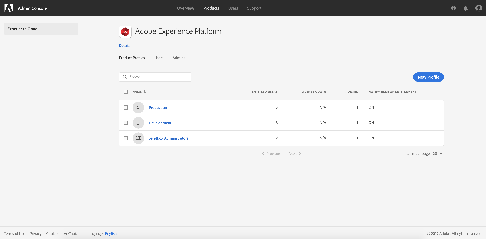

# Arbeitsbereich &quot;Zugriffskontrolle&quot;durchsuchen

Um die Zugriffskontrolle für Experience Platform über die Adobe Admin-Konsole zu konfigurieren, müssen Sie Administrator für eine IMS-Organisation sein, die über ein Abonnement zu Experience Platform verfügt. Adobe unterstützt flexible Administrationshierarchien für IMS Orgs. Zur Konfiguration der Zugriffskontrolle benötigen Sie jedoch **Systemadministrator**, **Produktadministrator** oder **Produktadministrator** . Weitere Informationen zu [Verwaltungsrollen](https://helpx.adobe.com/enterprise/using/admin-roles.html) finden Sie im Adobe Help Center-Artikel.

Wenn Sie keine Administratorrechte haben, wenden Sie sich an Ihren Systemadministrator, um Zugriff zu erhalten.

Sobald Sie über Administratorrechte verfügen, wechseln Sie zur [Adobe Admin Console](https://adminconsole.adobe.com) und melden Sie sich mit Ihren Adobe-Anmeldedaten an. Nach der Anmeldung wird die Seite *Übersicht* für den IMS-Org angezeigt, für den Sie Administratorrechte haben. Diese Seite zeigt die Produkte, die Ihr IMS-Org abonniert, zusammen mit anderen Steuerelementen, um Benutzer und Administratoren zum IMS-Org als Ganzes hinzuzufügen. Klicken Sie auf **Adobe Experience Platform** , um den Arbeitsbereich &quot;Zugriffskontrolle&quot;für Ihre Plattformintegration zu öffnen.

Der Arbeitsbereich &quot;Zugriffskontrolle&quot;für Adobe Experience Platform wird angezeigt und auf der Registerkarte &quot; *Product Profils* &quot;geöffnet. Auf dieser Registerkarte können Sie alle Profil des Produkts Ansicht und verschiedene Einstellungen verwalten, wie in diesem Dokument beschrieben.

Dieses Benutzerhandbuch konzentriert sich auf die Verwendung der Admin-Konsole zum Zuweisen von Zugriffsberechtigungen für die Plattform. Weitere allgemeine Informationen zum Navigieren in der Admin-Konsole finden Sie im Benutzerhandbuch [zur](https://helpx.adobe.com/de/enterprise/using/admin-console.html)Admin-Konsole.

## Nächste Schritte

Nachdem Sie im Arbeitsbereich &quot;Zugriffskontrolle&quot;navigiert haben, fahren Sie mit dem nächsten Schritt fort, um ein neues Profil zu [erstellen](create-profile.md)