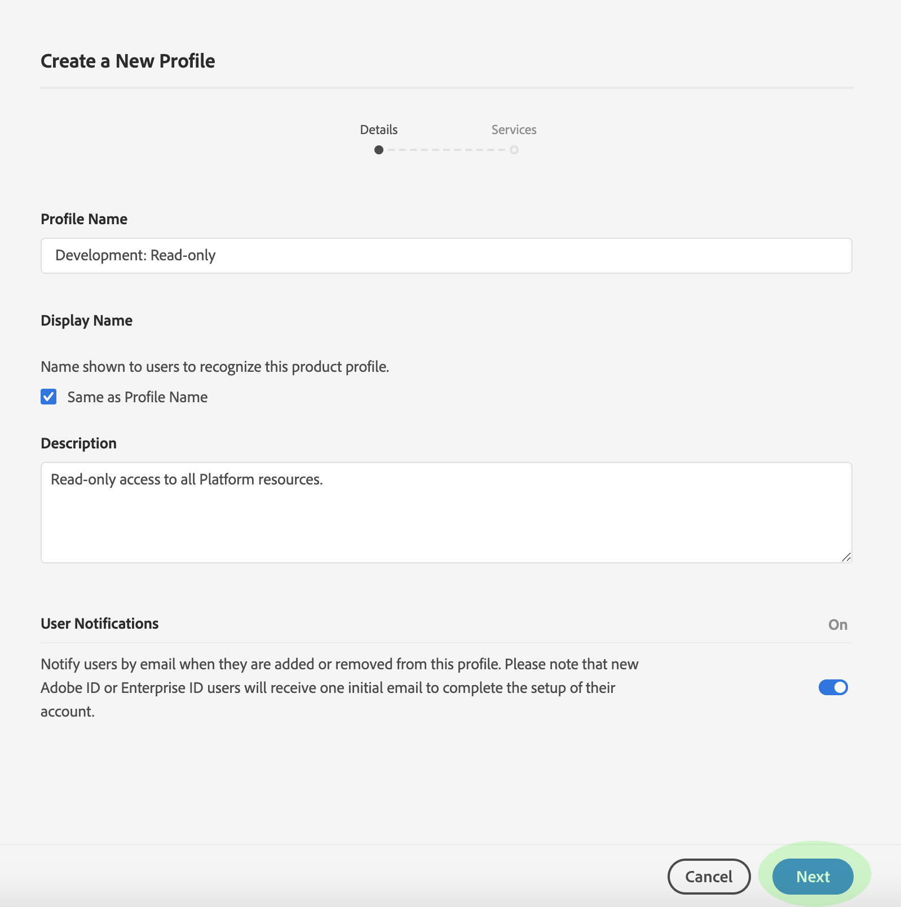

# Neues Profil erstellen

Um Beginn beim Erstellen eines neuen Profils zu erhalten, navigieren Sie zur Registerkarte &quot; *Product Profils* &quot;und klicken Sie auf **New Profil**.

Das Dialogfeld &quot;Neues Profil __ erstellen&quot;wird angezeigt, in dem Sie aufgefordert werden, einen **Profil-Namen** und eine **Beschreibung** für das neue Profil einzugeben. Wenn der Anzeigename des Profils anders lauten soll, deaktivieren Sie die **Option &quot;Dasselbe Profil** &quot;und geben Sie den Anzeigenamen in das angezeigte Textfeld ein. Unter &quot; *Benutzerbenachrichtigungen*&quot;können Sie einstellen, ob Benutzer per E-Mail benachrichtigt werden, wenn sie hinzugefügt oder aus dem Profil entfernt werden.

Klicken Sie abschließend auf **Weiter**.

Im nächsten Bildschirm werden Sie aufgefordert, die Plattformdienste auszuwählen, die in das Profil aufgenommen werden sollen. Klicken Sie auf die Schaltfläche zum Umschalten neben einem Dienst, um ihn zu deaktivieren. Wenn ein Dienst deaktiviert ist, stehen Benutzern, die diesem Profil zugewiesen sind, nicht alle mit diesem Dienst verknüpften Funktionen zur Verfügung. Klicken Sie abschließend auf **Fertig**.

Das neue Profil wurde erfolgreich erstellt und Sie werden zur Seite &quot; [Bearbeitungsberechtigungen&quot;des Profils weitergeleitet](#edit-permissions). Weitere Informationen zum Verwalten von Profilen nach der Erstellung finden Sie in den Abschnitten zum [Verwalten von Berechtigungen](#manage-permissions-for-a-product-profile) und zum [Verwalten von Benutzern](#manage-users-for-a-product-profile) .

## Nächste Schritte

Nachdem Sie ein neues Profil erstellt haben, können Sie mit dem nächsten Schritt fortfahren, um die Berechtigungen für ein Profil zu [verwalten](permissions.md)