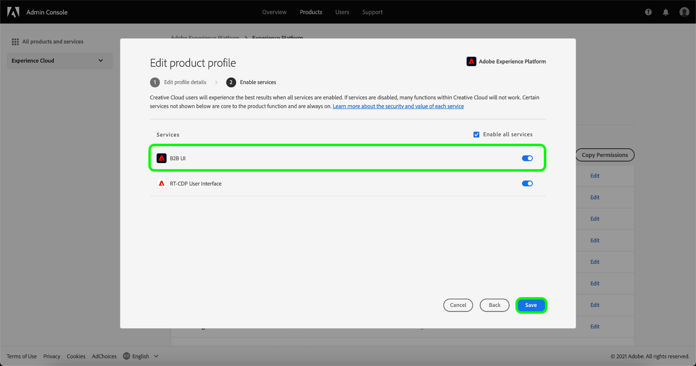

# Erstellen eines neuen Produktprofils in Adobe Admin Console

Um mit dem Erstellen eines neuen Profils zu beginnen, navigieren Sie zur Registerkarte **[!UICONTROL Produktprofile]** und klicken Sie auf **[!UICONTROL Neues Profil]**.

Das Dialogfeld **[!UICONTROL Neues Produktprofil erstellen]** wird angezeigt und fordert Sie zur Eingabe eines Profils, eines optionalen Anzeigenamens und einer optionalen Beschreibung auf. Unter **[!UICONTROL Benutzerbenachrichtigungen]** können Sie einstellen, ob Benutzer per E-Mail benachrichtigt werden, wenn sie hinzugefügt oder aus dem Profil entfernt werden.

Wenn Sie fertig sind, klicken Sie auf **[!UICONTROL Weiter]**.

Im nächsten Bildschirm werden Sie aufgefordert, die Platform-Services auszuwählen, die in das Profil eingeschlossen werden sollen. Klicken Sie auf die Umschalttaste neben einem Service, um ihn zu deaktivieren. Wenn ein Service deaktiviert ist, stehen Benutzern, die diesem Produktprofil zugewiesen sind, sämtliche mit diesem Service verknüpften Funktionen nicht zur Verfügung. Klicken Sie abschließend auf **[!UICONTROL Speichern]**.

Kunden mit Berechtigung für die B2B- oder B2P-Edition haben Zugriff auf die B2B-Benutzeroberfläche. Die B2B-Benutzeroberfläche kann Benutzern über das Menü [!UICONTROL Dienste aktivieren] bereitgestellt werden. Wählen Sie den Umschalter neben [!UICONTROL B2B-Benutzeroberfläche] aus, um den Service für ein bestimmtes Produktprofil zu aktivieren, und klicken Sie dann auf **[!UICONTROL Speichern]**.

Der Umschalter für die B2B-Benutzeroberfläche ermöglicht es Benutzern, B2B-Workflows zur Verwaltung von Accounts und Opportunities sowie B2B-bezogene Segmente anzuzeigen. Weitere Informationen finden Sie in der Dokumentation zu [[!DNL Adobe Real-Time Customer Data Platform B2B Edition]](../../rtcdp/b2b-overview.md).

Das neue Produktprofil wurde erfolgreich erstellt und Sie werden auf die [Seite zur Bearbeitung von Berechtigungen](#edit-permissions) des Profils weitergeleitet. Weitere Informationen zum Verwalten von Produktprofilen nach der Erstellung finden Sie in den Abschnitten zum [Verwalten von Berechtigungen](#manage-permissions-for-a-product-profile) und [Verwalten von Benutzern](#manage-users-for-a-product-profile).

## Nächste Schritte

Nachdem ein neues Produktprofil erstellt wurde, können Sie mit dem nächsten Schritt zum [Verwalten der Berechtigungen für ein Produktprofil](permissions.md) fortfahren.
