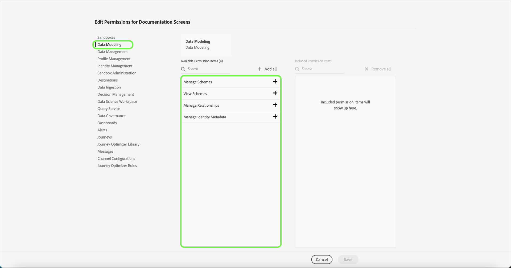

# Berechtigungen für ein Produktprofil verwalten

Unmittelbar nach der [Erstellung eines neuen Produktprofils](#create-a-new-product-profile) werden Sie dazu aufgefordert, die Berechtigungen für das Profil zu konfigurieren. Wenn Sie Berechtigungen für ein vorhandenes Profil bearbeiten wollen, wählen Sie auf der Registerkarte **[!UICONTROL Produktprofile]** das gewünschte Profil aus, um die Detailseite des Profils zu öffnen. Klicken Sie dann auf **[!UICONTROL Berechtigungen]**.

Berechtigungen werden in Kategorien unterteilt und auf dieser Seite aufgelistet. In der Liste werden der Name der Kategorie, die Anzahl der enthaltenen Berechtigungen (und die Anzahl der aktiven Berechtigungen) sowie die zugehörige Beschreibung angezeigt. Siehe Tabelle unter [Ressourcenberechtigungen](/help/access-control/home.md#permissions) für eine Aufschlüsselung der für jede Rolle verfügbaren Berechtigungen.

Klicken Sie auf eine Kategorie in der Liste, um die Seite **[!UICONTROL Berechtigungen bearbeiten]** zu öffnen.

Auf der Seite **[!UICONTROL Berechtigungen bearbeiten]** gibt es einen Arbeitsbereich zum Hinzufügen und Entfernen von Berechtigungen für das ausgewählte Produktprofil. Auf der linken Seite des Bildschirms wird eine Liste mit Berechtigungskategorien angezeigt. Durch Klicken auf eine Kategorie ändert sich, welche Berechtigungen jeweils unter **[!UICONTROL Verfügbare Berechtigungselemente]** angezeigt werden.

Um beispielsweise Berechtigungen für die Datenmodellierung zu aktualisieren, wählen Sie **[!UICONTROL Datenmodellierung]**.

Um eine Berechtigung hinzuzufügen, klicken Sie auf das Pluszeichen **(+)** neben dem Namen der Berechtigung. Alternativ können Sie auf **[!UICONTROL Alle hinzufügen]** klicken, um alle Berechtigungen in der aktuellen Kategorie zum Profil hinzuzufügen. Unter **[!UICONTROL Eingeschlossene Berechtigungselemente]** werden hinzugefügte Berechtigungen angezeigt.

>[!NOTE]
>
>In der Liste **[!UICONTROL Eingeschlossene Berechtigungselemente]** werden nur hinzugefügte Berechtigungen aus der aktuell ausgewählten Kategorie angezeigt.

Um eine Berechtigung zu entfernen, klicken Sie auf das Symbol **X** neben dem Namen der Berechtigung oder wählen Sie **[!UICONTROL Alle entfernen]**, um alle in der aktuellen Kategorie enthaltenen Berechtigungen zu entfernen. Entfernte Berechtigungen werden wieder unter **[!UICONTROL Verfügbare Berechtigungselemente]** angezeigt.

Fahren Sie mit den verfügbaren Kategorien fort und fügen Sie gewünschte Berechtigungen hinzu. Klicken Sie abschließend auf **[!UICONTROL Speichern]**.

Die Registerkarte **[!UICONTROL Berechtigungen]** für das Produktprofil wird erneut angezeigt und meldet, dass die ausgewählten Berechtigungen jetzt aktiviert sind.

## Nächste Schritte

Nachdem Sie die Berechtigungen festgelegt haben, können Sie mit dem nächsten Schritt zum [Verwalten von Details und Diensten für ein Produktprofil](details-and-services.md) fortfahren.
