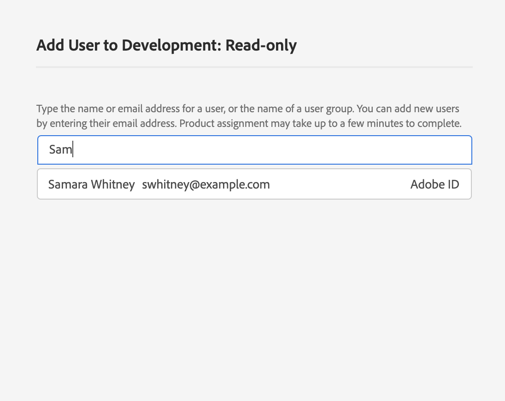

# Benutzer für ein Produktprofil verwalten

Um Benutzer einem Profil zuzuweisen oder daraus zu entfernen, öffnen Sie die Detailseite des Profils und navigieren Sie zur Registerkarte &quot; *[!UICONTROL Benutzer]* &quot;. Klicken Sie von hier auf **[!UICONTROL Hinzufügen Benutzer]**.

The *[!UICONTROL Add User]* dialog appears. Mithilfe des Suchfelds können Sie Benutzer suchen, um sie entweder nach Namen oder per E-Mail hinzuzufügen. Während der Eingabe werden übereinstimmende Benutzer in einem Fenster mit automatischer Vervollständigung unterhalb des Textfelds angezeigt.

>[!NOTE]
>
>Wenn ein Benutzer nicht im Fenster zur automatischen Vervollständigung angezeigt wird, geben Sie seine vollständige E-Mail-Adresse in der Suchleiste ein. Eine Einladung wird mit Anweisungen zur Einrichtung eines Kontos für die Adobe ID an die E-Mail gesendet.

Nachdem Sie einen Benutzer ausgewählt haben, klicken Sie auf **[!UICONTROL Speichern]** , um ihn dem Profil hinzuzufügen.

Die Registerkarte &quot; *[!UICONTROL Benutzer]* &quot;für das Produkt-Profil wird erneut angezeigt, wobei der hinzugefügte Benutzer nun aufgeführt wird.

## Nächste Schritte

Nachdem Sie nun gelernt haben, wie Sie den Zugriff auf [!DNL Platform] Funktionen über das [!DNL Admin Console]steuern können, lesen Sie den Anhang im Überblick [über die](../home.md) Zugriffskontrolle, um mehr über die einzelnen Berechtigungen und die Funktionen zu erfahren, auf die sie Zugriff gewähren [!DNL Platform] .