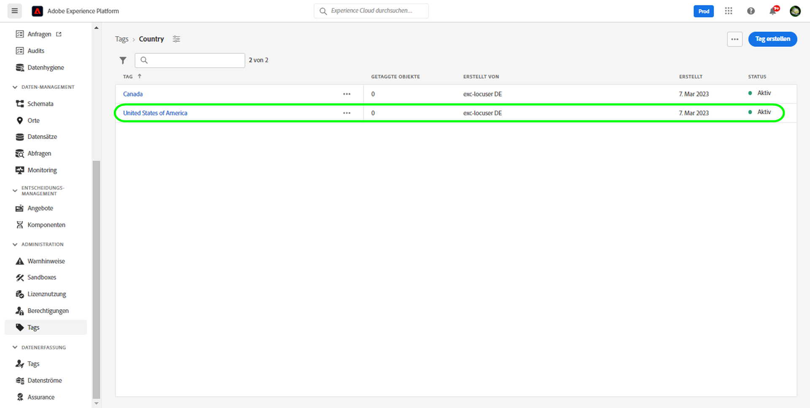
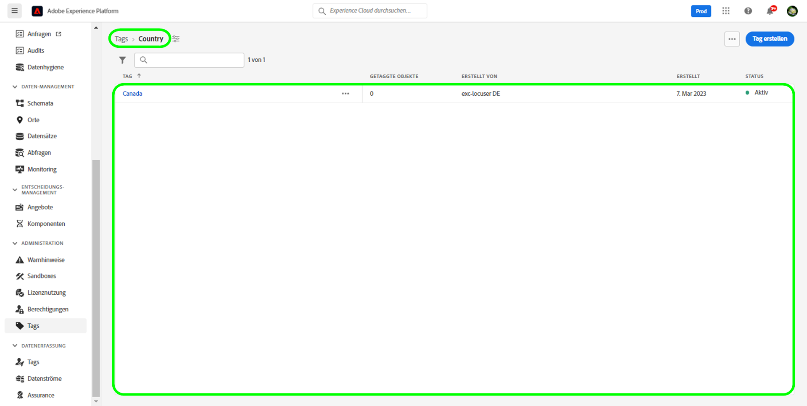

# Verwalten von Tags-Handbuch

Mit Tags können Sie Metadaten-Taxonomien verwalten, um Geschäftsobjekte zu klassifizieren und so die Erkennung und Kategorisierung zu erleichtern. Tags können dabei helfen, wichtige taxonomische Attribute für die Zielgruppen zu identifizieren, mit denen Ihr Team zusammenarbeitet, damit es sie schneller finden und gemeinsame Zielgruppen auch über einen Deskriptor gruppieren kann. Sie sollten allgemeine Tag-Kategorien wie geografische Regionen, Geschäftseinheiten, Produktlinien, Projekte, Teams, Zeiträume (Quartale, Monate, Jahre) oder alles andere identifizieren, was dazu beitragen kann, Bedeutung anzuwenden und die Zielgruppenerkennung für Ihr Team zu erleichtern. 

## Erstellen von Tags {#create-tag}

Um ein neues Tag zu erstellen, wählen Sie **[!UICONTROL tags]** Wählen Sie im linken Navigationsbereich die gewünschte Tag-Kategorie aus.

Auswählen **[!UICONTROL Tag erstellen]** , um ein neues Tag zu erstellen.

Die **[!UICONTROL Tag erstellen]** angezeigt, in dem Sie zur Eingabe eines eindeutigen Tag-Namens aufgefordert werden. Wenn Sie fertig sind, wählen Sie **[!UICONTROL Speichern]**.

Das neue Tag wurde erfolgreich erstellt und Sie werden zum Bildschirm &quot;Tags&quot;weitergeleitet, wo das neu erstellte Tag in der Liste angezeigt wird.

## Tag bearbeiten {#edit-tag}

Die Bearbeitung eines Tags ist nützlich, wenn Rechtschreibfehler, Aktualisierungen der Benennungskonvention oder Terminologieaktualisierungen vorliegen. Beim Bearbeiten eines Tags wird die Verknüpfung des Tags mit allen Objekten beibehalten, auf die sie derzeit angewendet werden.

Um ein vorhandenes Tag zu bearbeiten, wählen Sie in der Liste der Tag-Kategorien die Auslassungszeichen (`...`) neben dem Namen des Tags, das Sie bearbeiten möchten. In einer Dropdown-Liste werden Steuerelemente zum Bearbeiten, Verschieben oder Archivieren des Tags angezeigt. Auswählen **[!UICONTROL Bearbeiten]** aus dem Dropdown-Menü aus.

Die **[!UICONTROL Tag bearbeiten]** angezeigt, in dem Sie aufgefordert werden, den Tag-Namen zu bearbeiten. Wenn Sie fertig sind, wählen Sie **[!UICONTROL Speichern]**.

Der Tag-Name wurde erfolgreich aktualisiert und Sie werden zum Tag-Bildschirm weitergeleitet, wo das aktualisierte Tag in der Liste angezeigt wird.

## Tag zwischen Kategorien verschieben {#move-tag}

Tags können in andere Tag-Kategorien verschoben werden. Durch Verschieben eines Tags wird die Zuordnung des Tags zu allen Objekten, auf die sie derzeit angewendet werden, beibehalten.

Um ein vorhandenes Tag zu verschieben, wählen Sie in der Liste der Tag-Kategorien die Auslassungszeichen (`...`) neben dem Namen des Tags, das Sie verschieben möchten. In einer Dropdown-Liste werden Steuerelemente zum Bearbeiten, Verschieben oder Archivieren des Tags angezeigt. Auswählen **[!UICONTROL Bearbeiten]** aus dem Dropdown-Menü aus.

Die **[!UICONTROL Tag verschieben]** angezeigt, in dem Sie aufgefordert werden, die Tag-Kategorie auszuwählen, in die das ausgewählte Tag verschoben werden soll.

Sie können einen Bildlauf durchführen und aus der Liste auswählen oder alternativ die Suchfunktion verwenden, um den Kategorienamen einzugeben. Wenn Sie fertig sind, wählen Sie **[!UICONTROL Verschieben]**.

Das Tag wurde erfolgreich verschoben und Sie werden zum Bildschirm &quot;Tags&quot;weitergeleitet, wo die aktualisierte Tag-Liste angezeigt wird, in der das Tag nicht mehr angezeigt wird.

Das Tag wird nun in der zuvor ausgewählten Tag-Kategorie angezeigt.

## Tag archivieren {#archive-tag}

Der Status eines Tags kann zwischen aktiv und archiviert umgeschaltet werden. Archivierte Tags werden nicht aus Objekten entfernt, auf die sie bereits angewendet wurden. Sie können jedoch nicht mehr auf neue Objekte angewendet werden. Für jedes Tag wird derselbe Status in allen Objekten angezeigt. Dies ist besonders hilfreich, wenn Sie aktuelle Tag-Objekt-Zuordnungen beibehalten möchten, aber nicht möchten, dass das Tag in Zukunft verwendet wird.

Um ein vorhandenes Tag zu archivieren, wählen Sie in der Liste der Tag-Kategorien die Auslassungszeichen (`...`) neben dem Namen des Tags, das Sie archivieren möchten. In einer Dropdown-Liste werden Steuerelemente zum Bearbeiten, Verschieben oder Archivieren des Tags angezeigt. Auswählen **[!UICONTROL Archivieren]** aus dem Dropdown-Menü aus.

Die **[!UICONTROL Tag archivieren]** angezeigt, in dem Sie aufgefordert werden, das Tag-Archiv zu bestätigen. Auswählen **[!UICONTROL Archivieren]**.

Das Tag wurde erfolgreich archiviert und Sie werden zum Tag-Bildschirm weitergeleitet. Die aktualisierte Tag-Liste zeigt jetzt den Status des Tags als `Archived`.

## Archiviertes Tag wiederherstellen {#restore-archived-tag}

Wenn Sie eine `Archived` -Tag neuen Objekten zuordnen, muss sich das Tag in einem `Active` state. Beim Wiederherstellen eines archivierten Tags wird ein Tag an die `Active` state.

Um ein archiviertes Tag wiederherzustellen, wählen Sie in der Liste der Tag-Kategorien die Auslassungszeichen (`...`) neben dem Namen des Tags, das Sie wiederherstellen möchten. In einem Dropdown-Menü werden Steuerelemente zum Wiederherstellen oder Löschen des Tags angezeigt. Auswählen **[!UICONTROL Wiederherstellen]** aus dem Dropdown-Menü aus.

Die **[!UICONTROL Tag wiederherstellen]** angezeigt, in dem Sie aufgefordert werden, die Wiederherstellung des Tags zu bestätigen. Auswählen **[!UICONTROL Wiederherstellen]**.

Das Tag wurde erfolgreich wiederhergestellt und Sie werden zum Tag-Bildschirm weitergeleitet. Die aktualisierte Tag-Liste zeigt jetzt den Status des Tags als `Active`.

## Löschen von Tags {#delete-tag}

>[!NOTE]
>
>Nur Tags, die sich in einer `Archived` Status und sind mit keinem Objekt verknüpft können gelöscht werden.

Durch das Löschen eines Tags wird es vollständig aus dem System entfernt.

Um ein archiviertes Tag zu löschen, wählen Sie in der Liste der Tag-Kategorien die Auslassungszeichen (`...`) neben dem Namen des Tags, das Sie löschen möchten. In einem Dropdown-Menü werden Steuerelemente zum Wiederherstellen oder Löschen des Tags angezeigt. Auswählen **[!UICONTROL Löschen]** aus dem Dropdown-Menü aus.

Die **[!UICONTROL Tag löschen]** angezeigt, in dem Sie aufgefordert werden, das Löschen des Tags zu bestätigen. Wählen Sie **[!UICONTROL Löschen]** aus.

Das Tag wurde erfolgreich gelöscht und Sie werden zum Tag-Bildschirm weitergeleitet. Das Tag wird nicht mehr in der Liste angezeigt und wurde vollständig entfernt.

## Anzeigen getaggter Objekte {#view-tagged}

Jedes Tag verfügt über eine Detailseite, auf die über das Tag-Inventar zugegriffen werden kann. Auf dieser Seite werden alle Objekte aufgelistet, auf die dieses Tag angewendet wird, sodass Benutzer verwandte Objekte aus verschiedenen Apps und Funktionen in einer einzigen Ansicht sehen können.

Um die Liste der getaggten Objekte anzuzeigen, suchen Sie das Tag in einer Tag-Kategorie und wählen Sie das Tag aus.

Die [!UICONTROL Tagging von Objekten] angezeigt, die Ihnen einen Lagerbestand an getaggten Objekten anzeigt.

## Nächste Schritte

Sie haben jetzt gelernt, wie Tags verwaltet werden. Eine allgemeine Übersicht über Tags in Experience Platform finden Sie im Abschnitt [Tagübersicht](../overview.md).
