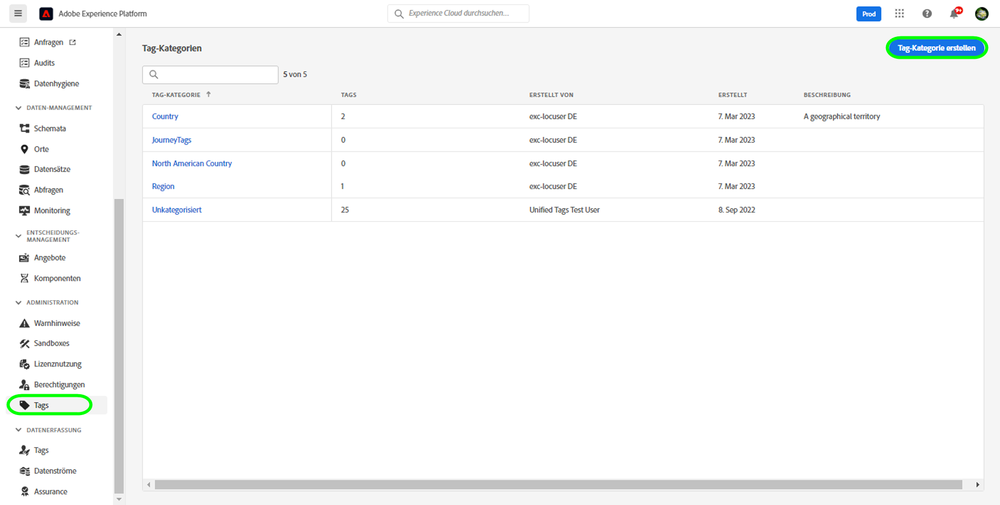
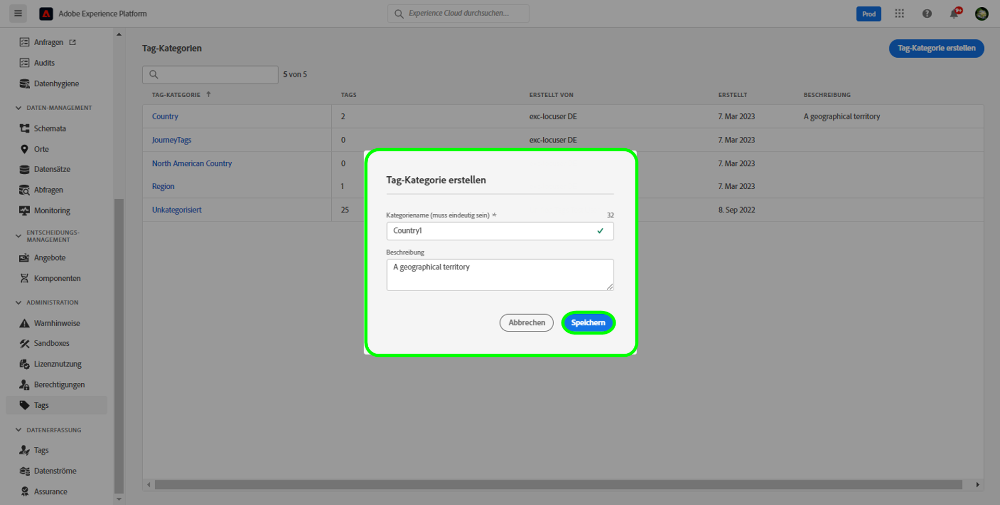
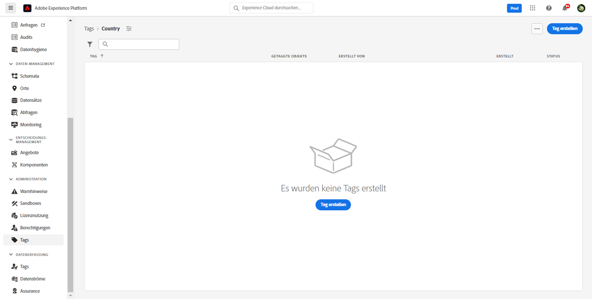
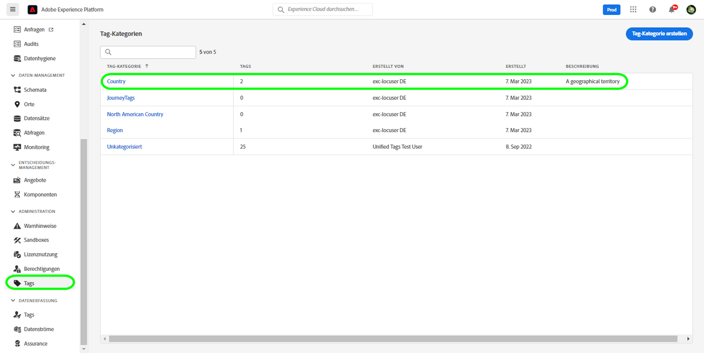
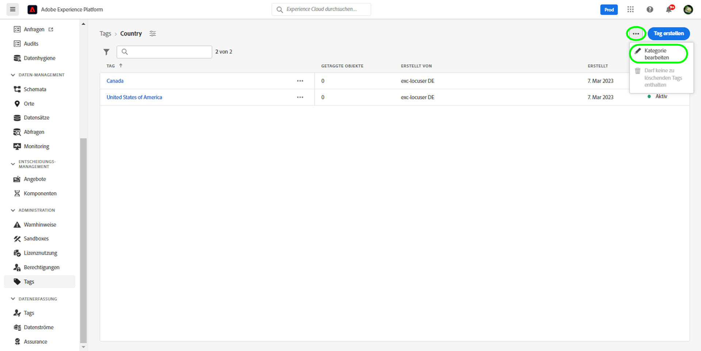
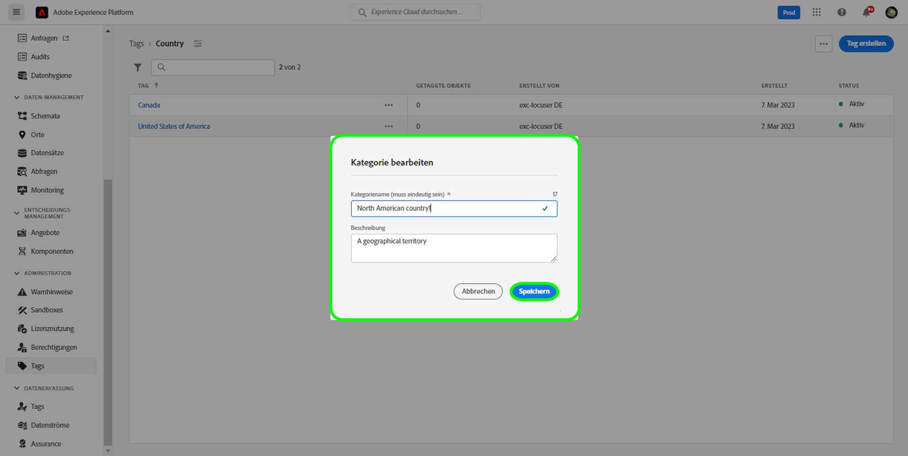
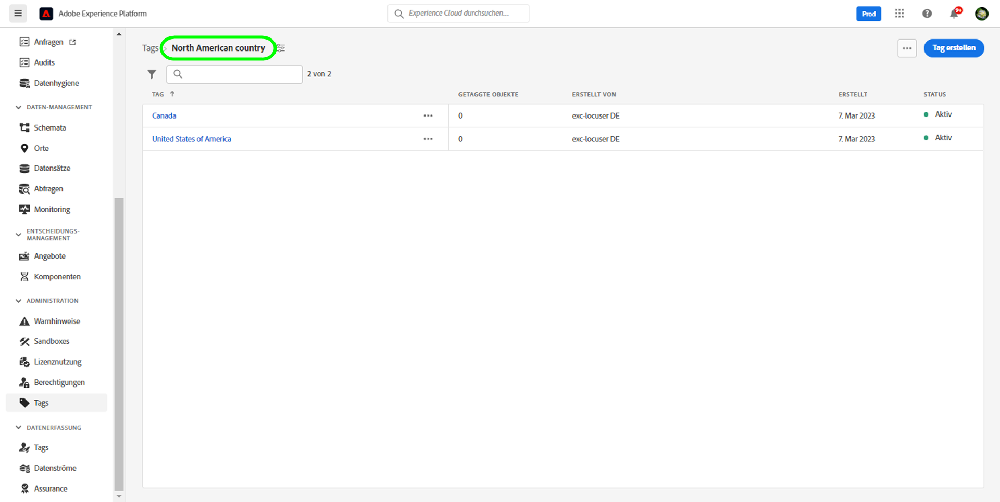
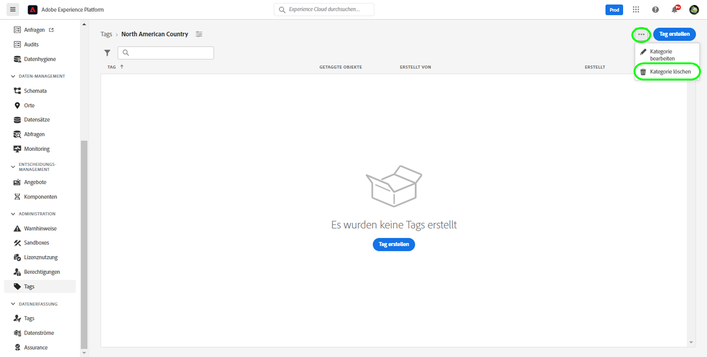
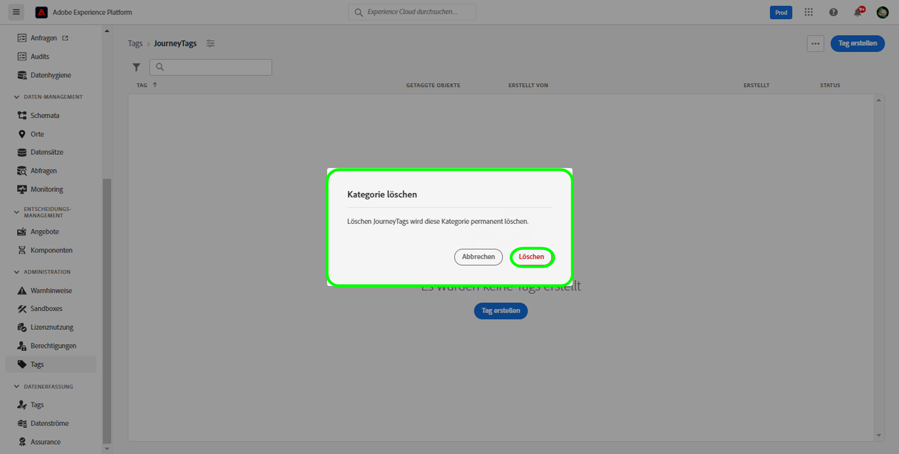

# Handbuch zu Tag-Kategorien

Tag-Kategorien gruppieren Tags in aussagekräftigen Sätzen, um mehr Kontext zu bieten und den Zweck des Tags besser zu verdeutlichen. Bei jedem Tag mit einer Kategorie wird dem Tag-Namen der Name der Kategorie vorangestellt, gefolgt von einem Doppelpunkt.

## Erstellen einer Tag-Kategorie {#create-tag-category}

Um eine neue Kategorie zu erstellen, wählen Sie im linken Navigationsbereich **[!UICONTROL Tags]** aus und klicken Sie dann auf die Option [!UICONTROL Tag-Kategorie erstellen].

Der Dialog **[!UICONTROL Tag-Kategorie erstellen]** erscheint, in dem Sie aufgefordert werden, einen eindeutigen Kategorienamen und optional eine Beschreibung einzugeben. Klicken Sie abschließend auf **[!UICONTROL Speichern]**.

Die neue Tag-Kategorie wurde erfolgreich erstellt und Sie werden zur Tag-Erstellungsseite weitergeleitet, auf der Sie neue Tags zuweisen können. Weitere Informationen zum Erstellen von Tags finden Sie im Dokument [Verwalten von Tags](./managing-tags.md#create-a-tag-create-tag).

## Bearbeiten von Tag-Kategorien {#edit-tag-category}

>[!NOTE]
>
>Beim Bearbeiten oder Umbenennen einer Tag-Kategorie wird die Zuordnung der Tags zu allen Objekten, auf die sie derzeit angewendet werden, beibehalten.

Um eine Tag-Kategorie zu bearbeiten, klicken Sie im linken Navigationsbereich auf **[!UICONTROL Tags]** und wählen Sie dann die Tag-Kategorie aus, die Sie bearbeiten möchten.

Klicken Sie in der Tag-Kategorie auf die Auslassungspunkte (`...`) neben [!UICONTROL Tag erstellen]. In einer Dropdown-Liste werden Steuerelemente zum Bearbeiten oder Löschen von Kategorien angezeigt. Wählen Sie **[!UICONTROL Kategorie bearbeiten]** aus.

Das Dialogfeld **[!UICONTROL Kategorie bearbeiten]** erscheint, in dem Sie aufgefordert werden, den Kategorienamen und die optionale Beschreibung zu aktualisieren. Klicken Sie abschließend auf **[!UICONTROL Speichern]**.

Die Tag-Kategorie wurde erfolgreich aktualisiert und Sie werden zur Tag-Kategorie weitergeleitet.

## Löschen von Tag-Kategorien {#delete-tag-category}

>[!NOTE]
>
>Bevor eine Tag-Kategorie gelöscht werden kann, muss sie leer und frei von Tags sein.

Um eine Tag-Kategorie zu löschen, klicken Sie im linken Navigationsbereich auf **[!UICONTROL Tags]** und wählen Sie dann die Tag-Kategorie aus, die Sie löschen möchten.

Klicken Sie in der Tag-Kategorie auf die Auslassungspunkte (`...`) neben [!UICONTROL Tag erstellen]. In einer Dropdown-Liste werden Steuerelemente zum Bearbeiten oder Löschen von Kategorien angezeigt. Wählen Sie **[!UICONTROL Kategorie löschen]** aus.

Das Dialogfeld **[!UICONTROL Kategorie löschen]** erscheint, in dem Sie aufgefordert werden, das Löschen der Tag-Kategorie zu bestätigen. Klicken Sie zur Bestätigung auf **[!UICONTROL Löschen]**.

Die Tag-Kategorie wurde erfolgreich gelöscht und Sie werden zur Tag-Kategorie-Inventarseite weitergeleitet. Die Tag-Kategorie wird nicht mehr in der Liste angezeigt und wurde vollständig entfernt.

## Nächste Schritte

Sie haben jetzt gelernt, wie Tag-Kategorien verwaltet werden. Sie können mit dem nächsten Schritt [Verwalten von Tags](./managing-tags.md) fortfahren.
