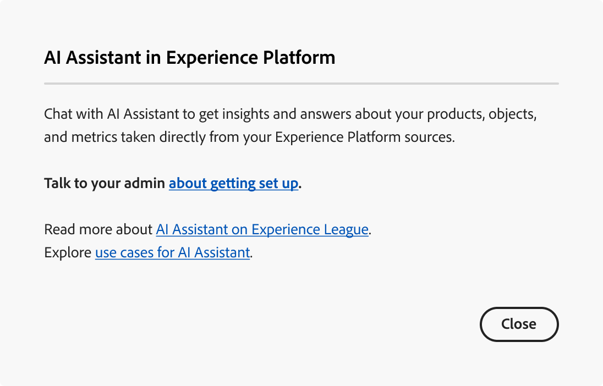

# Zugriff auf KI-Assistent (veraltet) in Experience Platform

>[!IMPORTANT]
>
>Dieses Dokument gilt für den KI-Assistenten (veraltet). Informationen zum KI-Assistenten (der nächsten Generation) finden Sie im Handbuch [Benutzeroberfläche des KI-Assistenten](https://experienceleague.adobe.com/en/docs/experience-cloud-ai/experience-cloud-ai/ai-assistant/ai-assistant-ui) in der Dokumentation [KI in Experience Cloud](https://experienceleague.adobe.com/en/docs/experience-cloud-ai/experience-cloud-ai/home).

In der folgenden Tabelle finden Sie einen Vergleich von KI-Assistent (veraltet) und KI-Assistent (nächste Generation):

| Merkmalsbereich | KI-Assistent (veraltet) | KI-Assistent (nächste Generation) |
| --- | --- | --- |
| Benutzererlebnis | Der KI-Assistent (veraltet) ist nur in einem Bereich der rechten Leiste verfügbar. | Der KI-Assistent (der nächsten Generation) ist sowohl im Bereich der rechten Leiste als auch im immersiven Vollbilderlebnis verfügbar. |
| Funktionsumfang | Sie können den KI-Assistenten (frühere Version) sowohl für Produktkenntnisse als auch für betriebliche Einblicke verwenden. | Sie können den KI-Assistenten (der nächsten Generation) für Produktkenntnisse, operative Einblicke sowie erweiterte agentische Fähigkeiten und die Ausführung mehrstufiger Aufgaben verwenden. |
| Architektur von Platform | Der KI-Assistent (veraltet) wurde nicht auf dem Agent Orchestrator-Stack erstellt. | Der KI-Assistent (der nächsten Generation) wird von [Adobe Experience Platform Agent Orchestrator &#x200B;](https://experienceleague.adobe.com/de/docs/experience-cloud-ai/experience-cloud-ai/agents/agent-orchestrator) unterstützt und ermöglicht Erweiterbarkeit und erweiterte Koordinierung über Funktionen hinweg. |
| Anwendungsbereich | Der KI-Assistent (veraltet) ist eine anwendungsspezifische Implementierung. | Sie können den KI-Assistenten (der nächsten Generation) für ein einheitliches KI-Assistentenerlebnis in allen Adobe Experience Cloud-Programmen verwenden. |
| Zugriffs- und Berechtigungsmodell | Auf einzelne Produktgrenzen abgestimmtes Zugriffsmodell für die Anwendung. | Alle Benutzer erhalten Zugriff auf den KI-Assistenten (der nächsten Generation) und die zugehörigen Experience Platform-Agenten. **Hinweis**: <ul><li>**Adobe Experience Manager**: Ihr Administrator muss Ihnen über die [Adobe Admin Console](https://helpx.adobe.com/de/enterprise/using/admin-console.html) die Berechtigung für den Zugriff auf den KI-Assistenten (der nächsten Generation) erteilen.</li><li>**Customer Journey Analytics**: Ihr Administrator muss Ihnen die Berechtigung für den Zugriff auf den KI-Assistenten über die [Customer Journey Analytics-Zugriffssteuerung](https://experienceleague.adobe.com/en/docs/analytics-platform/using/technotes/access-control?lang=en) erteilen. Auf diese Weise können Sie Fragen zu Produktwissen und Dateneinblicken stellen. |

In Adobe Experience Cloud können Sie über mehrere Anwendungen hinweg auf den KI-Assistenten (frühere Version) zugreifen.

>[!NOTE]
>
>Wenn Sie eine Popup-Meldung in der Benutzeroberfläche „Berechtigungen“ erhalten, die Sie darüber informiert, dass Ihr Unternehmen zunächst zusätzlichen rechtlichen Bedingungen zustimmen muss, um Zugriff auf den KI-Assistenten (veraltet) zu erhalten, wenden Sie sich an Ihr Adobe-Account-Team, um eine Anleitung zu diesen Bedingungen zu erhalten.

## Erste Schritte {#get-started}

Sie müssen zwei erforderliche Schritte ausführen, bevor Sie auf den KI-Assistenten (veraltet) zugreifen können.

1. Ihr Unternehmen muss zunächst den rechtlichen Bedingungen zustimmen. Weitere Informationen erhalten Sie von Ihrem Adobe Account Team.
2. Ihre Admins müssen Ihnen ausreichende Berechtigungen für den Zugriff auf den KI-Assistenten (alt) erteilen.

Wenn Sie keinen dieser beiden erforderlichen Schritte abgeschlossen haben, sehen Sie die folgenden Meldungen, wenn Sie in der Experience Platform-Benutzeroberfläche auf das Chat-Symbol des KI-Assistenten (veraltet) klicken.

>[!BEGINTABS]

>[!TAB Ihr Unternehmen kann den KI-Assistenten (veraltet) nicht verwenden]

Die folgende Meldung wird angezeigt, wenn Sie eine Organisation verwenden, die rechtlich nicht zur Verwendung des KI-Assistenten (veraltet) berechtigt ist. In diesem Fall müssen Sie sich an Ihr Adobe-Account-Team wenden, um den Zugriff zu klären.

>[!TAB Sie haben nicht die richtigen Berechtigungen]

Wenn Ihr Unternehmen rechtlich berechtigt ist, den KI-Assistenten (veraltet) zu verwenden, und Sie immer noch nicht auf die Funktion zugreifen können, wird die folgende Meldung auf der Experience Platform-Benutzeroberfläche angezeigt. In diesem Szenario verfügen Sie nicht über ausreichende Berechtigungen für den Zugriff auf die Funktion. Sie müssen sich daher an Ihre Admins wenden, um die Berechtigungen zu klären.

>[!ENDTABS]

## Zugriff auf KI-Assistenten erhalten (veraltet) {#get-access-to-ai-assistant}

Der Zugriff auf den KI-Assistenten (veraltet) wird durch die folgenden Parameter geregelt:

* **Zugriff auf die Anwendung:** Sie können auf den KI-Assistenten (veraltet) in Adobe Experience Platform, Adobe Real-Time CDP, Adobe Journey Optimizer und [Customer Journey Analytics &#x200B;](https://experienceleague.adobe.com/en/docs/analytics-platform/using/ai-assistant).
<!-- * **Contractual access:** Your company must agree to certain [!DNL GenAI]-related legal terms before your organization can use AI Assistant (Legacy). Contact your organization's administrator or your Adobe Account Team if you are not able to access AI Assistant (Legacy).  -->
* **Berechtigungen:** Verwenden Sie die [Benutzeroberfläche „Berechtigungen](../access-control/abac/ui/permissions.md), um den Zugriff auf den KI-Assistenten (veraltet) in Ihrer Organisation zu gewähren oder zu widerrufen. Um den KI-Assistenten (veraltete Version) verwenden zu können, muss ein Benutzer zu einer Rolle gehören, die mit den Berechtigungen **KI-Assistenten aktivieren** und **operative Insights anzeigen** ausgestattet ist.
   * Als Administrator können Sie einer bestimmten Rolle den **KI-Assistenten aktivieren** hinzufügen und dieser Rolle einen Benutzer hinzufügen, um ihm den Zugriff auf den KI-Assistenten (eine veraltete Version) in Ihrer Organisation zu ermöglichen. **Hinweis**: Diese Berechtigung ermöglicht dem genannten Benutzer den Zugriff auf den KI-Assistenten (veraltet). Er gewährt ihm keine Verwaltungskapazitäten, um anderen Zugriff auf den KI-Assistenten (veraltet) zu gewähren.
   * Als Administrator können Sie einer bestimmten Rolle die **Operative Einblicke anzeigen** hinzufügen und dieser Rolle einen Benutzer hinzufügen, damit er die operativen Einblicke des KI-Assistenten (veraltete Funktion) verwenden kann.

Verwenden Sie die [Benutzeroberfläche für Berechtigungen](../access-control/abac/ui/roles.md) um Berechtigungen zur Verwendung des KI-Assistenten (veraltet) in Experience Platform und Journey Optimizer zu gewähren. Informationen zum Zugriff auf den KI-Assistenten (veraltet) in Customer Journey Analytics. Lesen Sie die Dokumentation in [Customer Journey Analytics](https://experienceleague.adobe.com/en/docs/analytics-platform/using/ai-assistant).

Sobald Sie über die erforderlichen Berechtigungen verfügen, können Sie auf den KI-Assistenten (veraltet) zugreifen, indem Sie das Symbol  in der oberen Kopfzeile der von Ihnen verwendeten Anwendung auswählen.

Sehen Sie sich das folgende Video an, um zu erfahren, wie Sie den Zugriff auf den KI-Assistenten (alt) für Ihre Organisationen und Benutzer konfigurieren.

>[!VIDEO](https://video.tv.adobe.com/v/3436470/?learn=on)

## Nächste Schritte

Sobald Sie vollständigen Zugriff auf den KI-Assistenten (veraltet) haben, können Sie mit der Verwendung der Funktion während Ihrer Workflows fortfahren. Weitere Informationen finden Sie [&#x200B; Handbuch zur Benutzeroberfläche des KI-Assistenten (veraltet](./ui-guide.md) .
