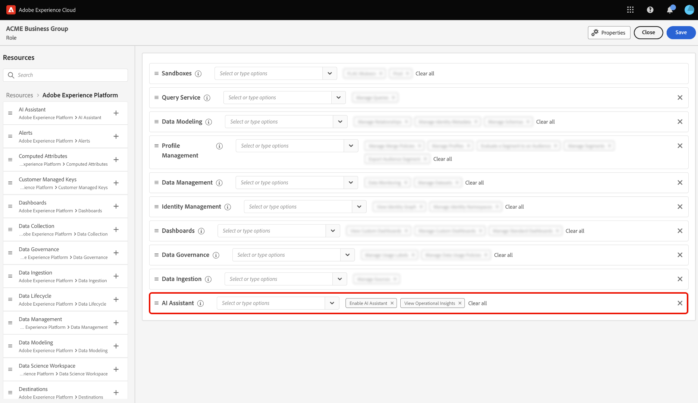

# Zugriff auf AI Assistant in Experience Platform

In Adobe Experience Cloud können Sie über mehrere Anwendungen hinweg auf den KI-Assistenten zugreifen.

>[!IMPORTANT]
>
>Wenn Sie eine Popup-Meldung in der Benutzeroberfläche „Berechtigungen“ erhalten, die Sie darüber informiert, dass Ihr Unternehmen zunächst zusätzlichen rechtlichen Bedingungen zustimmen muss, um Zugriff auf den KI-Assistenten zu erhalten, wenden Sie sich an Ihr Adobe-Account-Team, um Anleitungen zu diesen Bedingungen zu erhalten.

## Erste Schritte {#get-started}

Sie müssen zwei erforderliche Schritte ausführen, bevor Sie auf den KI-Assistenten zugreifen können.

1. Ihr Unternehmen muss zunächst den rechtlichen Bedingungen zustimmen. Weitere Informationen erhalten Sie von Ihrem Adobe Account Team.
2. Ihre Admins müssen Ihnen ausreichende Berechtigungen für den Zugriff auf den KI-Assistenten gewähren.

Wenn Sie keinen dieser beiden erforderlichen Schritte abgeschlossen haben, sehen Sie die folgenden Meldungen, wenn Sie in der Experience Platform-Benutzeroberfläche auf das Chat-Symbol des KI-Assistenten klicken.

>[!BEGINTABS]

>[!TAB Ihr Unternehmen kann den KI-Assistenten nicht verwenden]

Die folgende Meldung wird angezeigt, wenn Sie eine Organisation verwenden, die rechtlich nicht zur Verwendung des KI-Assistenten berechtigt ist. In diesem Fall müssen Sie sich an Ihr Adobe-Account-Team wenden, um den Zugriff zu klären.

>[!TAB Sie haben nicht die richtigen Berechtigungen]

Wenn Ihr Unternehmen rechtlich berechtigt ist, den KI-Assistenten zu verwenden, und Sie immer noch nicht auf die Funktion zugreifen können, wird die folgende Meldung auf der Experience Platform-Benutzeroberfläche angezeigt. In diesem Szenario verfügen Sie nicht über ausreichende Berechtigungen für den Zugriff auf die Funktion. Sie müssen sich daher an Ihre Admins wenden, um die Berechtigungen zu klären.

>[!ENDTABS]

## Zugriff auf den KI-Assistenten

Der Zugriff auf den KI-Assistenten wird durch die folgenden Parameter geregelt:

* **Zugriff auf die Anwendung:** Sie können auf den KI-Assistenten in Adobe Experience Platform, Adobe Real-Time CDP, Adobe Journey Optimizer und [Customer Journey Analytics &#x200B;](https://experienceleague.adobe.com/de/docs/analytics-platform/using/ai-assistant).
<!-- * **Contractual access:** Your company must agree to certain [!DNL GenAI]-related legal terms before your organization can use AI Assistant. Contact your organization's administrator or your Adobe Account Team if you are not able to access AI Assistant.  -->
* **Berechtigungen:** Verwenden Sie die [Benutzeroberfläche „Berechtigungen](../access-control/abac/ui/permissions.md), um den Zugriff auf den KI-Assistenten in Ihrer Organisation zu gewähren oder zu widerrufen. Um den KI-Assistenten verwenden zu können, muss eine bestimmte Person zu einer Rolle gehören, die mit den Berechtigungen **KI-Assistenten aktivieren** und **operative Insights anzeigen** ausgestattet ist.
   * Als Administrator können Sie einer bestimmten Rolle den **KI-Assistenten aktivieren** hinzufügen und dieser Rolle einen Benutzer hinzufügen, um ihm den Zugriff auf den KI-Assistenten in Ihrer Organisation zu ermöglichen. **Hinweis**: Diese Berechtigung ermöglicht dem genannten Benutzer den Zugriff auf den KI-Assistenten. Es werden ihm jedoch keine Verwaltungskapazitäten gewährt, um anderen Zugriff auf den KI-Assistenten zu gewähren.
   * Als Administrator können Sie einer bestimmten Rolle die **Operative Insights anzeigen** hinzufügen und dieser Rolle einen Benutzer hinzufügen, damit er die operativen Insights-Funktionen des KI-Assistenten nutzen kann. Operational Insights befindet sich derzeit in der Beta-Phase.

Verwenden Sie die [Benutzeroberfläche für Berechtigungen](../access-control/abac/ui/roles.md) um Berechtigungen zur Verwendung des KI-Assistenten in Experience Platform und Journey Optimizer zu gewähren. Informationen zum Zugriff auf den KI-Assistenten in Customer Journey Analytics. Lesen Sie die Dokumentation in [Customer Journey Analytics](https://experienceleague.adobe.com/de/docs/analytics-platform/using/ai-assistant).

Sobald Sie über die erforderlichen Berechtigungen verfügen, können Sie auf den KI-Assistenten zugreifen, indem Sie das Symbol KI-Assistent in der oberen Kopfzeile der von Ihnen verwendeten Anwendung auswählen.

Sehen Sie sich das folgende Video an, um zu erfahren, wie Sie den Zugriff auf den KI-Assistenten für Ihre Organisationen und Benutzer konfigurieren.

>[!VIDEO](https://video.tv.adobe.com/v/3475928/?captions=ger&learn=on)

## Nächste Schritte

Sobald Sie vollständigen Zugriff auf den KI-Assistenten haben, können Sie mit der Verwendung der Funktion während Ihrer Workflows fortfahren. Weitere Informationen finden Sie im [Handbuch zur Benutzeroberfläche des KI](./ui-guide.md)Assistenten.
