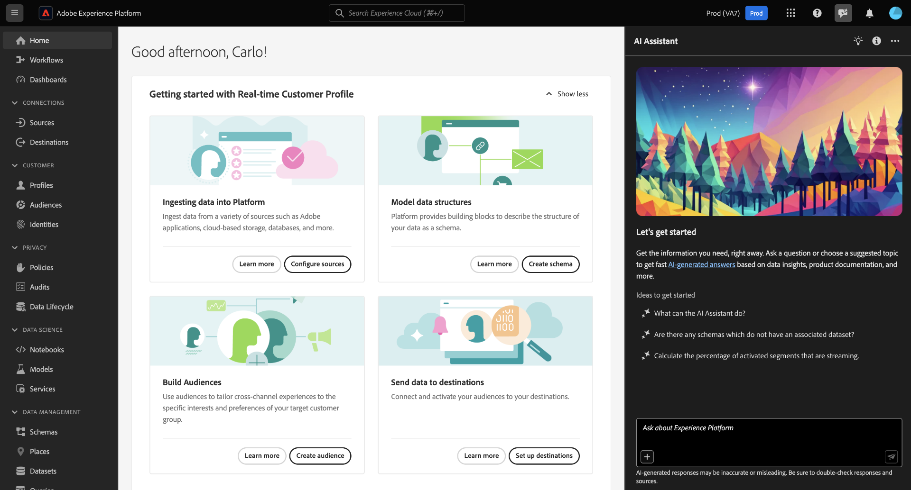

# KI-Assistent in Adobe Experience Platform

Das folgende Video soll Ihr Verständnis von AI Assistant unterstützen.

>[!VIDEO](https://video.tv.adobe.com/v/3429845?learn=on)

Lesen Sie dieses Dokument, um mehr über AI Assistant in Adobe Experience Platform zu erfahren.

AI Assistant in Adobe Experience Platform ist eine Dialogerfahrung, mit der Sie Ihre Workflows in Adobe-Applikationen beschleunigen können. Sie können den AI-Assistenten verwenden, um Produktwissen besser zu verstehen, Probleme zu beheben oder Informationen zu durchsuchen und operative Einblicke zu erhalten. Der AI-Assistent unterstützt Experience Platform, Real-time Customer Data Platform, Adobe Journey Optimizer und Customer Journey Analytics.

>[!IMPORTANT]
>
>Sie müssen einer [Benutzervereinbarung](https://www.adobe.com/de/legal/licenses-terms/adobe-dx-gen-ai-user-guidelines.html) zustimmen, bevor Sie den KI-Assistenten verwenden können. Die Nutzervereinbarung enthält auch die öffentliche Betavereinbarung. Dies ist erforderlich, damit Sie zusätzliche Funktionen des KI-Assistenten verwenden können, wenn sie als Beta-Version eingeführt werden.

+++Auswählen zum Anzeigen der Benutzeroberfläche für Benutzervereinbarungen

+++

## Grundlegendes zum KI-Assistenten {#understanding-ai-assistant}

Der KI-Assistent antwortet auf Ihre gestellten Fragen, indem er eine Datenbank abfragt und dann Daten aus der Datenbank in eine für Menschen lesbare Antwort übersetzt.

Diese interne Darstellung der zugrunde liegenden Daten wird auch als **[!DNL Knowledge Graph]** bezeichnet - ein umfassendes Netz von Konzepten, Daten und Metadaten für eine gegebene Antwort.

Der [!DNL Knowledge Graph] besteht aus Unterdiagrammen, die bei jeder Übermittlung von Abfragen referenziert werden:

* Betriebliche Einblicke des Kunden.
* Betriebliche Einblicke des Kunden in verschiedene Meta-Stores.
* Experience League.

Vor der Abfrage des AI-Assistenten müssen zwei Frageklassen beachtet werden:

### Produktwissen {#product-knowledge}

Produktkenntnis bezieht sich auf Konzepte und Themen, die auf der Experience League-Dokumentation basieren. Produktwissensfragen können in die folgenden Untergruppen weiter spezifiziert werden:

| Produktwissen | Beispiele |
| --- | --- |
| Zielgerichtetes Lernen | <ul><li>Was ist der Unterschied zwischen einer Identität und einem Primärschlüssel oder Fremdschlüssel?</li><li>Was sind Lookalike-Zielgruppen?</li></ul> |
| Offene Entdeckung | <ul><li>Wie kann ich diesen Datensatz exportieren?</li><li>Gibt es Schemata für Kunden im Gesundheitswesen?</li></ul> |
| Fehlerbehebung | <ul><li>Warum kann ich ein Schema, das im Besitz von Adobe ist, nicht für ein Profil aktivieren?</li><li>Warum kann ich ein Segment nicht löschen?</li></ul> |

{style="table-layout:auto"}

Sehen Sie sich das folgende Video an, um weitere Informationen zu Produktwissen von AI Assistant zu erhalten:

>[!VIDEO](https://video.tv.adobe.com/v/3438032/?learn=on)

### Betriebliche Erkenntnisse {#operational-insights}

>[!IMPORTANT]
>
>Die Antworten auf operative Einblicke befinden sich in der Beta-Phase. Jeder, der Zugriff auf die Berechtigung **Operative Einblicke anzeigen** hat, hat Zugriff auf betriebliche Einblicke.

Operative Einblicke beziehen sich auf Antworten, die der KI-Assistent über Ihre Metadatendatenobjekte (Attribute, Zielgruppen, Datenflüsse, Datensätze, Ziele, Journey, Schemas und Quellen) generiert, einschließlich Zählungen, Suchen und Auswirkungen auf die Herkunft. Es werden keine Daten innerhalb der Sandbox angezeigt.

* Wie viele Datensätze habe ich?
* Wie viele Schemaattribute wurden noch nie verwendet?
* Welche Zielgruppen wurden aktiviert?

Sie können in den folgenden Bereichen Fragen zu Ihren operativen Einblicken an den KI-Assistenten stellen:

| Domain | Unterstützte Metadaten | Nicht unterstützte Metadaten |
| --- | --- | --- |
| Attribute | <ul><li>Suche nach Attributnamen</li><li>Attribut - Schemabeziehung</li><li>Attribut - Datensatzbeziehung</li><li>Attribut - Zielgruppenbeziehung</li><li>Attribut - Zielbeziehung</li></ul> | <ul><li>Attributklasse</li><li>Verfolgung</li><li>Veraltungsstatus</li><li>Beschriftungen</li><li>In Attributen gespeicherter Wert</li></ul> |
| Zielgruppen | <ul><li>Zielgruppengröße</li><li>Zielgruppentyp (Streaming oder Batch)</li><li>Erstellungs-/Änderungsdatum</li><li>Aktivierungsstatus</li><li>Anzahl der Profile</li><li>Zielgruppen duplizieren</li><li>Zielgruppendefinitionssuche</li><li>Zielgruppe - Zielgruppenbeziehung</li><li>Zielgruppe - Attributbeziehung</li><li>Zielgruppe - Datensatzbeziehung</li><li>Zielgruppe - Zielbeziehung</li><li>Suche benennen</li><li>Name und ID-Suche | <ul><li>Zielgruppenüberschneidungen</li><li>Zielgruppen-Aktivierung</li><li>Zielgruppe - Kampagnenbeziehungen</li><li>Verfolgung</li><li>Erstellen/Ändern</li><li>Beschriftungen</li><li>Trends bei der Profilqualifizierung</li></ul> |
| Datenflüsse | <ul><li>Dataflow-Anzahl</li><li>Datenflussstatus</li><li>Datenfluss - Datensatzbeziehung</li><li>Datenfluss - Quellbeziehung</li></ul> | <ul><li>Erstellung/Änderung</li><li>Datenfluss-Batch-Beziehungen</li><li>Profilanzahl erfassen</li></ul> |
| Datensätze | <ul><li>Datensatzanzahl</li><li>Profil - Aktivierungsstatus</li><li>Erstellungs-/Änderungsdatum</li><li>Datensatz - Schemabeziehung</li><li>Datensatz - Zielgruppenbeziehung</li><li>Datensatz - Attributbeziehung</li><li>Datensatz - Datenfluss-Beziehung</li><li>Suche benennen </li><li>Name und ID-Suche</li></ul> | <ul><li>Verfolgung</li><li>Erstellt von</li><li>Datensatz - Batch-Beziehung</li><li>Erstellung/Änderung von Datensätzen</li><li>Datensatzgröße</li><li>Anzahl Profile</li><li>Zeilenanzahl</li><li>Wertesuche</li></ul> |
| Ziele | <ul><li>Konfigurierte Zielzahlen</li><li>Ziel - Zielgruppenbeziehung</li><li>Zielattribut-Beziehung</li></ul> | <ul><li>Kontoeinrichtung</li><li>Kontoanmeldeinformationen</li><li>Individuelle Profile aktiviert</li></ul> |
| Journeys | <ul><li>Zählungen</li><li>Suche benennen</li><li>Name und ID-Suche</li><li>Journey-Status</li><li>Ausgelöster Status (Zielgruppe vs. Ereignisse)</li><li>Erstellungs-/Änderungsdatum</li><li>Häufigkeit</li></ul> | <ul><li>Attribute - Journey-Beziehungen</li><li>Verfolgung</li><li>Erstellung/Änderung</li><li>Erstellt von</li><li>Events</li><li>Journey - Datensatz</li><li>Journey - schema</li><li>Angebote</li><li>Trends bei der Profilqualifizierung</li><li>Schrittereignisse</li></ul> |
| Schemata | <ul><li>Schemaanzahl</li><li>Erstellungs-/Änderungsdatum</li><li>Schema - Attributbeziehung</li><li>Schema - Datensatzbeziehung</li><li>Schema - Zielgruppenbeziehung</li><li>Profil - Aktivierungsstatus</li><li>Suche benennen</li><li>Name und ID-Suche</li></ul> | <ul><li>Verfolgung</li><li>Erstellung/Änderung</li><li>Erstellt von</li><li>Feldergruppen</li><li>Identitäten</li><li>Identity-Namespaces</li><li>Beschriftungen</li><li>Anzahl Profile</li></ul> |
| Quellen | <ul><li>Kontonumzählungen</li><li>Kontostatus</li><li>Aktive/inaktive Datenflüsse für jedes Konto</li><li>Source-Connector - Datenfluss-Beziehung</li><li>Source-Konto - Datenfluss-Beziehung</li></ul> | <ul><li>Informationen zu Kontoanmeldeinformationen</li><li>Kontoeinrichtung</li><li>Datenerfassungsmetriken</li><li>Anzahl Profile</li><li>Source - Batch-Beziehungen</li></ul> |

{style="table-layout:auto"}

Bei Fragen zu operativen Einblicken spiegeln die Antworten möglicherweise nicht den aktuellen Status der Benutzeroberfläche wider. Die Daten, die diese Fragen unterstützen, werden alle 24 Stunden aktualisiert. Beispielsweise werden Änderungen, die Benutzer tagsüber in Real-Time CDP vornehmen, mit den Datenspeichern nachts synchronisiert und stehen dann morgens für Benutzerfragen zur Verfügung. Sie müssen sich bei einer Sandbox anmelden, um sich über bestimmte Daten zu Objekten zu informieren.

### Funktionsumfang {#feature-scope}

Derzeit ist der Umfang des AI-Assistenten wie folgt:

* [Produktwissen](./home.md#product-knowledge): Der KI-Assistent kann Fragen zu Produktwissen für Experience Platform, Real-time Customer Data Platform und Adobe Journey Optimizer beantworten. Sie können sich auch über die Customer Journey Analytics-Benutzeroberfläche mit Produktwissensthemen für Customer Journey Analytics befassen.
* [Operative Einblicke](./home.md#operational-insights): Sie können den KI-Assistenten mit Fragen zu betrieblichen Einblicken in die folgenden Datenobjekte befassen: Attribute, Zielgruppen, Datenflüsse, Datensätze, Ziele, Journey, Schemata und Quellen.

## Nächste Schritte

Da Sie nun über allgemeine Kenntnisse im Bereich KI-Assistenzkraft verfügen, können Sie jetzt fortfahren und KI-Assistenzkräfte während Ihrer Workflows verwenden. Weiterführende Informationen finden Sie in der folgenden Dokumentation:

* [Handbuch zur Benutzeroberfläche des AI-Assistenten](./ui-guide.md)
* [Funktionszugriff](./access.md)
* [Fragenleitfaden](./questions.md)
* [Datenschutz, Sicherheit und Governance im KI-Assistenten](./privacy.md)
* [Häufig gestellte Fragen](./faq.md)
