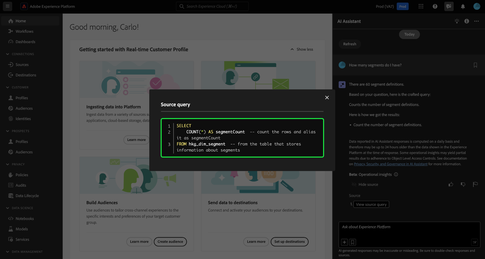
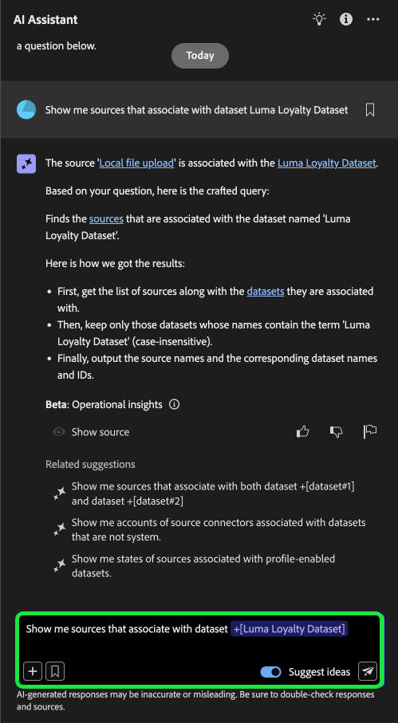

# Handbuch zur Benutzeroberfläche des KI-Assistenten

Lesen Sie dieses Handbuch, um zu erfahren, wie Sie den KI-Assistenten in der Adobe Experience Platform-Benutzeroberfläche verwenden können.

## Zugriff auf den KI-Assistenten über die Experience Platform-Benutzeroberfläche

Um den KI-Assistenten zu starten, wählen Sie **[!UICONTROL KI-Assistenten]** in der oberen Kopfzeile der Experience Platform-Benutzeroberfläche aus.

Die Benutzeroberfläche des KI-Assistenten wird angezeigt und stellt Ihnen sofort Informationen zum Einstieg bereit. Sie können die unter „Ideen[!UICONTROL  bereitgestellten Optionen verwenden, um ] und Befehle wie die folgenden zu beantworten:

* [!UICONTROL Welche meiner Zielgruppen sind aktiviert?]
* [!UICONTROL Was ist ein Schema?]
* [!UICONTROL Erzählen Sie mir einige gängige Anwendungsfälle für Real-Time CDP]

## Handbuch zur Benutzeroberfläche des KI-Assistenten

>[!NOTE]
>
>Der folgende Workflow ist ein Beispiel, das den Erlebnisereignisschema-Erstellungsprozess verwendet, um zu veranschaulichen, wie Sie den KI-Assistenten bei der Verwendung der Experience Platform-Benutzeroberfläche verwenden können.

Stellen Sie sich einen Anwendungsfall vor, in dem Sie ein **Device Trade in Event Schema** erstellen. Während des Erstellungsprozesses des Erlebnisereignis-Schemas stoßen Sie auf das Feld `eventType` . „An dieser Stelle haben Sie die Möglichkeit, Ihren Workflow zu beenden und sich auf die Dokumentation [Grundlagen einer Schemakomposition](../xdm/schema/composition.md) zu beziehen. Alternativ können Sie den KI-Assistenten verwenden, um Antworten auf Ihre Fragen abzurufen und zusätzliche Ressourcen über die vom KI-Assistenten empfohlenen Dokumentations-Links zu finden.“

Um zu beginnen, geben Sie Ihre Frage in das bereitgestellte Textfeld ein. Im folgenden Beispiel wird der KI-Assistent mit der Frage bereitgestellt: &quot;**Was ist das eventType-Feld in einem ExperienceEvent-Schema?**&quot;

Der KI-Assistent fragt dann seine Wissensdatenbank ab und berechnet eine Antwort. Nach einigen Augenblicken gibt der KI-Assistent eine Antwort und zugehörige Vorschläge zurück, die Sie als Folgeaufforderungen verwenden können.

Nachdem Sie eine Antwort vom KI-Assistenten erhalten haben, können Sie aus einer Reihe von Optionen auswählen, um zu entscheiden, wie Sie fortfahren möchten.

### Funktionen des KI-Assistenten {#features}

In diesem Abschnitt werden die verschiedenen Funktionen des KI-Assistenten beschrieben, die Sie während Ihrer Workflows auf Experience Platform verwenden können.

### Anzeigen von betrieblichen Datenobjekten {#view-operational-data-objects}

Abhängig von Ihrer Abfrage stellt der KI-Assistent zusätzliche Informationen zu den Daten in Ihrer Sandbox bereit. Um anzuzeigen, wie die Antwort auf Ihre Abfrage auf Ihre bestimmte Sandbox angewendet wird, wählen Sie **[!UICONTROL In Ihrer Sandbox] aus**

Beim Anzeigen von Daten zu Ihrer Sandbox kann der KI-Assistent direkte Links zu bestimmten Seiten der Benutzeroberfläche bereitstellen, auf denen Ihre abgefragten Daten angezeigt werden.

+++Beispiel auswählen, um es anzuzeigen

In diesem Beispiel gibt der KI-Assistent zusätzliche Informationen zu den vorhandenen XDM-Schemata in Ihrer Sandbox zurück, einschließlich ihrer Gesamtanzahl und der fünf am häufigsten verwendeten Felder.

+++

### Zitate anzeigen {#view-citations}

Sie können die von KI-Assistent an Sie zurückgegebenen Antworten überprüfen, indem Sie die Zitate lesen, die mit jeder Antwort zum Produktwissen verfügbar sind.

+++Auswählen, um ein Beispiel für die Anzeige von Quellen zu sehen

Um Zitate anzuzeigen und die Antwort des KI-Assistenten zu validieren, wählen Sie **[!UICONTROL Quellen anzeigen]**.

Der KI-Assistent aktualisiert die Benutzeroberfläche und stellt Links zur Dokumentation bereit, die die ursprüngliche Antwort bestätigen. Wenn Zitate aktiviert sind, aktualisiert der KI-Assistent außerdem die Antwort, sodass sie Fußnoten enthält, um die spezifischen Teile der Antwort anzugeben, die auf die bereitgestellte Dokumentation verweisen.

+++

### Betriebliche Erkenntnisse {#operational-insights}

Sie müssen sich in einer aktiven Sandbox befinden, damit der KI-Assistent eine Frage zu Ihren operativen Einblicken ausreichend beantworten kann.

+++Wählen Sie aus, um ein Beispiel für eine Frage zu operativen Einblicken zu sehen.

Im folgenden Beispiel wird der KI-Assistent nach der folgenden Abfrage gefragt: **„Anzeigen von Datenflüssen, die mit der Amazon S3-Quelle erstellt wurden“**.

Der KI-Assistent antwortet dann mit einer Tabelle, in der Ihre Datenflüsse und die entsprechenden IDs aufgelistet sind. Um die gesamte Datentabelle anzuzeigen, klicken Sie auf das Symbol Erweitern oben rechts.

Eine erweiterte Ansicht der Tabelle wird angezeigt, die Ihnen eine umfassendere Liste der Datenflüsse auf der Grundlage der Parameter Ihrer Abfrage bereitstellt.

Bei der Aufforderung mit einer Frage zu operativen Einblicken gibt der KI-Assistent eine Erklärung dazu ab, wie die Antwort berechnet wurde. Im folgenden Beispiel beschreibt der KI-Assistent die Schritte, die unternommen wurden, um die mithilfe der [!DNL Amazon S3] erstellten Datenflüsse zu identifizieren.

Sie können auch Filter und Änderungen für Ihre Fragen angeben und den KI-Assistenten anweisen, seine Ergebnisse basierend auf den eingeschlossenen Filtern zu rendern. Sie können beispielsweise den KI-Assistenten bitten, Ihnen einen Trend der Anzahl der Segmentdefinitionen in der Reihenfolge ihres Erstellungsdatums anzuzeigen, Segmentdefinitionen mit null Gesamtprofilen zu entfernen und bei der Anzeige der Daten Monatsnamen anstelle von Ganzzahlen zu verwenden.

**Hinweis:** Antworten zu operativen Einblicken befinden sich derzeit in der Beta-Phase. Wählen Sie in der Benutzeroberfläche des KI-Assistenten das QuickInfo-Symbol aus, um den Beta-Hinweis und einen Link zur Dokumentation anzuzeigen.

+++

### Überprüfen von Antworten auf betriebliche Einblicke {#verify-responses}

Sie können jede Antwort im Zusammenhang mit Fragen zu operativen Einblicken mithilfe einer SQL-Abfrage überprüfen, die der KI-Assistent bereitstellt.

+++Wählen Sie diese Option aus, um ein Beispiel für die Verifizierung von Antworten auf operative Insights anzuzeigen.

Nachdem Sie eine Antwort auf eine operative Insights-Frage erhalten haben, wählen Sie **[!UICONTROL Quellen anzeigen]** und dann **[!UICONTROL Quellabfrage anzeigen]** aus.

Bei der Abfrage mit einer operativen Insights-Frage stellt der KI-Assistent eine SQL-Abfrage bereit, mit der Sie den Prozess überprüfen können, der zur Berechnung der Antwort erforderlich war. Diese Quellabfrage dient nur zu Verifizierungszwecken und wird vom Abfrage-Service nicht unterstützt.

+++

### Entität für automatische Vervollständigung verwenden {#use-entity-auto-complete}

Sie können die Funktion zur automatischen Vervollständigung verwenden, um eine Liste von Datenobjekten zu erhalten, die in Ihrer Sandbox vorhanden sind. Empfehlungen zur automatischen Vervollständigung sind für die folgenden Domains verfügbar: Zielgruppen, Schemata, Datensätze, Journey, Quellen und Ziele.

+++Auswählen, um ein Beispiel für die automatische Vervollständigung anzuzeigen

Sie können die automatische Vervollständigung verwenden, indem Sie das Pluszeichen (**`+`**) in Ihre Abfrage aufnehmen. Alternativ können Sie auch das Pluszeichen (**`+`**) unten im Texteingabefeld auswählen. Es wird ein Fenster mit einer Liste empfohlener Datenobjekte aus Ihrer Sandbox angezeigt.

+++

### Verwenden von Multi-Turn {#use-multi-turn}

Sie können die Multi-Turn-Funktionen des KI-Assistenten nutzen, um während Ihres Erlebnisses eine natürlichere Konversation zu führen. Der KI-Assistent kann bei Bedarf Folgefragen beantworten. Dieser Kontext kann aus einer früheren Interaktion abgeleitet werden.

+++Wählen Sie aus, um ein Beispiel für die Mehrfachdrehung anzuzeigen.

Im folgenden Beispiel wird der KI-Assistent zunächst nach der Gesamtzahl der Datenflüsse gefragt und dann aufgefordert, die zehn neuesten Datenflüsse aufzulisten.

+++

### Neue Unterhaltung beginnen

Mit dem KI-Assistenten können Sie Themen ändern, indem Sie eine neue Konversation zurücksetzen und starten.

+++Wählen Sie aus, um ein Beispiel für das Zurücksetzen Ihrer Konversation zu sehen.

Zum Zurücksetzen wählen Sie die Auslassungszeichen (**`...`**) auf der Benutzeroberfläche des KI-Assistenten und dann **[!UICONTROL Neue Konversation beginnen]** aus. Dies informiert den KI-Assistenten darüber, dass Sie beabsichtigen, Themen zu ändern, und kann besonders bei der Fehlerbehebung bei Abfragen hilfreich sein, die entweder fehlschlagen oder auf falsche Informationen verweisen.

+++

### Entdeckbarkeit verwenden {#use-discoverability}

Sie können die Auffindbarkeitsfunktion des KI-Assistenten verwenden, um eine Liste der allgemeinen Themen anzuzeigen, die in Entitäten gruppiert sind und die der KI-Assistent unterstützt.

+++Auswählen, um ein Beispiel für die Entdeckbarkeit anzuzeigen

Um die Auffindbarkeit anzuzeigen, wählen Sie das Glühbirnensymbol in der oberen Kopfzeile der Benutzeroberfläche des KI-Assistenten aus.

Wählen Sie als Nächstes eine Kategorie und dann eine Eingabeaufforderung aus der bereitgestellten Liste aus. Mithilfe dieser Funktion können Sie sich einen besseren Überblick über die Arten von Fragen verschaffen, die der KI-Assistent beantworten kann. Sie können auch die bereits vorhandenen Eingabeaufforderungen mit bestimmten Details aktualisieren, die sich auf Ihre Sandbox beziehen, indem Sie freien Text oder &quot;[&quot; ](#use-auto-complete).

+++

### Frage automatisch vervollständigen {#use-question-autocomplete}

Mit der Funktion zur automatischen Vervollständigung von Fragen des KI-Assistenten können Sie eine Frage aus einer Liste von Empfehlungen des KI-Assistenten auswählen.

+++Auswählen, um ein Beispiel für die automatische Vervollständigung von Fragen anzuzeigen

Um das Bedienfeld mit den vorgeschlagenen Fragen anzuzeigen, geben Sie mindestens sieben (7) Zeichen in das Eingabefeld ein. Wählen Sie anschließend aus dem angezeigten Menü die Frage aus, die für Sie relevant ist.

Möglicherweise müssen Sie die Platzhalter in einigen Fällen aktualisieren, in denen eine vorgeschlagene Frage betriebliche Einblicke erfordert. Sie müssen beispielsweise den spezifischen Namen eines Datensatzes oder einer Zielgruppe hinzufügen, wenn der Vorschlag aus dem KI-Assistenten Platzhalter enthält.

Platzhalter werden blau hervorgehoben. Wählen Sie den Platzhalter aus, um mit der Aktualisierung seines Werts zu beginnen. Um optimale Ergebnisse bei numerischen Platzhaltern zu erzielen, stellen Sie sicher, dass Sie Ziffern anstelle von Text verwenden. Sie können auch die Funktion zur automatischen Vervollständigung von Entitäten verwenden, um die Platzhalterwerte zu aktualisieren. Sie können keine Frage senden, die nicht ausgefüllte Platzhalter enthält.

**HINWEIS**: Vorschläge sind standardmäßig aktiviert. Wählen Sie den Umschalter **[!UICONTROL Ideen vorschlagen]** aus, um die Funktion zu deaktivieren.

+++

### Verwandte Vorschläge verwenden {#use-related-suggestions}

Sie können den Abschnitt mit den zugehörigen Vorschlägen in jeder Antwort des KI-Assistenten verwenden, um Ihr Gespräch fortzusetzen.

+++Auswählen, um ein Beispiel für zugehörige Vorschläge anzuzeigen

Zugehörige Vorschläge werden mit jeder Antwort des KI-Assistenten zurückgegeben. Um Ihr Gespräch fortzusetzen, wählen Sie einen der Vorschläge im Abschnitt mit den entsprechenden Vorschlägen aus.

Ähnlich wie bei Platzhaltern, die für die automatische Vervollständigung infrage kommen, müssen Sie Platzhalter, die in verknüpften Vorschlägen enthalten sind, aktualisieren, bevor Sie die Abfrage senden können.

+++

## Feedback geben {#feedback}

Mithilfe der mit der Antwort bereitgestellten Optionen können Sie Feedback zu Ihren Erfahrungen mit dem KI-Assistenten geben.

Um Feedback zu geben, wählen Sie entweder Daumen hoch, Daumen runter oder eine Markierung aus, nachdem Sie eine Antwort vom KI-Assistenten erhalten haben, und geben Sie dann Ihr Feedback in das bereitgestellte Textfeld ein.

+++Wählen Sie aus, um weitere Beispiele anzuzeigen

>[!BEGINTABS]

>[!TAB Daumen hoch]

Wählen Sie das Symbol mit den Daumen nach oben aus, um Feedback zu der Frage zu geben, was mit Ihrem Erlebnis mit dem KI-Assistenten gut gelaufen ist.

>[!TAB Daumen runter]

Wählen Sie das Symbol mit den Daumen nach unten aus, um Feedback zu dem zu geben, was basierend auf Ihren Erfahrungen mit dem KI-Assistenten verbessert werden könnte. In diesem Schritt können Sie auch spezifische Kommentare zu Ihrem Erlebnis eingeben. Das Feedback in den Kommentaren wird täglich überprüft.

>[!TAB Markierung]

Wählen Sie das Flag-Symbol aus, um weitere Berichte zu Ihrem Erlebnis mit dem KI-Assistenten bereitzustellen.

>[!ENDTABS]

+++
