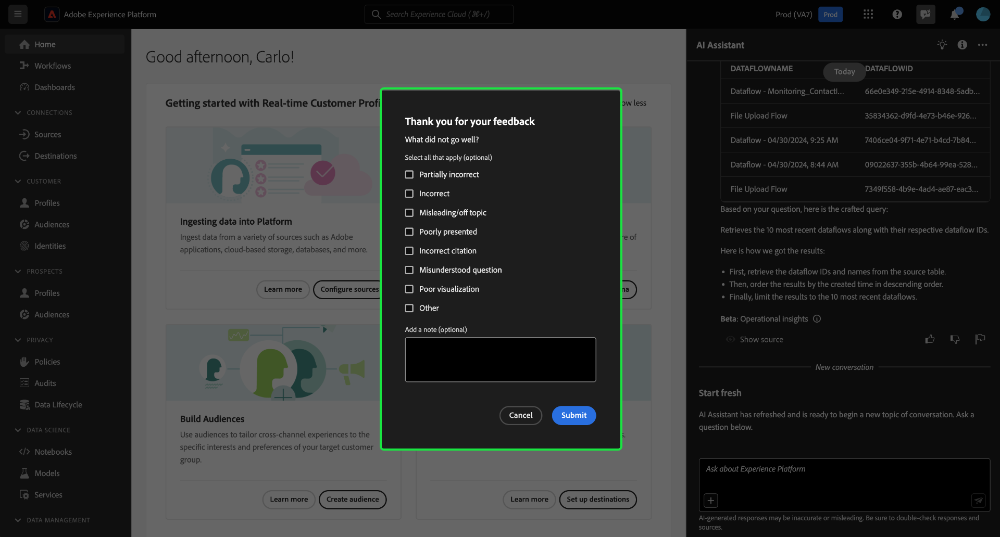

# Handbuch zur Benutzeroberfläche des AI-Assistenten

In diesem Handbuch erfahren Sie, wie Sie den KI-Assistenten in der Adobe Experience Platform-Benutzeroberfläche verwenden können.

## Zugriff auf den KI-Assistenten in der Experience Platform-Benutzeroberfläche

Um den AI-Assistenten zu starten, wählen Sie das Symbol **[!UICONTROL AI-Assistent]** in der oberen Kopfzeile der Experience Platform-Benutzeroberfläche aus.

Die Benutzeroberfläche des KI-Assistenten wird angezeigt und stellt Ihnen sofort Informationen zu den ersten Schritten bereit. Sie können die unter [!UICONTROL Ideen für die ersten Schritte] bereitgestellten Optionen verwenden, um Fragen und Befehle zu beantworten, z. B.:

* [!UICONTROL Welche meiner Zielgruppen sind aktiviert?]
* [!UICONTROL Was ist ein Schema?]
* [!UICONTROL Erzählen Sie mir einige häufige Anwendungsfälle für Real-Time CDP]

## Handbuch zur Benutzeroberfläche des AI-Assistenten

>[!NOTE]
>
>Der folgende Workflow ist ein Beispiel für die Erstellung eines Erlebnisereignisschemas, um zu veranschaulichen, wie Sie den AI-Assistenten bei Verwendung der Experience Platform-Benutzeroberfläche verwenden können.

Betrachten Sie einen Anwendungsfall, in dem Sie einen **Gerätehandel im Ereignisschema** erstellen. Während des Erstellungsprozesses des Erlebnisereignisschemas wird das Feld `eventType` angezeigt. &quot;An dieser Stelle haben Sie die Möglichkeit, Ihren Workflow zu beenden und sich auf die [Grundlagen einer Schemakomposition](../xdm/schema/composition.md) zu beziehen. Alternativ können Sie den AI-Assistenten verwenden, um Antworten auf Ihre Fragen abzurufen und über die Dokumentationslinks, die von AI Assistant empfohlen werden, zusätzliche Ressourcen zu finden.&quot;

Geben Sie zunächst Ihre Frage in das bereitgestellte Textfeld ein. Im folgenden Beispiel erhält der KI-Assistent die Frage: &quot;**Was ist das Feld eventType in einem ExperienceEvent-Schema?**&quot;

AI Assistant fragt dann seine Wissensdatenbank ab und berechnet eine Antwort. Nach einigen Augenblicken gibt der KI-Assistent eine Antwort und entsprechende Vorschläge zurück, die Sie als Aufforderung zur Nachverfolgung verwenden können.

Nach Erhalt einer Antwort des KI-Assistenten können Sie aus einer Reihe von Optionen auswählen, um zu entscheiden, wie Sie vorgehen möchten.

### Funktionen des KI-Assistenten {#features}

In diesem Abschnitt werden die verschiedenen Funktionen des KI-Assistenten beschrieben, die Sie während Ihrer Workflows auf dem Experience Platform verwenden können.

### Anzeigen betrieblicher Datenobjekte {#view-operational-data-objects}

Je nach Abfrage stellt der KI-Assistent zusätzliche Informationen zu den Daten in Ihrer Sandbox bereit. Um anzuzeigen, wie die Antwort auf Ihre Abfrage auf Ihre bestimmte Sandbox angewendet wird, wählen Sie **[!UICONTROL In Ihrer Sandbox]** aus.

Beim Anzeigen von Daten zu Ihrer Sandbox kann der KI-Assistent direkte Links zu bestimmten Benutzeroberflächen-Seiten bereitstellen, auf denen Ihre abgefragten Daten angezeigt werden.

+++Auswählen zum Anzeigen des Beispiels

In diesem Beispiel gibt der KI-Assistent zusätzliche Informationen zu den vorhandenen XDM-Schemas in Ihrer Sandbox zurück, einschließlich der Gesamtzahl der Schemas und der fünf am häufigsten verwendeten Felder.

+++

### Zitate anzeigen {#view-citations}

Sie können die von AI Assistant an Sie zurückgegebenen Antworten überprüfen, indem Sie die verfügbaren Zitate mit jeder Antwort auf das Produktwissen überprüfen.

+++Auswählen , um ein Beispiel für die Anzeige von Quellen anzuzeigen

Um Zitate anzuzeigen und die Antwort des KI-Assistenten zu überprüfen, wählen Sie **[!UICONTROL Quellen anzeigen]** aus.

Der AI-Assistent aktualisiert die Benutzeroberfläche und bietet Ihnen Links zur Dokumentation, die die ursprüngliche Antwort bestätigen. Wenn Zitate aktiviert sind, aktualisiert der KI-Assistent die Antwort dahingehend, dass er Fußnoten enthält, die die spezifischen Teile der Antwort angeben, die auf die bereitgestellte Dokumentation verweisen.

Sie können auch die Vorschläge, die der KI-Assistent unter **[!UICONTROL Verwandte Vorschläge]** bereitstellt, verwenden, um Themen im Zusammenhang mit Ihrer ursprünglichen Frage weiter zu untersuchen.

+++

### Betriebliche Erkenntnisse {#operational-insights}

Sie müssen sich in einer aktiven Sandbox befinden, damit der KI-Assistent ausreichend auf eine Frage zu Ihren operativen Einblicken antworten kann.

+++Auswählen , um ein Beispiel für eine operative Insights-Frage anzuzeigen

Im folgenden Beispiel wird der AI-Assistent mit der folgenden Abfrage gefragt: **&quot;Anzeigen von Datenflüssen, die mit der Amazon S3-Quelle erstellt wurden&quot;**.

Der AI-Assistent antwortet dann mit einer Tabelle, in der Ihre Datenflüsse und die zugehörigen IDs aufgelistet sind. Um die gesamte Datentabelle anzuzeigen, wählen Sie oben rechts das Symbol zum Erweitern aus.

Eine erweiterte Ansicht der Tabelle mit einer umfassenderen Liste von Datenflüssen, die auf den Parametern Ihrer Abfrage basieren, wird angezeigt.

Wenn eine Frage zu operativen Einblicken gestellt wird, erläutert der KI-Assistent, wie die Antwort berechnet wurde. Im folgenden Beispiel beschreibt der AI-Assistent die Schritte zur Identifizierung der Datenflüsse, die mit der Quelle [!DNL Amazon S3] erstellt wurden.

Sie können auch Filter bereitstellen und Änderungen an Ihren Fragen vornehmen und AI Assistant anweisen, seine Ergebnisse anhand der von Ihnen eingeschlossenen Filter zu rendern. Beispielsweise können Sie den AI-Assistenten bitten, Ihnen einen Trend zur Anzahl der Segmentdefinitionen in der Reihenfolge ihres Erstellungsdatums anzuzeigen, Segmentdefinitionen mit null Gesamtprofilen zu entfernen und bei der Anzeige der Daten Monatsnamen anstelle von Ganzzahlen zu verwenden.

**Hinweis:** Antworten auf operative Einblicke befinden sich derzeit in der Beta-Phase. Wählen Sie das QuickInfo-Symbol in der Benutzeroberfläche des AI-Assistenten aus, um den Beta-Hinweis anzuzeigen und einen Link zur Dokumentation zu erhalten.

+++

### Überprüfen der betrieblichen Insights-Antworten {#verify-responses}

Sie können jede Antwort im Zusammenhang mit betrieblichen Insights-Fragen mithilfe einer SQL-Abfrage überprüfen, die von AI Assistant bereitgestellt wird.

+++Auswählen zum Anzeigen eines Beispiels für die Überprüfung operativer Insights-Antworten

Nachdem Sie eine Antwort für eine operative Insight-Frage erhalten haben, wählen Sie **[!UICONTROL Quellen anzeigen]** und dann **[!UICONTROL Quellabfrage anzeigen]** aus.

Bei Fragen zu operativen Einblicken stellt der AI-Assistent eine SQL-Abfrage bereit, mit der Sie den Prozess zur Berechnung der Antwort überprüfen können. Diese Quellabfrage dient nur zu Überprüfungszwecken und wird von Query Service nicht unterstützt.

+++

### Automatische Vervollständigung verwenden {#use-auto-complete}

Sie können die Funktion zum automatischen Ausfüllen verwenden, um eine Liste von Datenobjekten zu erhalten, die in Ihrer Sandbox vorhanden sind. Empfehlungen zur automatischen Vervollständigung stehen für die folgenden Domänen zur Verfügung: Zielgruppen, Schemata, Datensätze, Quellen und Ziele.

+++Auswählen , um ein Beispiel für die automatische Vervollständigung anzuzeigen

Sie können die automatische Vervollständigung verwenden, indem Sie das Pluszeichen (**`+`**) in Ihre Abfrage einfügen. Alternativ können Sie auch das Pluszeichen (**`+`**) am unteren Rand des Texteingabefelds auswählen. Es wird ein Fenster mit einer Liste der empfohlenen Datenobjekte aus Ihrer Sandbox angezeigt.

+++

### Mehrdrehzahl verwenden {#use-multi-turn}

Sie können die mehrgleisigen Funktionen des KI-Assistenten verwenden, um während Ihres Erlebnisses ein natürlicheres Gespräch zu führen. Die KI-Assistenzkraft ist in der Lage, die gegebenen Folgefragen zu beantworten. Dieser Kontext kann aus einer früheren Interaktion abgeleitet werden.

+++Auswählen, um ein Beispiel für eine Mehrfachumstellung anzuzeigen

Im folgenden Beispiel wird der KI-Assistent zunächst nach der Gesamtzahl der Datenflüsse gefragt und dann aufgefordert, die 10 neuesten Datenflüsse aufzulisten.

+++

### Neue Unterhaltung beginnen

Sie können Themen mit dem KI-Assistenten ändern, indem Sie eine neue Unterhaltung zurücksetzen und starten.

+++Auswählen , um ein Beispiel für das Zurücksetzen der Konversation anzuzeigen

Um das Zurücksetzen vorzunehmen, wählen Sie die Auslassungszeichen (**`...`**) auf der Benutzeroberfläche des AI-Assistenten aus und wählen Sie dann **[!UICONTROL Neue Konversation starten]** aus. Dies informiert den AI-Assistenten darüber, dass Sie beabsichtigen, Themen zu ändern. Dies kann besonders bei der Fehlerbehebung von Abfragen hilfreich sein, die entweder fehlschlagen oder auf falsche Informationen verweisen.

+++

### Erkennung verwenden {#use-discoverability}

Sie können die Funktion zur Auffindbarkeit von AI-Assistenten verwenden, um eine Liste der allgemeinen Themen anzuzeigen, die von AI Assistant unterstützt werden und in Entitäten gruppiert sind.

+++Auswählen, um ein Beispiel für Entdeckbarkeit anzuzeigen

Um die Entdeckung anzuzeigen, wählen Sie das Glühbirnensymbol in der oberen Kopfzeile der Benutzeroberfläche des AI-Assistenten aus.

Wählen Sie als Nächstes eine Kategorie aus und wählen Sie dann eine Eingabeaufforderung aus der bereitgestellten Liste aus. Sie können diese Funktion verwenden, um eine bessere Vorstellung davon zu erhalten, welche Arten von Fragen der KI-Assistent beantworten kann. Sie können die bereits vorhandenen Eingabeaufforderungen auch mit spezifischen Details aktualisieren, die sich auf Ihre Sandbox beziehen, indem Sie freien Text oder [autocomplete](#use-auto-complete) verwenden.

+++

## Feedback geben {#feedback}

Sie können mithilfe der Antwortmöglichkeiten Feedback zu Ihrer Erfahrung mit dem KI-Assistenten geben.

Um Feedback zu geben, wählen Sie entweder Daumen nach oben, Daumen nach unten oder eine Markierung aus, nachdem Sie eine Antwort vom AI-Assistenten erhalten haben, und geben Sie dann Ihr Feedback in das bereitgestellte Textfeld ein.

+++Auswählen , um weitere Beispiele anzuzeigen

>[!BEGINTABS]

>[!TAB wirft nach oben]

Wählen Sie das Daumen-nach-oben-Symbol aus, um Feedback dazu zu geben, was mit Ihrem Erlebnis mit dem KI-Assistenten gut gelaufen ist.

>[!TAB wirft nach unten]

Wählen Sie das Daumendown-Symbol aus, um Feedback dazu zu geben, was basierend auf Ihrem Erlebnis mit dem KI-Assistenten verbessert werden könnte. Während dieses Schritts können Sie auch spezifische Kommentare zu Ihrem Erlebnis angeben. Das in den Kommentaren enthaltene Feedback wird täglich überprüft.

>[!TAB Markierung]

Wählen Sie das Flag-Symbol aus, um weitere Berichte zu Ihrem Erlebnis mit dem KI-Assistenten bereitzustellen.

>[!ENDTABS]

+++
