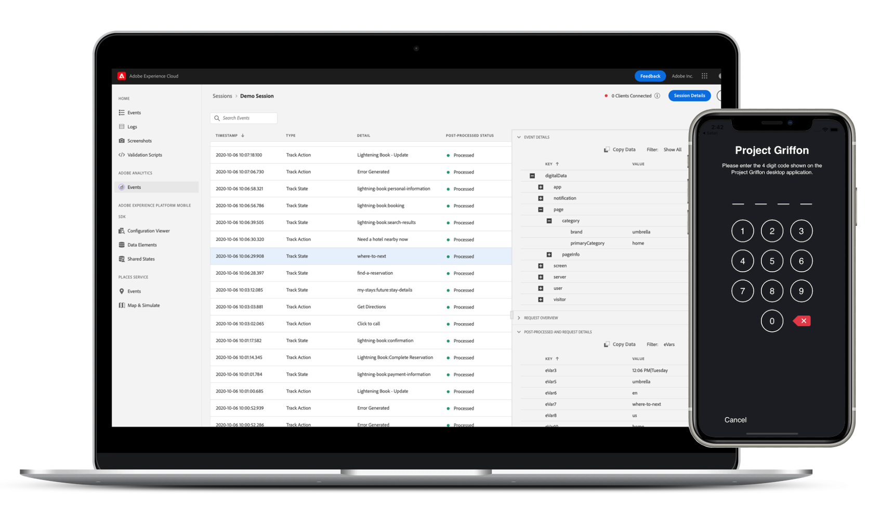

# Adobe Experience Platform Assurance

Adobe Experience Platform Assurance ist ein Produkt aus [Adobe Experience Cloud](https://www.adobe.com/experience-cloud.html) , damit Sie die Erfassung, den Testversand, die Simulation und die Validierung der Datenerfassung und der Bereitstellung von Erlebnissen in Ihrer App unterstützen können.

>[!IMPORTANT]
>
> Project Griffon ist jetzt bekannt als **Sicherheit**!
>
> Project Griffon ist jetzt allgemein verfügbar für **all** Adobe Experience Cloud-Kunden als Assurance. Weitere Informationen zu dieser Transition finden Sie im Abschnitt [Benutzerhandbuch](./user-access.md).

>[!INFO]
>
>Sicherstellen Öffentliche APIs sind verfügbar!
>
>[Die Assurance-APIs](https://developer.adobe.com/adobe-assurance-public-apis/) sind eine Sammlung von APIs, mit denen Benutzer ihre Web- und mobilen Apps testen und debuggen können, wenn sie mit dem Adobe Assurance Mobile SDK ausgestattet sind.

## Allgemeine Verfügbarkeit

Ab dem 15. Oktober 2022 ist &quot;Assurance&quot;allgemein für alle Adobe Experience Cloud verfügbar.

### Was ändert sich?

Am 15. Oktober wird der Zugriff auf die Zuverlässigkeitserklärung über die Admin Console verwaltet. Bitte lesen Sie die [Benutzerhandbuch](./user-access.md) , um sicherzustellen, dass Sie weiterhin ununterbrochen Zugriff haben.

Es werden keine anderen Änderungen oder Störungen bei bestehenden Assurance-Integrationen, -Sitzungen und -Ereignissen erwartet. Der Zugriff auf die Versicherung kann über [https://griffon.adobe.com](https://griffon.adobe.com) **oder** können Sie verwenden (und Lesezeichen) [https://experience.adobe.com/assurance](https://experience.adobe.com/assurance).

## Was kann Assurance für Sie tun?

### Schnell-Setup

Beginnen Sie mit einigen Codezeilen in Kürze. Bei mobilen Apps unterstützt Assurance das Adobe Experience Platform Mobile SDK bei der Überprüfung, Simulation und Validierung von App-Ereignissen, Standortsignalen, Konfigurationsparametern, SDK-Protokollen, Geräteinformationen und mehr.

### Keine problemlose Verbindung

Mit Assurance ist es einfach und zuverlässig, Ihre App mit Platform zu verbinden. Sie müssen keine Netzwerk-Proxys verwenden. [MiTM](https://en.wikipedia.org/wiki/Man-in-the-middle_attack)) und andere Netzwerkgymnastik - das Verbinden Ihrer App mit Assurance ist so einfach wie das Scannen eines QR-Codes oder das Tippen auf eine Schaltfläche.

### Echtzeitüberprüfung, Simulation und Validierung

Nach der Verbindung mit Assurance können Sie Live-Streaming-App-Ereignisse und -Aktivitäten untersuchen und filtern und suchen, um Rauschen zu vermeiden. Ereignisse enthalten Details zur Validierung, zum Debugging und zur Fehlerbehebung bei der Implementierung Ihrer Mobile App. Mit &quot;Assurance&quot;können Sie außerdem Screenshots erstellen, Standortsignale simulieren und vieles mehr in Echtzeit.

### Integration mit Adobe Experience Cloud

Client-seitige Daten und Erlebnisse werden durch die Einrichtung von Berichterstellungsregeln, Aktivitäten und Kampagnen durch Benutzer auf unseren marketerorientierten Benutzeroberflächen kontextgebunden. Um Ihnen zu helfen, die Punkte zwischen den beiden zu verbinden, integrieren wir in Adobe Experience Cloud-Lösungen wie Adobe Experience Platform, Adobe Analytics, Adobe Target, Places Service und mehr.

## Funktionen

### Adobe Experience Platform Mobile SDK-Ereignisse, -Protokolle und mehr

Mithilfe von &quot;Assurance&quot;können Sie unformatierte SDK-Ereignisse überprüfen, die vom Adobe Experience Platform Mobile SDK generiert wurden. Alle vom SDK erfassten Ereignisse stehen zur Überprüfung zur Verfügung. SDK-Ereignisse werden in einer Listenansicht geladen, sortiert nach Zeit. Jedes Ereignis verfügt über eine detaillierte Ansicht, die weitere Details enthält. Zusätzliche Ansichten zum Durchsuchen von SDK-Konfigurationen, Datenelementen, freigegebenen Status und SDK-Erweiterungsversionen werden ebenfalls bereitgestellt.

### Adobe Analytics

Die Ansicht Adobe Analytics > Analytics-Ereignisse ist eine fokussierte Ansicht, die Ereignisse im Zusammenhang mit Ihrer mobilen Adobe Analytics-Implementierung anzeigt. Die Listenansicht zeigt den Lebenszyklus- oder Aktions-/Statusereignis, den &quot;Status&quot;nach der Verarbeitung sowie die erforderlichen Ereignisdetails in einer speziell formatierten Ansicht an. Der Status Nach Verarbeitung zeigt an, wie das Ereignis von Adobe Analytics verarbeitet wurde, nachdem die Verarbeitungsregeln auf das Ereignis angewendet wurden.

### Adobe Analytics für Streaming Media

Die Ansicht &quot;Adobe Analytics&quot;> &quot;Media Analytics-Ereignisse&quot;zeigt Ereignisse für Ihre Audio- und Videoanalyseimplementierung an. Die Detailansicht der Ereignisse zeigt standardmäßige und benutzerdefinierte Metadaten an, die für jede Wiedergabesitzung verfolgt werden. Darüber hinaus können Sie nach der Verarbeitung verarbeitete Status- und Medienanalysedaten wie die Medienbesuchszeit oder die Gesamtpufferdauer anzeigen.

### Places (Location Services)

Die Ansicht &quot;Location Services&quot;ist eine geräteübergreifende Ansicht, die die Einstiegs- und Ausstiegsereignisse des Benutzerstandorts zur einfachen Validierung anzeigt. Diese praktische Ansicht bietet eine bequeme Schnittstelle, um standortspezifische Datenpunkte zur Überprüfung auf dem Client für das kontextbezogene Debugging anzuzeigen.

## Ist die Sicherheit gewährleistet?

Die Zuverlässigkeitserklärung umfasst die folgenden Sicherheitsmaßnahmen:

* Sowohl die Assurance- als auch die Assurance-Web-Benutzeroberfläche verfügen über einen sicheren, PIN-basierten Handshake für eine Verbindung. Der Benutzer muss explizit einen Handshake erstellen, der verhindert, dass &quot;versehentliche&quot;Zuverlässigkeitsverbindungen von einem Endbenutzer erstellt werden.
* Es werden nur Verbindungen zwischen Assurance und der Assurance-Web-Benutzeroberfläche unterstützt, die zur gleichen Adobe Experience Cloud-Organisations-ID gehören.
* Adobe Experience Platform Mobile SDKs-Ereignisse werden über HTTPS übertragen.
* Assurance- und Adobe Experience Platform Mobile-SDKs verwenden TLS 1.2
* Zuverlässigkeitssitzungen werden nach 30 Tagen gelöscht.
* Die Sitzungsdaten der Versicherung werden im Ruhezustand gemäß Best Practices für die Speicherung verschlüsselt.

## Erste Schritte

Um Assurance einzurichten, müssen Sie zunächst die Assurance-Erweiterung in Ihrer Anwendung installieren. Weiterführende Informationen dazu finden Sie im Tutorial zu [Implementierung der Assurance-Erweiterung](https://developer.adobe.com/client-sdks/documentation/platform-assurance-sdk/#add-the-aep-assurance-extension-to-your-app).

Nachdem Sie Ihrer App die Option &quot;Assurance&quot;hinzugefügt haben, können Sie eine Zuverlässigkeitssitzung erstellen, die mit Ihrem Gerät verbunden werden kann. Informationen zur Verwendung von Assurance finden Sie im Abschnitt [Handbuch zur Verwendung von Assurance](./tutorials/using-assurance.md).
