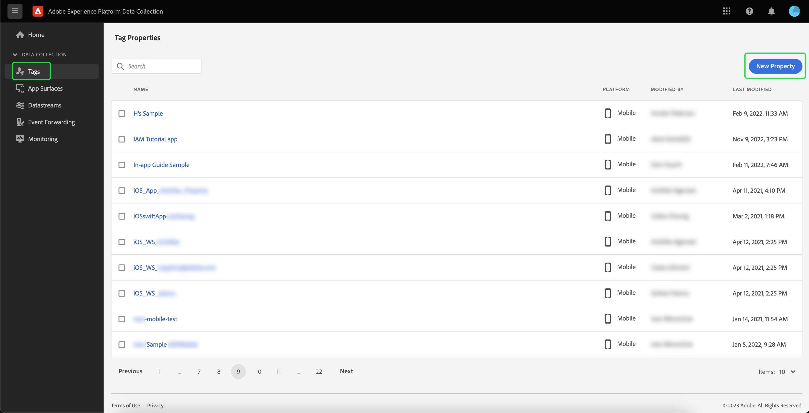

# Implementieren der Adobe Experience Platform Assurance-Erweiterung

In diesem Tutorial erfahren Sie, wie Sie die Platform Assurance-Erweiterung im Mobile SDK installieren und implementieren. Anweisungen zum Hinzufügen der Assurance-Erweiterung zu Ihrer Anwendung finden Sie im Abschnitt [Übersicht über die Adobe Experience Platform Assurance-Erweiterung](https://developer.adobe.com/client-sdks/documentation/platform-assurance-sdk/#add-the-aep-assurance-extension-to-your-app).

## Erste Schritte

Um die Assurance-Erweiterung zu installieren und zu implementieren, benötigen Sie Zugriff auf die folgenden Dienste:

- Die [Adobe Experience Platform-Datenerfassungs-Benutzeroberfläche](https://experience.adobe.com/#/data-collection/)
- [Adobe Experience Platform Assurance](https://experience.adobe.com/assurance)

## Erstellen einer mobilen Eigenschaft

>[!NOTE]
>
>Wenn Sie bereits über eine Eigenschaft für Mobilgeräte verfügen, können Sie mit dem nächsten Schritt fortfahren.

Wählen Sie in der Datenerfassungs-Benutzeroberfläche die Option **[!UICONTROL Tags]**. Es wird eine Liste mit mobilen und Web-Eigenschaften mit Informationen zu den Eigenschaften angezeigt, die zu Ihrem Unternehmen gehören. Auswählen **[!UICONTROL Neue Eigenschaft]** , um eine neue Eigenschaft zu erstellen.

Die **[!UICONTROL Eigenschaft erstellen]** angezeigt. Geben Sie den Namen für die neue Eigenschaft ein und wählen Sie **[!UICONTROL Mobile]** als Ihre Plattform. Nachdem Sie Ihre Details eingefügt haben, wählen Sie **[!UICONTROL Speichern]** , um die Eigenschaft für Mobilgeräte zu erstellen.

>[!NOTE]
>
>Die Eigenschaft für Mobilgeräte **[!UICONTROL Datenschutz]** Einstellung **not** sich auf die Datenerfassung von Assurance auswirken.

## Installieren der Assurance-Erweiterung

Wählen Sie die mobile Eigenschaft aus, in der Sie die Assurance-Erweiterung installieren möchten.

Die **Mobile-Eigenschaftendetails** angezeigt. Auswählen **[!UICONTROL Erweiterungen]** , um eine Liste der Erweiterungen anzuzeigen, die derzeit mit Ihrer mobilen Eigenschaft verknüpft sind.

Auswählen **[!UICONTROL Katalog]** , um eine Liste der Erweiterungen anzuzeigen, die Sie zur Eigenschaft für Mobilgeräte hinzufügen können. Suchen Sie mithilfe des Filters die **[!UICONTROL AEP Assurance]** Erweiterung und wählen Sie **[!UICONTROL Installieren]**.

## Nächste Schritte

Nachdem Sie die Assurance-Erweiterung in Ihrer mobilen Eigenschaft installiert haben, können Sie mit der Verwendung von Assurance in Ihren Anwendungen beginnen. Informationen zum Hinzufügen der Assurance-Erweiterung zu Ihrer Anwendung finden Sie im Abschnitt [Übersicht über die Adobe Experience Platform Assurance-Erweiterung](https://developer.adobe.com/client-sdks/documentation/platform-assurance-sdk/#add-the-aep-assurance-extension-to-your-app). Informationen zur Verwendung von Assurance finden Sie im Abschnitt [Verwenden des Assurance-Handbuchs](./using-assurance.md).
