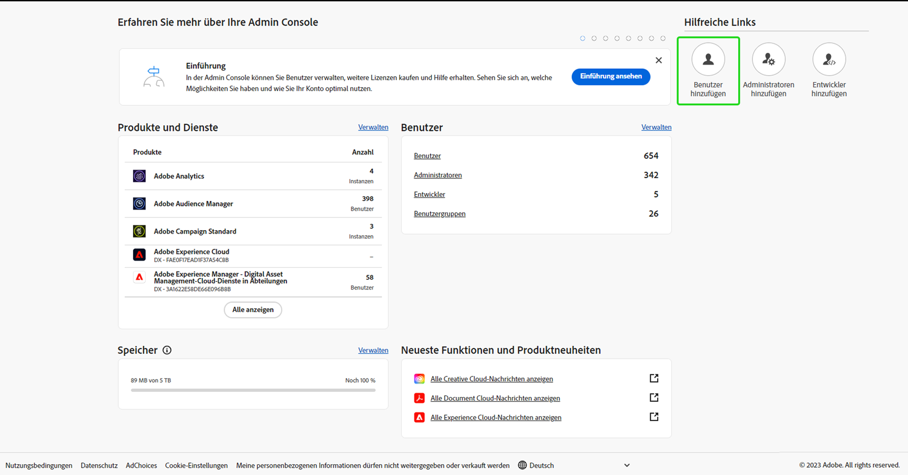
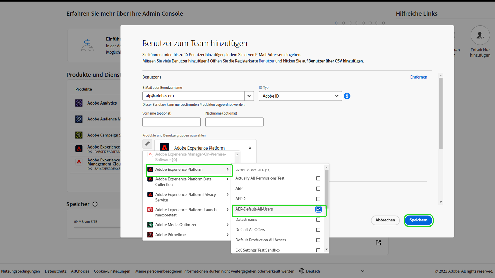

# Benutzerzugriff

>[!WARNING]
>
>Beachten Sie, dass der Benutzerzugriff auf Assurance Änderungen unterworfen ist. Wenn Assurance die Betaphase (Projekt Griffon) verlässt und für alle Adobe Experience Cloud-Kundinnen und -Kunden verfügbar wird (als Assurance), wird der Zugriff auf Assurance über [Admin Console](https://helpx.adobe.com/de/enterprise/using/admin-console.html) verwaltet.
>
>Wenn Sie Hilfe benötigen, wenden Sie sich an das Adobe Experience Cloud-Admin-Team Ihres Unternehmens.

Um einen unterbrechungsfreien Zugriff auf Assurance zu erhalten oder zu verwalten, stellen Sie sicher, dass die folgenden Schritte in Admin Console ausgeführt werden:

## Hinzufügen von Benutzenden zur Experience Platform über ein Produktprofil

Um einen Benutzer zu einem Produktprofil hinzuzufügen, melden Sie sich bei der Admin Console an und wählen Sie **Benutzer hinzufügen** aus..

Das Dialogfeld **Benutzer zum Team hinzufügen** wird angezeigt. In diesem Dialogfeld können Sie die Details der Benutzenden eingeben, die Sie hinzufügen möchten. Geben Sie die E-Mail-Adresse, den Vornamen (optional) und den Nachnamen (optional) der jeweiligen Benutzenden ein.

Wählen Sie das Stiftsymbol aus, um die Produkte und Benutzergruppen auszuwählen. Wählen Sie von hier aus **Adobe Experience Platform** und dann **AEP-Default-All-Users** und **Speichern** aus.

