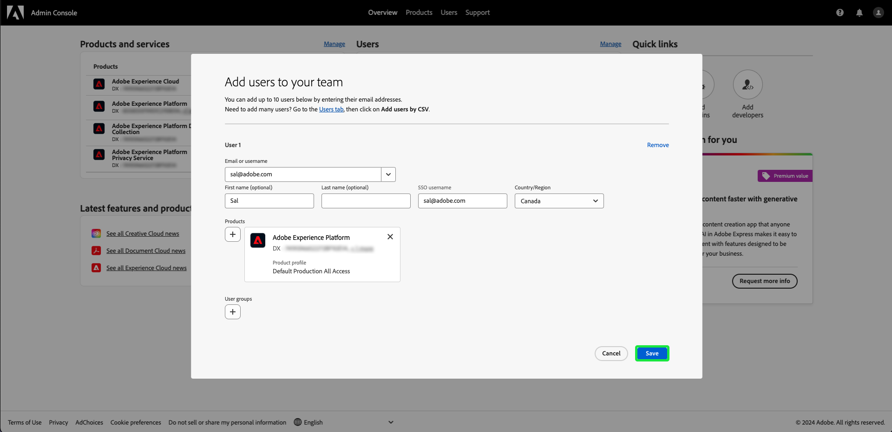

# Benutzerzugriff

Gewähren Sie Benutzern Zugriff auf [!UICONTROL Assurance], indem Sie sie zu einem beliebigen Produktprofil in Adobe Experience Platform hinzufügen, indem Sie die folgenden Schritte in [Adobe Admin Console](https://adminconsole.adobe.com/) ausführen:

## Hinzufügen von Benutzern zu Adobe Experience Platform über ein Produktprofil {#adding-product-profile}

Um einen Benutzer zu einem Produktprofil hinzuzufügen, melden Sie sich bei [Adobe Admin Console](https://adminconsole.adobe.com/) an. Wählen Sie auf der Registerkarte **[!UICONTROL Übersicht]** der Benutzeroberfläche der Admin Console die Option **[!UICONTROL Benutzer hinzufügen]** aus.

Das Dialogfeld **[!UICONTROL Benutzer zum Team hinzufügen]** wird angezeigt. Geben Sie die E-Mail-Adresse oder den Benutzernamen der Person ein, die Sie hinzufügen möchten, und wählen Sie dann **[!UICONTROL Als neuen Benutzer hinzufügen]** aus.

Zwei Textfelder scheinen einen optionalen Vornamen **[!UICONTROL 1} und einen optionalen Nachnamen**[!UICONTROL  3} einzugeben. ]**]** Der Benutzername **[!UICONTROL SSO]** wird zusammen mit dem Eintrag **[!UICONTROL Land]** im Dropdown-Menü automatisch ausgefüllt. Stellen Sie sicher, dass beide Optionen korrekt sind, und nehmen Sie die erforderlichen Anpassungen vor. Sobald alles korrekt ist, wählen Sie **[!UICONTROL Produkte]** aus.

Das Dialogfeld **[!UICONTROL Produkt auswählen]** wird angezeigt. Wählen Sie die Adobe Experience Platform aus.

Das Dialogfeld **[!UICONTROL Produktprofile auswählen]** wird mit einer Liste von Produktprofilen angezeigt. Wählen Sie ein beliebiges Produktprofil und dann **[!UICONTROL Anwenden]** aus. Sie können weitere Produkte und Produktprofile hinzufügen, indem Sie diese Schritte wiederholen.

Überprüfen Sie, ob alles für den Benutzer korrekt ist. Hier können Sie weitere Benutzer hinzufügen oder Ihre Änderungen speichern, indem Sie **[!UICONTROL Speichern]** auswählen.

