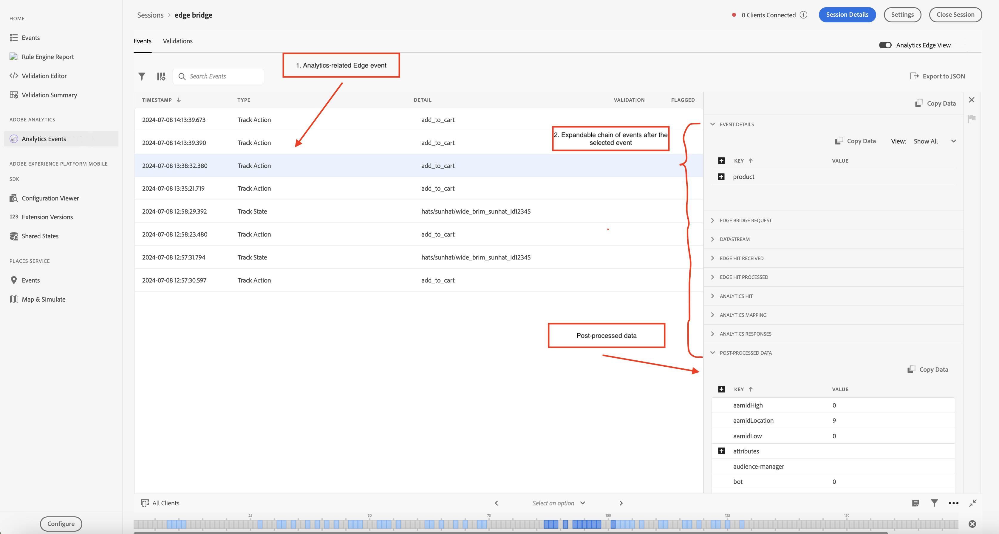
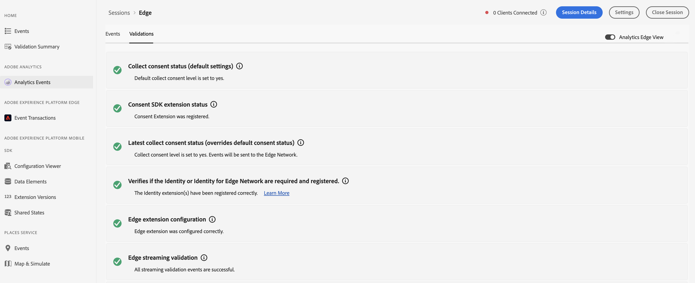
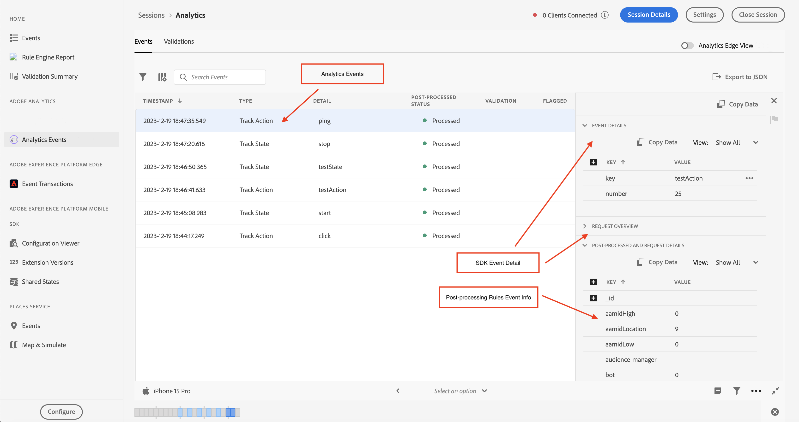
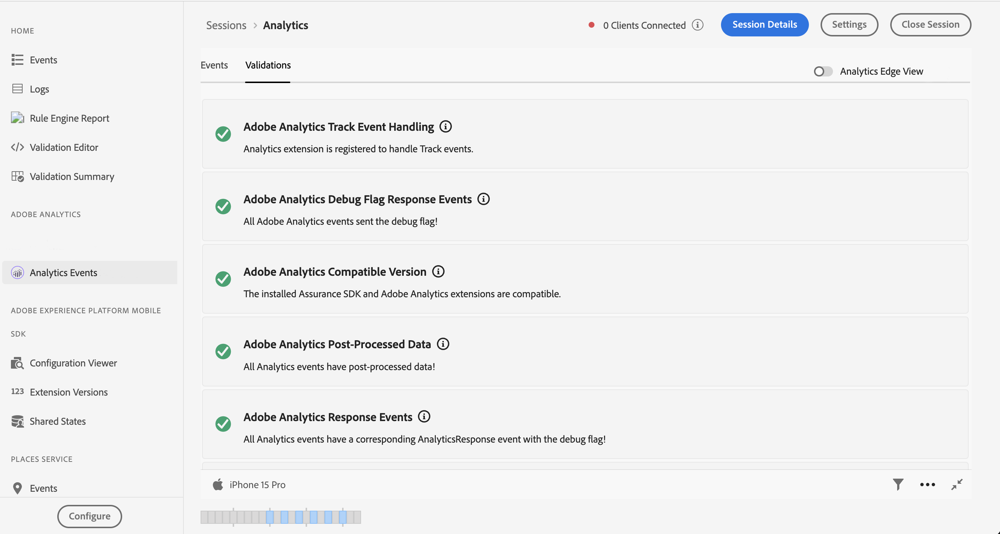

# Ansicht &quot;Adobe Analytics Events&quot;in &quot;Assurance

Analytics-Ereignisse bieten Benutzern, die ihre Adobe Analytics-Implementierung debuggen und validieren, eine umfassendere Ansicht der SDK-Ereignisse. Die Ansicht zeigt Ereignisse, die vom [Adobe Experience Platform Edge Network SDK](https://developer.adobe.com/client-sdks/edge/edge-network/) an Adobe Analytics gesendet werden, sowie das [Adobe Experience Platform Mobile SDK](https://developer.adobe.com/client-sdks/solution/adobe-analytics/). Die Ansicht verfügt auch über ein Detailbedienfeld, das Kontext zur Verarbeitung des Ereignisses durch das Client-SDK und die Upstream-Dienste bietet, nachdem es das Gerät verlassen hat.

## Erste Schritte

Führen Sie die folgenden Schritte aus, um diese Ansicht zu verwenden:

1. [Einrichten von Adobe Experience Platform Assurance](../tutorials/implement-assurance.md).
2. [Erstellen und Verbinden mit einer Zuverlässigkeitssitzung](../tutorials/using-assurance.md).
3. Wählen Sie in der Assurance-Benutzeroberfläche im linken Navigationsmenü **Startseite** die Option **Analytics-Ereignisse** aus. Wenn diese Option nicht angezeigt wird, wählen Sie unten links im Fenster die Option **Konfigurieren**, fügen Sie die **Analytics-Ereignisse** hinzu und wählen Sie **Speichern** aus.

## Analytics Edge-Ansicht

Verwenden Sie die Analytics Edge-Ansicht, wenn Sie die mobilen Erweiterungen **Edge Network** oder **Edge Bridge** verwenden. Diese Ansicht wird aktiviert, wenn der Umschalter &quot;Analytics-Edge-Ansicht&quot;oben rechts aktiviert ist und die über das Edge-Netzwerk gesendeten Analytics-Ereignisse in Ihrer aktuellen Sitzung anzeigt. Dies umfasst alle Ereignisse, die von der Lifecycle-Erweiterung, der Edge-Erweiterung und/oder der Edge Bridge-Erweiterung ausgelöst wurden.

Die Analytics Edge-Ansicht enthält Informationen zu Analytics-bezogenen Edge-Ereignissen und Lebenszyklusereignissen, die vom Client gesendet werden. Durch die Auswahl eines Ereignisses in der Liste zeigt das Bedienfeld mit der Detailansicht des Ereignisses auf der rechten Seite die Ereignisse an, die vom Client SDK und vom Upstream-Dienst verarbeitet wurden, nachdem sie das Gerät verlassen haben. Auf diese Weise können Sie die Ereigniskette, die sich aus einem -Aufruf ergab, einfach anzeigen.

Das Ereignis **Nachbearbeitete Daten** in der Liste bestätigt, dass die Daten erfolgreich verarbeitet und an die Adobe Analytics gesendet wurden. Wenn dieses Ereignis oder verarbeitete Daten fehlen, können Benutzer jedes Ereignis in der Liste erweitern, um detaillierte Debugging-Informationen anzuzeigen.

### Analytics Edge-Ereignisdetailansicht

Für ein Edge-Anfrageereignis oder ein Analytics-Verfolgungsereignis enthält die Detailansicht die folgenden Informationen:

* Ereignisdetails: Ein Ursprungs-SDK-Edge-Anforderungsereignis.
* Edge Bridge-Anfrage: Ein Ereignis, das ausschließlich für den Edge Bridge Extension-Workflow vorgesehen ist.
* Datastream: Ein Ereignis, das für den Datastream für diese Sitzung dargestellt wird.
* Edge-Treffer erhalten: Stellt den von Edge erhaltenen Treffer dar.
* Edge-Trefferverarbeitung: Stellt den in Edge verarbeiteten Treffer dar.
* Analytics-Treffer: Stellt den von Analytics erhaltenen Treffer dar.
* Analytics-Zuordnung: Stellt den Status der Datenzuordnung in Analytics dar.
* Analytics Responsed: Der Antwortstatus von Analytics.
* Nachbearbeitungs-Daten: Informationen zu dem Ereignis, das die Zuordnung von Vars, eVars und Props enthält.

### Analytics Edge-Validierung

Die Analytics Edge-Validierungsansicht ermöglicht es Ihnen, die Ergebnisse von Überprüfungsskripten im Zusammenhang mit der Analytics Edge-Sitzung einfach anzuzeigen. Fehler, die von Validatoren angezeigt werden, können Links zu den Stellen enthalten, an denen sie korrigiert werden sollen, oder Ereignisse anzeigen, die einen Fehlerstatus aufweisen.

## Analytics-Ereignisansicht

Verwenden Sie die Analytics-Ereignisansicht , wenn Sie die mobile Erweiterung **Adobe Analytics** verwenden. In dieser Ansicht können Sie mühelos Analytics-Ereignisse sehen, die von Ihrem verbundenen Client gesendet wurden, einschließlich Verfolgungsaktion, Status verfolgen und Lebenszyklusereignissen. Diese Ansicht ist aktiv, wenn der Umschalter &quot;Analytics Edge-Ansicht&quot;oben rechts deaktiviert ist.

Durch Auswahl eines der Analytics-Ereignisse in der Ereignistabelle können Details zur Verarbeitung des Ereignisses im rechten Bereich angezeigt werden.

### Status &quot;Nachbearbeitet&quot;

Nachdem das SDK eine Netzwerkanforderung mit Adobe Analytics gestellt hat, wird Ihnen der Status angezeigt, ob Assurance die Nachbearbeitungsinformationen für die Adobe Analytics-Anfrage abrufen konnte. Die Ansicht &quot;Analytics-Ereignisse&quot;muss aktiv bleiben, während der Status der Nachbearbeitung aktiv ist, nachdem die Anfrage ausgelöst wurde.

Beachten Sie, dass der angemeldete Benutzer zum Abrufen von Nachbearbeitungs-Informationen Zugriff auf die entsprechende Report Suite haben muss.

| Status | Beschreibung |
| :----- | :---------- |
| `Queued` | Die Netzwerkanforderung ruft die Nachbearbeitungsinformationen ab. |
| `Processed` | Die Netzwerkanforderung war erfolgreich, und die Nachbearbeitungsinformationen werden empfangen. |
| `Delayed` | Die maximale Anzahl von Anfragen, die erneut versucht haben, die Nachbearbeitungs-Informationen abzurufen, wurde überschritten. |
| `Error` | Ein Fehler führte dazu, dass die Netzwerkanforderung fehlschlug. Weitere Informationen zum Fehler werden in der Ansicht &quot;Ereignisdetails&quot;angezeigt. |
| `Unauthorized` | Der Benutzer hat keinen Zugriff auf die Adobe Analytics Report Suite. |
| `Unavailable` | Die Adobe Analytics-Anfrage weist kein entsprechendes `AnalyticsResponse` -Ereignis auf. |
| `No Debug Flag` | Die aktuelle Adobe Analytics- oder Assurance-SDK-Version unterstützt die Analytics-Debugging-Funktion möglicherweise nicht. Weitere Informationen finden Sie im [Handbuch zur Fehlerbehebung](../troubleshooting.md). |
| `Expired` | Das Ereignis `AnalyticsTrack` oder `LifecycleStart` ist älter als 24 Stunden. |

### Ansicht mit Ereignisdetails

Für ein Analytics-Verfolgungsereignis enthält die Detailansicht die folgenden Teile:

* Ein Analytics-Anfrageereignis vom Typ &quot;SDK&quot;.
* Meta- und Kontextdaten aus der Anfrage, z. B. Report Suite-ID, SDK-Erweiterungsversionen und Kontextdaten.
* Nachbearbeitete Informationen zum Analytics-Ereignis, das die Zuordnung von Vars, eVars und Props enthält.

### Validierung der Analytics-Ansicht

Die Überprüfungsansicht ermöglicht es Ihnen, die Ergebnisse von Überprüfungsskripten im Zusammenhang mit Analytics einfach anzuzeigen. Fehler, die von Validatoren angezeigt werden, können Links zu den Stellen enthalten, an denen sie korrigiert werden sollen, oder Ereignisse anzeigen, die einen Fehlerstatus aufweisen.

