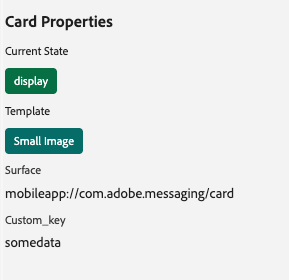
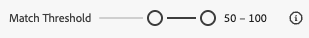

# Ansicht „Inhaltskarten“ in Assurance

Die In-App-Messaging-Ansicht in Adobe Experience Platform Assurance bietet die Möglichkeit, Ihre App zu validieren, die auf Ihrem Gerät bereitgestellten Inhaltskarten zu überwachen und Karten in der Vorschau anzuzeigen.

## Inhaltskarten

Oben auf der Registerkarte **[!UICONTROL Inhaltskarten]** befindet sich ein **[!UICONTROL Inhaltskarte]** Dropdown. Hier werden alle Inhaltskarten aufgelistet, die in der Assurance-Sitzung empfangen wurden. Wenn eine Karte nicht in dieser Liste enthalten ist, bedeutet dies, dass die App sie nie erhalten hat.

Wenn Sie eine Inhaltskarte auswählen, werden viele Informationen zu dieser Karte angezeigt, wie in den folgenden Abschnitten beschrieben.

### Kartenvorschau

Im rechten Bedienfeld befindet sich ein Bereich **[!UICONTROL Kartenvorschau]** in dem angezeigt wird, wie eine Karte in gängigen Vorlagen - klein, groß und nur Bild - gerendert wird.

Verwenden Sie den Umschalter **[!UICONTROL Design]**, um die Karte im Hell- oder Dunkelmodus anzuzeigen.

### Verfügbare Registerkarten

Im linken Bereich hängen die verfügbaren Registerkarten von der ausgewählten Karte ab. Wenn die Karte Regeln enthält, werden drei Registerkarten angezeigt: **[!UICONTROL Info]**, **[!UICONTROL Interaktionen]** und **[!UICONTROL Regeln analysieren]**.

Wenn die Karte keine Regeln enthält, werden zwei Registerkarten angezeigt: **[!UICONTROL Info]** und **[!UICONTROL Interactions]**.

### Registerkarte „Informationen“

Die Registerkarte **[!UICONTROL Info]** zeigt **[!UICONTROL Abschnitt „Karteneigenschaften]** oben, einschließlich der Abzeichen für den **[!UICONTROL aktuellen Status]** (Trigger, Anzeige, Verwerfen, Disqualifizierung) sowie Meta-Details wie **[!UICONTROL Vorlage]** (kleines Bild, großes Bild oder nur Bild), **[!UICONTROL Oberfläche]** und alle benutzerdefinierten Schlüssel-Wert-Paare.

Darunter zeigt der Abschnitt **[!UICONTROL Kampagneneigenschaften]** Informationen, die aus Adobe Journey Optimizer (AJO) geladen wurden.

Sie können auch **[!UICONTROL Kampagne anzeigen]** auswählen, um die Karte in AJO zur Überprüfung oder Bearbeitung zu öffnen.

### Registerkarte „Interaktionen“

Die Registerkarte **[!UICONTROL Interaktionen]** fasst den Lebenszyklus jeder Karte als Abfolge von Abzeichen zusammen: Sie beginnt immer mit **[!UICONTROL Trigger]**, gefolgt von dem Ergebnis, das von den Regeln erzeugt wurde **[!UICONTROL Anzeige]**, **[!UICONTROL Verwerfen]** oder **[!UICONTROL Disqualifizieren]**.

### Registerkarte Regeln analysieren

Auf der Registerkarte **[!UICONTROL Analysieren]** wird eine Ereignistabelle mit bis zu drei Regelspalten, **[!UICONTROL Anzeigen]**, **[!UICONTROL Verwerfen]** und **[!UICONTROL Disqualifizieren]**, basierend auf den Kartenregeln angezeigt. Wenn die Karte nur eine Regel definiert, wird nur diese Spalte angezeigt.

Jede Zeile stellt ein Sitzungsereignis dar, und jede Spalte zeigt an, ob die Regel der Karte mit den Bedingungen dieses Ereignisses übereinstimmt. Ein Score von 0 % bedeutet, dass keine Bedingungen erfüllt sind. 100 % ist eine vollständige Übereinstimmung (die Regel würde ausgelöst werden).

Wenn das Ereignis einer Bedingung entspricht, wird ein grünes Häkchen angezeigt. Wenn das Ereignis nicht übereinstimmt, wird ein rotes Symbol angezeigt.

Verwenden Sie den **[!UICONTROL Übereinstimmungsschwellenwert]**, um Ereignisse nach dem minimalen Übereinstimmungsprozentsatz zu filtern.

Wenn Sie ein Ereignis auswählen, wird rechts ein Detailbereich mit einem Akkordeon geöffnet, in dem die drei Regeln aufgelistet sind: **[!UICONTROL Anzeigen]**, **[!UICONTROL Verwerfen]** und **[!UICONTROL Disqualifizieren]**.

Erweitern Sie einen beliebigen Abschnitt, um die Bedingungen der Regel, die übereinstimmenden Bedingungen und den berechneten Übereinstimmungsprozentsatz für dieses Ergebnis anzuzeigen.

## Registerkarte „Anfragen“

Die **[!UICONTROL Anfragen]** zeigt an, welche Inhaltskarten angefordert wurden und auf welcher Oberfläche.

Verwenden Sie die **[!UICONTROL Karte anzeigen]**, um zur Registerkarte „Info“ einer bestimmten Inhaltskarte zurückzukehren.

## Registerkarte „Ereignisliste“

Die Registerkarte **[!UICONTROL Ereignisliste]** zeigt Sitzungsereignisse an, die für Inhaltskarten relevant sind, einschließlich AJO-Vorschlagsanfragen/-antworten, Kartenlebenszyklusereignissen und Interaktions-Tracking. Sie können Spalten suchen, filtern, sortieren und anpassen sowie Ergebnisse exportieren.

Wenn Sie ein Ereignis auswählen, wird ein Bedienfeld mit den rechten Details mit der rohen Payload und den wichtigsten Attributen geöffnet. Sie können auch Ereignisse für das Follow-up kennzeichnen. Diese Ansicht ist nützlich, um Anfragen, Regelergebnisse und Interaktionen über die gesamte Sitzung hinweg zu korrelieren.

## Registerkarte „Validierung“

Die Registerkarte **[!UICONTROL Validierung]** führt Validierungen für Ihre aktuelle Sitzung durch und überprüft, ob die App für Messaging richtig konfiguriert wurde:

