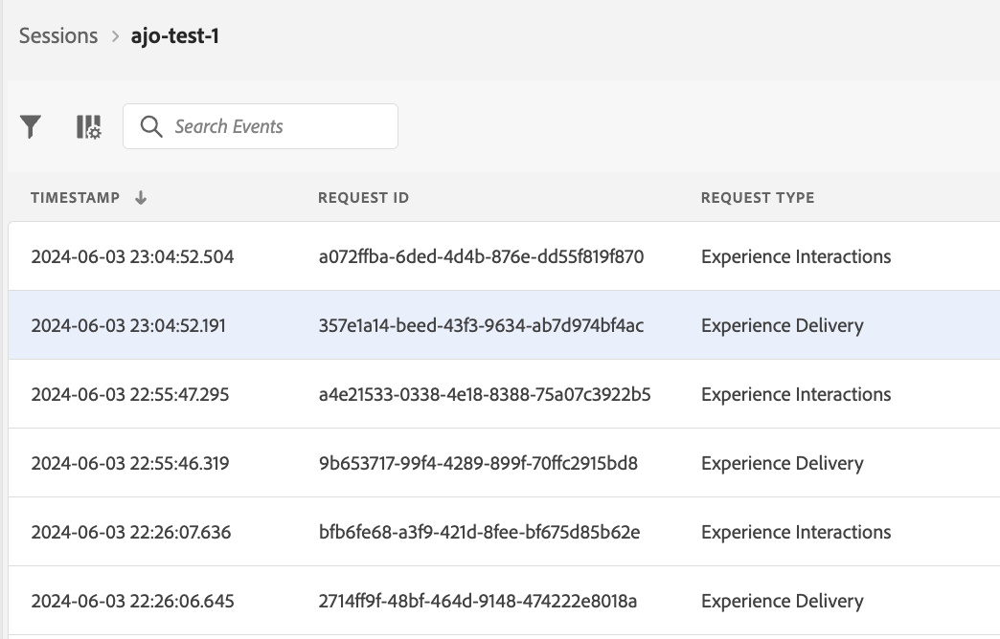
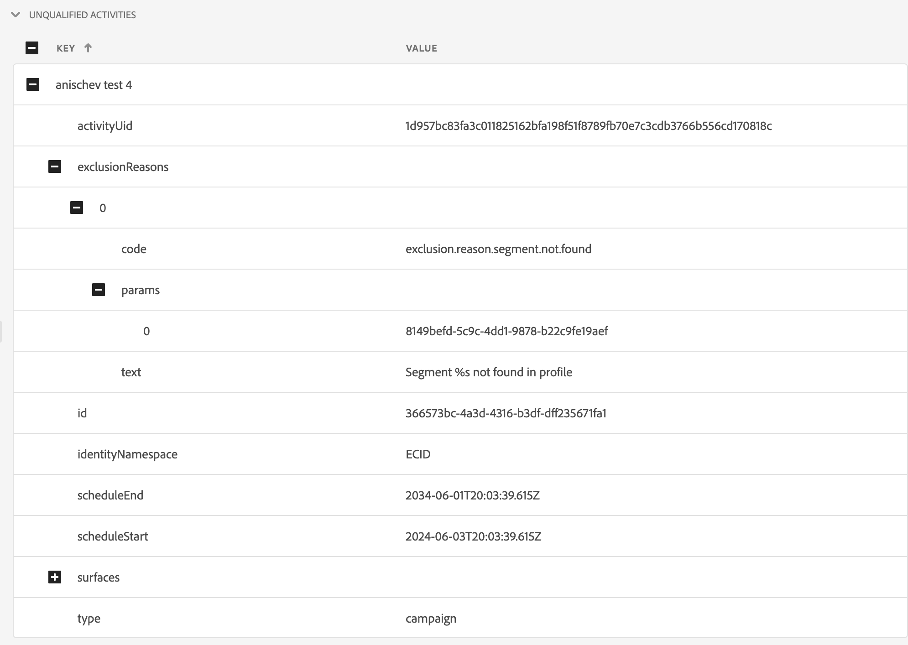
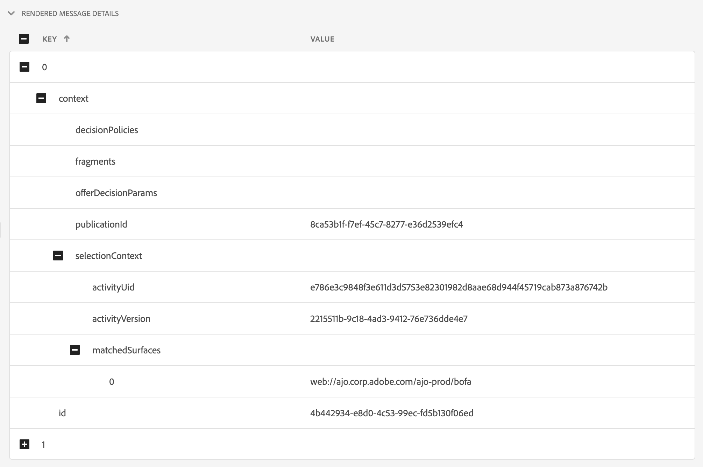

# Edge Delivery View in Assurance

Die **[!UICONTROL Edge-Bereitstellung]** Ansicht innen **[!UICONTROL Adobe Experience Platform Assurance]** bietet die Möglichkeit, [!UICONTROL AJO Inbound] Edge-Versand von Nachrichten an Ihre Web- und Mobile-Apps. Diese Ansicht ist besonders hilfreich, um Probleme bei der Bereitstellung von [!UICONTROL AJO Inbound] Web- und Mobilkampagnen und Journey.

## Erste Schritte

Bevor Sie fortfahren, stellen Sie bitte sicher, dass Sie Zugriff auf die folgenden Dienste haben:

- Die [Adobe Experience Platform-Datenerfassungs-Benutzeroberfläche](https://experience.adobe.com/#/data-collection/)
- [Adobe Experience Platform Assurance](https://experience.adobe.com/assurance)

Informationen zur Installation **[!UICONTROL Assurance]** in Ihrer Anwendung lesen Sie bitte die [Implementieren des Zuverlässigkeitshandbuchs](../tutorials/implement-assurance.md).

## Verwenden von Assurance mit Edge Delivery

Sobald Sie die **[!UICONTROL Assurance]** Sitzung hinzufügen, können Sie die **[!UICONTROL Edge-Bereitstellung]** Ansicht zu **[!UICONTROL Assurance]**. Wählen Sie unten im linken Bedienfeld die Option **[!UICONTROL Konfigurieren]** , um **[!UICONTROL Edge-Bereitstellung]** Ansicht und **Speichern** es.

Wählen Sie nach dem Hinzufügen die **[!UICONTROL Edge-Bereitstellung]** Ansicht in der **[!UICONTROL Adobe Journey Optimizer]** Abschnitt zur Validierung des Eingangs-Edge-Versands.

## Anforderungsliste

Im Hauptbereich der Ansicht wird die Liste der Edge-Versandanfragen angezeigt. Diese Liste zeigt alle [!UICONTROL Eingehender AJO] Anforderungen an Experience Edge, die von der **[!UICONTROL Eingehender Bereitstellungsdienst]**, einschließlich Anforderungen zum Abrufen von Personalisierungsentscheidungen sowie zur Verfolgung von Interaktionen mit Personalisierungsvorschlägen (wie Anzeigen, Klicken, Trigger oder Schließen).

Anforderungen werden nach Zeitstempel geordnet, wobei die letzten Anforderungen oben aufgeführt sind. Neben dem Zeitstempel enthält die Liste auch eine Spalte mit der Anfrage-ID sowie den Anfragetyp, bei dem es sich um eine der folgenden Optionen handeln kann:

- **[!UICONTROL Experience Delivery]**: Anfrage zum Abrufen von Personalisierungsentscheidungen
- **[!UICONTROL Erlebnisinteraktionen]**: Anfrage zum Verfolgen der Interaktionen mit Personalisierungsvorschlägen
- **[!UICONTROL Erlebnisbereitstellung und Interaktionen]**: Anfrage zum Abrufen von Personalisierungsentscheidungen, einschließlich der Interaktionen mit Personalisierungsvorschlägen
- **[!UICONTROL Versandvorschau]**: Anfrage zum Abrufen von Vorschaupersonalisierungsentscheidungen

Anforderungen können auch gefiltert werden, indem Sie einen Suchbegriff in die Suchleiste am Anfang der Liste eingeben. Dies ist nützlich beim Filtern nach bestimmten Werten wie IDs.

## Detaillierte Anfrageansichten

Sobald eine Anforderung in der Hauptansicht ausgewählt wurde, werden auf der rechten Seite detaillierte Informationen zur ausgewählten Anforderung angezeigt. Diese Ansicht enthält die folgenden Abschnitte:

### Anforderungsübersicht

Dieser Abschnitt bietet einen allgemeinen Überblick über die ausgewählte Anforderung, einschließlich [!UICONTROL Organisations-ID], [!UICONTROL Edge-Cluster], [!UICONTROL Antrags-ID] und [!UICONTROL Anfragetyp], [!UICONTROL Sandbox-ID], [!UICONTROL Sandbox-Name], [!UICONTROL Datenspeicher-ID]sowie die Liste der Anforderungsflächen bei [!UICONTROL Experience Delivery] -Anfragen.

### Profil

Dieser Abschnitt enthält Informationen zu den bei der Verarbeitung der Anfrage verwendeten Profildaten, einschließlich der Identitätszuordnung, der Segmentzugehörigkeit und der Zustimmungseinstellungen.\
Die [!UICONTROL Profil] -Abschnitt ist sehr hilfreich, wenn Sie Probleme wie den Versand beheben, der aufgrund fehlender oder verzögerter Segmentmitgliedschaften oder Opt-out-Zustimmungseinstellungen nicht wie erwartet funktioniert.

### Qualifizierte Aktivitäten

Dieser Abschnitt enthält eine Liste der Aktivitäten, die für die ausgewählte Anforderung qualifiziert wurden, einschließlich Aktivitätstyp, IDs, Identitäts-Namespace, Oberflächen, Zeitplan und Zielgruppen. Detailliertere Informationen zur Aktivität finden Sie im [Rohausführungszeichenfolge](#execution).

### Nicht qualifizierte Aktivitäten

Dieser Abschnitt enthält eine Liste der Aktivitäten, die von der Qualifizierung ausgeschlossen wurden. Zusätzlich zum Aktivitätstyp, den Kennungen, Identitäts-Namespaces, Oberflächen, Zeitplänen und Zielgruppen enthält dieser Abschnitt auch eine Liste der Gründe, aus denen die Aktivität nicht qualifiziert war.

### Nachrichtendetails

Dieser Abschnitt enthält detaillierte Informationen zu den Nachrichten, die für die ausgewählte Anforderung gesendet wurden. Dazu gehören Nachrichten-IDs, Fragmente, Entscheidungsrichtlinien, [!UICONTROL Offer decisioning] -Parameter sowie den Kontext der Nachrichtenauswahl.

### Interaktionen

Dieser Abschnitt enthält detaillierte Informationen zu den Interaktionen, die in der ausgewählten Anfrage verfolgt wurden. Sie enthält den Interaktionstyp (unter `propositionEventType`) sowie den zugehörigen Vorschlagsmetadaten, wie Aktivitätsmetadaten (unter `scopeDetails.activity`) und Vorschlagsereignis-Token (in `scopeDetails.characteristics.eventToken`).

### Rohspuren

In diesem Abschnitt finden Sie die Rohspuren der ausgewählten Anforderung. Er enthält die vollständige Spur der Anfrage, einschließlich der tatsächlichen Anfrage, wie sie empfangen wurde in **[!UICONTROL Eingehender Bereitstellungsdienst]**, Ausführungs-Trace und Antwort-Trace. Dies ist hilfreich bei der erweiterten Fehlerbehebung, z. B. beim nicht erwartungsgemäß funktionierenden Versand, da der Versanddienst nicht verfügbar ist, fehlende oder falsche Daten vorliegen oder der gesamte Anforderungsfluss erkannt wird.

#### Anfrage

Die Anfrageverfolgung enthält die vollständige Anforderung, wie sie beim **[!UICONTROL Eingehender Bereitstellungsdienst]** **[!UICONTROL Konductor]** Upstream. Sie enthält die Anfragekopfzeilen, den Text und andere Metadaten. Beispielsweise kann die XDM-Payload der Anfrage im `event.body.xdm` -Feld.

#### Ausführung

Die Ausführungsspur enthält die vollständige Spur der Anfrage, die von der **[!UICONTROL Eingehender Bereitstellungsdienst]**. Er zeigt den Ausführungskontext, die Aktivitätsqualifikation, die Nachrichtenauswahl und andere Verarbeitungsschritte. Fehler oder Warnungen, die während der Verarbeitung der Anfrage aufgetreten sind, finden Sie unter `context.messages` und `context.exceptions` -Felder. Detaillierte Informationen zur Aktivitätsqualifizierung finden Sie im Abschnitt `context.qualifiedActivitiesDetailed` und `context.unqualifiedActivitiesDetailed` -Felder.

#### Antwort

Die Antwort-Trace enthält die vollständige Antwort, wie sie von **[!UICONTROL Eingehender Bereitstellungsdienst]** nachgelagert **[!UICONTROL Konductor]**. Sie enthält die Antwortheader, den Text und andere Metadaten. Der vollständige Antworttext kann durch Kopieren der Nachricht mit der ID überprüft werden. `1` in die Zwischenablage mithilfe der **[!UICONTROL Wert kopieren]** und fügen Sie sie in einen JSON-Viewer ein.

