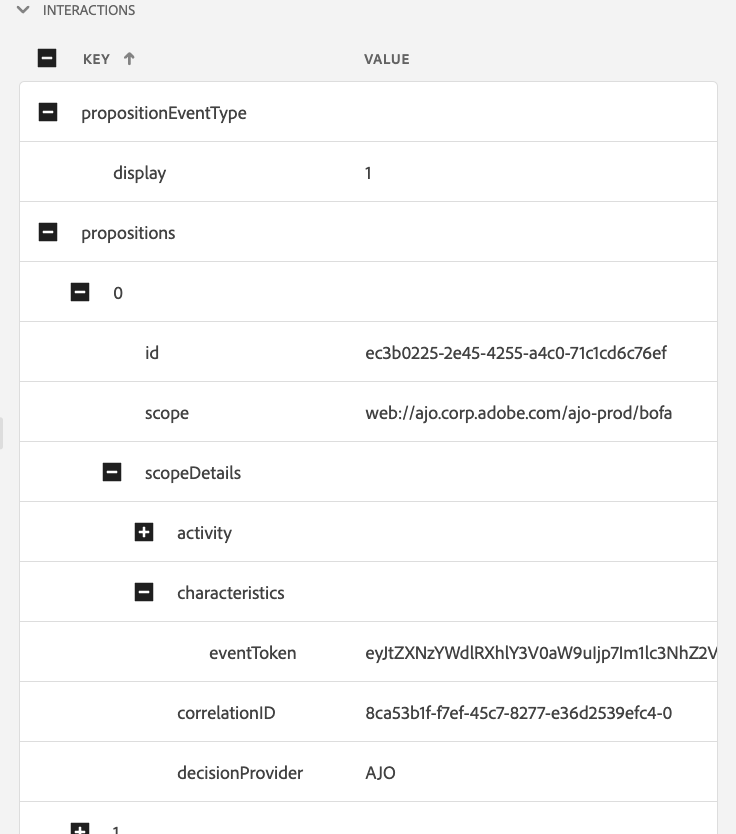

# Edge Delivery-Ansicht in Assurance

Die **[!UICONTROL Edge Delivery]**-Ansicht innerhalb von **[!UICONTROL Adobe Experience Platform Assurance]** bietet die Möglichkeit, den [!UICONTROL AJO Inbound]-Edge-Versand von Nachrichten an Ihre Web- und Mobile-Apps zu überprüfen und zu validieren. Diese Ansicht ist besonders nützlich für die Fehlerbehebung beim Versand von [!UICONTROL AJO Inbound] Web- und Mobile-Kampagnen und -Journey.

## Erste Schritte

Bevor Sie fortfahren, stellen Sie sicher, dass Sie Zugriff auf die folgenden Services haben:

- Die Datenerfassungs-Benutzeroberfläche von [Adobe Experience Platform](https://experience.adobe.com/#/data-collection/)
- [Adobe Experience Platform Assurance](https://experience.adobe.com/assurance)

Informationen zum Installieren von **[!UICONTROL Assurance]** in Ihrer Anwendung finden Sie im [Implementierungshandbuch für Assurance](../tutorials/implement-assurance.md).

## Verwenden von Assurance mit Edge Delivery

Nachdem Sie eine **[!UICONTROL Assurance]**-Sitzung geöffnet haben, können Sie die **[!UICONTROL Edge Delivery]**-Ansicht zu **[!UICONTROL Assurance hinzufügen]**. Wählen Sie unten im linken Bedienfeld die Option **[!UICONTROL Konfigurieren]**, um die Ansicht **[!UICONTROL Edge Delivery]** hinzuzufügen und sie **Speichern**.

Wählen Sie nach dem Hinzufügen die Ansicht **[!UICONTROL Edge Delivery]** im Abschnitt **[!UICONTROL Adobe Journey Optimizer]**, um die eingehende Edge-Bereitstellung zu validieren.

Auf 

## Liste anfordern

Im Hauptbereich der Ansicht wird die Liste der Edge-Versandanfragen angezeigt. In dieser Liste werden alle [!UICONTROL eingehenden AJO]-Anfragen angezeigt, die an Experience Edge gesendet und vom **[!UICONTROL eingehenden Versand-Service]** verarbeitet wurden, einschließlich Anfragen zum Abrufen von Personalisierungsentscheidungen sowie zum Nachverfolgen von Interaktionen mit Personalisierungsvorschlägen (z. B. Anzeige, Klick, Trigger oder Verwerfen).

Die Anfragen werden nach Zeitstempel sortiert, wobei die neuesten Anfragen oben stehen. Zusätzlich zum Zeitstempel enthält die Liste auch eine Spalte mit der Anfrage-ID sowie den Anfragetyp, der einer der folgenden sein kann:

- **[!UICONTROL Erlebnisversand]**: Eine Anfrage zum Abrufen von Personalisierungsentscheidungen
- **[!UICONTROL Erlebnisinteraktionen]**: Eine Anfrage zur Verfolgung von Interaktionen mit Personalisierungsvorschlägen
- **[!UICONTROL Versand und Interaktionen mit Erlebnissen]**: Eine Anfrage zum Abrufen von Personalisierungsentscheidungen, einschließlich Interaktionen mit Personalisierungsvorschlägen
- **[!UICONTROL Versandvorschau]**: Eine Anfrage zum Abrufen der Vorschau von Personalisierungsentscheidungen

Anfragen können auch gefiltert werden, indem ein Suchbegriff in die Suchleiste oben in der Liste eingegeben wird. Dies ist nützlich, wenn nach bestimmten Werten, wie z. B. IDs, gefiltert werden soll.

## Detaillierte Anfrageansichten

Sobald eine Anfrage in der Hauptansicht ausgewählt ist, werden detaillierte Informationen zur ausgewählten Anfrage auf der rechten Seite angezeigt. Diese Ansicht enthält die folgenden Abschnitte:

### Anfrageübersicht

Dieser Abschnitt bietet einen allgemeinen Überblick über die ausgewählte Anfrage, einschließlich [!UICONTROL Organisations-ID], [!UICONTROL Edge-Cluster], [!UICONTROL Anfrage-ID] und [!UICONTROL Anfragetyp], [!UICONTROL Sandbox-ID], [!UICONTROL Sandbox-Name], [!UICONTROL Datenstrom-ID] sowie der Liste der Anfrageoberflächen im Falle von [!UICONTROL Experience Delivery]-Anfragen.

### Profil

Dieser Abschnitt enthält Informationen zu den Profildaten, die bei der Verarbeitung der Anfrage verwendet werden, einschließlich Identitätszuordnung, Segmentzugehörigkeit und Einverständniseinstellungen.\
Der Abschnitt [!UICONTROL Profil] ist sehr hilfreich, wenn Sie Probleme beheben möchten, z. B. wenn der Versand aufgrund fehlender oder verzögerter Segmentzugehörigkeit oder Einstellungen zum Opt-out-Einverständnis nicht wie erwartet funktioniert.

### Qualifizierte Aktivitäten

Dieser Abschnitt enthält eine Liste der Aktivitäten, die für die ausgewählte Anfrage qualifiziert wurden, einschließlich Aktivitätstyp, IDs, Identity-Namespace, Oberflächen, Zeitplan und Zielgruppen. Ausführlichere Informationen über die Aktivität finden Sie im Abschnitt [Rohausführungsablaufverfolgung](#execution).

### Nicht qualifizierte Aktivitäten

Dieser Abschnitt enthält eine Liste der Aktivitäten, die von der Qualifizierung ausgeschlossen wurden. Zusätzlich zum Aktivitätstyp, zu den IDs, den Identity-Namespaces, Oberflächen, Zeitplänen und Zielgruppen enthält dieser Abschnitt auch eine Liste der Gründe, aus denen die Aktivität nicht qualifiziert war.

### Nachrichtendetails

Dieser Abschnitt enthält detaillierte Informationen zu den Nachrichten, die für die ausgewählte Anfrage gesendet wurden. Sie enthält Nachrichten-IDs, Fragmente, Entscheidungsrichtlinien, [!UICONTROL Offer decisioning]-Parameter sowie den Nachrichtenauswahlkontext.

### Interaktionen

Dieser Abschnitt enthält detaillierte Informationen zu den Interaktionen, die in der ausgewählten Anfrage verfolgt wurden. Sie enthält den Interaktionstyp (unter `propositionEventType`) sowie die zugehörigen Vorschlagsmetadaten, z. B. Aktivitätsmetadaten (unter `scopeDetails.activity`) und Vorschlagsereignis-Token (in `scopeDetails.characteristics.eventToken`).

### Rohspuren

In diesem Abschnitt finden Sie die Rohspuren der ausgewählten Anfrage. Sie enthält die vollständige Verfolgung der Anfrage, einschließlich der tatsächlichen Anfrage, wie sie im **[!UICONTROL Eingangsversand-Service) empfangen wurde]** der Ausführungsverfolgung und der Antwortverfolgung. Dies ist nützlich für eine erweiterte Fehlerbehebung, z. B. wenn der Versand aufgrund der Nichtverfügbarkeit des Versand-Service, fehlender oder falscher Daten nicht wie erwartet funktioniert oder wenn Sie den vollständigen Fluss der Anfrageverarbeitung verstehen möchten.

#### Anfrage

Die Anfrageverfolgung enthält die vollständige Anfrage so, wie sie zuvor vom Upstream **[!UICONTROL Inbound Delivery Service]**&#x200B;**[!UICONTROL Konductor]** empfangen wurde. Sie enthält die Anfragekopfzeilen, den Hauptteil und andere Metadaten. Beispielsweise kann die XDM-Payload der Anfrage im Feld `event.body.xdm` überprüft werden.

#### Ausführung

Die Ausführungs-Trace umfasst die vollständige Trace der Anfrage, wie sie vom **[!UICONTROL Inbound Delivery Service) verarbeitet]**. Darin werden der Ausführungskontext, die Aktivitätsqualifizierung, die Nachrichtenauswahl und andere Verarbeitungsschritte angezeigt. Alle Fehler oder Warnungen, die während der Verarbeitung der Anfrage aufgetreten sind, finden Sie in den Feldern `context.messages` und `context.exceptions` . Ausführliche Informationen zur Aktivitätsqualifizierung finden Sie in den Feldern `context.qualifiedActivitiesDetailed` und `context.unqualifiedActivitiesDetailed` .

#### Antwort

Der Antwort-Trace enthält die vollständige Antwort, wie sie von **[!UICONTROL Inbound Delivery Service) nachgelagert]** Konductor **[!UICONTROL zurückgegeben]**. Sie enthält die Antwort-Header, den Hauptteil und andere Metadaten. Der vollständige Antworttext kann überprüft werden, indem die Nachricht mit der ID `1` mithilfe der Schaltfläche **[!UICONTROL Wert kopieren]** in die Zwischenablage kopiert und in einen JSON-Viewer eingefügt wird.

