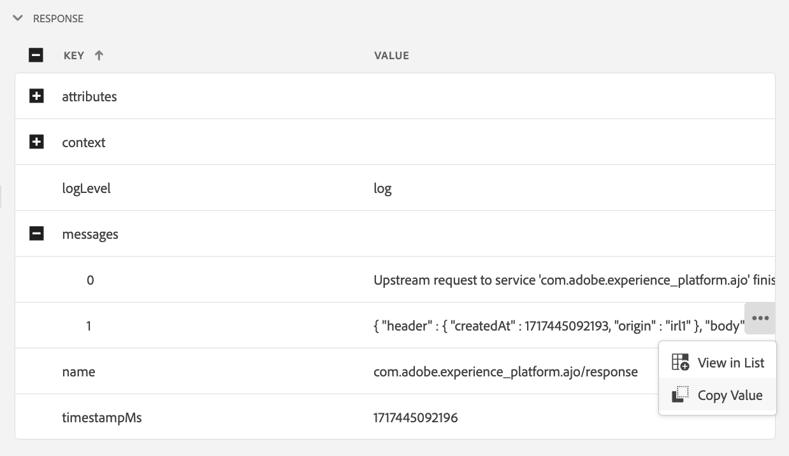

# Edge Delivery-Ansicht in Assurance

Die Ansicht **[!UICONTROL Edge Delivery]** in **[!UICONTROL Adobe Experience Platform Assurance]** bietet die Möglichkeit, den kantenübergreifenden Versand von Nachrichten an Ihre Web- und Mobile-Apps an die AJO-Vorgabe zu überprüfen und zu validieren.  Diese Ansicht ist besonders hilfreich, um Probleme bei der Fehlerbehebung bei der Bereitstellung von Web- und Mobilkampagnen und Journey mit dem AJO-Einstieg ] zu beheben.[!UICONTROL 

## Erste Schritte

Bevor Sie fortfahren, stellen Sie bitte sicher, dass Sie Zugriff auf die folgenden Dienste haben:

- Die [Adobe Experience Platform-Datenerfassungs-Benutzeroberfläche](https://experience.adobe.com/#/data-collection/)
- [Adobe Experience Platform Assurance](https://experience.adobe.com/assurance)

Informationen zur Installation von **[!UICONTROL Assurance]** in Ihrer Anwendung finden Sie im [Implementierungshandbuch zur Qualitätssicherung](../tutorials/implement-assurance.md).

## Verwenden von Assurance mit Edge Delivery

Nachdem Sie eine **[!UICONTROL Assurance]** -Sitzung geöffnet haben, können Sie die **[!UICONTROL Edge Delivery]** -Ansicht zu **[!UICONTROL Assurance]** hinzufügen. Wählen Sie unten im linken Bereich **[!UICONTROL Konfigurieren]** aus, um die Ansicht **[!UICONTROL Edge Delivery]** und die Ansicht **Speichern** hinzuzufügen.

Wählen Sie nach dem Hinzufügen die Ansicht **[!UICONTROL Edge Delivery]** im Abschnitt **[!UICONTROL Adobe Journey Optimizer]** aus, um den Versand an eingehende Edge zu validieren.

## Anforderungsliste

Im Hauptbereich der Ansicht wird die Liste der Edge-Versandanfragen angezeigt. Diese Liste enthält alle [!UICONTROL AJO-eingehenden ] Anforderungen, die an Experience Edge gesendet und vom **[!UICONTROL Eingehender Bereitstellungsdienst]** verarbeitet wurden. Dazu gehören Anforderungen zum Abrufen von Personalisierungsentscheidungen sowie die Verfolgung von Interaktionen mit Personalisierungsvorschlägen (z. B. Anzeige, Klick, Trigger oder Schließen).

Anforderungen werden nach Zeitstempel geordnet, wobei die letzten Anforderungen oben aufgeführt sind. Neben dem Zeitstempel enthält die Liste auch eine Spalte mit der Anfrage-ID sowie den Anfragetyp, bei dem es sich um eine der folgenden Optionen handeln kann:

- **[!UICONTROL Erlebnisbereitstellung]**: Eine Anfrage zum Abrufen von Personalisierungsentscheidungen
- **[!UICONTROL Erlebnisinteraktionen]**: Eine Anfrage zur Verfolgung von Interaktionen mit Personalisierungsvorschlägen
- **[!UICONTROL Erlebnisbereitstellung und Interaktionen]**: Eine Anfrage zum Abrufen von Personalisierungsentscheidungen, einschließlich der Interaktionen mit Personalisierungsvorschlägen
- **[!UICONTROL Vorschau der Bereitstellung anzeigen]**: Eine Anfrage zum Abrufen von Vorschaupersonalisierungsentscheidungen

Anforderungen können auch gefiltert werden, indem Sie einen Suchbegriff in die Suchleiste am Anfang der Liste eingeben. Dies ist nützlich beim Filtern nach bestimmten Werten wie IDs.

## Detaillierte Anfrageansichten

Sobald eine Anforderung in der Hauptansicht ausgewählt wurde, werden auf der rechten Seite detaillierte Informationen zur ausgewählten Anforderung angezeigt. Diese Ansicht enthält die folgenden Abschnitte:

### Anforderungsübersicht

Dieser Abschnitt bietet einen allgemeinen Überblick über die ausgewählte Anforderung, einschließlich [!UICONTROL Organisations-ID], [!UICONTROL Edge-Cluster], [!UICONTROL Anforderungs-ID] und [!UICONTROL Anforderungstyp], [!UICONTROL Sandbox-ID], [!UICONTROL Sandbox-Name], [!UICONTROL Datastream-ID] sowie der Liste der Anforderungsoberflächen. von Anforderungen vom Typ [!UICONTROL Erlebnisbereitstellung].

### Profil

Dieser Abschnitt enthält Informationen zu den bei der Verarbeitung der Anfrage verwendeten Profildaten, einschließlich der Identitätszuordnung, der Segmentzugehörigkeit und der Zustimmungseinstellungen.\
Der Abschnitt [!UICONTROL Profil] ist sehr hilfreich, wenn Sie Probleme wie den Versand beheben, der aufgrund fehlender oder verzögerter Segmentmitgliedschaften oder Opt-out-Zustimmungseinstellungen nicht wie erwartet funktioniert.

### Qualifizierte Aktivitäten

Dieser Abschnitt enthält eine Liste der Aktivitäten, die für die ausgewählte Anforderung qualifiziert wurden, einschließlich Aktivitätstyp, IDs, Identitäts-Namespace, Oberflächen, Zeitplan und Zielgruppen. Ausführlichere Informationen über die Aktivität finden Sie im Abschnitt [Ablaufverfolgung für die Rohausführung](#execution).

### Nicht qualifizierte Aktivitäten

Dieser Abschnitt enthält eine Liste der Aktivitäten, die von der Qualifizierung ausgeschlossen wurden. Zusätzlich zum Aktivitätstyp, den Kennungen, Identitäts-Namespaces, Oberflächen, Zeitplänen und Zielgruppen enthält dieser Abschnitt auch eine Liste der Gründe, aus denen die Aktivität nicht qualifiziert war.

### Nachrichtendetails

Dieser Abschnitt enthält detaillierte Informationen zu den Nachrichten, die für die ausgewählte Anforderung gesendet wurden. Er enthält Nachrichten-IDs, Fragmente, Entscheidungsrichtlinien, [!UICONTROL Offer decisioning]-Parameter sowie den Kontext für die Nachrichtenauswahl.

### Interaktionen

Dieser Abschnitt enthält detaillierte Informationen zu den Interaktionen, die in der ausgewählten Anfrage verfolgt wurden. Er enthält den Interaktionstyp (unter `propositionEventType`) sowie die zugehörigen Vorschlagsmetadaten, wie Aktivitätsmetadaten (unter `scopeDetails.activity`) und das Vorschlagsereignis-Token (in `scopeDetails.characteristics.eventToken`).

### Rohspuren

In diesem Abschnitt finden Sie die Rohspuren der ausgewählten Anforderung. Sie enthält die vollständige Spur der Anfrage, einschließlich der tatsächlichen Anfrage, wie sie im Dienst **[!UICONTROL Eingehender Versand-Service]** empfangen wurde, der Ausführungs-Trace und der Antwortzeichenfolge. Dies ist hilfreich bei der erweiterten Fehlerbehebung, z. B. beim nicht erwartungsgemäß funktionierenden Versand, da der Versanddienst nicht verfügbar ist, fehlende oder falsche Daten vorliegen oder der gesamte Anforderungsfluss erkannt wird.

#### Anfrage

Die Anfrage-Trace enthält die vollständige Anfrage, da sie vom Upstream **[!UICONTROL Inbound Delivery Service]** **[!UICONTROL Konductor]** empfangen wurde. Sie enthält die Anfragekopfzeilen, den Text und andere Metadaten. Beispielsweise kann die XDM-Payload der Anfrage im Feld `event.body.xdm` überprüft werden.

#### Ausführung

Der Ausführungsablauf enthält die vollständige Spur der Anfrage, während sie vom **[!UICONTROL Inbound Delivery Service]** verarbeitet wurde. Er zeigt den Ausführungskontext, die Aktivitätsqualifikation, die Nachrichtenauswahl und andere Verarbeitungsschritte. Fehler oder Warnungen, die während der Verarbeitung der Anfrage aufgetreten sind, finden Sie in den Feldern `context.messages` und `context.exceptions`. Detaillierte Informationen zur Aktivitätsqualifizierung finden Sie in den Feldern `context.qualifiedActivitiesDetailed` und `context.unqualifiedActivitiesDetailed` .

#### Antwort

Die Antwort-Trace enthält die vollständige Antwort, da sie von **[!UICONTROL Inbound Delivery Service]** nachgelagert an **[!UICONTROL Konductor]** zurückgegeben wurde. Sie enthält die Antwortheader, den Text und andere Metadaten. Der vollständige Antworttext kann geprüft werden, indem die Nachricht mit der ID `1` in die Zwischenablage kopiert und mit der Schaltfläche **[!UICONTROL Wert kopieren]** in einen JSON-Viewer eingefügt wird.

 zurückgegeben wird
