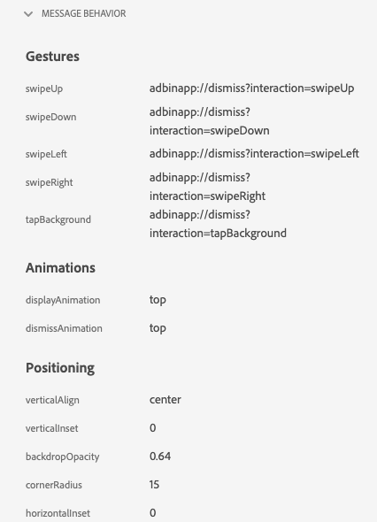

# Ansicht von In-App-Nachrichten in Assurance

Die In-App-Nachrichtenansicht in Adobe Experience Platform Assurance bietet die Möglichkeit, Ihre App zu validieren, auf Ihrem Gerät gesendete In-App-Nachrichten zu überwachen und Nachrichten auf Ihrem Gerät zu simulieren.

## Nachrichten auf dem Gerät

Oben auf der Registerkarte **[!UICONTROL Nachrichten auf Gerät]** befindet sich ein **[!UICONTROL Nachricht]** Dropdown. Dies umfasst alle Nachrichten, die in der Assurance-Sitzung empfangen wurden. Wenn eine Nachricht nicht in dieser Liste enthalten ist, bedeutet dies, dass die App sie nie erhalten hat.


Wenn Sie eine Nachricht auswählen, werden viele Informationen zu dieser Nachricht angezeigt, wie in den folgenden Abschnitten beschrieben.

### Nachrichtenvorschau

Im rechten Bereich befindet sich ein Bereich **[!UICONTROL Nachrichtenvorschau]** der eine Vorschau der Nachricht anzeigt. Wenn Sie **[!UICONTROL Auf Gerät simulieren]** auswählen, wird diese Nachricht an alle Geräte gesendet, die derzeit mit der Sitzung verbunden sind.


### Nachrichtenverhalten

Unter dem Bereich **[!UICONTROL Nachrichtenvorschau]** befindet sich die Registerkarte **[!UICONTROL Nachrichtenverhalten]** . Hier finden Sie alle Details zur Anzeige der Nachricht. Zu diesen Informationen gehören Positionierungsinformationen, Animationen, Wischgesten und Darstellungseinstellungen.



### Registerkarte „Info“

Im linken Bereich gibt es vier Registerkarten, die Details zur Nachricht anzeigen. Die **[!UICONTROL Info]** zeigt Informationen an, die von Adobe Journey Optimizer (AJO) zur Nachrichtenkampagne geladen wurden.

Sie können auch auf **[!UICONTROL Kampagne anzeigen]** klicken, um die Nachricht in AJO zur Überprüfung oder Bearbeitung zu öffnen.


### Registerkarte „Regeln“

Die **[!UICONTROL Regeln]** zeigt an, was passieren muss, damit diese Nachricht angezeigt wird. Dadurch erhalten Sie Einblick in den Trigger einer anzuzeigenden Nachricht. Sehen wir uns dieses Beispiel an:


Das Beispiel zeigt drei verschiedene Bedingungen für die Regel. Wenn Sie ein Ereignis auswählen (aus einer Ereignisliste, auf der Registerkarte Analysieren oder in der Zeitleiste), wird dieses Ereignis anhand dieser Regeln bewertet. Wenn das Ereignis einer Bedingung entspricht, wird ein grünes Häkchen angezeigt:


Wenn das Ereignis nicht übereinstimmt, wird ein rotes Symbol angezeigt:


Wenn alle drei Bedingungen mit dem aktuellen Ereignis übereinstimmen, wird die Nachricht angezeigt.

### Registerkarte „Analysieren“

Die **[!UICONTROL Analysieren]** bietet zusätzliche Einblicke in die Regeln. Hier filtern wir jedes Ereignis in der Sitzung danach, wie nahe unsere Nachrichtenregel mit dem Ereignis übereinstimmt.


Im Beispiel im Abschnitt **[!UICONTROL Registerkarte Regeln]** gibt es drei Bedingungen in der Regel. Auf dieser Registerkarte wird angezeigt, welcher Prozentsatz der Regel jedes Ereignis entspricht. Die Mehrheit der Ereignisse stimmt mit 33 % überein (eine von drei Bedingungen) und der Rest stimmt mit 100 % überein.

Daher können Sie Ereignisse finden, die der Regel nahe kommen, aber nicht vollständig entsprechen.


Mit **[!UICONTROL Schieberegler]**&#x200B;Übereinstimmungsschwelle“ können Sie filtern, welche Ereignisse angezeigt werden sollen. Dies kann beispielsweise auf 50 % bis 90 % festgelegt werden, um eine Liste von Ereignissen zu erhalten, die exakt zwei der drei Bedingungen erfüllen.

### Registerkarte „Interaktionen“

Die Registerkarte **[!UICONTROL Interaktionen]** zeigt eine Liste der Interaktionsereignisse an, die zu Tracking-Zwecken an die Edge gesendet wurden.


In der Regel gibt es vier Interaktionsereignisse, wenn eine Nachricht angezeigt wird:

```
trigger > display > interact > dismiss
```

Der Interaktion „interagieren“ ist ein zusätzlicher Wert „Aktion“ zugeordnet. Mögliche Werte sind „angeklickt“ oder „Abbrechen“.

Die Spalte Validierung zeigt an, ob das Interaktionsereignis vom Edge ordnungsgemäß empfangen und verarbeitet wurde.

## Validierung

Auf der Registerkarte **[!UICONTROL Validierung]** werden Validierungen für Ihre aktuelle Sitzung ausgeführt. Dabei wird überprüft, ob die App richtig für In-App-Nachrichten konfiguriert wurde:


Wenn Fehler gefunden wurden, werden Details zur Behebung dieser Fehler bereitgestellt.

## Ereignisliste


Die **[!UICONTROL Ereignisliste]** bietet einen schnellen Überblick über alle Ereignisse in der Assurance-Sitzung, die mit In-App-Nachrichten in Verbindung stehen. Einige der Ereignisse, die Sie hier sehen können, sind:

* Anfragen und Antworten zum Abrufen von Nachrichten
* Anzeigen von Nachrichtenereignissen
* Interaktions-Tracking-Ereignisse

In dieser Ansicht können Sie viele der standardmäßigen Funktionen für die Ereignisliste verwenden, einschließlich dem Anwenden von Suchvorgängen, dem Anwenden von Filtern, dem Hinzufügen oder Entfernen von Spalten und dem Exportieren von Daten.

Wählen Sie ein Ereignis aus, um die Rohdetails des Ereignisses im rechten Bedienfeld anzuzeigen.

Im rechten Detailbereich kann das ausgewählte Ereignis markiert werden. Dies ist hilfreich, um etwas zu markieren, das von einer anderen Person überprüft werden sollte.
