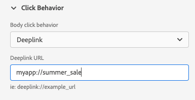

# Push Debug-Ansicht

Die Push-Debug-Ansicht in Adobe Experience Platform Assurance bietet die Möglichkeit, die Push-Einrichtung für Ihre App zu validieren und eine Testnachricht an Ihr Gerät zu senden.

## Kunden

Das Client-Dropdown-Menü enthält eine Liste aller eindeutigen Clients, die mit dieser Zuverlässigkeitssitzung verbunden sind. Ein Client ist entweder ein eindeutiges Gerät oder eine eindeutige App-Installation für ein Gerät. Wenn beispielsweise ein Android-Gerät und ein iOS-Gerät mit der Sitzung verbunden wurden, werden diese Clients im Dropdown-Menü &quot;Clients&quot;angezeigt.

Nachdem Sie die App auf einem Gerät neu installiert und neu verbunden haben, wird ein anderer Client angezeigt. Wenn bereits ein Gerät mit diesem Namen vorhanden ist, wird im neuen Dropdown-Menü eine 2 an den Namen angehängt.

Diese Ansicht ist nur für einen einzelnen Client aktiviert. Wenn Sie also einen anderen Client auswählen, werden die Details auf dem Bildschirm geändert.

## Validieren der Einrichtung

Die **[!UICONTROL Einrichtung überprüfen]** Registerkarte validiert und liefert zusätzliche Details zur Push-Einrichtung der App. Es gibt drei Bereiche, die Überprüfungen durchführen. Sie zeigen ein grünes Häkchen an, wenn die Überprüfungen alle erfolgreich sind. Wenn drei grüne Häkchen vorhanden sind, wurde die App ordnungsgemäß für Push-Nachrichten konfiguriert, schreibt Push-Token in das Benutzerprofil und hat eine zugehörige App-Oberfläche konfiguriert.

Wenn etwas nicht erwartungsgemäß funktioniert, wird ein Warnhinweis mit Details zur Behebung dieses Problems angezeigt:

### Client-Details

In diesem Bedienfeld wird überprüft, ob das Gerät richtig konfiguriert ist. Dazu gehören das Konfigurieren der Erweiterung in der Datenerfassungs-Benutzeroberfläche, das Initialisieren der Erweiterung und ihrer Voraussetzungen in Ihrer Anwendung und das Erfassen des Push-Tokens vom Gerät.

Falls gültig, zeigt das Bedienfeld die ECID für das Gerät, das Push-Token sowie den Namen und Typ der Edge-Sandbox an.

### Profildetails

Sobald Ihr Client korrekt eingerichtet ist, prüft dieses Bedienfeld, ob das Gerät in ein Profil schreibt. Außerdem wird überprüft, ob das Push-Token im Profil mit dem auf dem Gerät vorhandenen übereinstimmt.

Falls gültig, zeigt das Bedienfeld die ECID für das Gerät, das Push-Token, die App-ID Ihrer Anwendung, die Messaging-Plattform und an, ob das Push-Token auf die Abweisungsliste gesetzt wurde. Das Token kann aus verschiedenen Gründen, z. B. weil der Benutzer die App deinstalliert oder die Push-Benachrichtigung für die App deaktiviert hat, auf die Abweisungsliste gesetzt werden.

Am unteren Rand des Bedienfelds befindet sich ein Link, über den dieses spezifische Profil in einer neuen Registerkarte geöffnet wird.

### AppStore-Anmeldeinformationen und -Konfiguration

In diesem Bedienfeld wird geprüft, ob die App-ID und die Messaging-Plattform, die im Profil gespeichert wurden, eine passende App-Oberfläche erstellt haben. Auf einer App-Oberfläche werden Push-Anmeldeinformationen für die Anwendung hochgeladen.

Wenn dies gültig ist, zeigt das Profil den Namen der App-Oberfläche, die App-ID und den Namen des Messaging-Dienstes an.

Am unteren Rand des Bedienfelds befindet sich ein Link, über den diese spezifische App-Oberfläche in einer neuen Registerkarte geöffnet wird.

## Test-Push senden

Die **[!UICONTROL Test-Push senden]** kann verwendet werden, um eine Testnachricht an Ihr Gerät zu senden.

Es gibt mehrere Bereiche, die zum Testen verschiedener Push-Funktionen für iOS und Android konfiguriert werden können. Wählen Sie nach der Konfiguration **[!UICONTROL Push-Benachrichtigung zum Testversand senden]** , um Ihre Nachricht zu senden.

### Nachricht

Im **[!UICONTROL Nachricht]** können Sie einen Titel und einen Text für die Nachricht angeben. Die Funktion für stille Benachrichtigungen kann auch hier aktiviert werden.

### Push target

Die **[!UICONTROL Push-Ziel]** können Sie anpassen, welches Push-Token und welche App-Oberfläche beim Senden der Push-Nachricht verwendet werden sollen.

Diese Informationen werden standardmäßig bereitgestellt, wenn die Variable **[!UICONTROL Einrichtung überprüfen]** gibt drei grüne Markierungen an. Sie können jedoch Ihr eigenes Push-Token und Ihre eigene App-Oberfläche bereitstellen, auch wenn Ihre App nicht vollständig konfiguriert ist.

### Klickverhalten

Aus dem **[!UICONTROL Klickverhalten]** können Sie festlegen, welches Verhalten beim Klicken auf die Push-Benachrichtigung auf dem Gerät auftreten soll. Standardmäßig wird die App geöffnet, es kann jedoch einen Deeplink oder eine Webseite öffnen.

Wenn Sie einen Deeplink verwenden möchten, muss der App-Entwickler einen für Sie erstellen.

### Rich-Media

Die **[!UICONTROL Rich Media]** können Sie zusätzliche Medien zu Ihrer Nachricht hinzufügen, z. B. ein Bild, ein Video oder eine GIF. Der App-Entwickler muss der App Code hinzufügen, um diese Funktion zu aktivieren.

### Schaltflächen       

Die **[!UICONTROL Schaltflächen]** können Sie der Push-Benachrichtigung zusätzliche Schaltflächen hinzufügen. Jede Schaltfläche kann die App öffnen, einen Deeplink in die App öffnen oder eine Webseite öffnen.

Der App-Entwickler muss der App Code hinzufügen, um diese Funktion zu aktivieren.

### Benutzerspezifische Daten

Die **[!UICONTROL Benutzerdefinierte Daten]** können Sie benutzerdefinierte Daten zur Push-Benachrichtigung hinzufügen. Jedes Schlüssel/Wert-Paar wird als Metadaten zusammen mit der Nachricht gesendet und kann von Entwicklern verwendet werden, um leistungsstarke Erlebnisse zu erstellen und zusätzliches Tracking hinzuzufügen.

## Testergebnisse

Sobald Sie eine Nachricht gesendet haben, wird die **[!UICONTROL Testergebnisse]** -Abschnitt erhält Daten von den Push-Diensten für die Nachricht. Hier können Sie sehen, ob die Nachricht an die Google/iOS-Nachrichtendienste gesendet wurde:

Wenn Probleme aufgetreten sind, werden sie hier angezeigt:

## Erweitert

### Anzeigen der Payload der Nachricht

Neben dem **[!UICONTROL Push-Benachrichtigung zum Testversand senden]** button ist ein Satz von Auslassungspunkten mit einem Popup-Menü. Von hier aus können Sie die Payload der Nachricht anzeigen. Auf diese Weise können Sie die genaue Nachricht sehen, die an den Remote-Messaging-Dienst gesendet wird. Sie können diese Payload überprüfen oder sie sogar kopieren und in ein Desktop-Push-Test-Tool einfügen.

