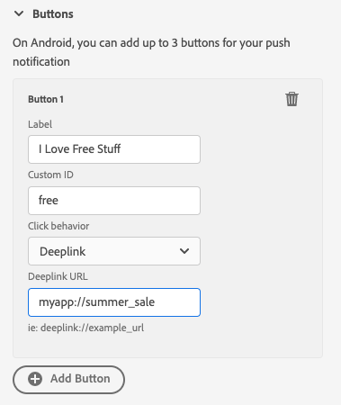

# Debug-Ansicht per Push übertragen

Die Push-Debugging-Ansicht in Adobe Experience Platform Assurance bietet die Möglichkeit, die Push-Einrichtung für Ihre App zu validieren und eine Testnachricht an Ihr Gerät zu senden.

## Clients

Das Client-Dropdown-Menü enthält eine Liste jedes eindeutigen Clients, der mit dieser Assurance-Sitzung verbunden ist. Ein Client ist entweder ein eindeutiges Gerät oder eine eindeutige App-Installation für ein Gerät. Wenn beispielsweise ein Android-Gerät und ein iOS-Gerät mit der Sitzung verbunden wurden, werden diese Clients im Dropdown-Menü „Clients“ angezeigt.

Nach der Neuinstallation und dem erneuten Verbinden der App auf einem Gerät wird ein weiterer Client angezeigt. Wenn bereits ein Gerät mit diesem Namen vorhanden ist, wird in der neuen Dropdown-Liste eine #2 an den Namen angehängt.

Diese Ansicht ist nur für einen einzelnen Client aktiviert. Wenn Sie also einen anderen Client auswählen, werden die Details auf dem Bildschirm geändert.

## Setup validieren

Die Registerkarte **[!UICONTROL Setup validieren]** validiert die Push-Einrichtung der App und liefert zusätzliche Details dazu. Es gibt drei Bedienfelder, die Validierungen durchführen. Wenn alle Validierungen erfolgreich sind, wird ein grünes Häkchen angezeigt. Wenn drei grüne Häkchen vorhanden sind, wurde die App korrekt für Push-Messaging konfiguriert, schreibt Push-Token in das Benutzerprofil und verfügt über eine zugehörige Kanalkonfiguration.

Wenn etwas nicht erwartungsgemäß funktioniert, wird ein Warnhinweis mit Details zur Behebung dieses Problems angezeigt:

### Kundendetails

In diesem Bedienfeld wird überprüft, ob das Gerät richtig konfiguriert ist. Dazu gehört das Konfigurieren der Erweiterung in der Datenerfassungs-Benutzeroberfläche, das Initialisieren der Erweiterung und ihrer Voraussetzungen in Ihrer Anwendung und das Erfassen des Push-Tokens vom Gerät.

Sofern gültig, zeigt das Bedienfeld die ECID für das Gerät, das Push-Token und den Namen und Typ der Edge-Sandbox an.

### Details zum Profil

Sobald Ihr Client korrekt eingerichtet ist, prüft dieses Bedienfeld, ob das Gerät in das Profil schreibt. Außerdem wird überprüft, ob das Push-Token im Profil mit dem auf dem Gerät übereinstimmt.

Sofern gültig, zeigt das Bedienfeld die ECID für das Gerät, das Push-Token, die App-ID Ihrer Anwendung und die Messaging-Plattform an und ob das Push-Token auf der Blockierungsliste aufgeführt wurde. Das Token kann aus verschiedenen Gründen auf die Blockierungsliste gesetzt werden, z. B. wenn der Benutzer die App deinstalliert oder Push-Messaging für die App deaktiviert hat.

Schließlich finden Sie unten im Bedienfeld einen Link, über den dieses spezifische Profil in einer neuen Registerkarte geöffnet wird.

### Anmeldedaten und Konfiguration für AppStore

In diesem Bedienfeld wird überprüft, ob für die App-ID und die Messaging-Plattform, die im Profil gespeichert wurde, eine entsprechende Kanalkonfiguration erstellt wurde. In einer Kanalkonfiguration werden Push-Anmeldeinformationen für das Programm hochgeladen.

Wenn gültig, zeigt das Profil den Namen der Kanalkonfiguration, die App-ID und den Namen des Messaging-Services an.

## Test-Push senden

Die **[!UICONTROL Test-Push senden]** kann verwendet werden, um eine Testnachricht an Ihr Gerät zu senden.

Es gibt mehrere Bereiche, die so konfiguriert werden können, dass verschiedene iOS- und Android-Push-Funktionen getestet werden. Wählen Sie nach der Konfiguration **[!UICONTROL Test-Push-Benachrichtigung senden]** aus, um Ihre Nachricht zu senden.

### Nachricht

Im Bereich **[!UICONTROL Nachricht]** können Sie einen Titel und einen Textkörper für die Nachricht angeben. Die Funktion für stille Benachrichtigungen kann auch hier aktiviert werden.

### Ziel per Push übertragen

Im Bereich **[!UICONTROL Push-Ziel]** können Sie anpassen, welches Push-Token und welche Kanalkonfiguration beim Senden der Push-Nachricht verwendet werden sollen.

Diese Informationen werden standardmäßig bereitgestellt, wenn auf der Registerkarte **[!UICONTROL Einrichtung überprüfen]** drei grüne Häkchen angezeigt werden. Sie können jedoch Ihr eigenes Push-Token und Ihre eigene Kanalkonfiguration bereitstellen, auch wenn Ihre App nicht vollständig konfiguriert ist.

### Klickverhalten

Im Bereich **[!UICONTROL Klickverhalten]** können Sie festlegen, wie sich das Klicken auf die Push-Benachrichtigung auf dem Gerät verhalten soll. Standardmäßig wird die App geöffnet, es kann jedoch ein Deeplink oder eine Web-Seite geöffnet werden.

Wenn Sie sich für die Verwendung eines Deeplink entscheiden, muss der App-Entwickler einen für Sie erstellen.

### Rich Media

Im **[!UICONTROL Rich-Media]**-Bereich können Sie zusätzliche Medien zu Ihrer Nachricht hinzufügen, z. B. ein Bild, Video oder GIF. Der App-Entwickler muss der App Code hinzufügen, um diese Funktion zu aktivieren.

### Schaltflächen       

Im **[!UICONTROL Schaltflächen]** können Sie der Push-Benachrichtigung zusätzliche Schaltflächen hinzufügen. Jede Schaltfläche kann die App öffnen, einen Deeplink in die App einfügen oder eine Web-Seite öffnen.

Der App-Entwickler muss der App Code hinzufügen, um diese Funktion zu aktivieren.

### Benutzerspezifische Daten

Im **[!UICONTROL Benutzerdefinierte Daten]** können Sie der Push-Benachrichtigung benutzerdefinierte Daten hinzufügen. Jedes Schlüssel-Wert-Paar wird zusammen mit der Nachricht als Metadaten gesendet und kann von Entwicklern verwendet werden, um leistungsstarke Erlebnisse zu erstellen und zusätzliches Tracking hinzuzufügen.

## Testergebnisse

Nachdem Sie eine Nachricht gesendet haben, empfängt **[!UICONTROL Abschnitt „Testergebnisse]** Daten von den Push-Services für die Nachricht. Hier können Sie sehen, ob die Nachricht an die Messaging-Services von Google/iOS gesendet wurde:

Wenn Probleme aufgetreten sind, werden sie hier angezeigt:

## Erweitert

### Anzeigen der Nachrichten-Payload

Neben der Schaltfläche **[!UICONTROL Test-Push-Benachrichtigung senden]** befindet sich eine Reihe von Auslassungspunkten mit einem Popup-Menü. Von hier aus können Sie die Nachrichten-Payload anzeigen. Auf diese Weise können Sie die genaue Nachricht sehen, die an den Remote-Messaging-Service gesendet wird. Sie können diese Payload überprüfen oder sie sogar kopieren und in ein Desktop-Push-Test-Tool einfügen.

