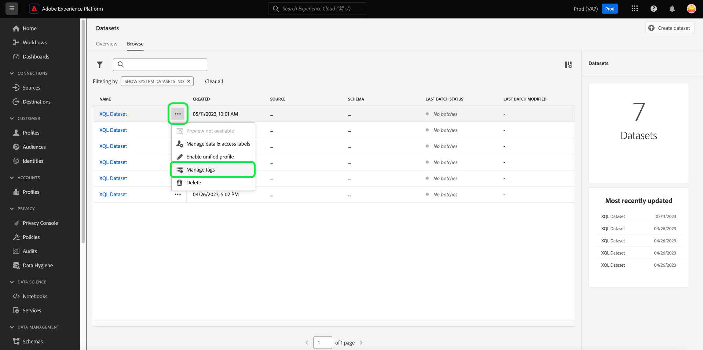
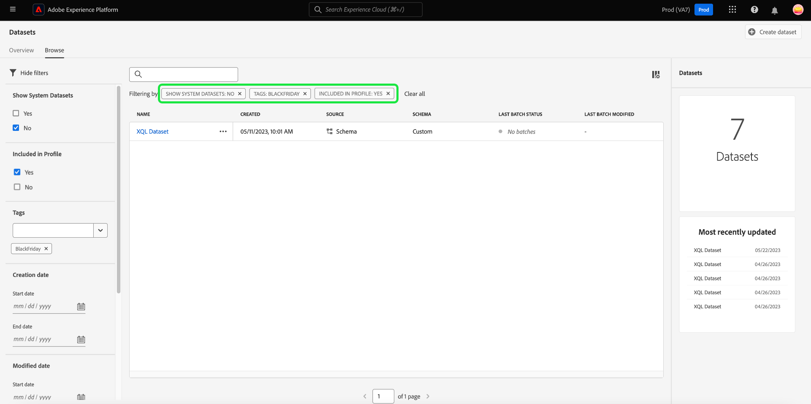
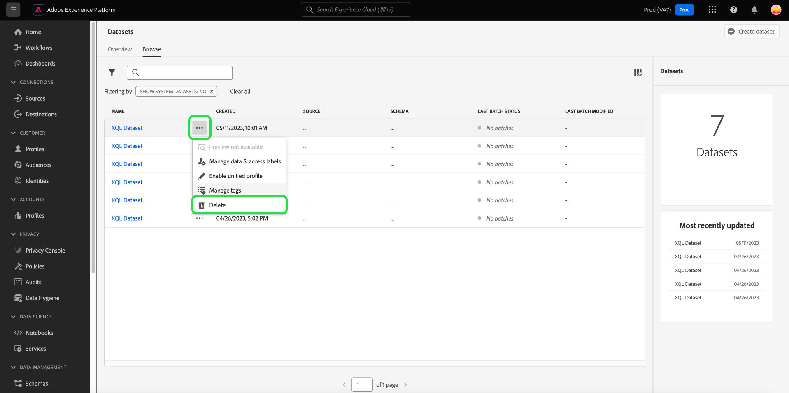

# Handbuch zur Benutzeroberfläche von Datensätzen

Dieses Benutzerhandbuch enthält Anweisungen zur Ausführung allgemeiner Aktionen beim Verwenden von Datensätzen in der Benutzeroberfläche von Adobe Experience Platform.

## Erste Schritte

Das Benutzerhandbuch setzt ein grundlegendes Verständnis der folgenden Komponenten von Adobe Experience Platform voraus:

* [Datensätze](overview.md): Das Speicher- und Verwaltungskonstrukt für Datenpersistenz in [!DNL Experience Platform].
* [[!DNL Experience Data Model (XDM) System]](../../xdm/home.md): Das standardisierte Framework, mit dem Kundenerlebnisdaten von [!DNL Experience Platform] organisiert werden.
   * [Grundlagen der Schemakomposition](../../xdm/schema/composition.md): Machen Sie sich mit den grundlegenden Bausteinen von XDM-Schemata vertraut, einschließlich der wichtigsten Prinzipien und Best Practices bei der Schemakomposition.
   * [Schema Editor](../../xdm/tutorials/create-schema-ui.md): Erfahren Sie, wie Sie mithilfe des [!DNL Schema Editor] innerhalb der [!DNL Platform] -Benutzeroberfläche.
* [[!DNL Real-Time Customer Profile]](../../profile/home.md): Bietet ein einheitliches Echtzeit-Kundenprofil, das auf aggregierten Daten aus verschiedenen Quellen basiert.
* [[!DNL Adobe Experience Platform Data Governance]](../../data-governance/home.md): Sorgen Sie bei der Nutzung von Kundendaten für die Einhaltung von Vorschriften, Begrenzungen und Richtlinien.

## Anzeigen von Datensätzen {#view-datasets}

>[!CONTEXTUALHELP]
>id="platform_datasets_negative_numbers"
>title="Negative Zahlen in der Datensatzaktivität"
>abstract="Negative Zahlen in aufgenommenen Datensätzen bedeuten, dass ein Benutzer oder eine Benutzerin bestimmte Batches im ausgewählten Zeitraum gelöscht hat."
>text="Learn more in documentation"

>[!CONTEXTUALHELP]
>id="platform_datasets_browse_daysRemaining"
>title="Ablaufdatum des Datensatzes"
>abstract="Diese Spalte gibt die Anzahl der Tage an, die verbleiben, bis der Zieldatensatz automatisch abläuft."

Im [!DNL Experience Platform] Benutzeroberfläche, auswählen **[!UICONTROL Datensätze]** im linken Navigationsbereich, um die **[!UICONTROL Datensätze]** Dashboard. Das Dashboard listet alle verfügbaren Datensätze für Ihre Organisation auf. Zu jedem aufgelisteten Datensatz werden Details angezeigt, einschließlich seines Namens, des Schemas, dem der Datensatz entspricht, und des Status des letzten Erfassungslaufs.

Wählen Sie den Namen eines Datensatzes aus der [!UICONTROL Durchsuchen] Registerkarte für den Zugriff auf die **[!UICONTROL Datensatzaktivität]** angezeigt und sehen Sie Details zum ausgewählten Datensatz. Die Registerkarte „Aktivität“ enthält ein Diagramm, das die Rate der konsumierten Nachrichten sowie eine Liste erfolgreicher und fehlgeschlagener Batches visuell darstellt.

## Inline-Datensatzaktionen {#inline-actions}

Die Benutzeroberfläche für Datensätze bietet jetzt eine Sammlung von Inline-Aktionen für jeden verfügbaren Datensatz. Wählen Sie die Auslassungspunkte (...) eines Datensatzes aus, den Sie verwalten möchten, um die verfügbaren Optionen in einem Popup-Menü anzuzeigen. Zu den verfügbaren Maßnahmen gehören: [[!UICONTROL Datensatz-Vorschau]](#preview), [[!UICONTROL Daten verwalten und Zugriffsbeschriftungen]](#manage-and-enforce-data-governance), [[!UICONTROL Einheitliches Profil aktivieren]](#enable-profile), [[!UICONTROL Tags verwalten]](#add-tags), [[!UICONTROL In Ordner verschieben]](#move-to-folders), und [[!UICONTROL Löschen]](#delete). Weitere Informationen zu diesen verfügbaren Aktionen finden Sie in den jeweiligen Abschnitten.

### Hinzufügen von Datensatz-Tags {#add-tags}

Fügen Sie benutzerdefinierte erstellte Tags hinzu, um Datensätze zu organisieren und die Such-, Filter- und Sortierfunktionen zu verbessern. Aus dem [!UICONTROL Durchsuchen] des [!UICONTROL Datensätze] Arbeitsbereich die Auslassungspunkte eines zu verwaltenden Datensatzes auswählen, gefolgt von **[!UICONTROL Tags verwalten]** aus dem Dropdown-Menü aus.

Die [!UICONTROL Tags verwalten] angezeigt. Geben Sie eine kurze Beschreibung ein, um ein benutzerdefiniertes Tag zu erstellen, oder wählen Sie aus einem bereits vorhandenen Tag aus, um Ihren Datensatz zu beschriften. Klicken Sie auf **[!UICONTROL Speichern]**, um Ihre Einstellungen zu bestätigen.

Die [!UICONTROL Tags verwalten] -Dialogfeld kann auch vorhandene Tags aus einem Datensatz entfernen. Wählen Sie einfach das &quot;x&quot;neben dem Tag aus, das Sie entfernen möchten, und wählen Sie **[!UICONTROL Speichern]**.

Nachdem einem Datensatz ein Tag hinzugefügt wurde, können die Datensätze anhand des entsprechenden Tags gefiltert werden. Siehe den Abschnitt zum [Filtern von Datensätzen nach Tags](#enable-profile) für weitere Informationen.

Weitere Informationen zum Klassifizieren von Geschäftsobjekten für eine einfachere Erkennung und Kategorisierung finden Sie im Handbuch unter [Verwalten von Metadaten-Taxonomien](../../administrative-tags/ui/managing-tags.md). In diesem Handbuch wird beschrieben, wie Benutzer mit entsprechenden Berechtigungen vordefinierte Tags erstellen, Tags Kategorien zuweisen und alle zugehörigen CRUD-Vorgänge für Tags und Tag-Kategorien in der Platform-Benutzeroberfläche durchführen können.

## Datensätze suchen und filtern {#search-and-filter}

Um die Liste der verfügbaren Datensätze zu durchsuchen oder zu filtern, wählen Sie das Filtersymbol () oben links im Arbeitsbereich. Eine Reihe von Filteroptionen wird in der linken Leiste angezeigt. Es gibt mehrere Methoden zum Filtern der verfügbaren Datensätze. Dazu gehören: [[!UICONTROL Systemdatensätze anzeigen]](#show-system-datasets), [[!UICONTROL Im Profil enthalten]](#filter-profile-enabled-datasets), [[!UICONTROL Tags]](#filter-by-tag), [[!UICONTROL Erstellungsdatum]](#filter-by-creation-date), [[!UICONTROL Änderungsdatum], [!UICONTROL Erstellt von]](#filter-by-creation-date), und [[!UICONTROL Schema]](#filter-by-schema).

Die Liste der angewendeten Filter wird oberhalb der gefilterten Ergebnisse angezeigt.

### Anzeigen von Systemdatensätzen {#show-system-datasets}

Standardmäßig werden nur Datensätze angezeigt, in die Sie Daten aufgenommen haben. Wenn Sie die systemgenerierten Datensätze anzeigen möchten, wählen Sie die **[!UICONTROL Ja]** im [!UICONTROL Anzeigen von Systemdatensätzen] Abschnitt. Systemgenerierte Datensätze werden nur zur Verarbeitung anderer Komponenten verwendet. Beispielsweise wird der systemgenerierte Profilexport-Datensatz zur Verarbeitung des Profil-Dashboards verwendet.

![Die Filteroptionen des Arbeitsbereichs &quot;Datensätze&quot;mit dem [!UICONTROL Anzeigen von Systemdatensätzen] hervorgehoben.](../images/datasets/user-guide/show-system-datasets.png)

### Profilaktivierte Datensätze filtern {#filter-profile-enabled-datasets}

Die für Profildaten aktivierten Datensätze werden zum Ausfüllen von Kundenprofilen verwendet, nachdem die Daten erfasst wurden. Siehe Abschnitt zu [Aktivieren von Datensätzen für Profile](#enable-profile) , um mehr zu erfahren.

Um Ihren Datensatz nach der Aktivierung für Profil zu filtern, wählen Sie die [!UICONTROL Ja] aus den Filteroptionen.

![Die Filteroptionen des Arbeitsbereichs &quot;Datensätze&quot;mit dem [!UICONTROL Im Profil enthalten] hervorgehoben.](../images/datasets/user-guide/included-in-profile.png)

### Filtern von Datensätzen nach Tag {#filter-by-tag}

Geben Sie Ihren benutzerdefinierten Tag-Namen in die [!UICONTROL Tags] eingeben und wählen Sie dann Ihr Tag aus der Liste der verfügbaren Optionen aus, um Datensätze zu suchen und zu filtern, die diesem Tag entsprechen.

![Die Filteroptionen des Arbeitsbereichs &quot;Datensätze&quot;mit dem [!UICONTROL Tags] Eingabe- und Filtersymbol hervorgehoben.](../images/datasets/user-guide/filter-tags.png)

### Filtern von Datensätzen nach Erstellungsdatum {#filter-by-creation-date}

Datensätze können nach Erstellungsdatum über einen benutzerdefinierten Zeitraum gefiltert werden. Dies kann zum Ausschließen von Verlaufsdaten oder zum Generieren spezifischer chronologischer Dateneinblicke und Berichte verwendet werden. Wählen Sie eine [!UICONTROL Startdatum] und [!UICONTROL Enddatum] durch Auswahl des Kalendersymbols für jedes Feld. Danach werden auf der Registerkarte Durchsuchen nur Datensätze angezeigt, die diesen Kriterien entsprechen.

### Filtern von Datensätzen nach Änderungsdatum {#filter-by-modified-date}

Ähnlich wie der Filter für das Erstellungsdatum können Sie Ihre Datensätze nach dem Datum der letzten Änderung filtern. Im [!UICONTROL Änderungsdatum] Abschnitt auswählen [!UICONTROL Startdatum] und [!UICONTROL Enddatum] durch Auswahl des Kalendersymbols für jedes Feld. Danach werden auf der Registerkarte Durchsuchen nur Datensätze angezeigt, die während dieses Zeitraums geändert wurden.

### Nach Schema filtern {#filter-by-schema}

Sie können Datensätze nach dem Schema filtern, das ihre Struktur definiert. Wählen Sie entweder das Dropdown-Symbol aus oder geben Sie den Schemanamen in das Textfeld ein. Eine Liste der potenziellen Übereinstimmungen wird angezeigt. Wählen Sie das entsprechende Schema aus der Liste aus.

## Sortieren von Datensätzen nach dem erstellten Datum {#sort}

Datensätze in der [!UICONTROL Durchsuchen] kann nach auf- oder absteigenden Datumsangaben sortiert werden. Wählen Sie die [!UICONTROL Erstellt] oder [!UICONTROL Letzte Aktualisierung] Spaltenüberschriften, die zwischen auf- und absteigender Reihenfolge zu wechseln sind. Nach der Auswahl zeigt die Spalte dies entweder mit einem Nach-oben- oder Nach-unten-Pfeil neben der Spaltenüberschrift an.

## Vorschau für Datensatz anzeigen {#preview}

Sie können eine Vorschau der Datensatzstichprobe aus beiden Inline-Optionen der [!UICONTROL Durchsuchen] und auch [!UICONTROL Datensatzaktivität] anzeigen. Aus dem [!UICONTROL Durchsuchen] die Auslassungszeichen (...) neben dem Datensatznamen, den Sie in der Vorschau anzeigen möchten. Eine Menüliste mit Optionen wird angezeigt. Wählen Sie als Nächstes **[!UICONTROL Datensatz-Vorschau]** aus der Liste der verfügbaren Optionen. Wenn der Datensatz leer ist, wird der Vorschau-Link deaktiviert und stattdessen darauf hingewiesen, dass die Vorschau nicht verfügbar ist.

Dadurch wird das Vorschaufenster geöffnet, in dem rechts die hierarchische Ansicht des Schemas für den Datensatz angezeigt wird.

Alternativ können Sie über die **[!UICONTROL Datensatzaktivität]** Bildschirm, auswählen **[!UICONTROL Datensatz-Vorschau]** in der oberen rechten Ecke des Bildschirms eine Vorschau von bis zu 100 Datenzeilen anzeigen.

Für zuverlässigere Methoden zum Zugriff auf Ihre Daten: [!DNL Experience Platform] bietet nachgelagerte Dienste wie [!DNL Query Service] und [!DNL JupyterLab] zur Datenanalyse und -analyse. Weiterführende Informationen finden Sie in folgenden Dokumenten:

* [Query Service – Übersicht](../../query-service/home.md)
* [JupyterLab-Benutzerhandbuch](../../data-science-workspace/jupyterlab/overview.md)

## Erstellen eines Datensatzes {#create}

Um einen neuen Datensatz zu erstellen, klicken Sie im Dashboard „Datensätze“ auf die Option **[!UICONTROL Datensatz erstellen]**.****

Im folgenden Bildschirm werden Ihnen die folgenden zwei Optionen zum Erstellen eines neuen Datensatzes angezeigt:

* [Datensatz aus Schema erstellen](#schema)
* [Datensatz aus CSV-Datei erstellen](#csv)

### Datensatz mit vorhandenem Schema erstellen {#schema}

Im **[!UICONTROL Datensatz erstellen]** Bildschirm, auswählen **[!UICONTROL Datensatz aus Schema erstellen]** , um einen neuen leeren Datensatz zu erstellen.

Der Schritt **[!UICONTROL Schema auswählen]** wird angezeigt. Durchsuchen Sie die Schemaliste und wählen Sie das Schema aus, dem der Datensatz entsprechen soll, bevor Sie **[!UICONTROL Nächste]**.

Der Schritt **[!UICONTROL Datensatz konfigurieren]** wird angezeigt. Geben Sie dem Datensatz einen Namen und eine optionale Beschreibung und wählen Sie **[!UICONTROL Beenden]** , um den Datensatz zu erstellen.

Datensätze können mit dem Schemafilter aus der Liste der verfügbaren Datensätze in der Benutzeroberfläche gefiltert werden. Siehe den Abschnitt zum [Datensätze nach Schema filtern](#filter-by-schema) für weitere Informationen.

### Datensatz mit einer CSV-Datei erstellen {#csv}

Wenn Sie einen Datensatz mit einer CSV-Datei erstellen, wird ein Ad-hoc-Schema erstellt, um dem Datensatz eine Struktur zu geben, die mit der bereitgestellten CSV-Datei übereinstimmt. Im **[!UICONTROL Datensatz erstellen]** Bildschirm, auswählen **[!UICONTROL Datensatz aus CSV-Datei erstellen]**.

Der Schritt **[!UICONTROL Konfigurieren]** wird angezeigt. Geben Sie dem Datensatz einen Namen und eine optionale Beschreibung und wählen Sie **[!UICONTROL Nächste]**.

Der Schritt **[!UICONTROL Daten hinzufügen]** wird angezeigt. Laden Sie die CSV-Datei hoch, indem Sie sie entweder in die Mitte des Bildschirms ziehen und dort ablegen oder Sie **[!UICONTROL Durchsuchen]** , um Ihr Dateiverzeichnis zu durchsuchen. Die Datei darf maximal 10 Gigabyte groß sein. Nachdem die CSV-Datei hochgeladen wurde, wählen Sie **[!UICONTROL Speichern]** , um den Datensatz zu erstellen.

>[!NOTE]
>
>Namen von CSV-Spalten müssen mit alphanumerischen Zeichen beginnen und dürfen ausschließlich Buchstaben, Ziffern und Unterstriche enthalten.

## Datensatz für Echtzeit-Kundenprofil aktivieren {#enable-profile}

Jeder Datensatz bietet die Möglichkeit, Kundenprofile mit den erfassten Daten anzureichern. Dazu muss das Schema, dem der Datensatz entspricht, für die Verwendung in [!DNL Real-Time Customer Profile]. Ein kompatibles Schema erfüllt folgende Anforderungen:

* Das Schema weist mindestens ein Attribut auf, das als Identitätseigenschaft definiert wurde.
* Das Schema verfügt über eine Identitätseigenschaft, die als primäre Identität definiert wurde.

Weitere Informationen zum Aktivieren eines Schemas für [!DNL Profile], siehe [Benutzerhandbuch zum Schema Editor](../../xdm/tutorials/create-schema-ui.md).

Sie können einen Datensatz für Profil über beide Inline-Optionen der [!UICONTROL Durchsuchen] und auch [!UICONTROL Datensatzaktivität] anzeigen. Aus dem [!UICONTROL Durchsuchen] des [!UICONTROL Datensätze] Arbeitsbereich die Auslassungspunkte eines Datensatzes auswählen, den Sie für Profil aktivieren möchten. Eine Menüliste mit Optionen wird angezeigt. Wählen Sie als Nächstes **[!UICONTROL Einheitliches Profil aktivieren]** aus der Liste der verfügbaren Optionen.

Alternativ dazu kann die **[!UICONTROL Datensatzaktivität]** Bildschirm, wählen Sie **[!UICONTROL Profil]** innerhalb der **[!UICONTROL Eigenschaften]** Spalte. Nach der Aktivierung werden Daten, die in den Datensatz aufgenommen werden, auch zum Ausfüllen von Kundenprofilen verwendet.

>[!NOTE]
>
>Wenn ein Datensatz bereits Daten enthält und dann für [!DNL Profile], werden die vorhandenen Daten nicht automatisch von [!DNL Profile]. Nachdem ein Datensatz für [!DNL Profile]sollten Sie alle vorhandenen Daten neu erfassen, damit sie zu Kundenprofilen beitragen.

Datensätze, die für Profile aktiviert wurden, können ebenfalls anhand dieser Kriterien gefiltert werden. Siehe den Abschnitt zum [Für das Profil aktivierte Datensätze filtern](#filter-profile-enabled-datasets) für weitere Informationen.

## Data Governance in einem Datensatz verwalten und durchsetzen {#manage-and-enforce-data-governance}

Sie können die Data Governance-Beschriftungen für einen Datensatz verwalten, indem Sie die Inline-Optionen des [!UICONTROL Durchsuchen] Registerkarte. Wählen Sie die Auslassungspunkte (...) neben dem Datensatz, den Sie verwalten möchten, gefolgt von **[!UICONTROL Daten verwalten und Zugriffsbeschriftungen]** aus dem Dropdown-Menü aus.

Mit Datennutzungsbezeichnungen, die auf Schemaebene angewendet werden, können Sie Datensätze und Felder entsprechend den für diese Daten geltenden Nutzungsrichtlinien kategorisieren. Siehe [Data Governance - Übersicht](../../data-governance/home.md) Weitere Informationen zu Bezeichnungen finden Sie im Abschnitt [Benutzerhandbuch zu Datennutzungsbezeichnungen](../../data-governance/labels/overview.md) für Anweisungen zum Anwenden von Bezeichnungen auf Schemas zur Weitergabe an Datensätze.

## In Ordner verschieben {#move-to-folders}

Sie können Datensätze in Ordnern platzieren, um die Datensatzverwaltung zu verbessern. Um einen Datensatz in einen Ordner zu verschieben, wählen Sie die Auslassungszeichen (..) neben dem Datensatz-Namen aus, den Sie verwalten möchten, gefolgt von **[!UICONTROL In Ordner verschieben]** aus dem Dropdown-Menü aus.

![Die [!UICONTROL Datensätze] Dashboard mit den Auslassungspunkten und [!UICONTROL In Ordner verschieben] hervorgehoben.](../images/datasets/user-guide/move-to-folder.png)

Die [!UICONTROL Verschieben] Das Dialogfeld Datensatz in Ordner wird angezeigt. Wählen Sie den Ordner aus, in den Sie die Zielgruppe verschieben möchten, und wählen Sie dann **[!UICONTROL Verschieben]**. Eine Popup-Benachrichtigung informiert Sie darüber, dass die Verschiebung des Datensatzes erfolgreich war.

![Die [!UICONTROL Verschieben] Datensatz-Dialogfeld mit [!UICONTROL Verschieben] hervorgehoben.](../images/datasets/user-guide/move-dialog.png)

>[!TIP]
>
>Sie können Ordner auch direkt im Dialogfeld Datensatz verschieben erstellen. Um einen Ordner zu erstellen, wählen Sie das Symbol Ordner erstellen () oben rechts im Dialogfeld.
>
>![Die [!UICONTROL Verschieben] Datensatz-Dialogfeld mit dem Symbol Ordner erstellen hervorgehoben.](/help/catalog/images/datasets/user-guide/create-folder.png)

Sobald sich der Datensatz in einem Ordner befindet, können Sie festlegen, dass nur Datensätze angezeigt werden, die zu einem bestimmten Ordner gehören. Um Ihre Ordnerstruktur zu öffnen, wählen Sie das Symbol Ordner anzeigen (). Wählen Sie als Nächstes den ausgewählten Ordner aus, um alle zugehörigen Datensätze anzuzeigen.

![Die [!UICONTROL Datensätze] Dashboards, in denen die Ordnerstruktur des Datensatzes angezeigt wird, das Symbol &quot;Ordner anzeigen&quot;und ein ausgewählter Ordner hervorgehoben sind.](../images/datasets/user-guide/folder-structure.png)

## Datensatz löschen {#delete}

Sie können einen Datensatz aus den Inline-Aktionen des Datensatzes löschen. [!UICONTROL Durchsuchen] oder oben rechts im [!UICONTROL Datensatzaktivität] anzeigen. Aus dem [!UICONTROL Durchsuchen] -Ansicht die Auslassungszeichen (...) neben dem Datensatznamen, den Sie löschen möchten. Eine Menüliste mit Optionen wird angezeigt. Wählen Sie als Nächstes **[!UICONTROL Löschen]** aus dem Dropdown-Menü aus.

Ein Bestätigungsdialogfeld wird angezeigt. Klicken Sie zur Bestätigung auf **[!UICONTROL Löschen]**.

Wählen Sie alternativ **[!UICONTROL Datensatz löschen]** aus dem **[!UICONTROL Datensatzaktivität]** angezeigt.

>[!NOTE]
>
>Datensätze, die von Adobe-Anwendungen und -Diensten erstellt und verwendet werden (z. B. Adobe Analytics, Adobe Audience Manager oder [!DNL Offer Decisioning]) kann nicht gelöscht werden.

Ein Bestätigungsdialog wird angezeigt. Auswählen **[!UICONTROL Löschen]** , um das Löschen des Datensatzes zu bestätigen.

## Profil-aktivierten Datensatz löschen

Wenn ein Datensatz für Profil aktiviert ist, wird er durch Löschen dieses Datensatzes über die Benutzeroberfläche aus dem Data Lake, Identity Service und dem Profilspeicher in Platform gelöscht.

Sie können einen Datensatz aus der [!DNL Profile] nur speichern (die Daten im Data Lake belassen) mithilfe der Echtzeit-Kundenprofil-API. Weitere Informationen finden Sie im [Handbuch zum Vorgangs-API-Endpunkt von Profile System](../../profile/api/profile-system-jobs.md).

## Überwachen der Datenaufnahme

Im [!DNL Experience Platform] Benutzeroberfläche, auswählen **[!UICONTROL Überwachung]** im linken Navigationsbereich. Mit dem **[!UICONTROL Monitoring]**-Dashboard können Sie die Status von aus der Batch- oder Streaming-Erfassung eingehenden Daten anzeigen. Um den Status einzelner Batches anzuzeigen, wählen Sie entweder **[!UICONTROL Batch End-to-End]** oder **[!UICONTROL End-to-End-Streaming]**. In den Dashboards werden alle Batch- oder Streaming-Erfassungsläufe aufgelistet, einschließlich jener, die erfolgreich sind, fehlgeschlagen sind oder noch ausgeführt werden. Jede Auflistung enthält Details zum Batch, einschließlich der Batch-Kennung, dem Namen des Zieldatensatzes und der Zahl der erfassten Einträge. Wenn der Zieldatensatz für [!DNL Profile], wird auch die Anzahl der erfassten Identitäts- und Profildatensätze angezeigt.

Sie können einzelne **[!UICONTROL Batch-Kennung]** , um auf die **[!UICONTROL Batch-Übersicht]** Dashboard anzeigen und Details zum Batch anzeigen, einschließlich Fehlerprotokollen, falls der Batch nicht erfasst werden kann.

Wenn Sie den Batch löschen möchten, wählen Sie **[!UICONTROL Batch löschen]** oben rechts im Dashboard. Durch das Löschen eines Batches werden auch seine Datensätze aus dem Datensatz entfernt, in den der Batch ursprünglich aufgenommen wurde.

## Nächste Schritte

Dieses Benutzerhandbuch enthält Anweisungen zum Ausführen allgemeiner Aktionen beim Arbeiten mit Datensätzen in der [!DNL Experience Platform] -Benutzeroberfläche. Für die Schritte zum Ausführen von [!DNL Platform] Workflows mit Datensätzen finden Sie in den folgenden Tutorials:

* [Erstellen eines Datensatzes mithilfe von APIs](create.md)
* [Datensatzdaten mit der Data Access-API abfragen](../../data-access/home.md)
* [Datensatz für Echtzeit-Kundenprofil und Identity Service mithilfe von APIs konfigurieren](../../profile/tutorials/dataset-configuration.md)
