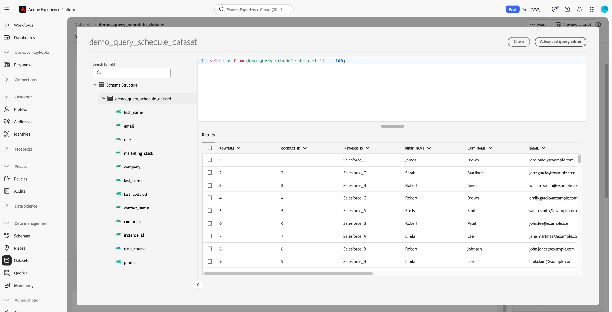

# Handbuch zur Benutzeroberfläche von Datensätzen

Dieses Benutzerhandbuch enthält Anweisungen zur Ausführung allgemeiner Aktionen beim Verwenden von Datensätzen in der Benutzeroberfläche von Adobe Experience Platform.

## Erste Schritte

Das Benutzerhandbuch setzt ein grundlegendes Verständnis der folgenden Komponenten von Adobe Experience Platform voraus:

* [Datensätze](overview.md): Das Speicher- und Verwaltungskonstrukt für Datenpersistenz in [!DNL Experience Platform].
* [[!DNL Experience Data Model (XDM) System]](../../xdm/home.md): Das standardisierte Framework, mit dem [!DNL Experience Platform] Kundenerlebnisdaten organisiert.
   * [Grundlagen der Schemakomposition](../../xdm/schema/composition.md): Machen Sie sich mit den grundlegenden Bausteinen von XDM-Schemas vertraut, einschließlich der wichtigsten Prinzipien und Best Practices bei der Schemaerstellung.
   * [Schema Editor](../../xdm/tutorials/create-schema-ui.md): Erfahren Sie, wie Sie mithilfe des [!DNL Schema Editor] innerhalb der [!DNL Platform] -Benutzeroberfläche.
* [[!DNL Real-time Customer Profile]](../../profile/home.md): Bietet ein einheitliches Echtzeit-Kundenprofil, das auf aggregierten Daten aus verschiedenen Quellen basiert.
* [[!DNL Adobe Experience Platform Data Governance]](../../data-governance/home.md): Sorgen Sie bei der Nutzung von Kundendaten für die Einhaltung von Vorschriften, Begrenzungen und Richtlinien.

## Anzeigen von Datensätzen

Im [!DNL Experience Platform] Benutzeroberfläche, auswählen **[!UICONTROL Datensätze]** im linken Navigationsbereich, um die **[!UICONTROL Datensätze]** Dashboard. Das Dashboard listet alle verfügbaren Datensätze für Ihre Organisation auf. Zu jedem aufgelisteten Datensatz werden Details angezeigt, einschließlich seines Namens, des Schemas, dem der Datensatz entspricht, und des Status des letzten Erfassungslaufs.

Standardmäßig werden nur die Datensätze angezeigt, die Sie in aufgenommen haben. Wenn Sie die systemgenerierten Datensätze anzeigen möchten, aktivieren Sie die **[!UICONTROL Anzeigen von Systemdatensätzen]** umschalten. Systemgenerierte Datensätze werden nur zur Verarbeitung anderer Komponenten verwendet. Beispielsweise wird der systemgenerierte Profilexport-Datensatz zur Verarbeitung des Profil-Dashboards verwendet.

Wählen Sie den Namen eines Datensatzes aus, um auf seinen **[!UICONTROL Datensatzaktivität]** angezeigt und sehen Sie Details zum ausgewählten Datensatz. Der Tab „Aktivität“ enthält ein Diagramm, das die Rate der konsumierten Nachrichten sowie eine Liste erfolgreicher und fehlgeschlagener Batches visuell darstellt.

## Vorschau für Datensatz anzeigen

Aus dem **[!UICONTROL Datensatzaktivität]** Bildschirm, wählen Sie **[!UICONTROL Vorschau des Datensatzes anzeigen]** in der oberen rechten Ecke des Bildschirms, um eine Vorschau von bis zu 100 Datenzeilen anzuzeigen. Wenn der Datensatz leer ist, wird der Vorschau-Link deaktiviert und stattdessen darauf hingewiesen, dass die Vorschau nicht verfügbar ist.

Im Vorschaufenster wird rechts für den Datensatz die hierarchische Ansicht des Schemas angezeigt.

Für zuverlässigere Methoden zum Zugriff auf Ihre Daten: [!DNL Experience Platform] bietet nachgelagerte Dienste wie [!DNL Query Service] und [!DNL JupyterLab] , um Daten zu untersuchen und zu analysieren. Weiterführende Informationen finden Sie in folgenden Dokumenten:

* [Query Service – Übersicht](../../query-service/home.md)
* [JupyterLab-Benutzerhandbuch](../../data-science-workspace/jupyterlab/overview.md)

## Erstellen eines Datensatzes {#create}

Um einen neuen Datensatz zu erstellen, wählen Sie zunächst **[!UICONTROL Datensatz erstellen]** im **[!UICONTROL Datensätze]** Dashboard.

Im folgenden Bildschirm werden Ihnen die folgenden zwei Optionen zum Erstellen eines neuen Datensatzes angezeigt:

* [Datensatz aus Schema erstellen](#schema)
* [Datensatz aus CSV-Datei erstellen](#csv)

### Datensatz mit vorhandenem Schema erstellen {#schema}

Im **[!UICONTROL Datensatz erstellen]** Bildschirm, wählen Sie **[!UICONTROL Datensatz aus Schema erstellen]** , um einen neuen leeren Datensatz zu erstellen.

Der Schritt **[!UICONTROL Schema auswählen]** wird angezeigt. Durchsuchen Sie die Schemaliste und wählen Sie das Schema aus, dem der Datensatz entsprechen soll, bevor Sie **[!UICONTROL Nächste]**.

Der Schritt **[!UICONTROL Datensatz konfigurieren]** wird angezeigt. Geben Sie dem Datensatz einen Namen und eine optionale Beschreibung und wählen Sie **[!UICONTROL Beenden]** , um den Datensatz zu erstellen.

### Datensatz mit einer CSV-Datei erstellen {#csv}

Wenn Sie einen Datensatz mit einer CSV-Datei erstellen, wird ein Ad-hoc-Schema erstellt, um dem Datensatz eine Struktur zu geben, die mit der bereitgestellten CSV-Datei übereinstimmt. Im **[!UICONTROL Datensatz erstellen]** Bildschirm, wählen Sie **[!UICONTROL Datensatz aus CSV-Datei erstellen]**.

Der Schritt **[!UICONTROL Konfigurieren]** wird angezeigt. Geben Sie dem Datensatz einen Namen und eine optionale Beschreibung und wählen Sie **[!UICONTROL Nächste]**.

Der Schritt **[!UICONTROL Daten hinzufügen]** wird angezeigt. Laden Sie die CSV-Datei hoch, indem Sie sie entweder in die Mitte des Bildschirms ziehen und dort ablegen oder Sie **[!UICONTROL Durchsuchen]** , um das Dateiverzeichnis zu durchsuchen. Die Datei darf maximal 10 Gigabyte groß sein. Nachdem die CSV-Datei hochgeladen wurde, wählen Sie **[!UICONTROL Speichern]** , um den Datensatz zu erstellen.

>[!NOTE]
>
>Namen von CSV-Spalten müssen mit alphanumerischen Zeichen beginnen und dürfen ausschließlich Buchstaben, Ziffern und Unterstriche enthalten.

## Datensatz für Echtzeit-Kundenprofile aktivieren {#enable-profile}

Jeder Datensatz bietet die Möglichkeit, Kundenprofile mit den erfassten Daten anzureichern. Dazu muss das Schema, dem der Datensatz entspricht, für die Verwendung in [!DNL Real-time Customer Profile]. Ein kompatibles Schema erfüllt folgende Anforderungen:

* Das Schema weist mindestens ein Attribut auf, das als Identitätseigenschaft definiert wurde.
* Das Schema verfügt über eine Identitätseigenschaft, die als primäre Identität definiert wurde.

Weitere Informationen zum Aktivieren eines Schemas für [!DNL Profile], siehe [Benutzerhandbuch zum Schema Editor](../../xdm/tutorials/create-schema-ui.md).

Um einen Datensatz für Profil zu aktivieren, greifen Sie auf dessen **[!UICONTROL Datensatzaktivität]** und wählen Sie **[!UICONTROL Profil]** innerhalb der **[!UICONTROL Eigenschaften]** Spalte. Nach der Aktivierung werden Daten, die in den Datensatz aufgenommen werden, auch zum Ausfüllen von Kundenprofilen verwendet.

>[!NOTE]
>
>Wenn ein Datensatz bereits Daten enthält und dann für [!DNL Profile], werden die vorhandenen Daten nicht automatisch von [!DNL Profile]. Nachdem ein Datensatz für [!DNL Profile]sollten Sie alle vorhandenen Daten neu erfassen, damit sie zu Kundenprofilen beitragen.

## Data Governance in einem Datensatz verwalten und durchsetzen

Mit Datennutzungsbeschriftungen können Sie Datensätze anhand der für diese Daten geltenden Nutzungsrichtlinien kategorisieren. Weiterführende Informationen zu Bezeichnungen finden Sie in der [Übersicht zu Data Governance](../../data-governance/home.md) oder im [Benutzerhandbuch zu Datennutzungsbezeichnungen](../../data-governance/labels/overview.md), wo beschrieben wird, wie Sie Bezeichnungen auf Datensätze anwenden können.

## Datensatz löschen

Sie können einen Datensatz löschen, indem Sie zunächst auf den Bildschirm **[!UICONTROL Datensatzaktivität]** zugreifen. Wählen Sie dann **[!UICONTROL Datensatz löschen]** , um sie zu löschen.

>[!NOTE]
>
>Datensätze, die von Adobe-Anwendungen und -Diensten erstellt und verwendet werden (z. B. Adobe Analytics, Adobe Audience Manager oder [!DNL Offer Decisioning]) kann nicht gelöscht werden.

Ein Bestätigungsdialog wird angezeigt. Auswählen **[!UICONTROL Löschen]** , um das Löschen des Datensatzes zu bestätigen.

## Profil-aktivierten Datensatz löschen

Wenn ein Datensatz für [!DNL Profile]Wenn Sie diesen Datensatz über die Benutzeroberfläche löschen, wird er sowohl aus dem Data Lake als auch aus dem Profilspeicher in Platform gelöscht.

Sie können einen Datensatz aus der [!DNL Profile] nur speichern (die Daten im Data Lake belassen) mithilfe der Echtzeit-Kundenprofil-API. Weitere Informationen finden Sie im [Handbuch zum Vorgangs-API-Endpunkt von Profile System](../../profile/api/profile-system-jobs.md).

## Überwachen der Datenerfassung

Im [!DNL Experience Platform] Benutzeroberfläche, Auswahl **[!UICONTROL Überwachung]** im linken Navigationsbereich. Mit dem **[!UICONTROL Monitoring]**-Dashboard können Sie die Status von aus der Batch- oder Streaming-Erfassung eingehenden Daten anzeigen. Um den Status einzelner Batches anzuzeigen, wählen Sie entweder **[!UICONTROL Batch End-to-End]** oder **[!UICONTROL End-to-End-Streaming]**. In den Dashboards werden alle Batch- oder Streaming-Erfassungsläufe aufgelistet, einschließlich jener, die erfolgreich sind, fehlgeschlagen sind oder noch ausgeführt werden. Jede Auflistung enthält Details zum Batch, einschließlich der Batch-Kennung, dem Namen des Zieldatensatzes und der Zahl der erfassten Einträge. Wenn der Zieldatensatz für [!DNL Profile], wird auch die Anzahl der erfassten Identitäts- und Profildatensätze angezeigt.

Sie können einzelne **[!UICONTROL Batch-Kennung]** , um auf die **[!UICONTROL Batch-Übersicht]** Dashboard anzeigen und Details zum Batch anzeigen, einschließlich Fehlerprotokollen, falls der Batch nicht erfasst werden kann.

Wenn Sie den Batch löschen möchten, wählen Sie dazu **[!UICONTROL Batch löschen]** befindet sich oben rechts im Dashboard. Dadurch werden seine Einträge auch aus dem Datensatz entfernt, in dem der Batch ursprünglich erfasst wurde.

## Nächste Schritte

Dieses Benutzerhandbuch enthält Anweisungen zum Ausführen allgemeiner Aktionen beim Arbeiten mit Datensätzen in der [!DNL Experience Platform] -Benutzeroberfläche. Für die Schritte zum Ausführen von [!DNL Platform] Workflows mit Datensätzen finden Sie in den folgenden Tutorials:

* [Erstellen eines Datensatzes mithilfe von APIs](create.md)
* [Datensatzdaten mit der Data Access-API abfragen](../../data-access/home.md)
* [Datensatz für Echtzeit-Kundenprofil und Identity Service mithilfe von APIs konfigurieren](../../profile/tutorials/dataset-configuration.md)
