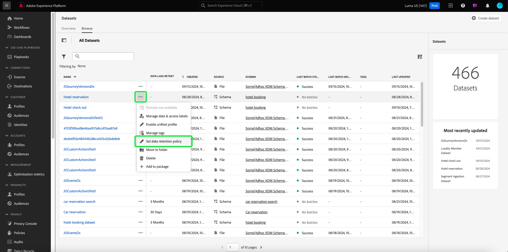

# Handbuch zur Datensatz-Benutzeroberfläche

Dieses Benutzerhandbuch enthält Anweisungen zur Ausführung allgemeiner Aktionen beim Verwenden von Datensätzen in der Benutzeroberfläche von Adobe Experience Platform.

## Erste Schritte

Das Benutzerhandbuch setzt ein grundlegendes Verständnis der folgenden Komponenten von Adobe Experience Platform voraus:

* [Datensätze](overview.md): Das Speicher- und Verwaltungskonstrukt für die Datenpersistenz in [!DNL Experience Platform].
* [[!DNL Experience Data Model (XDM) System]](../../xdm/home.md): Das standardisierte Framework, mit dem Kundenerlebnisdaten von [!DNL Experience Platform] organisiert werden.
   * [Grundlagen der Schemakomposition](../../xdm/schema/composition.md): Machen Sie sich mit den grundlegenden Bausteinen von XDM-Schemata vertraut, einschließlich der wichtigsten Prinzipien und Best Practices bei der Schemakomposition.
   * [Schema-Editor](../../xdm/tutorials/create-schema-ui.md): Erfahren Sie, wie Sie Ihre eigenen benutzerdefinierten XDM-Schemata mithilfe der [!DNL Schema Editor] in der [!DNL Experience Platform]-Benutzeroberfläche erstellen.
* [[!DNL Real-Time Customer Profile]](../../profile/home.md): Bietet ein einheitliches Echtzeit-Kundenprofil, das auf aggregierten Daten aus verschiedenen Quellen basiert.
* [[!DNL Adobe Experience Platform Data Governance]](../../data-governance/home.md): Stellen Sie die Einhaltung von Vorschriften, Einschränkungen und Richtlinien bezüglich der Verwendung von Kundendaten sicher.

## Anzeigen von Datensätzen {#view-datasets}

>[!CONTEXTUALHELP]
>id="platform_datasets_negative_numbers"
>title="Negative Zahlen in der Datensatzaktivität"
>abstract="Negative Zahlen in aufgenommenen Einträgen bedeuten, dass ein Benutzer oder eine Benutzerin bestimmte Batches im ausgewählten Zeitraum gelöscht hat."
>text="Learn more in documentation"

>[!CONTEXTUALHELP]
>id="platform_datasets_browse_daysRemaining"
>title="Ablaufdatum des Datensatzes"
>abstract="Diese Spalte gibt die Anzahl der Tage an, die verbleiben, bis der Zieldatensatz automatisch abläuft."

>[!CONTEXTUALHELP]
>id="platform_datasets_browse_datalakeretention"
>title="Datalake-Aufbewahrung"
>abstract="Zeigt die aktuelle Aufbewahrungsrichtlinie für jeden Datensatz. Dieser Wert kann in den Aufbewahrungseinstellungen jedes Datensatzes geändert werden. Sie können die Aufbewahrungszeit nur für einen ExperienceEvent-Datensatz festlegen."

>[!CONTEXTUALHELP]
>id="platform_datasets_browse_profileretention"
>title="Profilaufbewahrung"
>abstract="Zeigt die aktuelle Aufbewahrungsrichtlinie für jeden Datensatz. Dieser Wert kann in den Aufbewahrungseinstellungen jedes Datensatzes geändert werden. Sie können die Aufbewahrungszeit nur für einen ExperienceEvent-Datensatz festlegen."

>[!CONTEXTUALHELP]
>id="platform_datasets_datalakesettings_datasetretention"
>title="Datensatzaufbewahrung"
>abstract="Mit der Datalake-Aufbewahrung werden Regeln festgelegt, wie lange Daten gespeichert werden und wann sie in verschiedenen Diensten gelöscht werden sollen. Dies gewährleistet die Einhaltung von Vorschriften, die Verwaltung von Speicherkosten und die Aufrechterhaltung der Datenqualität."

>[!CONTEXTUALHELP]
>id="platform_datasets_orchestratedCampaigns_toggle"
>title="Orchestrierte Kampagnen"
>abstract="Aktivieren Sie diesen Umschalter, damit der ausgewählte Datensatz in Adobe Journey Optimizer in orchestrierten Kampagnen verwendet werden kann. Der Datensatz muss ein relationales Schema verwenden und pro Schema kann nur ein Datensatz erstellt werden."

Wählen Sie in der [!DNL Experience Platform]-Benutzeroberfläche **[!UICONTROL Datensätze]** im linken Navigationsbereich aus, um das Dashboard **[!UICONTROL Datensätze]** zu öffnen. Das Dashboard listet alle verfügbaren Datensätze für Ihre Organisation auf. Details werden für jeden aufgelisteten Datensatz angezeigt, einschließlich seines Namens, des Schemas, dem der Datensatz entspricht, und des Status des letzten Aufnahmedurchgangs.

Wählen Sie auf der Registerkarte [!UICONTROL Durchsuchen] den Namen eines Datensatzes aus, um auf seinen **[!UICONTROL Datensatzaktivität]**-Bildschirm zuzugreifen und Details zum ausgewählten Datensatz anzuzeigen. Die Registerkarte „Aktivität“ enthält ein Diagramm, das die Rate der konsumierten Nachrichten sowie eine Liste erfolgreicher und fehlgeschlagener Batches visuell darstellt.

## Mehr Aktionen {#more-actions}

Sie können [!UICONTROL Löschen] oder [!UICONTROL Aktivieren eines Datensatzes für Profil] in der Detailansicht [!UICONTROL Datensatz]. Um die verfügbaren Aktionen anzuzeigen, wählen Sie **[!UICONTROL … Mehr]** oben rechts in der Benutzeroberfläche. Das Dropdown-Menü wird angezeigt.

![Der Arbeitsbereich Datensätze mit den [!UICONTROL … Mehr] Dropdown-Menü hervorgehoben.](../images/datasets/user-guide/more-actions.png)

Wenn Sie die Option **[!UICONTROL Datensatz für Profil aktivieren]** auswählen, wird ein Bestätigungsdialogfeld angezeigt. Wählen Sie **[!UICONTROL Aktivieren]** aus, um Ihre Auswahl zu bestätigen.

>[!NOTE]
>
>Um einen Datensatz für das Profil zu aktivieren, muss das Schema, dem der Datensatz entspricht, für die Verwendung im Echtzeit-Kundenprofil kompatibel sein. Weitere Informationen finden [ im Abschnitt „Aktivieren eines Datensatzes ](#enable-profile) Profil“.

Wenn Sie **[!UICONTROL Löschen]** auswählen, wird das Bestätigungsdialogfeld [!UICONTROL Datensatz löschen] angezeigt. Wählen Sie **[!UICONTROL Löschen]** aus, um Ihre Auswahl zu bestätigen.

>[!NOTE]
>
>Sie können keine Systemdatensätze löschen.

Sie können einen Datensatz auch löschen oder einen Datensatz zur Verwendung mit dem Echtzeit-Kundenprofil aus den Inline-Aktionen auf der Registerkarte [!UICONTROL Durchsuchen] hinzufügen. Weitere Informationen finden Sie [ Abschnitt ](#inline-actions)-Aktionen .

## Inline-Datensatzaktionen {#inline-actions}

Die Benutzeroberfläche „Datensätze“ bietet jetzt eine Sammlung von Inline-Aktionen für jeden verfügbaren Datensatz. Klicken Sie auf die Auslassungszeichen (…) eines Datensatzes, den Sie verwalten möchten, um die verfügbaren Optionen in einem Popup-Menü anzuzeigen. Zu den verfügbaren Aktionen gehören:

* [[!UICONTROL Vorschau des Datensatzes]](#preview)
* [[!UICONTROL Verwalten von Daten und Zugreifen auf Kennzeichnungen]](#manage-and-enforce-data-governance)
* [[!UICONTROL Einheitliches Profil aktivieren]](#enable-profile)
* [[!UICONTROL Tags verwalten]](#manage-tags)
* [[!UICONTROL Festlegen einer Richtlinie zur Datenaufbewahrung]](#data-retention-policy)
* [[!UICONTROL In Ordner verschieben]](#move-to-folders)
* [[!UICONTROL Löschen]](#delete).

Weitere Informationen zu diesen verfügbaren Aktionen finden Sie in den jeweiligen Abschnitten. Informationen zum gleichzeitigen Verwalten einer großen Anzahl von Datensätzen finden Sie im Abschnitt [Massenaktionen](#bulk-actions).

### Vorschau für Datensatz anzeigen {#preview}

Sie können eine Vorschau von bis zu 100 Zeilen mit Beispieldaten für jeden Datensatz anzeigen, entweder über die Inline-Optionen auf der Registerkarte [!UICONTROL Durchsuchen] oder über die Ansicht [!UICONTROL Datensatzaktivität].

Klicken Sie auf [!UICONTROL  Registerkarte ]Durchsuchen“ auf die Auslassungspunkte (…) neben dem Datensatznamen und wählen Sie [!UICONTROL Datensatz in der Vorschau anzeigen]. Wenn der Datensatz leer ist, ist die Vorschauoption deaktiviert. Alternativ können Sie im Bildschirm **[!UICONTROL Datensatzaktivität]** oben rechts auf **[!UICONTROL Datensatz]** Vorschau anzeigen) klicken.

Dadurch wird das Vorschaufenster geöffnet, in dem links die hierarchische Schemaansicht für den Datensatz angezeigt wird.

>[!NOTE]
>
>Das Schemadiagramm auf der linken Seite zeigt nur Felder an, die Daten enthalten. Felder ohne Daten werden automatisch ausgeblendet, um die Benutzeroberfläche zu optimieren und den Fokus auf relevante Informationen zu legen.

Wählen Sie alternativ auf dem Bildschirm **[!UICONTROL Datensatzaktivität]** die Option **[!UICONTROL Vorschau des Datensatzes]** aus, um das Vorschaufenster zu öffnen und ein Beispiel für die Struktur und Werte Ihres Datensatzes zu überprüfen.

Das Fenster „Datensatzvorschau“ bietet eine schnelle Möglichkeit, die Struktur und die Daten Ihres Datensatzes zu untersuchen und zu validieren.

#### Vorschaufenster des Datensatzes {#dataset-preview-window}

Die folgende Animation zeigt das Datensatzvorschaufenster mit seinen Navigations- und Datenexplorationsfunktionen:

Das Vorschaufenster des Datensatzes enthält folgende Elemente:

* Eine Seitenleiste im Objektbrowser auf der linken Seite zum Navigieren und Filtern von Datensatzfeldern.
* Datentypindikatoren neben jedem Spaltennamen für insight in der Datensatzstruktur.
* Oben im Fenster wird eine SQL-Abfrage angezeigt, die die Abfrage anzeigt, die zum Generieren des Datensatzes verwendet wird.
* Eine formatierte Tabellenansicht mit bis zu 100 Zeilen für eine effiziente Datenüberprüfung.

Diese Funktionen helfen Ihnen beim Navigieren, Verstehen von Schemadetails und effizienten Validieren von Beispieldaten.

#### Verknüpfung mit dem erweiterten Abfrage-Editor {#query-editor-shortcut}

Wenn Ihr Unternehmen über eine Data Distiller-Lizenz verfügt, können Sie direkt über [!UICONTROL  Datensatzvorschau auf ] erweiterten Abfrage-Editor zugreifen. Verwenden Sie diesen Tastaturbefehl, um im Abfrage-Service nahtlos von der Vorschau von Beispieldaten zur Ausführung und Verfeinerung von Abfragen zu wechseln.

>[!AVAILABILITY]
>
>Der Zugriff auf [!UICONTROL erweiterten Abfrage-Editor] ist auf Organisationen mit einer Data Distiller SKU-Lizenz beschränkt. Wenn Ihr Unternehmen nicht über die erforderliche Lizenz verfügt, wird diese Option nicht im Fenster Datensatzvorschau angezeigt.

Wählen Sie [!UICONTROL Erweiterter Abfrage]Editor oben rechts im Vorschaufenster aus, um Query Service mit der aktuellen SQL-Abfrage zu öffnen, die vorgeladen und ausgeführt wurde. Sie können mit der Analyse oder Änderung der SQL fortfahren, ohne die Abfrage erneut eingeben zu müssen.

Verwenden Sie für zusätzliche Analysen nachgelagerte Services wie [!DNL Query Service] und [!DNL JupyterLab]. Weiterführende Informationen finden Sie in folgenden Dokumenten:

* [Query Service – Übersicht](../../query-service/home.md)
* [JupyterLab-Benutzerhandbuch](../../data-science-workspace/jupyterlab/overview.md)

### Data Governance in einem Datensatz verwalten und durchsetzen {#manage-and-enforce-data-governance}

Sie können die Data Governance-Beschriftungen für einen Datensatz verwalten, indem Sie die Inline-Optionen der Registerkarte [!UICONTROL Durchsuchen] auswählen. Wählen Sie aus dem Dropdown-Menü die Auslassungszeichen (…) neben dem Datensatznamen aus, den Sie verwalten möchten **[!UICONTROL gefolgt von]** Daten verwalten und Zugriffsbeschriftungen“.

Mit Datennutzungskennzeichnungen, die auf Schemaebene angewendet werden, können Sie Datensätze und Felder entsprechend den für diese Daten geltenden Nutzungsrichtlinien kategorisieren. Weitere Informationen zu Kennzeichnungen finden Sie [Übersicht zu Data ](../../data-governance/home.md)) oder im [Benutzerhandbuch zu Datennutzungskennzeichnungen](../../data-governance/labels/overview.md) mit Anweisungen zum Anwenden von Kennzeichnungen auf Schemata zur Übertragung auf Datensätze.

## Aktivieren eines Datensatzes für das Echtzeit-Kundenprofil {#enable-profile}

Jeder Datensatz bietet die Möglichkeit, Kundenprofile mit den erfassten Daten anzureichern. Dazu muss das Schema, dem der Datensatz entspricht, für die Verwendung in [!DNL Real-Time Customer Profile] kompatibel sein. Ein kompatibles Schema erfüllt folgende Anforderungen:

* Das Schema weist mindestens ein Attribut auf, das als Identitätseigenschaft definiert wurde.
* Das Schema verfügt über eine Identitätseigenschaft, die als primäre Identität definiert wurde.

Weitere Informationen zum Aktivieren eines Schemas für [!DNL Profile] finden Sie im [Benutzerhandbuch zum Schema-Editor](../../xdm/tutorials/create-schema-ui.md).

Sie können einen Datensatz für das Profil sowohl in den Inline-Optionen der Registerkarte [!UICONTROL Durchsuchen] als auch in der Ansicht [!UICONTROL Datensatzaktivität] aktivieren. Wählen Sie auf der [!UICONTROL Durchsuchen] des Arbeitsbereichs [!UICONTROL Datensätze] die Auslassungszeichen eines Datensatzes aus, den Sie für das Profil aktivieren möchten. Eine Menüliste mit Optionen wird angezeigt. Wählen Sie anschließend **[!UICONTROL Einheitliches Profil aktivieren]** aus der Liste der verfügbaren Optionen aus.

Alternativ können Sie auf dem Bildschirm **[!UICONTROL Datensatzaktivität]** den Umschalter **[!UICONTROL Profil]** innerhalb der Spalte **[!UICONTROL Eigenschaften]** auswählen. Nach der Aktivierung werden Daten, die in den Datensatz aufgenommen werden, auch zum Ausfüllen von Kundenprofilen verwendet.

>[!NOTE]
>
>Wenn ein Datensatz bereits Daten enthält und dann für die [!DNL Profile] aktiviert ist, werden die vorhandenen Daten nicht automatisch von [!DNL Profile] genutzt. Nachdem ein Datensatz für die [!DNL Profile] aktiviert wurde, wird empfohlen, vorhandene Daten erneut aufzunehmen, damit sie zu Kundenprofilen beitragen können.

Datensätze, die für Profil aktiviert wurden, können auch nach diesen Kriterien gefiltert werden. Weitere Informationen finden Sie im Abschnitt [ Filtern ](#filter-profile-enabled-datasets) Datensätze mit aktiviertem Profil .

### Datensatz-Tags verwalten {#manage-tags}

Fügen Sie benutzerdefinierte erstellte Tags hinzu, um Datensätze zu organisieren und die Such-, Filter- und Sortierfunktionen zu verbessern. Wählen [!UICONTROL  der Registerkarte ] des Arbeitsbereichs [!UICONTROL Datensätze] die Auslassungspunkte eines Datensatzes aus, den Sie verwalten möchten, gefolgt von **[!UICONTROL Tags verwalten]** aus dem Dropdown-Menü.

Das [!UICONTROL Tags verwalten] wird angezeigt. Geben Sie eine kurze Beschreibung ein, um ein benutzerdefiniertes Tag zu erstellen, oder wählen Sie ein bereits vorhandenes Tag aus, um Ihren Datensatz zu kennzeichnen. Klicken Sie auf **[!UICONTROL Speichern]**, um Ihre Einstellungen zu bestätigen.

Das [!UICONTROL Tags verwalten] kann auch vorhandene Tags aus einem Datensatz entfernen. Wählen Sie einfach das „x“ neben dem Tag aus, das Sie entfernen möchten, und wählen Sie &quot;**[!UICONTROL &quot;]**.

Nachdem ein Tag zu einem Datensatz hinzugefügt wurde, können die Datensätze anhand des entsprechenden Tags gefiltert werden. Weitere Informationen finden Sie im Abschnitt [ Filtern von Datensätzen nach ](#enable-profile) .

Weitere Informationen zum Klassifizieren von Geschäftsobjekten für eine einfachere Erkennung und Kategorisierung finden Sie im Handbuch [Verwalten von Metadatentaxonomien](../../administrative-tags/ui/managing-tags.md). In diesem Handbuch wird erläutert, wie Benutzende mit den entsprechenden Berechtigungen vordefinierte Tags erstellen, Kategorien zuweisen und alle zugehörigen CRUD-Vorgänge in der Benutzeroberfläche von Experience Platform verwalten können.

### Richtlinie zur Datenspeicherung festlegen {#data-retention-policy}

Verwalten Sie die Einstellungen für die Datensatzgültigkeit und -beibehaltung mithilfe des Inline-Aktionsmenüs auf der Registerkarte [!UICONTROL Durchsuchen] des Arbeitsbereichs [!UICONTROL Datensätze]. Mit dieser Funktion können Sie konfigurieren, wie lange Daten im Data Lake und Profilspeicher aufbewahrt werden. Das Ablaufdatum basiert auf dem Zeitpunkt der Datenaufnahme in Experience Platform und Ihrer konfigurierten Aufbewahrungsfrist.

>[!IMPORTANT]
>
>Um Aufbewahrungsregeln für einen ExperienceEvent-Datensatz anzuwenden oder zu aktualisieren, muss Ihre Benutzerrolle die Berechtigung **[!UICONTROL Datensätze verwalten]** enthalten. Diese rollenbasierte Zugriffssteuerung stellt sicher, dass nur autorisierte Benutzer die Einstellungen für die Datensatzaufbewahrung ändern können.
>
>Weitere Informationen [ Zuweisen von Berechtigungen in Adobe Experience Platform finden ](../../access-control/home.md#platform-permissions) unter „Zugriffssteuerung - Übersicht“.

>[!TIP]
>
>Der Data Lake speichert unbearbeitete Rohdaten wie Ereignisprotokolle, Clickstream-Daten und massenweise aufgenommene Datensätze für die Analyse und Verarbeitung. Der Profilspeicher enthält kundenidentifizierbare Daten, einschließlich identitätszugehöriger Ereignisse und Attributinformationen, um die Echtzeit-Personalisierung und -Aktivierung zu unterstützen.

Um Ihre Aufbewahrungsfrist zu konfigurieren, wählen Sie aus dem Dropdown-Menü die Auslassungspunkte neben dem Datensatz **[!UICONTROL Datenaufbewahrungsrichtlinie festlegen]** aus.

Das [!UICONTROL Dialogfeld „Datensatzaufbewahrung festlegen] wird angezeigt. Das Dialogfeld zeigt Lizenznutzungsmetriken auf Sandbox-Ebene, Details auf Datensatzebene und aktuelle Einstellungen zur Datenaufbewahrung an. Diese Metriken zeigen Ihre Nutzung im Vergleich zu Ihren Berechtigungen und helfen Ihnen bei der Bewertung datensatzspezifischer Speicher- und Aufbewahrungskonfigurationen. Zu den Metriken gehören Datensatzname, Typ, Profilaktivierungsstatus sowie die Nutzung von Data Lake und Profilspeicher.

>[!NOTE]
>
>Lizenzierte Data-Lake-Speicher-Metriken auf Sandbox-Ebene sind noch in Entwicklung und werden möglicherweise nicht angezeigt. Eine vollständige Aufschlüsselung der Metriken zur Lizenznutzung finden Sie im Dashboard Lizenznutzung . In der Dokumentation finden Sie Beschreibungen zu diesen Metriken.
<!-- replace this screenshot with a dataset that enabled unified profile so user can see the Profile TTL settings -->

Konfigurieren Sie Ihre bevorzugte Aufbewahrungsfrist im Dialogfeld Datenaufbewahrungseinstellungen . Geben Sie eine Zahl ein und wählen Sie eine Zeiteinheit (Tage, Monate oder Jahre) aus dem Dropdown-Menü aus. Sie können separate Aufbewahrungseinstellungen für den Data Lake und den Profil-Service konfigurieren.

>[!NOTE]
> 
>Die Mindestaufbewahrungsdauer für den Data Lake beträgt 30 Tage. Die Mindestaufbewahrungsdauer für den Profil-Service beträgt einen Tag.
>
>Darüber hinaus können Sie den Aufbewahrungszeitraum für den Profil-Service nur einmal alle 30 Tage aktualisieren.

Um die Transparenz und Überwachung zu unterstützen, werden Zeitstempel für die Ausführungen des **letzten** und **nächsten** Datenaufbewahrungsauftrags bereitgestellt. Die Zeitstempel helfen zu verstehen, wann die letzte Datenbereinigung stattgefunden hat und wann die nächste geplant ist.

#### Speicherwirkungseinblicke {#storage-impact-insights}

Um eine visuelle Prognose der Speicherauswirkungen verschiedener Aufbewahrungsrichtlinien zu öffnen, wählen Sie **[!UICONTROL Verteilung von Erlebnisereignisdaten anzeigen]**.

Das Diagramm zeigt die Verteilung von Erlebnisereignissen über verschiedene Aufbewahrungszeiträume für den aktuell ausgewählten Datensatz an. Bewegen Sie den Mauszeiger über die einzelnen Balken, um die genaue Anzahl der Datensätze anzuzeigen, die entfernt werden, wenn die ausgewählte Aufbewahrungsfrist angewendet wird.

Sie können die visuelle Prognose verwenden, um die Auswirkungen verschiedener Aufbewahrungsfristen zu bewerten und fundierte Geschäftsentscheidungen zu treffen. Wenn Sie beispielsweise eine Aufbewahrungsfrist von 30 Tagen auswählen und das Diagramm zeigt, dass 60 % Ihrer Daten gelöscht werden, können Sie die Aufbewahrungsfrist verlängern, um weitere Daten für die Analyse beizubehalten.

>[!NOTE]
>
>Das Verteilungsdiagramm für Erlebnisereignisse ist spezifisch für den ausgewählten Datensatz und spiegelt nur dessen Daten wider. Sie gilt ausschließlich für Daten, die im Data Lake gespeichert sind.

Wenn Sie mit der Konfiguration zufrieden sind, klicken Sie auf **[!UICONTROL Speichern]**, um Ihre Einstellungen zu bestätigen.

>[!IMPORTANT]
>
>Sobald die Datenspeicherungsregeln angewendet werden, werden alle Daten, die älter als die durch den Gültigkeitswert definierte Anzahl von Tagen sind, dauerhaft gelöscht und können nicht wiederhergestellt werden.

Nachdem Sie Ihre Aufbewahrungseinstellungen konfiguriert haben, verwenden Sie die Monitoring-Benutzeroberfläche, um zu bestätigen, dass Ihre Änderungen vom System ausgeführt wurden. Die Monitoring-Benutzeroberfläche bietet eine zentralisierte Ansicht der Datenaufbewahrungsaktivität für alle Datensätze. Dort können Sie die Ausführung von Aufträgen verfolgen, überprüfen, wie viele Daten gelöscht wurden, und sicherstellen, dass Ihre Aufbewahrungsrichtlinien erwartungsgemäß funktionieren.

Informationen dazu, wie Aufbewahrungsrichtlinien auf verschiedene Services angewendet werden, finden Sie in den entsprechenden Handbüchern [Aufbewahrung von Erlebnisereignis-Datensätzen im ](../../profile/event-expirations.md) und [Aufbewahrung von Erlebnisereignis-Datensätzen im Data Lake](./experience-event-dataset-retention-ttl-guide.md). Diese Sichtbarkeit unterstützt Governance, Compliance und effizientes Data Lifecycle Management.

Informationen dazu, wie Sie mit dem Überwachungs-Dashboard Quelldatenflüsse in der Experience Platform-Benutzeroberfläche verfolgen können, finden Sie in der Dokumentation [Überwachen von Datenflüssen für Quellen in der Benutzeroberfläche](../../dataflows/ui/monitor-sources.md) .

<!-- Improve the link above. I cannot link to a 100% appropriate document yet. -->

Weitere Informationen zu den Regeln, die Datumsbereiche für Datensatzgültigkeiten definieren, und Best Practices für die Konfiguration Ihrer Datenspeicherungsrichtlinie finden Sie auf der Seite [Häufig gestellte Fragen](../catalog-faq.md).

#### Verbesserte Sichtbarkeit von Aufbewahrungsfristen und Speichermetriken {#retention-and-storage-metrics}

Vier neue Spalten bieten eine bessere Sichtbarkeit Ihres Daten-Managements: **[!UICONTROL Data Lake Storage]**, **[!UICONTROL Data Lake Retention]**, **[!UICONTROL Profile Storage]** und **[!UICONTROL Profile Retention]**. Diese Metriken zeigen, wie viel Speicher Ihre Daten verbrauchen und wie lange sie aufbewahrt werden, sowohl im Data Lake als auch im Profil-Service.

Diese erhöhte Transparenz ermöglicht fundierte Entscheidungen und ein effektiveres Management der Speicherkosten. Sortieren Sie Datensätze nach Speichergröße, um die größten Datensätze in Ihrer aktuellen Sandbox zu identifizieren. Diese Einblicke unterstützen Best Practices für das Daten-Management und helfen bei der Sicherstellung der Einhaltung Ihrer lizenzierten Berechtigungen.

Die folgende Tabelle bietet einen Überblick über die neuen Metriken zur Datenspeicherung und Datenspeicherung. Darin wird der Zweck jeder Spalte und die Unterstützung für die Verwaltung der Datenaufbewahrung und -speicherung beschrieben.

| Spaltentitel | Beschreibung |
|---|---|
| [!UICONTROL Data Lake-Aufbewahrung] | Der aktuelle Aufbewahrungszeitraum für jeden Datensatz im Data Lake. Dieser Wert kann konfiguriert werden und bestimmt, wie lange Daten vor dem Löschen aufbewahrt werden. |
| [!UICONTROL Data Lake Storage] | Die aktuelle Speicherverwendung für jeden Datensatz im Data Lake. Mit dieser Metrik können Sie Speicherbeschränkungen verwalten und die Nutzung optimieren. |
| [!UICONTROL Profilspeicher] | Die aktuelle Speicherverwendung für jeden Datensatz im Profil-Service. Hilft bei der Überwachung der Speichernutzung und der Unterstützung von Datenverwaltungsentscheidungen. |
| [!UICONTROL Profilaufbewahrung] | Die aktuelle Aufbewahrungsfrist für Profildatensätze. Sie können diesen Wert aktualisieren, um zu steuern, wie lange Profildaten aufbewahrt werden. |

{style="table-layout:auto"}

Informationen zu Einblicken aus Speicher- und Aufbewahrungsmetriken finden Sie im [Handbuch zu Best Practices für Data Management-Lizenzberechtigungen](../../landing/license-usage-and-guardrails/data-management-best-practices.md). Verwenden Sie sie, um zu verwalten, welche Daten Sie aufnehmen und speichern, Filter und Ablaufregeln anzuwenden und das Datenwachstum zu kontrollieren, um innerhalb Ihrer lizenzierten Nutzungsbeschränkungen zu bleiben.

### In Ordner verschieben {#move-to-folders}

Sie können Datensätze in Ordnern platzieren, um die Datensatzverwaltung zu verbessern. Um einen Datensatz in einen Ordner zu verschieben, wählen Sie aus dem Dropdown-Menü die Auslassungspunkte (…) neben dem Datensatznamen, den Sie verwalten möchten, und dann **[!UICONTROL In Ordner]**.

![Das Dashboard [!UICONTROL Datensätze] mit den Auslassungszeichen und [!UICONTROL In Ordner verschieben] hervorgehoben.](../images/datasets/user-guide/move-to-folder.png)

Das [!UICONTROL Verschieben] des Datensatzes in den Ordner wird angezeigt. Wählen Sie den Ordner aus, in den Sie die Zielgruppe verschieben möchten, und wählen Sie dann **[!UICONTROL Verschieben]**. Eine Popup-Benachrichtigung informiert Sie darüber, dass die Verschiebung des Datensatzes erfolgreich war.

![Das Datensatzdialogfeld [!UICONTROL Verschieben] mit hervorgehobener [!UICONTROL Verschieben]-Option.](../images/datasets/user-guide/move-dialog.png)

>[!TIP]
>
>Sie können Ordner auch direkt über das Dialogfeld Datensatz verschieben erstellen. Um einen Ordner zu erstellen, klicken Sie auf das Symbol Ordner erstellen ) oben rechts im Dialogfeld.
>
>![Das Dialogfeld [!UICONTROL Verschieben] mit hervorgehobenem Symbol „Ordner erstellen“.](/help/catalog/images/datasets/user-guide/create-folder.png)

Sobald sich der Datensatz in einem Ordner befindet, können Sie festlegen, dass nur Datensätze angezeigt werden sollen, die zu einem bestimmten Ordner gehören. Um Ihre Ordnerstruktur zu öffnen, klicken Sie auf das Symbol Ordner anzeigen . Wählen Sie als Nächstes den ausgewählten Ordner aus, um alle zugehörigen Datensätze anzuzeigen.

![Die [!UICONTROL Datensätze] Dashboards mit der Ordnerstruktur der Datensätze, dem Symbol „Ordner anzeigen“ und einem hervorgehobenen ausgewählten Ordner.](../images/datasets/user-guide/folder-structure.png)

### Datensatz löschen {#delete}

Sie können einen Datensatz entweder aus den Datensatz-Inline-Aktionen auf der Registerkarte [!UICONTROL Durchsuchen] oder oben rechts in der Ansicht [!UICONTROL Datensatzaktivität] löschen. Wählen [!UICONTROL  in der Ansicht ]Durchsuchen“ die Auslassungspunkte (…) neben dem Datensatznamen aus, den Sie löschen möchten. Eine Menüliste mit Optionen wird angezeigt. Wählen Sie anschließend **[!UICONTROL Dropdown]** Menü „Löschen“ aus.

Ein Bestätigungsdialogfeld wird angezeigt. Klicken Sie zur Bestätigung auf **[!UICONTROL Löschen]**.

Wählen Sie alternativ **[!UICONTROL Datensatz löschen]** auf dem Bildschirm **[!UICONTROL Datensatzaktivität]** aus.

>[!NOTE]
>
>Datensätze, die von Adobe-Programmen und -Services (wie Adobe Analytics, Adobe Audience Manager oder [!DNL Offer Decisioning]) erstellt und verwendet werden, können nicht gelöscht werden.

Ein Bestätigungsdialog wird angezeigt. Wählen Sie **[!UICONTROL Löschen]** aus, um das Löschen des Datensatzes zu bestätigen.

### Profil-aktivierten Datensatz löschen

Wenn ein Datensatz für Profil aktiviert ist, wird er beim Löschen dieses Datensatzes über die Benutzeroberfläche aus dem Data Lake, Identity Service sowie allen Profildaten, die mit diesem Datensatz im Profilspeicher verknüpft sind, gelöscht.

Sie können mit einem Datensatz verknüpfte Profildaten aus dem [!DNL Profile] löschen (d. h. die Daten im Data Lake belassen), indem Sie die Echtzeit-Kundenprofil-API verwenden. Weitere Informationen finden Sie im [Handbuch zum Vorgangs-API-Endpunkt von Profile System](../../profile/api/profile-system-jobs.md).

## Datensätze suchen und filtern {#search-and-filter}

Um die Liste der verfügbaren Datensätze zu durchsuchen oder zu filtern, klicken Sie auf das Filtersymbol () oben links im Arbeitsbereich. In der linken Leiste wird ein Satz von Filteroptionen angezeigt. Es gibt mehrere Methoden, um Ihre verfügbaren Datensätze zu filtern. Dazu gehören: [[!UICONTROL Systemdatensätze anzeigen]](#show-system-datasets), [[!UICONTROL Im Profil enthalten]](#filter-profile-enabled-datasets), [[!UICONTROL Tags]](#filter-by-tag), [[!UICONTROL Erstellungsdatum]](#filter-by-creation-date), [[!UICONTROL Änderungsdatum], [!UICONTROL Erstellt von]](#filter-by-creation-date) und [[!UICONTROL Schema]](#filter-by-schema).

Die Liste der angewendeten Filter wird über den gefilterten Ergebnissen angezeigt.

### Systemdatensätze anzeigen {#show-system-datasets}

Standardmäßig werden nur Datensätze angezeigt, in die Sie Daten aufgenommen haben. Wenn Sie die systemgenerierten Datensätze anzeigen möchten, aktivieren Sie das Kontrollkästchen **[!UICONTROL Ja]** im Abschnitt [!UICONTROL Systemdatensätze anzeigen]. Systemgenerierte Datensätze werden nur zur Verarbeitung anderer Komponenten verwendet. Beispielsweise wird der systemgenerierte Profilexportdatensatz zur Verarbeitung des Profil-Dashboards verwendet.

![Die Filteroptionen des Arbeitsbereichs Datensätze mit hervorgehobenem [!UICONTROL  „Systemdatensätze ].](../images/datasets/user-guide/show-system-datasets.png)

### Filtern von profilaktivierten Datensätzen {#filter-profile-enabled-datasets}

Die Datensätze, die für Profildaten aktiviert wurden, werden nach der Aufnahme von Daten zum Ausfüllen von Kundenprofilen verwendet. Weitere Informationen finden Sie im Abschnitt [Aktivieren von Datensätzen ](#enable-profile) Profil“.

Um Ihren Datensatz danach zu filtern, ob er für Profil aktiviert wurde, aktivieren [!UICONTROL  in den Filteroptionen das ] „Ja“.

![Die Filteroptionen des Arbeitsbereichs „Datensätze“ mit hervorgehobenem [!UICONTROL  „Im Profil ]&quot;.](../images/datasets/user-guide/included-in-profile.png)

### Datensätze nach Tag filtern {#filter-by-tag}

Geben Sie Ihren benutzerdefinierten Tag-Namen in die Eingabe [!UICONTROL Tags] ein und wählen Sie dann Ihr Tag aus der Liste der verfügbaren Optionen aus, um Datensätze zu suchen und zu filtern, die diesem Tag entsprechen.

![Die Filteroptionen des Arbeitsbereichs „Datensätze“ mit hervorgehobenem [!UICONTROL  &quot;]&quot; und Filtersymbol.](../images/datasets/user-guide/filter-tags.png)

### Datensätze nach Erstellungsdatum filtern {#filter-by-creation-date}

Datensätze können nach Erstellungsdatum über einen benutzerdefinierten Zeitraum gefiltert werden. Dies kann verwendet werden, um historische Daten auszuschließen oder um spezifische chronologische Dateneinblicke und Berichte zu generieren. Wählen Sie ein [!UICONTROL Startdatum] und ein [!UICONTROL Enddatum] aus, indem Sie für jedes Feld das Kalendersymbol auswählen. Danach werden nur noch Datensätze, die diesen Kriterien entsprechen, auf der Registerkarte Durchsuchen angezeigt.

### Datensätze nach Änderungsdatum filtern {#filter-by-modified-date}

Ähnlich wie beim Filter für das Erstellungsdatum können Sie Ihre Datensätze nach dem Datum filtern, an dem sie zuletzt geändert wurden. Wählen Sie im [!UICONTROL Änderungsdatum] ein [!UICONTROL Startdatum] und ein [!UICONTROL Enddatum], indem Sie für jedes Feld das Kalendersymbol auswählen. Danach werden nur Datensätze, die während dieses Zeitraums geändert wurden, auf der Registerkarte Durchsuchen angezeigt.

### Nach Schema filtern {#filter-by-schema}

Sie können Datensätze anhand des Schemas filtern, das ihre Struktur definiert. Wählen Sie entweder das Dropdown-Symbol aus oder geben Sie den Schemanamen in das Textfeld ein. Eine Liste möglicher Übereinstimmungen wird angezeigt. Wählen Sie das entsprechende Schema aus der Liste aus.

## Massenaktionen {#bulk-actions}

Verwenden Sie Massenaktionen, um die betriebliche Effizienz zu verbessern, und führen Sie mehrere Aktionen für zahlreiche Datensätze gleichzeitig durch. Sie können Zeit sparen und eine organisierte Datenstruktur mit Massenaktionen wie [In Ordner verschieben](#move-to-folders), [Tags bearbeiten](#manage-tags) und [Löschen](#delete) beibehalten.

Um mehrere Datensätze gleichzeitig zu bearbeiten, wählen Sie einzelne Datensätze mit dem Kontrollkästchen in jeder Zeile oder eine ganze Seite mit dem Kontrollkästchen Spaltenüberschrift aus. Nach der Auswahl wird die Massenaktionsleiste angezeigt.

Wenn Sie Massenaktionen auf Datensätze anwenden, gelten die folgenden Bedingungen:

* Sie können Datensätze aus verschiedenen Seiten der Benutzeroberfläche auswählen.
* Bei Auswahl eines Filters werden die ausgewählten Datensätze zurückgesetzt.

## Sortieren von Datensätzen nach Erstellungsdatum {#sort}

Datensätze auf der Registerkarte [!UICONTROL Durchsuchen] können nach aufsteigenden oder absteigenden Datumsangaben sortiert werden. Wählen Sie die Spaltenüberschriften [!UICONTROL Erstellt] oder [!UICONTROL Zuletzt aktualisiert] aus, um zwischen aufsteigender und absteigender Reihenfolge zu wechseln. Nach der Auswahl zeigt die Spalte dies entweder mit einem Aufwärts- oder Abwärtspfeil seitlich neben der Spaltenüberschrift an.

## Erstellen eines Datensatzes {#create}

Um einen neuen Datensatz zu erstellen, wählen Sie zunächst **[!UICONTROL Datensatz erstellen]** im Dashboard **[!UICONTROL Datensätze]** aus.

Im folgenden Bildschirm werden Ihnen die folgenden zwei Optionen zum Erstellen eines neuen Datensatzes angezeigt:

* [Datensatz aus Schema erstellen](#schema)
* [Datensatz aus CSV-Datei erstellen](#csv)

### Datensatz mit vorhandenem Schema erstellen {#schema}

Wählen Sie im **[!UICONTROL Datensatz erstellen]** die Option **[!UICONTROL Datensatz aus Schema erstellen]** aus, um einen neuen leeren Datensatz zu erstellen.

Der Schritt **[!UICONTROL Schema auswählen]** wird angezeigt. Durchsuchen Sie die Schemaauflistung und wählen Sie das Schema aus, dem der Datensatz entsprechen soll, bevor Sie auf **[!UICONTROL Weiter]** klicken.

Der Schritt **[!UICONTROL Datensatz konfigurieren]** wird angezeigt. Geben Sie dem Datensatz einen Namen und eine optionale Beschreibung und wählen Sie dann **[!UICONTROL Beenden]** aus, um den Datensatz zu erstellen.

Datensätze können aus der Liste der verfügbaren Datensätze in der Benutzeroberfläche mit dem Schemafilter gefiltert werden. Weitere Informationen finden Sie im Abschnitt [ Filtern von Datensätzen nach ](#filter-by-schema) .

### Datensatz mit einer CSV-Datei erstellen {#csv}

Wenn Sie einen Datensatz mit einer CSV-Datei erstellen, wird ein Ad-hoc-Schema erstellt, um dem Datensatz eine Struktur zu geben, die mit der bereitgestellten CSV-Datei übereinstimmt. Wählen Sie im **[!UICONTROL Datensatz erstellen]** die Option **[!UICONTROL Datensatz aus CSV-Datei erstellen]**.

Der Schritt **[!UICONTROL Konfigurieren]** wird angezeigt. Geben Sie dem Datensatz einen Namen und eine optionale Beschreibung ein und wählen Sie dann **[!UICONTROL Weiter]**.

Der Schritt **[!UICONTROL Daten hinzufügen]** wird angezeigt. Laden Sie die CSV-Datei hoch, indem Sie sie entweder per Drag-and-Drop in die Mitte Ihres Bildschirms ziehen oder **[!UICONTROL Durchsuchen]** auswählen, um Ihr Dateiverzeichnis zu durchsuchen. Die Datei darf maximal 10 Gigabyte groß sein. Nachdem die CSV-Datei hochgeladen wurde, wählen Sie **[!UICONTROL Speichern]** aus, um den Datensatz zu erstellen.

>[!NOTE]
>
>CSV-Spaltennamen müssen mit alphanumerischen Zeichen beginnen und dürfen nur Buchstaben, Zahlen und Unterstriche enthalten.

## Überwachen der Datenaufnahme

Wählen Sie in der [!DNL Experience Platform]-Benutzeroberfläche **[!UICONTROL Überwachung]** im linken Navigationsbereich aus. Mit dem **[!UICONTROL Monitoring]**-Dashboard können Sie die Status von aus der Batch- oder Streaming-Erfassung eingehenden Daten anzeigen. Um die Status einzelner Batches anzuzeigen, wählen Sie entweder **[!UICONTROL Batch End-to-End]** oder **[!UICONTROL Streaming End-to-End]**. In den Dashboards werden alle Batch- oder Streaming-Erfassungsdurchgänge aufgelistet, einschließlich der erfolgreichen, fehlgeschlagenen oder noch laufenden. Jede Auflistung enthält Details zum Batch, einschließlich der Batch-Kennung, dem Namen des Zieldatensatzes und der Zahl der erfassten Einträge. Wenn der Zieldatensatz für die [!DNL Profile] aktiviert ist, wird auch die Anzahl der aufgenommenen Identitäts- und Profildatensätze angezeigt.

Sie können eine einzelne (**[!UICONTROL -ID)]**, um auf das Dashboard **[!UICONTROL Batch-Übersicht]** zuzugreifen und Details für den Batch anzuzeigen, einschließlich Fehlerprotokollen, falls der Batch nicht aufgenommen werden kann.

Wenn Sie den Stapel löschen möchten, wählen Sie **[!UICONTROL Stapel löschen]** oben rechts im Dashboard aus. Beim Löschen eines Batches werden auch seine Datensätze aus dem Datensatz entfernt, in den der Batch ursprünglich aufgenommen wurde.

>[!NOTE]
>
>Wenn die aufgenommenen Daten für Profil aktiviert und verarbeitet wurden, werden beim Löschen eines Batches diese Daten nicht aus dem Profilspeicher gelöscht.

## Nächste Schritte

Dieses Benutzerhandbuch enthält Anweisungen zum Ausführen häufiger Aktionen beim Arbeiten mit Datensätzen in der [!DNL Experience Platform]-Benutzeroberfläche. Anweisungen zum Ausführen allgemeiner [!DNL Experience Platform]-Workflows mit Datensätzen finden Sie in den folgenden Tutorials:

* [Erstellen eines Datensatzes mithilfe von APIs](create.md)
* [Abfragen von Datensatzdaten mithilfe der Datenzugriffs-API](../../data-access/home.md)
* [Konfigurieren eines Datensatzes für das Echtzeit-Kundenprofil und Identity Service mithilfe von APIs](../../profile/tutorials/dataset-configuration.md)

