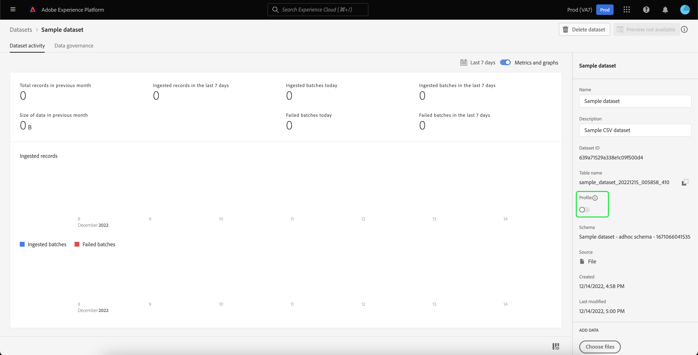
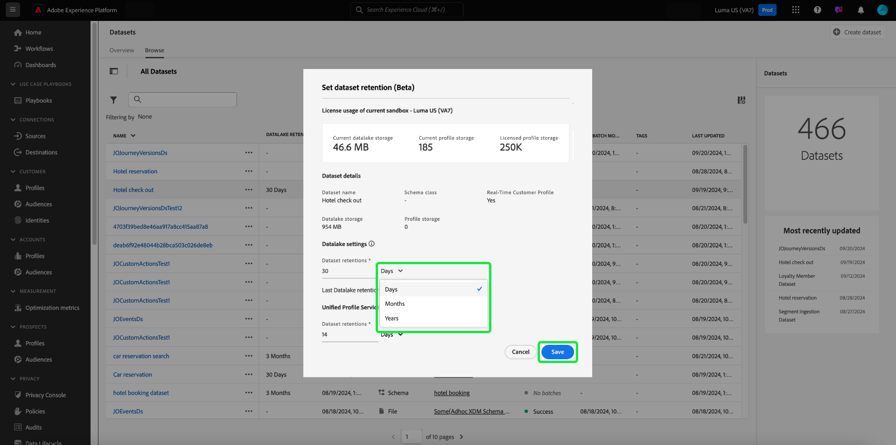

# Handbuch zur Benutzeroberfläche von Datensätzen

Dieses Benutzerhandbuch enthält Anweisungen zur Ausführung allgemeiner Aktionen beim Verwenden von Datensätzen in der Benutzeroberfläche von Adobe Experience Platform.

## Erste Schritte

Das Benutzerhandbuch setzt ein grundlegendes Verständnis der folgenden Komponenten von Adobe Experience Platform voraus:

* [Datensätze](overview.md): Das Speicher- und Verwaltungskonstrukt für Datenpersistenz in [!DNL Experience Platform].
* [[!DNL Experience Data Model (XDM) System]](../../xdm/home.md): Das standardisierte Framework, mit dem Kundenerlebnisdaten von [!DNL Experience Platform] organisiert werden.
   * [Grundlagen der Schemakomposition](../../xdm/schema/composition.md): Machen Sie sich mit den grundlegenden Bausteinen von XDM-Schemata vertraut, einschließlich der wichtigsten Prinzipien und Best Practices bei der Schemakomposition.
   * [Schema-Editor](../../xdm/tutorials/create-schema-ui.md): Erfahren Sie, wie Sie Ihre eigenen benutzerdefinierten XDM-Schemas mithilfe von [!DNL Schema Editor] in der Benutzeroberfläche von [!DNL Platform] erstellen.
* [[!DNL Real-Time Customer Profile]](../../profile/home.md): Bietet ein einheitliches Echtzeit-Kundenprofil, das auf aggregierten Daten aus verschiedenen Quellen basiert.
* [[!DNL Adobe Experience Platform Data Governance]](../../data-governance/home.md): Stellen Sie sicher, dass die Vorschriften, Einschränkungen und Richtlinien zur Verwendung von Kundendaten eingehalten werden.

## Anzeigen von Datensätzen {#view-datasets}

>[!CONTEXTUALHELP]
>id="platform_datasets_negative_numbers"
>title="Negative Zahlen in der Datensatzaktivität"
>abstract="Negative Zahlen in aufgenommenen Datensätzen bedeuten, dass ein Benutzer oder eine Benutzerin bestimmte Batches im ausgewählten Zeitraum gelöscht hat."
>text="Learn more in documentation"

>[!CONTEXTUALHELP]
>id="platform_datasets_browse_daysRemaining"
>title="Ablaufdatum des Datensatzes"
>abstract="Diese Spalte gibt die Anzahl der Tage an, die verbleiben, bis der Zieldatensatz automatisch abläuft."

>[!CONTEXTUALHELP]
>id="platform_datasets_browse_datalakeretention"
>title="Datalake-Aufbewahrung"
>abstract="Zeigt die aktuelle Aufbewahrungsrichtlinie für jeden Datensatz. Dieser Wert kann in den Aufbewahrungseinstellungen jedes Datensatzes geändert werden. Sie können die Aufbewahrungszeit nur für einen ExperienceEvent-Datensatz festlegen."

>[!CONTEXTUALHELP]
>id="platform_datasets_browse_profileretention"
>title="Profilaufbewahrung"
>abstract="Zeigt die aktuelle Aufbewahrungsrichtlinie für jeden Datensatz. Dieser Wert kann in den Aufbewahrungseinstellungen jedes Datensatzes geändert werden. Sie können die Aufbewahrungszeit nur für einen ExperienceEvent-Datensatz festlegen."

>[!CONTEXTUALHELP]
>id="platform_datasets_datalakesettings_datasetretention"
>title="Datensatzaufbewahrung"
>abstract="Mit der Datalake-Aufbewahrung werden Regeln festgelegt, wie lange Daten gespeichert werden und wann sie in verschiedenen Diensten gelöscht werden sollen. Dies gewährleistet die Einhaltung von Vorschriften, die Verwaltung von Speicherkosten und die Aufrechterhaltung der Datenqualität."

Wählen Sie in der Benutzeroberfläche von [!DNL Experience Platform] im linken Navigationsbereich die Option **[!UICONTROL Datensätze]** aus, um das Dashboard **[!UICONTROL Datensätze]** zu öffnen. Das Dashboard listet alle verfügbaren Datensätze für Ihre Organisation auf. Zu jedem aufgelisteten Datensatz werden Details angezeigt, einschließlich seines Namens, des Schemas, dem der Datensatz entspricht, und des Status des letzten Erfassungslaufs.

Wählen Sie auf der Registerkarte [!UICONTROL Durchsuchen] den Namen eines Datensatzes aus, um auf seinen Bildschirm **[!UICONTROL Datensatzaktivität]** zuzugreifen und Details zum ausgewählten Datensatz anzuzeigen. Die Registerkarte „Aktivität“ enthält ein Diagramm, das die Rate der konsumierten Nachrichten sowie eine Liste erfolgreicher und fehlgeschlagener Batches visuell darstellt.

## Mehr Aktionen {#more-actions}

Sie können einen Datensatz für Profil [!UICONTROL löschen] oder [!UICONTROL aktivieren] in der Detailansicht des [!UICONTROL Datensatzes]. Um die verfügbaren Aktionen anzuzeigen, wählen Sie **[!UICONTROL ... aus. Mehr]** oben rechts in der Benutzeroberfläche. Das Dropdown-Menü wird angezeigt.

![Der Arbeitsbereich &quot;Datensätze&quot;mit dem Arbeitsbereich [!UICONTROL ... Mehr] Dropdown-Menü hervorgehoben.](../images/datasets/user-guide/more-actions.png)

Wenn Sie **[!UICONTROL Datensatz für Profil aktivieren]** auswählen, wird ein Bestätigungsdialogfeld angezeigt. Wählen Sie **[!UICONTROL Aktivieren]** aus, um Ihre Auswahl zu bestätigen.

>[!NOTE]
>
>Um einen Datensatz für Profil zu aktivieren, muss das Schema, dem der Datensatz entspricht, für die Verwendung im Echtzeit-Kundenprofil kompatibel sein. Weitere Informationen finden Sie im Abschnitt [Datensatz für Profil aktivieren](#enable-profile) .

Wenn Sie **[!UICONTROL Löschen]** auswählen, wird das Bestätigungsdialogfeld [!UICONTROL Datensatz löschen] angezeigt. Wählen Sie **[!UICONTROL Löschen]** aus, um Ihre Auswahl zu bestätigen.

>[!NOTE]
>
>Sie können Systemdatensätze nicht löschen.

Sie können auch einen Datensatz löschen oder einen Datensatz zur Verwendung mit dem Echtzeit-Kundenprofil aus den Inline-Aktionen hinzufügen, die auf der Registerkarte [!UICONTROL Durchsuchen] gefunden wurden. Weitere Informationen finden Sie im Abschnitt [Inline-Aktionen](#inline-actions) .

## Inline-Datensatzaktionen {#inline-actions}

Die Benutzeroberfläche für Datensätze bietet jetzt eine Sammlung von Inline-Aktionen für jeden verfügbaren Datensatz. Wählen Sie die Auslassungspunkte (...) eines Datensatzes aus, den Sie verwalten möchten, um die verfügbaren Optionen in einem Popup-Menü anzuzeigen. Zu den verfügbaren Maßnahmen gehören:

* [[!UICONTROL Vorschau des Datensatzes anzeigen]](#preview),
* [[!UICONTROL Verwalten von Daten und Zugriffsbeschriftungen]](#manage-and-enforce-data-governance)
* [[!UICONTROL Einheitliches Profil aktivieren]](#enable-profile)
* [[!UICONTROL Tags verwalten]](#manage-tags)
* [(Beta) [!UICONTROL Richtlinie zur Datenaufbewahrung festlegen]](#data-retention-policy)
* [[!UICONTROL In Ordner verschieben]](#move-to-folders)
* [[!UICONTROL Löschen]](#delete).

Weitere Informationen zu diesen verfügbaren Aktionen finden Sie in den jeweiligen Abschnitten. Informationen zum gleichzeitigen Verwalten einer großen Anzahl von Datensätzen finden Sie im Abschnitt [Massenaktionen](#bulk-actions) .

### Vorschau für Datensatz anzeigen {#preview}

Sie können eine Vorschau der DatensatzBeispieldaten sowohl aus den Inline-Optionen der Registerkarte [!UICONTROL Durchsuchen] als auch aus der Ansicht [!UICONTROL Datensatzaktivität] anzeigen. Wählen Sie auf der Registerkarte [!UICONTROL Durchsuchen] die Auslassungszeichen (...) neben dem Datensatznamen aus, den Sie in der Vorschau anzeigen möchten. Eine Menüliste mit Optionen wird angezeigt. Wählen Sie als Nächstes **[!UICONTROL Datensatz-Vorschau]** aus der Liste der verfügbaren Optionen aus. Wenn der Datensatz leer ist, wird der Vorschau-Link deaktiviert und stattdessen darauf hingewiesen, dass die Vorschau nicht verfügbar ist.

Dadurch wird das Vorschaufenster geöffnet, in dem rechts die hierarchische Ansicht des Schemas für den Datensatz angezeigt wird.

>[!NOTE]
>
>Das Schemadiagramm auf der linken Seite der Ansicht zeigt nur Felder an, die Daten enthalten. Felder ohne Daten werden automatisch ausgeblendet, um die Benutzeroberfläche zu optimieren und sich auf relevante Informationen zu konzentrieren.

Wählen Sie alternativ im Bildschirm **[!UICONTROL Datensatzaktivität]** die Option **[!UICONTROL Vorschau des Datensatzes anzeigen]** in der oberen rechten Ecke des Bildschirms aus, um eine Vorschau von bis zu 100 Datenzeilen anzuzeigen.

Für zuverlässigere Methoden für den Zugriff auf Ihre Daten stellt [!DNL Experience Platform] nachgelagerte Dienste wie [!DNL Query Service] und [!DNL JupyterLab] zur Untersuchung und Analyse von Daten bereit. Weiterführende Informationen finden Sie in folgenden Dokumenten:

* [Query Service – Übersicht](../../query-service/home.md)
* [JupyterLab-Benutzerhandbuch](../../data-science-workspace/jupyterlab/overview.md)

### Data Governance in einem Datensatz verwalten und durchsetzen {#manage-and-enforce-data-governance}

Sie können die Data Governance-Beschriftungen für einen Datensatz verwalten, indem Sie die Inline-Optionen auf der Registerkarte [!UICONTROL Durchsuchen] auswählen. Wählen Sie die Auslassungszeichen (...) neben dem Datensatz-Namen aus, den Sie verwalten möchten, gefolgt von **[!UICONTROL Daten verwalten und Beschriftungen aufrufen]** aus dem Dropdown-Menü.

Mit Datennutzungsbezeichnungen, die auf Schemaebene angewendet werden, können Sie Datensätze und Felder entsprechend den für diese Daten geltenden Nutzungsrichtlinien kategorisieren. Weitere Informationen zu Beschriftungen finden Sie in der [Übersicht zu Data Governance](../../data-governance/home.md) oder im [Benutzerhandbuch zu Datennutzungsbezeichnungen](../../data-governance/labels/overview.md) , um Anweisungen dazu zu erhalten, wie Sie Beschriftungen auf Schemata anwenden, die zur Übertragung auf Datensätze verwendet werden können.

## Datensatz für Echtzeit-Kundenprofil aktivieren {#enable-profile}

Jeder Datensatz bietet die Möglichkeit, Kundenprofile mit den erfassten Daten anzureichern. Dazu muss das Schema, dem der Datensatz entspricht, für die Verwendung in [!DNL Real-Time Customer Profile] kompatibel sein. Ein kompatibles Schema erfüllt folgende Anforderungen:

* Das Schema weist mindestens ein Attribut auf, das als Identitätseigenschaft definiert wurde.
* Das Schema verfügt über eine Identitätseigenschaft, die als primäre Identität definiert wurde.

Weitere Informationen zum Aktivieren eines Schemas für [!DNL Profile] finden Sie im [Benutzerhandbuch zum Schema-Editor](../../xdm/tutorials/create-schema-ui.md).

Sie können einen Datensatz für das Profil sowohl über die Inline-Optionen der Registerkarte [!UICONTROL Durchsuchen] als auch über die Ansicht [!UICONTROL Datensatzaktivität] aktivieren. Wählen Sie auf der Registerkarte [!UICONTROL Durchsuchen] im Arbeitsbereich [!UICONTROL Datensätze] die Auslassungszeichen eines Datensatzes aus, den Sie für das Profil aktivieren möchten. Eine Menüliste mit Optionen wird angezeigt. Wählen Sie als Nächstes **[!UICONTROL Einheitliches Profil aktivieren]** aus der Liste der verfügbaren Optionen.

Alternativ können Sie im Bildschirm **[!UICONTROL Datensatzaktivität]** des Datensatzes den Umschalter **[!UICONTROL Profil]** in der Spalte **[!UICONTROL Eigenschaften]** auswählen. Nach der Aktivierung werden Daten, die in den Datensatz aufgenommen werden, auch zum Ausfüllen von Kundenprofilen verwendet.

>[!NOTE]
>
>Wenn ein Datensatz bereits Daten enthält und dann für [!DNL Profile] aktiviert ist, werden die vorhandenen Daten nicht automatisch von [!DNL Profile] genutzt. Nachdem ein Datensatz für [!DNL Profile] aktiviert wurde, sollten Sie alle vorhandenen Daten neu erfassen, damit er zu Kundenprofilen beiträgt.

Datensätze, die für Profile aktiviert wurden, können ebenfalls anhand dieser Kriterien gefiltert werden. Weitere Informationen finden Sie im Abschnitt zum [Filtern von für Profile aktivierten Datensätzen](#filter-profile-enabled-datasets) .

### Verwalten von Datensatz-Tags {#manage-tags}

Fügen Sie benutzerdefinierte erstellte Tags hinzu, um Datensätze zu organisieren und die Such-, Filter- und Sortierfunktionen zu verbessern. Wählen Sie auf der Registerkarte [!UICONTROL Durchsuchen] im Arbeitsbereich [!UICONTROL Datensätze] die Auslassungszeichen eines zu verwaltenden Datensatzes aus, gefolgt von **[!UICONTROL Tags verwalten]** aus dem Dropdown-Menü.

Das Dialogfeld [!UICONTROL Tags verwalten] wird angezeigt. Geben Sie eine kurze Beschreibung ein, um ein benutzerdefiniertes Tag zu erstellen, oder wählen Sie aus einem bereits vorhandenen Tag aus, um Ihren Datensatz zu beschriften. Klicken Sie auf **[!UICONTROL Speichern]**, um Ihre Einstellungen zu bestätigen.

Das Dialogfeld [!UICONTROL Tags verwalten] kann auch vorhandene Tags aus einem Datensatz entfernen. Wählen Sie einfach das &quot;x&quot;neben dem Tag aus, das Sie entfernen möchten, und wählen Sie **[!UICONTROL Speichern]** aus.

Nachdem einem Datensatz ein Tag hinzugefügt wurde, können die Datensätze anhand des entsprechenden Tags gefiltert werden. Weitere Informationen finden Sie im Abschnitt zum Filtern von Datensätzen nach Tags ](#enable-profile) .[

Weitere Informationen zum Klassifizieren von Geschäftsobjekten für eine einfachere Erkennung und Kategorisierung finden Sie im Handbuch zum [Verwalten von Metadaten-Taxonomien](../../administrative-tags/ui/managing-tags.md). In diesem Handbuch wird beschrieben, wie Benutzer mit entsprechenden Berechtigungen vordefinierte Tags erstellen, Tags Kategorien zuweisen und alle zugehörigen CRUD-Vorgänge für Tags und Tag-Kategorien in der Platform-Benutzeroberfläche durchführen können.

### (Beta) Richtlinie zur Datenaufbewahrung festlegen {#data-retention-policy}

>[!AVAILABILITY]
> 
>Die Einstellungen zur Datenbeibehaltung befinden sich derzeit in der Beta-Phase und stehen nur in einer **eingeschränkten Version** für ausgewählte Unternehmen zur Verfügung. Ihre Benutzeroberfläche entspricht möglicherweise nicht der unten beschriebenen Funktion.

Verwalten Sie die Richtlinien zum Ablauf und zur Aufbewahrung von Datensätzen auf Datensatzebene über die Registerkarte [!UICONTROL Durchsuchen] im Arbeitsbereich [!UICONTROL Datensätze] . Mit dieser Funktion können Sie Aufbewahrungsrichtlinien für Daten konfigurieren, die bereits in Data Lake- und Profildienste erfasst wurden. Das Ablaufdatum basiert auf dem Zeitpunkt, zu dem Daten in Platform erfasst wurden, und Ihren Aufbewahrungsregeln.

Um das Dialogfeld [!UICONTROL Datenbeibehaltung festlegen] zu öffnen, wählen Sie die Auslassungszeichen neben dem Datensatz aus, gefolgt von **[!UICONTROL Richtlinie zur Datenaufbewahrung festlegen]** aus dem Dropdown-Menü.

Das Dialogfeld [!UICONTROL Datenbeibehaltung festlegen] wird angezeigt. Das Dialogfeld zeigt die Nutzungsmetriken der Sandbox-Ebene, Details auf Datensatzebene und Einstellungen für den Daten-Pool an. Diese Metriken zeigen Ihre Nutzung im Vergleich zu Ihren Berechtigungen. Zu den Datensatzdetails gehören der Datensatzname, der Typ, der Profilaktivierungsstatus und die aktuelle Nutzung der Daten-Seespeicherung.

>[!NOTE]
>
>Die lizenzierten Data Lake-Speichermetriken auf Sandbox-Ebene sind noch in Entwicklung und stehen nicht zur Verfügung.

Bevor Sie die Richtlinie zur Aufbewahrung von Datensätzen konfigurieren, werden im Dialogfeld die empfohlenen Einstellungen zur Aufbewahrung angezeigt. Ein Monat ist der empfohlene standardmäßige Aufbewahrungszeitraum. Um die standardmäßige Aufbewahrungsrichtlinie anzupassen, wählen Sie die Zahl aus, aktualisieren Sie sie und wählen Sie dann den gewünschten Zeitraum aus (Tage, Monate, Jahre). Sie können Ihre Einstellungen zur Aufbewahrung für den Data Lake und den Profildienst unabhängig voneinander konfigurieren.

>[!NOTE]
> 
>Die Mindestdauer der Datenaufbewahrung für den Data Lake beträgt 30 Tage. Die Mindestdauer der Datenaufbewahrung für den Profil-Service beträgt einen Tag.

.

Weitere Informationen zu den Regeln, die Datumsbereiche für den Ablauf von Datensätzen definieren, und Best Practices für die Konfiguration Ihrer Datenaufbewahrungsrichtlinie finden Sie auf der Seite [häufig gestellte Fragen](../catalog-faq.md) .

#### (Beta) Verbesserte Sichtbarkeit von Aufbewahrungszeiträumen und Speichermetriken {#retention-and-storage-metrics}

Beta-Benutzern stehen vier neue Spalten zur Verfügung, die eine bessere Sichtbarkeit der Datenverwaltung bieten: **[!UICONTROL Data Lake Storage]**, **[!UICONTROL Data Lake Retention]**, **[!UICONTROL Profil Storage]** und **[!UICONTROL Profile Retention]**. Diese Metriken zeigen, wie viel Datenspeicherung Ihre Daten verbrauchen und wie lange sie aufbewahrt werden, sowohl im Data Lake als auch in den Profildiensten. Diese Details helfen Ihnen dabei, die Aufbewahrungsrichtlinien zu optimieren, die Nutzung im Vergleich zu Berechtigungen zu verfolgen und die Einhaltung von Organisations- und Regulierungsstandards sicherzustellen. Diese erhöhte Sichtbarkeit ermöglicht es Ihnen, fundierte Entscheidungen zu treffen, Kosten zu verwalten, die Governance zu optimieren und Ihre Datenlandschaft klar zu verstehen.

Die folgende Tabelle bietet einen Überblick über die neuen Bindungs- und Speichermetriken, die in der Betaversion verfügbar sind. Sie beschreibt den Zweck jeder Spalte und wie sie bei der Verwaltung der Datenaufbewahrung und -speicherung in der Platform-Benutzeroberfläche hilft.

| Spaltentitel | Beschreibung |
|---|---|
| [!UICONTROL Beibehaltung des Daten-Sees] | Zeigt die aktuelle Aufbewahrungsdauer für jeden Datensatz an. Dieser Wert kann in den Aufbewahrungseinstellungen jedes Datensatzes geändert werden. Die Richtlinie zur Aufbewahrung von Daten in Seen legt Regeln dafür fest, wie lange Daten gespeichert werden und wann sie in verschiedenen Diensten gelöscht werden sollen. |
| [!UICONTROL  Data Lake Storage] | Zeigt die aktuelle Speichernutzung für jeden Datensatz im Data Lake an. Diese Metrik hilft dabei, zu verfolgen, wie viel Platz jeder Datensatz belegt, und hilft bei der Verwaltung von Speicherbeschränkungen und der Optimierung der Nutzung. |
| [!UICONTROL Profilspeicher] | Zeigt die aktuelle Speichernutzung für jeden Datensatz in den Profildiensten an. Verwenden Sie diese Informationen, um den Speicherverbrauch zu überwachen und sicherzustellen, dass sie mit Ihren Datenverwaltungszielen übereinstimmen. |
| [!UICONTROL Profilaufbewahrung] | Gibt die Aufbewahrungsdauer für jeden Profildatensatz an. Dieser Wert kann in den Aufbewahrungseinstellungen des Datensatzes angepasst werden, sodass Sie besser steuern können, wie lange Profildaten vor dem Löschen gespeichert werden. |

{style="table-layout:auto"}

### In Ordner verschieben {#move-to-folders}

Sie können Datensätze in Ordnern platzieren, um die Datensatzverwaltung zu verbessern. Um einen Datensatz in einen Ordner zu verschieben, wählen Sie die Auslassungszeichen (...) neben dem Datensatz-Namen aus, den Sie verwalten möchten, gefolgt von **[!UICONTROL In Ordner verschieben]** aus dem Dropdown-Menü.

![Das Dashboard [!UICONTROL Datensätze] mit den Ellipsen und [!UICONTROL In den Ordner verschieben] ist hervorgehoben.](../images/datasets/user-guide/move-to-folder.png)

Das Dialogfeld [!UICONTROL Datensatz in Ordner verschieben] wird angezeigt. Wählen Sie den Ordner aus, in den Sie die Zielgruppe verschieben möchten, und wählen Sie dann **[!UICONTROL Verschieben]** aus. Eine Popup-Benachrichtigung informiert Sie darüber, dass die Verschiebung des Datensatzes erfolgreich war.

![Das Dialogfeld [!UICONTROL Verschieben] des Datensatzes mit hervorgehobenem Hinweis [!UICONTROL Verschieben].](../images/datasets/user-guide/move-dialog.png)

>[!TIP]
>
>Sie können Ordner auch direkt im Dialogfeld Datensatz verschieben erstellen. Um einen Ordner zu erstellen, wählen Sie das Symbol Ordner erstellen aus () oben rechts im Dialogfeld.
>
>![Das Dialogfeld [!UICONTROL Verschieben] des Datensatzes mit hervorgehobenem Symbol zum Erstellen des Ordners.](/help/catalog/images/datasets/user-guide/create-folder.png)

Sobald sich der Datensatz in einem Ordner befindet, können Sie festlegen, dass nur Datensätze angezeigt werden, die zu einem bestimmten Ordner gehören. Um Ihre Ordnerstruktur zu öffnen, wählen Sie das Symbol &quot;Ordner anzeigen&quot;(). Wählen Sie als Nächstes den ausgewählten Ordner aus, um alle zugehörigen Datensätze anzuzeigen.

![Die Dashboards [!UICONTROL Datensätze] mit der Ordnerstruktur des Datensatzes, dem Symbol &quot;Ordner anzeigen&quot;und einem ausgewählten Ordner, die hervorgehoben sind.](../images/datasets/user-guide/folder-structure.png)

### Datensatz löschen {#delete}

Sie können einen Datensatz entweder aus den Inline-Aktionen des Datensatzes auf der Registerkarte [!UICONTROL Durchsuchen] oder oben rechts in der Ansicht [!UICONTROL Datensatzaktivität] löschen. Wählen Sie in der Ansicht [!UICONTROL Durchsuchen] die Auslassungszeichen (...) neben dem Datensatznamen aus, den Sie löschen möchten. Eine Menüliste mit Optionen wird angezeigt. Wählen Sie anschließend **[!UICONTROL Löschen]** aus dem Dropdown-Menü aus.

Ein Bestätigungsdialogfeld wird angezeigt. Klicken Sie zur Bestätigung auf **[!UICONTROL Löschen]**.

Wählen Sie alternativ **[!UICONTROL Datensatz löschen]** im Bildschirm **[!UICONTROL Datensatzaktivität]** aus.

>[!NOTE]
>
>Datensätze, die von Adobe-Anwendungen und -Diensten erstellt und verwendet werden (z. B. Adobe Analytics, Adobe Audience Manager oder [!DNL Offer Decisioning]), können nicht gelöscht werden.

Ein Bestätigungsdialog wird angezeigt. Wählen Sie **[!UICONTROL Löschen]** aus, um das Löschen des Datensatzes zu bestätigen.

### Profil-aktivierten Datensatz löschen

Wenn ein Datensatz für Profil aktiviert ist, wird er beim Löschen dieses Datensatzes über die Benutzeroberfläche aus dem Data Lake, Identity Service und auch aus allen mit diesem Datensatz verknüpften Profildaten im Profilspeicher gelöscht.

Mit der Echtzeit-Kundenprofil-API können Sie mit einem Datensatz verknüpfte Profildaten aus dem [!DNL Profile]-Speicher löschen (wobei die Daten im Data Lake verbleiben). Weitere Informationen finden Sie im [Handbuch zum Vorgangs-API-Endpunkt von Profile System](../../profile/api/profile-system-jobs.md).

## Datensätze suchen und filtern {#search-and-filter}

Um die Liste der verfügbaren Datensätze zu durchsuchen oder zu filtern, wählen Sie das Filtersymbol () oben links im Arbeitsbereich. Eine Reihe von Filteroptionen wird in der linken Leiste angezeigt. Es gibt mehrere Methoden zum Filtern der verfügbaren Datensätze. Dazu gehören: [[!UICONTROL Systemdatensätze anzeigen]](#show-system-datasets), [[!UICONTROL im Profil]](#filter-profile-enabled-datasets) enthalten, [[!UICONTROL Tags]](#filter-by-tag), [[!UICONTROL Erstellungsdatum]](#filter-by-creation-date), [[!UICONTROL Änderungsdatum], [!UICONTROL Erstellt von]](#filter-by-creation-date) und [[!UICONTROL Schema]](#filter-by-schema).

Die Liste der angewendeten Filter wird oberhalb der gefilterten Ergebnisse angezeigt.

### Systemdatensätze anzeigen {#show-system-datasets}

Standardmäßig werden nur Datensätze angezeigt, in die Sie Daten aufgenommen haben. Wenn Sie die systemgenerierten Datensätze sehen möchten, aktivieren Sie das Kontrollkästchen **[!UICONTROL Ja]** im Abschnitt [!UICONTROL Systemdatensätze anzeigen] . Systemgenerierte Datensätze werden nur zur Verarbeitung anderer Komponenten verwendet. Beispielsweise wird der systemgenerierte Profilexport-Datensatz zur Verarbeitung des Profil-Dashboards verwendet.

![Die Filteroptionen des Arbeitsbereichs &quot;Datensätze&quot;mit dem Abschnitt [!UICONTROL Systemdatensätze anzeigen] wurden hervorgehoben.](../images/datasets/user-guide/show-system-datasets.png)

### Profilaktivierte Datensätze filtern {#filter-profile-enabled-datasets}

Die für Profildaten aktivierten Datensätze werden zum Ausfüllen von Kundenprofilen verwendet, nachdem die Daten erfasst wurden. Weitere Informationen finden Sie im Abschnitt zum Aktivieren von Datensätzen für Profil ](#enable-profile) .[

Um Ihren Datensatz nach aktivierten Profilen zu filtern, aktivieren Sie in den Filteroptionen das Kontrollkästchen [!UICONTROL Ja] .

![Die Filteroptionen des Arbeitsbereichs &quot;Datensätze&quot;mit dem Abschnitt [!UICONTROL Im Profil eingeschlossen] wurden hervorgehoben.](../images/datasets/user-guide/included-in-profile.png)

### Filtern von Datensätzen nach Tag {#filter-by-tag}

Geben Sie Ihren benutzerdefinierten Tag-Namen in die Eingabe [!UICONTROL Tags] ein und wählen Sie dann Ihr Tag aus der Liste der verfügbaren Optionen aus, um Datensätze zu suchen und zu filtern, die diesem Tag entsprechen.

![Die Filteroptionen des Arbeitsbereichs &quot;Datensätze&quot;mit dem Symbol für Eingabe und Filter [!UICONTROL Tags] sind hervorgehoben.](../images/datasets/user-guide/filter-tags.png)

### Filtern von Datensätzen nach Erstellungsdatum {#filter-by-creation-date}

Datensätze können nach Erstellungsdatum über einen benutzerdefinierten Zeitraum gefiltert werden. Dies kann zum Ausschließen von Verlaufsdaten oder zum Generieren spezifischer chronologischer Dateneinblicke und Berichte verwendet werden. Wählen Sie ein [!UICONTROL Startdatum] und ein [!UICONTROL Enddatum] aus, indem Sie das Kalendersymbol für jedes Feld auswählen. Danach werden auf der Registerkarte Durchsuchen nur Datensätze angezeigt, die diesen Kriterien entsprechen.

### Filtern von Datensätzen nach Änderungsdatum {#filter-by-modified-date}

Ähnlich wie der Filter für das Erstellungsdatum können Sie Ihre Datensätze nach dem Datum der letzten Änderung filtern. Wählen Sie im Abschnitt [!UICONTROL Änderungsdatum] ein [!UICONTROL Startdatum] und ein [!UICONTROL Enddatum] aus, indem Sie für jedes Feld das Kalendersymbol auswählen. Danach werden auf der Registerkarte Durchsuchen nur Datensätze angezeigt, die während dieses Zeitraums geändert wurden.

### Nach Schema filtern {#filter-by-schema}

Sie können Datensätze nach dem Schema filtern, das ihre Struktur definiert. Wählen Sie entweder das Dropdown-Symbol aus oder geben Sie den Schemanamen in das Textfeld ein. Eine Liste der potenziellen Übereinstimmungen wird angezeigt. Wählen Sie das entsprechende Schema aus der Liste aus.

## Massenaktionen {#bulk-actions}

Verwenden Sie Massenaktionen, um Ihre betriebliche Effizienz zu steigern und mehrere Aktionen für zahlreiche Datensätze gleichzeitig durchzuführen. Sie können Zeit sparen und eine organisierte Datenstruktur mit Massenaktionen wie [Verschieben in Ordner](#move-to-folders), [Bearbeiten von Tags](#manage-tags) und [Löschen](#delete) beibehalten.

Um mehrere Datensätze gleichzeitig zu bearbeiten, wählen Sie einzelne Datensätze mit dem Kontrollkästchen für jede Zeile aus oder wählen Sie eine ganze Seite mit dem Kontrollkästchen Spaltenüberschrift aus. Nach der Auswahl wird die Aktionsleiste für den Massenversand angezeigt.

Wenn Sie Massenaktionen auf Datensätze anwenden, gelten die folgenden Bedingungen:

* Sie können Datensätze aus verschiedenen Seiten der Benutzeroberfläche auswählen.
* Wenn Sie einen Filter auswählen, werden die ausgewählten Datensätze zurückgesetzt.

## Sortieren von Datensätzen nach dem erstellten Datum {#sort}

Datensätze auf der Registerkarte [!UICONTROL Durchsuchen] können nach auf- oder absteigenden Datumsangaben sortiert werden. Wählen Sie die Spaltenüberschriften [!UICONTROL Erstellt] oder [!UICONTROL Zuletzt aktualisiert] aus, um zwischen auf- und absteigend zu wechseln. Nach der Auswahl zeigt die Spalte dies entweder mit einem Nach-oben- oder Nach-unten-Pfeil neben der Spaltenüberschrift an.

## Erstellen eines Datensatzes {#create}

Um einen neuen Datensatz zu erstellen, wählen Sie zunächst **[!UICONTROL Datensatz erstellen]** im Dashboard **[!UICONTROL Datensätze]** aus.

Im folgenden Bildschirm werden Ihnen die folgenden zwei Optionen zum Erstellen eines neuen Datensatzes angezeigt:

* [Datensatz aus Schema erstellen](#schema)
* [Datensatz aus CSV-Datei erstellen](#csv)

### Datensatz mit vorhandenem Schema erstellen {#schema}

Wählen Sie im Bildschirm **[!UICONTROL Datensatz erstellen]** die Option **[!UICONTROL Datensatz aus Schema erstellen]** aus, um einen neuen leeren Datensatz zu erstellen.

Der Schritt **[!UICONTROL Schema auswählen]** wird angezeigt. Durchsuchen Sie die Schemaliste und wählen Sie das Schema aus, dem der Datensatz entsprechen soll, bevor Sie **[!UICONTROL Weiter]** auswählen.

Der Schritt **[!UICONTROL Datensatz konfigurieren]** wird angezeigt. Geben Sie dem Datensatz einen Namen und eine optionale Beschreibung und wählen Sie dann **[!UICONTROL Beenden]** aus, um den Datensatz zu erstellen.

Datensätze können mit dem Schemafilter aus der Liste der verfügbaren Datensätze in der Benutzeroberfläche gefiltert werden. Weitere Informationen finden Sie im Abschnitt zum [Filtern von Datensätzen nach Schema](#filter-by-schema) .

### Datensatz mit einer CSV-Datei erstellen {#csv}

Wenn Sie einen Datensatz mit einer CSV-Datei erstellen, wird ein Ad-hoc-Schema erstellt, um dem Datensatz eine Struktur zu geben, die mit der bereitgestellten CSV-Datei übereinstimmt. Wählen Sie im Bildschirm **[!UICONTROL Datensatz erstellen]** die Option **[!UICONTROL Datensatz aus CSV-Datei erstellen]**.

Der Schritt **[!UICONTROL Konfigurieren]** wird angezeigt. Geben Sie dem Datensatz einen Namen und eine optionale Beschreibung und wählen Sie dann **[!UICONTROL Weiter]** aus.

Der Schritt **[!UICONTROL Daten hinzufügen]** wird angezeigt. Laden Sie die CSV-Datei hoch, indem Sie sie entweder in die Mitte des Bildschirms ziehen und dort ablegen oder auf **[!UICONTROL Durchsuchen]** klicken, um das Dateiverzeichnis zu durchsuchen. Die Datei darf maximal 10 Gigabyte groß sein. Nachdem die CSV-Datei hochgeladen wurde, wählen Sie **[!UICONTROL Speichern]** aus, um den Datensatz zu erstellen.

>[!NOTE]
>
>CSV-Spaltennamen müssen mit alphanumerischen Zeichen beginnen und dürfen nur Buchstaben, Zahlen und Unterstriche enthalten.

## Überwachen der Datenaufnahme

Wählen Sie in der Benutzeroberfläche von [!DNL Experience Platform] im linken Navigationsbereich die Option **[!UICONTROL Überwachung]** aus. Mit dem **[!UICONTROL Monitoring]**-Dashboard können Sie die Status von aus der Batch- oder Streaming-Erfassung eingehenden Daten anzeigen. Um die Status einzelner Batches anzuzeigen, wählen Sie entweder **[!UICONTROL Batch End-to-End]** oder **[!UICONTROL Streaming End-to-End]** aus. In den Dashboards werden alle Batch- oder Streaming-Erfassungsläufe aufgelistet, einschließlich jener, die erfolgreich sind, fehlgeschlagen sind oder noch ausgeführt werden. Jede Auflistung enthält Details zum Batch, einschließlich der Batch-Kennung, dem Namen des Zieldatensatzes und der Zahl der erfassten Einträge. Wenn der Zieldatensatz für [!DNL Profile] aktiviert ist, wird auch die Anzahl der erfassten Identitäts- und Profildatensätze angezeigt.

Sie können für eine einzelne **[!UICONTROL Batch-Kennung]** auswählen, um auf das Dashboard **[!UICONTROL Batch-Übersicht]** zuzugreifen und Details zum Batch anzuzeigen, einschließlich Fehlerprotokollen, falls der Batch nicht erfasst werden kann.

Wenn Sie den Batch löschen möchten, wählen Sie oben rechts im Dashboard **[!UICONTROL Batch löschen]** aus. Durch das Löschen eines Batches werden auch seine Datensätze aus dem Datensatz entfernt, in den der Batch ursprünglich aufgenommen wurde.

>[!NOTE]
>
>Wenn die erfassten Daten für Profil aktiviert und verarbeitet wurden, werden diese Daten beim Löschen eines Batches nicht aus dem Profilspeicher gelöscht.

## Nächste Schritte

Dieses Benutzerhandbuch enthält Anweisungen zum Ausführen allgemeiner Aktionen beim Arbeiten mit Datensätzen in der Benutzeroberfläche von [!DNL Experience Platform]. Anweisungen zum Ausführen allgemeiner [!DNL Platform] Workflows mit Datensätzen finden Sie in den folgenden Tutorials:

* [Erstellen eines Datensatzes mithilfe von APIs](create.md)
* [Datensatzdaten mit der Data Access API abfragen](../../data-access/home.md)
* [Datensatz für Echtzeit-Kundenprofil und Identity Service mithilfe von APIs konfigurieren](../../profile/tutorials/dataset-configuration.md)

