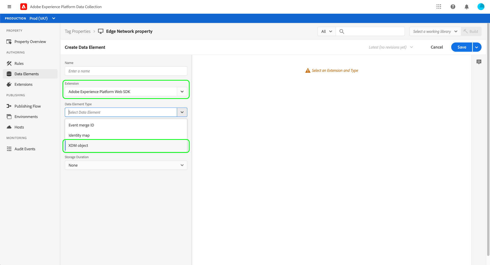
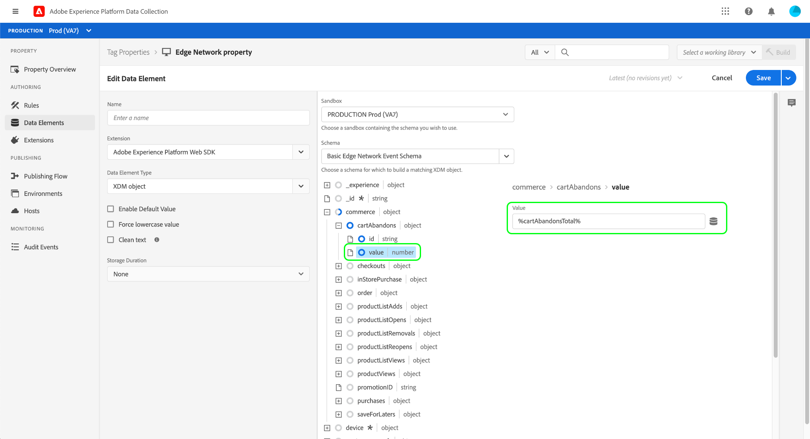

# Datenerfassung End-to-End – Übersicht

In Adobe Experience Platform bezieht sich die Datenerfassung auf mehrere Technologien, die zusammenarbeiten, um Ihre gesammelten Daten an andere Adobe-Produkte oder Drittanbieterziele zu übertragen. Um Ereignisdaten von Ihrem Programm an das Adobe Experience Platform Edge Network zu senden, müssen Sie diese Kerntechnologien kennen und wissen, wie Sie sie so konfigurieren können, dass sie bei Bedarf Ihre Daten an die gewünschten Ziele senden.

Dieses Handbuch enthält eine allgemeine Anleitung zum Senden eines Ereignisses über das Edge-Netzwerk mithilfe von Datenerfassungstechnologien. Insbesondere führt das Tutorial die Schritte zum Installieren und Konfigurieren der Tag-Erweiterung des Adobe Experience Platform Web SDK in der Datenerfassungs-Benutzeroberfläche (früher Adobe Experience Platform Launch) durch.

>[!NOTE]
>
>Sie können das SDK auch manuell installieren und konfigurieren, wenn Sie keine Tags verwenden möchten. Die folgenden Schritte müssen jedoch immer noch ausgeführt werden.

## Voraussetzungen

In diesem Tutorial wird die Datenerfassungs-Benutzeroberfläche verwendet, um ein Schema zu erstellen, einen Datastream zu konfigurieren und das Web SDK zu installieren. Um diese Aktionen in der Benutzeroberfläche ausführen zu können, müssen Sie über Zugriff auf mindestens eine Web-Eigenschaft sowie auf die folgenden [Eigenschaftsrechte](../tags/ui/administration/user-permissions.md#property-rights) verfügen:

* Entwickeln
* Erweiterungen verwalten

Informationen zum Gewähren des Zugriffs auf Eigenschaften und Eigenschaftsrechte finden Sie im Handbuch zu [Verwalten von Berechtigungen für Tags](../tags/ui/administration/manage-permissions.md).

Um die verschiedenen in diesem Handbuch erwähnten Datenerfassungsprodukte verwenden zu können, müssen Sie außerdem Zugriff auf Datenströme haben sowie die Möglichkeit, Schemas zu erstellen und zu verwalten. Wenn Sie Zugriff auf eine dieser Funktionen benötigen, wenden Sie sich an Ihren CSM, um den erforderlichen Zugriff zu erhalten. Wenn Sie Adobe Experience Platform noch nicht erworben haben, erhalten Sie von Adobe den erforderlichen Zugriff, damit Sie das SDK ohne Aufpreis nutzen können.

Wenn Sie bereits Zugriff auf Platform haben, müssen Sie sicherstellen, dass alle [Berechtigungen](../access-control/home.md#permissions) unter den folgenden Kategorien aktiviert sind:

* Datenmodellierung
* Identitäten

Informationen zum Gewähren von Berechtigungen für Platform-Funktionen für Benutzer finden Sie unter [Übersicht zur Benutzeroberfläche der Zugangssteuerung](../access-control/ui/overview.md). 


## Prozesszusammenfassung

Der Prozess der Konfiguration der Datenerfassung für Ihre Website kann wie folgt zusammengefasst werden:

1. [Erstellen Sie ein Schema](#schema), um zu bestimmen, wie Ihre Daten strukturiert sind, wenn sie an das Edge-Netzwerk gesendet werden.
1. [Erstellen Sie einen Datenstrom](#datastream), um zu konfigurieren, an welche Ziele Ihre Daten gesendet werden sollen.
1. [Installieren und konfigurieren Sie das Web SDK](#sdk), um Daten an den Datenstrom zu senden, wenn bestimmte Ereignisse auf Ihrer Website auftreten.

Sobald Sie Daten an das Edge-Netzwerk senden können, können Sie optional auch [die Ereignisweiterleitung konfigurieren](#event-forwarding), wenn Ihr Unternehmen über eine Lizenz dafür verfügt.

## Erstellen eines Schemas {#schema}

Das [Experience-Datenmodell (XDM)](../xdm/home.md) ist eine Open-Source-Spezifikation, die allgemeine Strukturen und Definitionen für Daten in Form von Schemas bereitstellt. Mit anderen Worten: XDM ist eine Methode, Ihre Daten so zu strukturieren und zu formatieren, dass sie vom Edge Network und anderen Adobe Experience Cloud-Programmen verarbeitet werden können.

Der erste Schritt bei der Einrichtung Ihrer Datenerfassungsvorgänge besteht darin, ein XDM-Schema zur Darstellung Ihrer Daten zu erstellen. In einem späteren Schritt in diesem Tutorial ordnen Sie die Daten, die Sie senden möchten, der Struktur dieses Schemas zu.

>[!NOTE]
>
>XDM-Schemata sind sehr anpassbar. Die unten beschriebenen Schritte konzentrieren sich nicht auf übermäßige Vorgaben, sondern auf die Schemaanforderungen für das Web SDK. Außerhalb dieser Parameter können Sie die verbleibende Struktur Ihrer Daten beliebig definieren.

Wählen Sie in der Datenerfassungs-Benutzeroberfläche im linken Navigationsbereich **[!UICONTROL Schemas]** aus. Von hier aus können Sie eine Liste der zuvor erstellten Schemas sehen, die zu Ihrer Organisation gehören. Um fortzufahren, wählen Sie **[!UICONTROL Schema erstellen]** und dann **[!UICONTROL XDM ExperienceEvent]** aus dem Dropdown-Menü.


Es wird ein Dialogfeld angezeigt, in dem Sie aufgefordert werden, Feldergruppen zu dem Schema hinzuzufügen. Um Ereignisse mit dem Web SDK zu senden, müssen Sie die Feldergruppe **[!UICONTROL AEP Web SDK ExperienceEvent Mixin]** hinzufügen. Diese Feldergruppe enthält Definitionen für Datenattribute, die automatisch von der Web SDK-Bibliothek erfasst werden.

Verwenden Sie die Suchleiste, um die Liste einzugrenzen und so diese Feldergruppe leichter zu finden. Nachdem Sie sie gefunden haben, wählen Sie sie aus der Liste aus, bevor Sie **[!UICONTROL Feldergruppen hinzufügen]** auswählen.


Die Arbeitsfläche des Schemas wird angezeigt und zeigt eine Baumstruktur Ihres XDM-Schemas mit den Feldern, die von der Web SDK-Feldergruppe bereitgestellt werden.


Wählen Sie das Stammfeld im Baum aus, um **[!UICONTROL Schemaeigenschaften]** in der rechten Leiste zu öffnen. Hier können Sie einen Namen und eine optionale Beschreibung für das Schema angeben.


Wenn Sie weitere Felder zu dem Schema hinzufügen möchten, wählen Sie **[!UICONTROL Hinzufügen]** im Abschnitt **[!UICONTROL Feldergruppen]** in der linken Leiste aus.

Klicken Sie auf 

>[!NOTE]
>
>Detaillierte Anweisungen zum Suchen nach verschiedenen Feldergruppen für Ihre Anwendungsfälle finden Sie im Handbuch zu [Hinzufügen von Feldergruppen](../xdm/ui/resources/schemas.md#add-field-groups) in der XDM-Dokumentation.
>
>Es empfiehlt sich, nur Felder für Daten hinzuzufügen, die Sie über das Edge-Netzwerk senden möchten. Nachdem Sie Felder zu einem Schema hinzugefügt und es gespeichert haben, können anschließend nur noch additive Änderungen am Schema vorgenommen werden. Weitere Informationen finden Sie im Abschnitt [Regeln der Schemaentwicklung](../xdm/schema/composition.md#evolution).

Nachdem Sie die erforderlichen Felder hinzugefügt haben, klicken Sie auf **[!UICONTROL Speichern]**, um das Schema zu speichern.


## Erstellen eines Datenspeichers {#datastream}

Ein Datenstrom ist eine Konfiguration, die dem Edge-Netzwerk mitteilt, wohin Ihre Daten gesendet werden sollen. Insbesondere gibt ein Datenstrom an, an welche Experience Cloud-Produkte Sie die Daten senden möchten und wie die Daten in jedem Produkt verarbeitet und gespeichert werden sollen.

>[!NOTE]
>
>Wenn Sie die [Ereignisweiterleitung](../tags/ui/event-forwarding/overview.md) verwenden möchten (vorausgesetzt, Ihr Unternehmen ist für die Funktion lizenziert), müssen Sie sie für einen Datenstrom auf dieselbe Weise aktivieren wie Adobe-Produkte. Details zu diesem Prozess werden in einem [späteren Abschnitt](#event-forwarding) erläutert.

Wählen Sie in der Datenerfassungs-Benutzeroberfläche **[!UICONTROL Datenströme]** aus. Von hier aus können Sie einen vorhandenen Datenstrom aus der Liste auswählen, um ihn zu bearbeiten, oder Sie können eine neue Konfiguration erstellen, indem Sie **[!UICONTROL Neuer Datenstrom]** auswählen.


Die Konfigurationsanforderungen für einen Datenstrom hängen davon ab, an welche Produkte und Funktionen Sie Daten senden. Detaillierte Informationen zu den Konfigurationsoptionen für die einzelnen Produkte finden Sie in der [Übersicht zu Datenströmen](../edge/fundamentals/datastreams.md).

## Installieren und konfigurieren des Web SDKs {#install}

Nachdem Sie ein Schema und einen Datenstrom erstellt haben, müssen Sie das Platform Web SDK installieren und konfigurieren, um mit dem Senden von Daten an das Edge Network zu beginnen.

>[!NOTE]
>
>In diesem Abschnitt wird die Datenerfassungs-Benutzeroberfläche verwendet, um die Tag-Erweiterung des Web SDKs zu konfigurieren. Sie können sie jedoch auch mithilfe von Rohcode installieren und konfigurieren. Weitere Informationen finden Sie in den folgenden Handbüchern:
>
>* [Installieren des SDK](../edge/fundamentals/installing-the-sdk.md)
>* [Konfigurieren des SDK](../edge/fundamentals/configuring-the-sdk.md)
>
>Beachten Sie außerdem, dass Sie, auch wenn Sie nur die Ereignisweiterleitung verwenden möchten, das SDK dennoch wie beschrieben installieren und konfigurieren müssen, bevor Sie die Ereignisweiterleitung in einem [späteren Schritt](#event-forwarding) konfigurieren.

Der Prozess lässt sich wie folgt zusammenfassen:

1. [Installieren Sie das Adobe Experience Platform Web SDK in einer Tag-Eigenschaft](#install-sdk), um Zugriff auf seine Funktionen zu erhalten.
1. [Erstellen Sie ein XDM-Objektdatenelement](#data-element), um Variablen auf Ihrer Website der Struktur des zuvor erstellten XDM-Schemas zuzuordnen.
1. [Erstellen Sie eine Regel](#rule), die dem SDK mitteilt, wann Daten an das Edge-Netzwerk gesendet werden sollen.
1. [Erstellen und installieren Sie eine Bibliothek](#library), um die Regel auf Ihrer Website zu implementieren.

### Installieren des SDKs in einer Tag-Eigenschaft {#install-sdk}

Wählen Sie im linken Navigationsbereich **[!UICONTROL Tags]** aus, um eine Liste der Tag-Eigenschaften anzuzeigen. Sie können eine vorhandene Eigenschaft auswählen, die Sie bearbeiten möchten, oder stattdessen **[!UICONTROL Neue Eigenschaft]** auswählen.


Wenn Sie eine neue Eigenschaft erstellen, geben Sie einen beschreibenden Namen an und setzen Sie den Parameter [!UICONTROL Platform] auf **[!UICONTROL Web]**. Geben Sie die vollständige Domain für die Web-Eigenschaft an und klicken Sie dann auf **[!UICONTROL Speichern]**.


Die Übersichtsseite für die Eigenschaft wird angezeigt. Wählen Sie von hier aus im linken Navigationsbereich **[!UICONTROL Erweiterungen]** und dann **[!UICONTROL Katalog]** aus. Suchen Sie die Liste für das Platform Web SDK (optional unter Verwendung der Suchleiste zur Eingrenzung der Ergebnisse) und wählen Sie **[!UICONTROL Installieren]**.


Die Konfigurationsseite für das SDK wird angezeigt. Für die meisten erforderlichen Werte werden automatisch die Standardwerte eingetragen, die Sie bei Bedarf ändern können.


Bevor Sie das SDK installieren können, müssen Sie jedoch einen Datenstrom auswählen, an den Ihre Daten gesendet werden sollen. Wählen Sie unter **[!UICONTROL Datenströme]** im Dropdown-Menü den Datenstrom aus, den Sie in einem [früheren Schritt](#datastream) konfiguriert haben. Nachdem Sie den Datenstrom festgelegt haben, wählen Sie **[!UICONTROL Speichern]** aus, um die Installation des SDKs für die Eigenschaft abzuschließen.


### Erstellen eines XDM-Datenelements {#data-element}

Damit das SDK Daten an das Edge-Netzwerk senden kann, müssen diese Daten dem XDM-Schema zugeordnet werden, das Sie in einem [vorherigen Schritt](#schema) erstellt haben. Diese Zuordnung wird mithilfe eines Datenelements erreicht.

Wählen Sie in der Benutzeroberfläche **[!UICONTROL Datenelemente]** und dann **[!UICONTROL Neues Datenelement erstellen]** aus.


Wählen Sie im nächsten Bildschirm **[!UICONTROL Adobe Experience Platform Web SDK]** aus der Dropdown-Liste [!UICONTROL Erweiterung] und wählen Sie dann für den Datenelementtyp **[!UICONTROL XDM-Objekt]** aus.



Das Konfigurationsdialogfeld wird für den XDM-Objekttyp angezeigt. Im Dialogfeld wird automatisch Ihre Platform-Sandbox ausgewählt. Von hier aus können Sie alle Schemas sehen, die in dieser Sandbox erstellt wurden. Wählen Sie das zuvor erstellte XDM-Schema aus der Liste aus.


Die Struktur des Schemas wird angezeigt. Bei allen Feldern mit einem Sternchen (**\***) handelt es sich um Felder, die beim Auslösen von Ereignissen automatisch aufgefüllt werden. Für alle anderen Felder können Sie die Struktur des Schemas untersuchen und den Rest der Daten ausfüllen.



>[!NOTE]
>
>Der obige Screenshot zeigt, wie eine global zugängliche Variable von der Client-Seite Ihrer Website (`cartAbandonsTotal`) einem XDM-Feld zugeordnet werden kann, indem auf den Namen im Feld [!UICONTROL Wert], eingeschlossen zwischen Prozentzeichen (`%`), verwiesen wird.
>
>Sie können auch andere zuvor erstellte Datenelemente verwenden, um diese Felder auszufüllen. Weitere Informationen finden Sie in der Tags-Dokumentation unter der Referenz zu [Datenelementen](../tags/ui/managing-resources/data-elements.md).

Nachdem Sie die Zuordnung Ihrer Daten zum Schema abgeschlossen haben, geben Sie einen Namen für das Datenelement ein, bevor Sie auf **[!UICONTROL Speichern]** klicken.


### Erstellen einer Regel

Nach dem Speichern des Datenelements besteht der nächste Schritt darin, eine Regel zu erstellen, die es an das Edge-Netzwerk sendet, sobald ein bestimmtes Ereignis auf Ihrer Website eintritt (z. B. wenn ein Kunde ein Produkt zu einem Warenkorb hinzufügt).

Sie können Regeln für praktisch jedes Ereignis einrichten, das auf Ihrer Website auftreten kann. In diesem Abschnitt wird beispielsweise gezeigt, wie eine Regel erstellt wird, die beim Senden eines Formulars durch einen Kunden ausgelöst wird. Der folgende HTML-Code stellt eine einfache Web-Seite mit dem Formular „Zum Warenkorb hinzufügen“ dar, die Gegenstand der Regel sein wird:

```html
<!DOCTYPE html>
<html>
<body>

  <form id="add-to-cart-form">
    <label for="item">Product:</label><br>
    <input type="text" id="item" name="item"><br>
    <label for="amount">Amount:</label><br>
    <input type="number" id="amount" name="amount" value="1"><br><br>
    <input type="submit" value="Add to Cart">
  </form> 

</body>
</html>
```

Wählen Sie in der Datenerfassungs-Benutzeroberfläche im linken Navigationsbereich **[!UICONTROL Regeln]** und dann **[!UICONTROL Neue Regel erstellen]** aus.


Geben Sie im nächsten Bildschirm einen Namen für die Regel ein. Von hier aus besteht der nächste Schritt darin, das Ereignis für die Regel zu bestimmen (d. h., wann die Regel ausgelöst wird). Wählen Sie **[!UICONTROL Hinzufügen]** unter [!UICONTROL Ereignisse] aus.


Die Seite zur Ereigniskonfiguration wird angezeigt. Um ein Ereignis zu konfigurieren, müssen Sie zunächst den Ereignistyp auswählen. Ereignistypen werden durch Erweiterungen bereitgestellt. Um beispielsweise ein Ereignis „Formular senden“ einzurichten, wählen Sie die **[!UICONTROL Core]**-Erweiterung und dann den Ereignistyp **[!UICONTROL Senden]** unter der Kategorie **[!UICONTROL Formular]** aus.

>[!NOTE]
>
>Weitere Informationen zu den verschiedenen Ereignistypen, die von Adobe-Web-Erweiterungen bereitgestellt werden, einschließlich ihrer Konfiguration, finden Sie unter [Adobe Erweiterungs-Referenz](../tags/extensions/web/overview.md) in der Tags-Dokumentation.

Mit dem Formularübermittlungsereignis können Sie einen [CSS-Selektor](https://www.w3schools.com/css/css_selectors.asp) verwenden, um auf ein bestimmtes Element zu verweisen, in dem die Regel ausgelöst werden soll. Im folgenden Beispiel wird die ID `add-to-cart-form` verwendet, sodass diese Regel nur für das Formular „Zum Warenkorb hinzufügen“ ausgelöst wird. Wählen Sie **[!UICONTROL Änderungen beibehalten]** aus, um das Ereignis zur Regel hinzuzufügen.


Die Seite zur Regelkonfiguration wird erneut angezeigt und zeigt an, dass das Ereignis hinzugefügt wurde. Sie können den Wert [!UICONTROL If] einschränken, indem Sie weitere Bedingungen zu der Regel hinzufügen.

Andernfalls besteht der nächste Schritt darin, eine Aktion hinzuzufügen, die von der Regel ausgeführt werden soll, wenn sie ausgelöst wird. Wählen Sie **[!UICONTROL Hinzufügen]** unter **[!UICONTROL Aktionen]** aus, um fortzufahren.


Die Seite mit der Aktionskonfiguration wird angezeigt. Um die Regel zum Senden von Daten an das Edge-Netzwerk abzurufen, wählen Sie **[!UICONTROL Adobe Experience Platform Web SDK]** für die Erweiterung und **[!UICONTROL Ereignis senden]** für den Aktionstyp aus.


Der Bildschirm wird aktualisiert und zeigt zusätzliche Optionen zum Konfigurieren der Sendeereignisaktion. Unter **[!UICONTROL Typ]** können Sie einen benutzerdefinierten Typwert bereitstellen, um das XDM-Feld `eventType` auszufüllen. Geben Sie unter **[!UICONTROL XDM-Daten]** den Namen des zuvor erstellten XDM-Datentyps ein (eingeschlossen von Prozentzeichen) oder wählen Sie das Datenbanksymbol () aus, um ihn aus einer Liste auszuwählen. Dies sind die Daten, die letztendlich an das Edge-Netzwerk gesendet werden.

Wählen Sie nach Abschluss **[!UICONTROL Änderungen beibehalten]** aus.


Nachdem Sie die Konfiguration der Regel abgeschlossen haben, klicken Sie auf **[!UICONTROL Speichern]**, um den Prozess abzuschließen.


### Erstellen und Installieren einer Bibliothek {#library}

Nachdem die Regel konfiguriert wurde, können Sie sie zu einer Tag-Bibliothek hinzufügen, diese Bibliothek zu einer Umgebung erstellen und diesen Build auf Ihrer Website installieren.

>[!NOTE]
>
>Wenn Sie noch keine Umgebung in der Datenerfassungs-Benutzeroberfläche eingerichtet haben, müssen Sie dies tun, bevor Sie einen Build erstellen können. Weitere Informationen finden Sie im Abschnitt [Konfigurieren einer Umgebung für eine Web-Eigenschaft](../tags/ui/publishing/environments.md#web-configuration) in der Tag-Dokumentation.

Informationen zum Erstellen einer Bibliothek, Hinzufügen von Erweiterungen und Regeln zur Bibliothek und Erstellen dieser Bibliothek in einer Umgebung finden Sie im Handbuch zum [Verwalten von Bibliotheken](../tags/ui/publishing/libraries.md) in der Tags-Dokumentation. Stellen Sie beim Erstellen der Bibliothek sicher, dass Sie die Platform Web SDK-Erweiterung und die zuvor erstellten Datenerfassungsregeln einbeziehen.

Nachdem Sie die Bibliothek erstellt und ihren Build einer Umgebung zugewiesen haben, können Sie diese Umgebung auf der Client-Seite Ihrer Website installieren. Weitere Informationen finden Sie im Abschnitt [Installieren von Umgebungen](../tags/ui/publishing/environments.md#installation).

Nachdem Sie die Umgebung auf Ihrer Website installiert haben, können Sie mit dem Adobe Experience Platform Debugger [Ihre Implementierung testen](../tags/ui/publishing/embed-code-testing.md).

## Konfigurieren der Ereignisweiterleitung (optional) {#event-forwarding}

>[!NOTE]
>
>Die Ereignisweiterleitung ist nur für Organisationen verfügbar, die dafür lizenziert wurden.

Nachdem Sie das SDK für das Senden von Daten an das Edge-Netzwerk konfiguriert haben, können Sie die Ereignisweiterleitung einrichten, um dem Edge-Netzwerk mitzuteilen, wo die Daten bereitgestellt werden sollen.

Um die Ereignisweiterleitung zu verwenden, müssen Sie zunächst eine Ereignisweiterleitungseigenschaft erstellen. Wählen Sie in der linken Navigationsleiste **[!UICONTROL Ereignisweiterleitung]** und dann **[!UICONTROL Neue Eigenschaft]** aus. Geben Sie einen Namen für die Eigenschaft ein, bevor Sie auf **[!UICONTROL Speichern]** klicken.

Nachdem Sie eine Ereignisweiterleitungseigenschaft erstellt haben, besteht der nächste Schritt darin, eine Regel zu erstellen, die bestimmt, wohin die Daten gesendet werden sollen. Regeln für Eigenschaften der Ereignisweiterleitung werden ähnlich wie Tag-Eigenschaften erstellt, mit der Ausnahme, dass keine Ereignisse angegeben werden können (da die Ereignisweiterleitung nur Ereignisse behandelt, die direkt vom Datenstrom empfangen werden). Für die Regelaktion können Sie eine der verfügbaren Ereignisweiterleitungserweiterungen verwenden oder stattdessen benutzerdefinierten Code verwenden, um das Ereignis bereitzustellen.


Ähnlich wie zuvor müssen Sie die Regel nach der Konfiguration zu einer Bibliothek hinzufügen und diese Bibliothek zu einer Umgebung erstellen.

Nach Abschluss des Builds besteht der letzte Schritt darin, den Datenstrom zu aktualisieren, den Sie [zuvor konfiguriert haben](#datastream), und die Ereignisweiterleitung zu aktivieren. Navigieren Sie zunächst zu **[!UICONTROL Datenströme]** und wählen Sie den betreffenden Datenstrom aus der Liste aus. Aktivieren Sie von hier aus den Umschalter für die Ereignisweiterleitung und geben Sie die Namen der soeben konfigurierten Eigenschaft und Umgebung an.


## Nächste Schritte

Dieses Handbuch bietet eine allgemeine Übersicht darüber, wie Daten mithilfe des Platform Web SDKs an das Edge-Netzwerk gesendet werden. Weitere Informationen zu den verschiedenen Komponenten und Services finden Sie in der Dokumentation, auf die in diesem Handbuch verlinkt wird.
