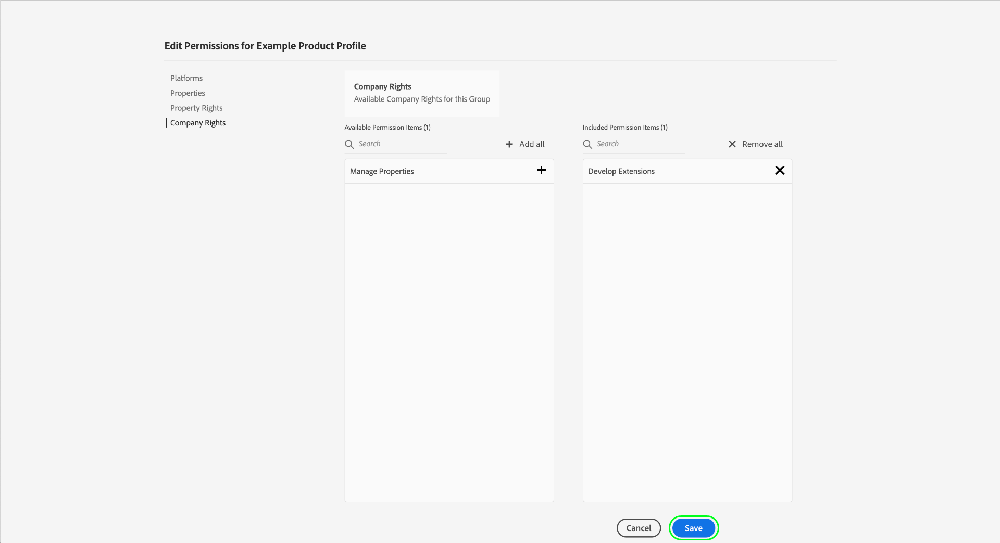

# Berechtigungsverwaltung für die Datenerfassung in Experience Platform

[Datenerfassung in Adobe Experience Platform](./home.md) besteht aus mehreren verschiedenen Technologien, die zusammenarbeiten, um Ihre Daten zu sammeln und zu übertragen. Der Zugriff auf diese Technologien wird über granulare rollenbasierte Berechtigungen in Adobe Admin Console gesteuert.

In diesem Handbuch erfahren Sie, wie Sie Berechtigungen für Datenerfassungsfunktionen verwalten.

## Erste Schritte

Um die Zugriffskontrolle für die Datenerfassung zu konfigurieren, müssen Sie über Administratorrechte für ein Unternehmen verfügen, das über eine Produktintegration mit der Datenerfassung von Adobe Experience Platform verfügt. Die Mindestrolle, die Berechtigungen erteilen oder entziehen kann, ist ein Produktprofiladministrator. Andere Administratorrollen, die Berechtigungen verwalten können, sind Produktadministratoren (kann alle Profile innerhalb eines Produkts verwalten) und Systemadministratoren (keine Einschränkungen). Weitere Informationen finden Sie im Artikel unter [Administratorrollen](https://helpx.adobe.com/de/enterprise/using/admin-roles.html) Weitere Informationen finden Sie im Adobe Enterprise-Verwaltungshandbuch .

In diesem Handbuch wird davon ausgegangen, dass Sie mit grundlegenden Konzepten der Admin Console wie Produktprofilen und der Art und Weise, wie diese Produktberechtigungen einzelnen Benutzern und Gruppen gewähren, vertraut sind. Weitere Informationen finden Sie unter [Benutzerhandbuch zu Admin Consolen](https://helpx.adobe.com/de/enterprise/using/admin-console.html).

## Verfügbare Berechtigungen

Die entsprechenden Berechtigungen für die Datenerfassung werden über zwei Produktbezeichnungen in Admin Console bereitgestellt: **Adobe Experience Platform** und **Adobe Experience Platform-Datenerfassung**. In den folgenden Abschnitten werden die Berechtigungen beschrieben, die unter den einzelnen Produkten gewährt werden, sowie die spezifischen Funktionen, auf die sie Zugriff gewähren.

### Adobe Experience Platform-Berechtigungen

Zu den Berechtigungen unter Adobe Experience Platform gehört der Zugriff auf Datenspeicher, Identitäten, Schemas und Sandboxes. Anweisungen zum Konfigurieren von Adobe Experience Platform-Berechtigungen finden Sie unter [Benutzerhandbuch zur Zugriffskontrolle](../access-control/ui/overview.md).

| Kategorie | Berechtigung | Beschreibung |
| --- | --- | --- |
| Sandboxes | (Nicht angegeben) | Je nach [Sandboxes](../sandboxes/home.md) die unter Ihrer Organisation erstellt wurden, können Sie den Zugriff auf jede dieser Berechtigungskategorien in Admin Console steuern. |
| Datenmodellierung | Verwalten von Schemas | Ermöglicht die Anzeige, Erstellung und Bearbeitung von [Experience-Datenmodell (XDM)-Schemas](../xdm/home.md). |
| Datenmodellierung | Anzeigen von Schemas | Gewährt schreibgeschützten Zugriff auf Schemas. |
| Identity Management | Verwalten von Identitäts-Namensräumen | Ermöglicht die Anzeige, Erstellung und Bearbeitung von [Identitäts-Namespaces](../identity-service/namespaces.md). |
| Identity Management | Anzeigen von Identitäts-Namensräumen | Ermöglicht schreibgeschützten Zugriff auf Identitäts-Namespaces. |
| Datenerfassung | Verwalten von Datenspeichern | Ermöglicht die Anzeige, Erstellung und Bearbeitung von [datastreams](../edge/datastreams/overview.md). |
| Datenerfassung | Anzeigen von Datenspeichern | Ermöglicht schreibgeschützten Zugriff auf Datenspeicher. |

{style=&quot;table-layout:auto&quot;}

<!-- (Feature not yet available?)
| Dashboards | Manage Custom Dashboards | |
| Dashboards | View Custom Dashboards | |
-->

### Adobe Experience Platform-Datenerfassungsberechtigungen

Berechtigungen unter der Datenerfassung von Adobe Experience Platform steuern den Zugriff auf Tags und Funktionen zur Ereignisweiterleitung, einschließlich Eigenschaften, Erweiterungen und Umgebungen. Anweisungen zum Konfigurieren von Adobe Experience Platform-Datenerfassungsberechtigungen finden Sie in der [Abschnitt unten](#manage).

| Kategorie | Berechtigung | Beschreibung |
| --- | --- | --- |
| Plattformen | Web | Gewährt Zugriff auf [Webeigenschaften](../tags/ui/administration/companies-and-properties.md) in Kombination mit anderen Eigentumsrechten. |
| Plattformen | Mobile | Gewährt Zugriff auf [mobile Eigenschaften](../tags/ui/administration/companies-and-properties.md) in Kombination mit anderen Eigentumsrechten. |
| Properties | (Nicht angegeben) | Je nach den Eigenschaften, die unter Ihrer Organisation erstellt wurden, können Sie den Zugriff auf jede dieser Eigenschaften über diese Berechtigungskategorie in Admin Console steuern.  Die zugewiesenen Eigenschaftsrechte eines Benutzers gelten nur für die Eigenschaften, auf die ihm über diese Berechtigungskategorie Zugriff gewährt wurde. |
| Eigenschaftsrechte | Genehmigen | Ermöglicht die Genehmigung eines Bibliotheks-Builds als Teil der [Veröffentlichungsfluss](../tags/ui/publishing/publishing-flow.md). |
| Eigenschaftsrechte | Entwickeln | Ermöglicht die Entwicklung eines Bibliotheks-Builds als Teil der [Veröffentlichungsfluss](../tags/ui/publishing/publishing-flow.md). |
| Eigenschaftsrechte | Eigenschaft bearbeiten | Ermöglicht die Bearbeitung der grundlegenden Konfiguration für die Eigenschaften, auf die ein Benutzer Zugriff hat. |
| Eigenschaftsrechte | Umgebungen verwalten | Ermöglicht die Verwaltung der [Umgebungen](../tags/ui/publishing/environments.md) für die Eigenschaften, auf die ein Benutzer Zugriff hat. |
| Eigenschaftsrechte | Erweiterungen verwalten | Ermöglicht die Verwaltung der [Erweiterungen](../tags/ui/managing-resources/extensions/overview.md) für die Eigenschaften, auf die ein Benutzer Zugriff hat. |
| Eigenschaftsrechte | Veröffentlichen Sie | Ermöglicht die Veröffentlichung eines Bibliotheks-Builds als Teil der [Veröffentlichungsfluss](../tags/ui/publishing/publishing-flow.md). |
| Unternehmensrechte | Entwickeln von Erweiterungen | Ermöglicht das Erstellen und Ändern von Erweiterungspaketen, die Ihrem Unternehmen gehören, einschließlich privater Versionen und Anforderungen zur öffentlichen Veröffentlichung. |
| Unternehmensrechte | Erweiterungen verwalten | Diese Berechtigung gilt nur, wenn Sie über eine Lizenz für Adobe Journey Optimizer oder eine andere Lösung verfügen, die Zugriff auf mobile In-App- und Push-Nachrichten gewährt. Auf diese Weise können Sie Apps verwalten, von denen Adobe Experience Cloud weiß, sowie die erforderlichen Push-Anmeldeinformationen, die für die Kommunikation mit dem Firebase Cloud Messaging-Dienst und dem Apple-Push-Benachrichtigungsdienst erforderlich sind. |

{style=&quot;table-layout:auto&quot;}

>[!NOTE]
>
>Weitere Informationen dazu, wie sich diese Berechtigungen auf Funktionen in Tags auswirken, einschließlich Verwaltungsstrategien für gängige Szenarien, finden Sie in der Tag-Dokumentation unter [Benutzerberechtigungen](../tags/ui/administration/user-permissions.md).

## Verwalten von Berechtigungen {#manage}

Wie im vorherigen Abschnitt beschrieben, werden die Berechtigungen für die Datenerfassung über zwei Produktbezeichnungen in Admin Console verwaltet: **Adobe Experience Platform** und **Adobe Experience Platform-Datenerfassung**.

Um diese Berechtigungen zu verwalten, melden Sie sich bei [Admin Console](https://adminconsole.adobe.com/) und wählen Sie **[!UICONTROL Produkte]** aus der oberen Navigation. Wählen Sie hier die Produktkarte für die Berechtigungen aus, die Sie konfigurieren möchten. In den folgenden Unterabschnitten erfahren Sie, wie Sie die entsprechenden Berechtigungen für die einzelnen Produkte in Admin Console verwalten:

* [Adobe Experience Platform-Berechtigungen](#manage-platform)
* [Adobe Experience Platform-Datenerfassungsberechtigungen](#manage-collection)

### Verwalten von Berechtigungen unter Adobe Experience Platform {#manage-platform}

Aus dem **[!UICONTROL Produkte]** Ansicht in Admin Console, wählen Sie **[!UICONTROL Adobe Experience Platform-Datenerfassung]**. Wählen Sie das Produktprofil aus, für das Sie Berechtigungen bearbeiten möchten, und navigieren Sie dann zum **[!UICONTROL Berechtigungen]** Registerkarte.

Um auf Datenerfassungsfunktionen zugreifen zu können, müssen Sie alle Berechtigungen in der **[!UICONTROL Sandboxes]**, **[!UICONTROL Datenmodellierung]**, **[!UICONTROL Identity Management]** und **[!UICONTROL Datenerfassung]** Kategorien.

Siehe [UI-Handbuch zur Zugriffskontrolle](../access-control/ui/overview.md) für detaillierte Anweisungen zum Verwalten von Platform-Berechtigungen.

>[!NOTE]
>
>Je nach den Produkt-SKUs, auf die Ihr Unternehmen Zugriff hat, stehen Ihnen möglicherweise nicht alle Platform-Berechtigungen zur Verfügung.

### Verwalten von Berechtigungen unter Adobe Experience Platform-Datenerfassung {#manage-collection}

Aus dem **[!UICONTROL Produkte]** Ansicht in Admin Console, wählen Sie **[!UICONTROL Adobe Experience Platform-Datenerfassung]**.

#### Produktprofil auswählen oder erstellen

Im nächsten Bildschirm wird eine Liste der verfügbaren Produktprofile für die Datenerfassung unter Ihrer Organisation angezeigt, wobei das Standardprofil **[!DNL Default Data Collection All Access]**. Sie können bei Bedarf das Standard-Produktprofil bearbeiten oder **[!UICONTROL Neues Profil]** , um eine zu erstellen. Wenn Ihre Organisation über mehrere Rollen oder Benutzergruppen verfügt, für die unterschiedliche Zugriffsebenen benötigt werden, sollten Sie für jede dieser Rollen ein eigenes Produktprofil erstellen.

Nachdem Sie ein Produktprofil ausgewählt oder erstellt haben, können Sie die **[!UICONTROL Bearbeiten]** Symbole zum Starten [Berechtigungen bearbeiten](#edit-permissions) für das Profil oder wählen Sie die **[!UICONTROL Benutzer]** Registerkarte zum Start [Zuweisen von Benutzern](#assign-users) zum Profil.

#### Berechtigungen für das Produktprofil bearbeiten {#edit-permissions}

Beim Bearbeiten von Berechtigungen für ein Profil werden die verfügbaren Berechtigungen in der linken Spalte aufgeführt, während die Berechtigungen, die im Profil enthalten sind, in der rechten Spalte aufgeführt sind. Wählen Sie die aufgelisteten Berechtigungen aus, um sie zwischen den Spalten zu verschieben.

Berechtigungen sind in Kategorien unterteilt. Um zwischen Kategorien zu wechseln, wählen Sie die gewünschte Kategorie aus der linken Navigation aus.

Auswählen **[!UICONTROL Speichern]** nachdem Sie die Berechtigungen konfiguriert haben.

Die Produktprofilansicht wird mit den hinzugefügten Berechtigungen erneut angezeigt.

#### Zuweisen von Benutzern zum Produktprofil {#assign-users}

Um dem Produktprofil Benutzer zuzuweisen (und ihnen die konfigurierten Berechtigungen des Profils zu erteilen), wählen Sie die **[!UICONTROL Benutzer]** Registerkarte, gefolgt von **[!UICONTROL Benutzer hinzufügen]**.

Weitere Informationen zum Verwalten von Benutzern für ein Produktprofil finden Sie unter [Dokumentation zur Admin Console](https://helpx.adobe.com/de/enterprise/using/manage-product-profiles.html).

## Nächste Schritte

In diesem Handbuch wurden die verfügbaren Berechtigungen für die Datenerfassungs-Benutzeroberfläche und deren Verwaltung über die Admin Console behandelt. Weitere Informationen zum Verwalten von Berechtigungen für andere Adobe Experience Platform-Funktionen finden Sie im Abschnitt [Zugriffssteuerungsdokumentation](../access-control/home.md).
