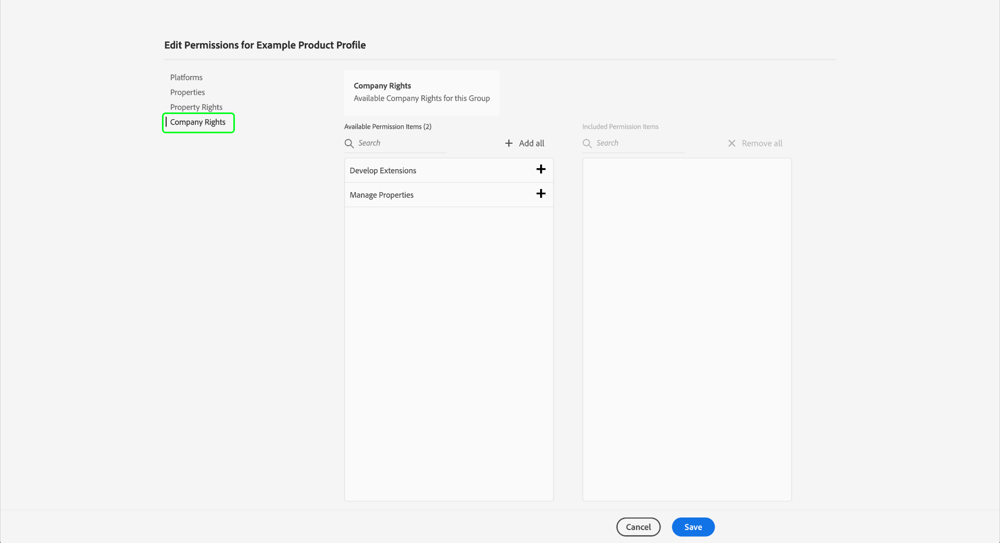

# Berechtigungsverwaltung zur Datenerfassung in Experience Platform {#permission-management}

>[!CONTEXTUALHELP]
>id="platform_tags_permissions"
>title="Berechtigungen"
>abstract="Machen Sie sich mit den wichtigsten Berechtigungen vertraut, die für die Arbeit mit Datenströmen, Schemata, Identitäten und Sandboxes in Adobe Experience Platform erforderlich sind."

[Datenerfassung in Adobe Experience Platform](./home.md) besteht aus mehreren verschiedenen Technologien, die zusammenarbeiten, um Ihre Daten zu erfassen und zu übertragen. Der Zugriff auf diese Technologien wird über granulare rollenbasierte Berechtigungen in Adobe Admin Console gesteuert.

In diesem Handbuch erfahren Sie, wie Sie Berechtigungen für Datenerfassungsfunktionen verwalten.

## Erste Schritte

Um die Zugriffssteuerung für die Datenerfassung zu konfigurieren, müssen Sie Administratorrechte für ein Unternehmen haben, das über eine Produktintegration mit der Datenerfassung in Adobe Experience Platform verfügt. Die Mindestrolle, die Berechtigungen erteilen oder entziehen kann, ist ein **Produktprofiladministrator**. Andere Administratorrollen, die Berechtigungen verwalten können, sind **Produktadministratoren** (kann alle Profile innerhalb eines Produkts verwalten) und **Systemadministratoren** (keine Einschränkungen). Weitere Informationen finden Sie im Artikel über [Administrationsrollen](https://helpx.adobe.com/de/enterprise/using/admin-roles.html) im Adobe Unternehmens-Administrationshandbuch.

In dieser Anleitung wird davon ausgegangen, dass Sie mit den grundlegenden Konzepten der Admin Console vertraut sind, z. B. mit Produktprofilen und damit, wie Sie einzelnen Benutzern und Gruppen Produktberechtigungen erteilen. Weitere Informationen finden Sie im [Benutzerhandbuch für die Admin Console](https://helpx.adobe.com/de/enterprise/using/admin-console.html).

## Verfügbare Berechtigungen

Die entsprechenden Berechtigungen für die Datenerfassung werden über zwei Produktbezeichnungen in Admin Console bereitgestellt: **Adobe Experience Platform** und **Adobe Experience Platform-Datenerfassung**. In den folgenden Abschnitten werden die unter den einzelnen Produkten bereitgestellten Berechtigungen zusammen mit Beschreibungen der spezifischen Funktionen beschrieben, auf die sie Zugriff gewähren.

### Adobe Experience Platform-Berechtigungen

Zu den Berechtigungen unter Adobe Experience Platform gehört der Zugriff auf Datenströme, Identitäten, Schemata und Sandboxes. Anweisungen zum Konfigurieren von Adobe Experience Platform-Berechtigungen finden Sie im [Benutzerhandbuch für die Zugriffssteuerung](../access-control/ui/overview.md).

| Kategorie | Berechtigung | Beschreibung |
| --- | --- | --- |
| Sandboxes | (Nicht angegeben) | Abhängig von den [Sandboxes](../sandboxes/home.md) die in Ihrer Organisation erstellt wurden, können Sie den Zugriff auf jede von ihnen über diese Berechtigungskategorie in Admin Console steuern. |
| Datenmodellierung | Verwalten von Schemata | Ermöglicht das Anzeigen, Erstellen und Bearbeiten von [Experience-Datenmodell(XDM)-Schemata](../xdm/home.md). |
| Datenmodellierung | Anzeigen von Schemata | Gewährt schreibgeschützten Zugriff auf Schemata. |
| Identity Management | Verwalten von Identitäts-Namensräumen | Ermöglicht das Anzeigen, Erstellen und Bearbeiten von [Identity-Namespaces](../identity-service/features/namespaces.md). |
| Identity Management | Anzeigen von Identitäts-Namensräumen | Gewährt schreibgeschützten Zugriff auf Identity-Namespaces. |
| Datenerfassung | Verwalten von Datenströmen | Ermöglicht das Anzeigen, Erstellen und Bearbeiten [Datenströme](../datastreams/overview.md). |
| Datenerfassung | Anzeigen von Datenströmen | Gewährt schreibgeschützten Zugriff auf Datenströme. |

{style="table-layout:auto"}

### Berechtigungen zur Datenerfassung in Adobe Experience Platform

Berechtigungen unter Adobe Experience Platform-Datenerfassung steuern den Zugriff auf Tags und Ereignisweiterleitungsfunktionen, einschließlich Eigenschaften, Erweiterungen und Umgebungen. Anweisungen zum Konfigurieren der Datenerfassungsberechtigungen für Adobe Experience Platform finden Sie [&#x200B; Abschnitt unten](#manage).

| Kategorie | Berechtigung | Beschreibung |
| --- | --- | --- |
| Plattformen | Web | Gewährt Zugriff auf [Web-Eigenschaften](../tags/ui/administration/companies-and-properties.md) in Kombination mit anderen Eigenschaftsrechten. |
| Plattformen | Mobile | Gewährt Zugriff auf [Mobile-Eigenschaften](../tags/ui/administration/companies-and-properties.md) in Kombination mit anderen Eigenschaftsrechten. |
| Plattformen | Edge | Gewährt Zugriff auf [Edge-Eigenschaften für die Ereignisweiterleitung](../tags/ui/event-forwarding/getting-started.md) in Kombination mit anderen Eigenschaftsrechten. |
| Properties | (Nicht angegeben) | Je nach den Eigenschaften, die im Rahmen Ihrer Organisation erstellt wurden, können Sie den Zugriff auf jede dieser Eigenschaften über diese Berechtigungskategorie in Admin Console steuern.  Die zugewiesenen Eigenschaftsrechte eines Benutzers gelten nur für die Eigenschaften, auf die ihm über diese Berechtigungskategorie Zugriff gewährt wurde. |
| Eigenschaftsrechte | Genehmigen | Ermöglicht die Genehmigung eines Bibliotheks-Builds als Teil des [Publishing-Flusses](../tags/ui/publishing/publishing-flow.md). |
| Eigenschaftsrechte | Entwickeln | Ermöglicht die Entwicklung eines Bibliotheks-Builds als Teil des [Publishing-Flusses](../tags/ui/publishing/publishing-flow.md). |
| Eigenschaftsrechte | Eigenschaft bearbeiten | Ermöglicht die Bearbeitung der Basiskonfiguration für die Eigenschaften, auf die ein Benutzer Zugriff hat. |
| Eigenschaftsrechte | Umgebungen verwalten | Ermöglicht die Verwaltung der [Umgebungen](../tags/ui/publishing/environments.md) für die Eigenschaften, auf die ein Benutzer Zugriff hat. |
| Eigenschaftsrechte | Erweiterungen verwalten | Ermöglicht die Verwaltung der [Erweiterungen](../tags/ui/managing-resources/extensions/overview.md) für die Eigenschaften, auf die ein Benutzer Zugriff hat. |
| Eigenschaftsrechte | Veröffentlichen | Ermöglicht die Veröffentlichung eines Bibliotheks-Builds im Rahmen des [Publishing-Flusses](../tags/ui/publishing/publishing-flow.md). |
| Unternehmensrechte | Entwickeln von Erweiterungen | Ermöglicht das Erstellen und Ändern von Erweiterungspaketen, die Ihrer Organisation gehören, einschließlich privater Versionen und Anfragen zur öffentlichen Freigabe. |
| Unternehmensrechte | Mobile-App-Konfigurationen verwalten | Diese Berechtigung gilt nur, wenn Sie über eine Lizenz für Adobe Journey Optimizer oder eine andere Lösung verfügen, die Zugriff auf mobile In-App- und Push-Nachrichten gewährt. Auf diese Weise können Sie die Apps verwalten, die Adobe Experience Cloud bekannt sind, zusammen mit den erforderlichen Push-Anmeldeinformationen, die für die Kommunikation mit dem Firebase Cloud Messaging-Service und dem Apple-Push-Benachrichtigungs-Service erforderlich sind. |
| Unternehmensrechte | Eigenschaften verwalten | Ermöglicht das Erstellen und Verwalten von Tags (Web-Eigenschaft), Ereignisweiterleitung (Edge-Eigenschaft) und mobilen Eigenschaften. |

{style="table-layout:auto"}

>[!NOTE]
>
>Weitere Informationen dazu, wie sich diese Berechtigungen auf die Funktionen in Tags auswirken, einschließlich Verwaltungsstrategien für gängige Szenarien, finden Sie in der Tags-Dokumentation unter [Benutzerberechtigungen](../tags/ui/administration/user-permissions.md).

## Verwalten von Berechtigungen {#manage}

Berechtigungen für die Datenerfassung werden über zwei Produktbezeichnungen verwaltet: **Adobe Experience Platform** und **Adobe Experience Platform Data Collection**.

Anweisungen zum Verwalten der entsprechenden Berechtigungen für die einzelnen Produkte in Admin Console finden Sie in den folgenden Unterabschnitten:

* [Adobe Experience Platform-Berechtigungen](#manage-platform)
* [Berechtigungen zur Datenerfassung in Adobe Experience Platform](#manage-collection)

### Verwalten von Berechtigungen unter Adobe Experience Platform {#manage-platform}

>[!NOTE]
>
>Zum Verwalten der Berechtigungen für eine Rolle benötigen Sie Administratorrechte. Wenn Sie keine Administratorrechte haben, wenden Sie sich an Ihren Systemadministrator.

Im **[!UICONTROL Permissions]** von Experience Cloud können Sie Benutzerrollen und Richtlinien definieren, um den Zugriff auf Funktionen und Objekte innerhalb einer Produktanwendung zu verwalten.

Über [!UICONTROL Permissions] können Sie Rollen erstellen und verwalten sowie die gewünschten Ressourcenberechtigungen für diese Rollen zuweisen.

Um auf Datenerfassungsfunktionen zugreifen zu können, müssen Sie alle Berechtigungen in den Kategorien **[!UICONTROL Sandboxes]**, **[!UICONTROL Data Modeling]**, **[!UICONTROL Identity Management]** und **[!UICONTROL Data Collection]** aktivieren.

Detaillierte Anweisungen [&#x200B; Verwalten von Experience Platform-Berechtigungen finden &#x200B;](../access-control/ui/overview.md) im Handbuch zur Benutzeroberfläche der Zugriffssteuerung .

>[!NOTE]
>
>Abhängig von den Produkt-SKUs, auf die Ihr Unternehmen Zugriff hat, verfügen Sie möglicherweise nicht über alle Experience Platform-Berechtigungen.

### Verwalten von Berechtigungen unter der Adobe Experience Platform-Datenerfassung {#manage-collection}

Um diese Berechtigungen zu verwalten, melden Sie sich bei Admin Console an und wählen Sie in der oberen Navigationsleiste **[!UICONTROL Products]** und dann **[!UICONTROL Adobe Experience Platform Data Collection]** aus.

#### Auswählen oder Erstellen eines Produktprofils

Der nächste Bildschirm zeigt eine Liste der verfügbaren Produktprofile für die Datenerfassung unter Ihrer Organisation, wobei das Standardprofil **[!DNL Default Data Collection All Access]** wird. Sie können das Standardproduktprofil bei Bedarf bearbeiten oder **[!UICONTROL New Profile]** auswählen, um eines zu erstellen. Wenn Sie in Ihrer Organisation mehrere Rollen oder Benutzergruppen haben, die unterschiedliche Zugriffsrechte benötigen, sollten Sie für jede dieser Gruppen ein eigenes Produktprofil erstellen.

Nachdem Sie ein Produktprofil ausgewählt oder erstellt haben, können Sie mit den **[!UICONTROL Edit]**-Symbolen mit der [Bearbeitung von Berechtigungen](#edit-permissions) für das Profil beginnen oder auf die Registerkarte **[!UICONTROL Users]** klicken, um mit der [Zuweisung von Benutzern](#assign-users) für das Profil zu beginnen.

#### Bearbeiten der Berechtigungen für das Produktprofil {#edit-permissions}

Wenn Sie die Berechtigungen für ein Profil bearbeiten, werden die verfügbaren Berechtigungen in der linken Spalte aufgelistet, während diejenigen, die im Profil enthalten sind, in der rechten Spalte aufgeführt werden. Wählen Sie die aufgelisteten Berechtigungen aus, um sie zwischen den beiden Spalten zu verschieben.

Berechtigungen sind in Kategorien unterteilt. Um zwischen Kategorien zu wechseln, wählen Sie die gewünschte Kategorie in der linken Navigationsleiste.

Wählen Sie **[!UICONTROL Save]** aus, nachdem Sie die Konfiguration der Berechtigungen abgeschlossen haben.

Die Ansicht des Produktprofils wird mit den hinzugefügten Berechtigungen wieder angezeigt.

#### Zuweisen von Benutzern zum Produktprofil {#assign-users}

Um dem Produktprofil Benutzer zuzuweisen (und ihnen die konfigurierten Berechtigungen des Profils zu gewähren), wählen Sie die Registerkarte **[!UICONTROL Users]** und dann **[!UICONTROL Add user]** aus.

Weitere Informationen zur Verwaltung von Benutzern für ein Produktprofil finden Sie in der [Dokumentation zu Admin Console](https://helpx.adobe.com/de/enterprise/using/manage-product-profiles.html).

## Nächste Schritte

In diesem Handbuch wurden die verfügbaren Berechtigungen für die Datenerfassung und deren Verwaltung über Admin Console behandelt. Weitere Informationen zur Verwaltung von Berechtigungen für andere Funktionen der Adobe Experience Platform finden Sie in der [Dokumentation zur Zugriffssteuerung](../access-control/home.md).
