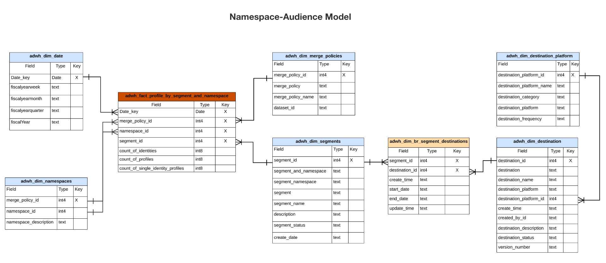

# Insights-Datenmodell von Real-Time Customer Data Platform

Die Real-time Customer Data Platform Insights-Datenmodell-Funktion stellt die Datenmodelle und SQL bereit, die die Einblicke für verschiedene Profil-, Ziel- und Segmentierungs-Widgets nutzen. Sie können diese SQL-Abfragevorlagen anpassen, um Real-Time CDP-Berichte für Ihre Marketing- und KPI-Anwendungsfälle (Key Performance Indicators) zu erstellen. Diese Insights können dann als benutzerdefinierte Widgets für benutzerdefinierte Dashboards verwendet werden. Weitere Informationen finden Sie in der Dokumentation zu Query Accelerated Store Reporting Insights . [Erstellen eines Berichtseinblicke-Datenmodells über Query Service zur Verwendung mit beschleunigten Speicherdaten und benutzerdefinierten Dashboards](../query-service/data-distiller/query-accelerated-store/reporting-insights-data-model.md).

## Voraussetzungen

Dieses Handbuch setzt ein Verständnis der [Benutzerdefinierte Dashboards-Funktion](./user-defined-dashboards.md). Lesen Sie die Dokumentation , bevor Sie mit diesem Handbuch fortfahren.

## Real-Time CDP Insight-Berichte und Anwendungsfälle

Real-Time CDP Reporting bietet Einblicke in Ihre Profildaten und ihre Beziehung zu Zielgruppen und Zielen. Verschiedene Sternschema-Modelle wurden entwickelt, um eine Vielzahl gängiger Marketing-Anwendungsfälle zu beantworten. Jedes Datenmodell kann mehrere Anwendungsfälle unterstützen.

>[!IMPORTANT]
>
>Die für die Real-Time CDP-Berichterstellung verwendeten Daten sind für eine bestimmte Zusammenführungsrichtlinie und aus der letzten täglichen Momentaufnahme korrekt.

### Profilmodell {#profile-model}

Das Profilmodell besteht aus drei Datensätzen:

- `adwh_dim_date`
- `adwh_fact_profile`
- `adwh_dim_merge_policies`

Die folgende Abbildung enthält die relevanten Datenfelder in jedem Datensatz.


#### Anwendungsfall für die Profilanzahl

Die für das Widget zur Profilanzahl verwendete Logik gibt die Gesamtzahl der zusammengeführten Profile im Profilspeicher zum Zeitpunkt der Momentaufnahme zurück. Siehe [[!UICONTROL Profilanzahl] Widget-Dokumentation](./guides/profiles.md#profile-count) für weitere Informationen.

Die SQL, die die [!UICONTROL Profilanzahl] Widget wird im ausblendbaren Abschnitt unten angezeigt.

+++SQL-Abfrage

```sql
SELECT adwh_dim_merge_policies.merge_policy_name,
  sum(adwh_fact_profile.count_of_profiles) CNT
FROM qsaccel.profile_agg.adwh_fact_profile
LEFT OUTER JOIN qsaccel.profile_agg.adwh_dim_merge_policies ON adwh_dim_merge_policies.merge_policy_id=adwh_fact_profile.merge_policy_id
WHERE adwh_fact_profile.date_key='${lastProcessDate}'
AND adwh_fact_profile.merge_policy_id=${mergePolicyId}
GROUP BY adwh_dim_merge_policies.merge_policy_name;
```

+++

#### Anwendungsfall für einzelne Identitätsprofile

Die für die [!UICONTROL Einzelne Identitätsprofile] -Widget stellt die Anzahl der Profile Ihres Unternehmens bereit, die nur über einen ID-Typ verfügen, der ihre Identität erstellt. Siehe[[!UICONTROL Einzelne Identitätsprofile] Widget-Dokumentation](./guides/profiles.md#single-identity-profiles) für weitere Informationen.

Die SQL, die die [!UICONTROL Einzelne Identitätsprofile] Widget wird im ausblendbaren Abschnitt unten angezeigt.

+++SQL-Abfrage

```sql
SELECT adwh_dim_merge_policies.merge_policy_name,
  sum(adwh_fact_profile.count_of_Single_Identity_profiles) CNT
FROM QSAccel.profile_agg.adwh_fact_profile
LEFT OUTER JOIN QSAccel.profile_agg.adwh_dim_merge_policies ON adwh_dim_merge_policies.merge_policy_id=adwh_fact_profile.merge_policy_id
WHERE adwh_fact_profile.date_key='${lastProcessDate}'
  AND adwh_fact_profile.merge_policy_id =${mergePolicyId}
GROUP BY adwh_dim_merge_policies.merge_policy_name;
```

+++

### Namespace-Modell {#namespace-model}

Das Namespace-Modell besteht aus den folgenden Datensätzen:

- `adwh_dim_date`
- `adwh_fact_profile_by_namespace`
- `adwh_dim_merge_policies`
- `adwh_dim_namespaces`

Die folgende Abbildung enthält die relevanten Datenfelder in jedem Datensatz.


#### Profile nach Identitätsanwendungsfall

Das Widget [!UICONTROL Profile nach Identität] zeigt die Aufschlüsselung der Identitäten in allen zusammengeführten Profile in Ihrem Profile Store an. Siehe [[!UICONTROL Profile nach Identität] Widget-Dokumentation](./guides/profiles.md#profiles-by-identity) für weitere Informationen.

Die SQL, die die [!UICONTROL Profile nach Identität] Widget wird im ausblendbaren Abschnitt unten angezeigt.

+++SQL-Abfrage

```sql
SELECT adwh_dim_namespaces.namespace_description,
    sum(adwh_fact_profile_by_namespace.count_of_profiles) count_of_profiles
FROM qsaccel.profile_agg.adwh_fact_profile_by_namespace
JOIN qsaccel.profile_agg.adwh_dim_namespaces ON adwh_fact_profile_by_namespace.namespace_id = adwh_dim_namespaces.namespace_id
AND adwh_fact_profile_by_namespace.merge_policy_id = adwh_dim_namespaces.merge_policy_id
WHERE adwh_fact_profile_by_namespace.merge_policy_id =${mergePolicyId}
AND adwh_fact_profile_by_namespace.date_key = '${lastProcessDate}'
GROUP BY adwh_fact_profile_by_namespace.date_key,
        adwh_fact_profile_by_namespace.merge_policy_id,
        adwh_dim_namespaces.namespace_description
ORDER BY count_of_profiles DESC
LIMIT 5;
```

+++

#### Einzelne Identitätsprofile nach Identitätsanwendungsfall

Die für die [!UICONTROL Einzelne Identitätsprofile nach Identität] -Widget zeigt die Gesamtzahl der Profile, die mit nur einer eindeutigen Kennung identifiziert werden. Siehe [Dokumentation zu einzelnen Identitätsprofilen nach Identitäts-Widgets](./guides/profiles.md#single-identity-profiles-by-identity) für weitere Informationen.

Die SQL, die die [!UICONTROL Einzelne Identitätsprofile nach Identität] Widget wird im ausblendbaren Abschnitt unten angezeigt.

+++SQL-Abfrage

```sql
SELECT
  adwh_dim_namespaces.namespace_description,
  sum(adwh_fact_profile_by_namespace.count_of_Single_Identity_profiles) count_of_Single_Identity_profiles
FROM
  qsaccel.profile_agg.adwh_fact_profile_by_namespace
  LEFT OUTER JOIN
    qsaccel.profile_agg.adwh_dim_namespaces
    ON adwh_fact_profile_by_namespace.namespace_id = adwh_dim_namespaces.namespace_id
AND adwh_fact_profile_by_namespace.merge_policy_id = adwh_dim_namespaces.merge_policy_id
WHERE
  adwh_fact_profile_by_namespace.merge_policy_id=${mergePolicyId}
  AND adwh_fact_profile_by_namespace.date_key='${lastProcessDate}'
GROUP BY
  adwh_fact_profile_by_namespace.date_key,
  adwh_fact_profile_by_namespace.merge_policy_id,
  adwh_dim_namespaces.namespace_description;
```

+++

### Zielgruppenmodell {#audience-model}

Das Zielgruppenmodell besteht aus den folgenden Datensätzen:

- `adwh_dim_date`
- `adwh_fact_profile_by_segment`
- `adwh_dim_merge_policies`
- `adwh_dim_segments`
- `adwh_dim_br_segment_destinations`
- `adwh_dim_destination`
- `adwh_dim_destination_platform`

Die folgende Abbildung enthält die relevanten Datenfelder in jedem Datensatz.


#### Anwendungsfall: Zielgruppengröße

Die für die [!UICONTROL Zielgruppengröße] Widget gibt die Gesamtzahl der zusammengeführten Profile innerhalb der ausgewählten Zielgruppe zum Zeitpunkt der letzten Momentaufnahme zurück. Siehe [[!UICONTROL Zielgruppengröße] Widget-Dokumentation](./guides/audiences.md#audience-size) für weitere Informationen.

Die SQL, die die [!UICONTROL Zielgruppengröße] Widget wird im ausblendbaren Abschnitt unten angezeigt.

+++SQL-Abfrage

```sql
SELECT adwh_fact_profile_by_segment.date_key,
       adwh_dim_merge_policies.merge_policy_name,
       adwh_dim_segments.segment,
       adwh_dim_segments.segment_name,
       sum(adwh_fact_profile_by_segment.count_of_profiles)count_of_profiles
FROM qsaccel.profile_agg.adwh_fact_profile_by_segment
LEFT OUTER JOIN qsaccel.profile_agg.adwh_dim_segments ON adwh_fact_profile_by_segment.segment_id = adwh_dim_segments.segment_id
LEFT OUTER JOIN qsaccel.profile_agg.adwh_dim_merge_policies ON adwh_fact_profile_by_segment.merge_policy_id=adwh_dim_merge_policies.merge_policy_id
WHERE adwh_fact_profile_by_segment.date_key ='${lastProcessDate}'
  AND adwh_fact_profile_by_segment.merge_policy_id=${mergePolicyId}
GROUP BY adwh_fact_profile_by_segment.date_key,
         adwh_dim_merge_policies.merge_policy_name,
         adwh_dim_segments.segment,
         adwh_dim_segments.segment_name
ORDER BY count_of_profiles DESC
LIMIT 20;
```

+++

#### Anwendungsfall zur Änderung der Zielgruppengröße

Die für die [!UICONTROL Trend zur Änderung der Zielgruppengröße] -Widget bietet eine Kantengraph-Darstellung der Differenz in der Gesamtzahl der Profile, die sich für eine bestimmte Zielgruppe qualifiziert haben, zwischen den letzten täglichen Momentaufnahmen. Siehe [[!UICONTROL Trend zur Änderung der Zielgruppengröße] Widget-Dokumentation](./guides/audiences.md#audience-size-change-trend) für weitere Informationen.

Die SQL, die die [!UICONTROL Trend zur Änderung der Zielgruppengröße] Widget wird im ausblendbaren Abschnitt unten angezeigt.

+++SQL-Abfrage

```sql
SELECT DISTINCT cast(adwh_dim_segments.create_date AS Date) Date_key, adwh_dim_merge_policies.merge_policy_name,
  count(DISTINCT adwh_dim_segments.segment_id)Segments_Added
FROM qsaccel.profile_agg.adwh_fact_profile_by_segment
JOIN qsaccel.profile_agg.adwh_dim_segments ON adwh_fact_profile_by_segment.segment_id = adwh_dim_segments.segment_id
JOIN qsaccel.profile_agg.adwh_dim_merge_policies ON adwh_fact_profile_by_segment.merge_policy_id=adwh_dim_merge_policies.merge_policy_id
WHERE Cast(adwh_dim_segments.create_date AS date) >= dateadd(DAY, - ${dayRange}, '${lastProcessDate}')
AND adwh_fact_profile_by_segment.merge_policy_id=${mergePolicyId}
GROUP BY cast(adwh_dim_segments.create_date AS date), adwh_dim_merge_policies.merge_policy_name ;
```

+++

#### Anwendungsfall für die am häufigsten verwendeten Ziele

Die in der [!UICONTROL Am häufigsten verwendete Ziele] -Widget listet die am häufigsten verwendeten Ziele Ihrer Organisation entsprechend der Anzahl der ihnen zugeordneten Zielgruppen auf. Diese Rangfolge bietet Einblicke, welche Ziele verwendet werden, und zeigt gleichzeitig, welche möglicherweise nicht genügend genutzt werden. Weitere Informationen finden Sie in der Dokumentation unter [[!UICONTROL Am häufigsten verwendete Ziele] Widget](./guides/destinations.md#most-used-destinations) für weitere Informationen.

Die SQL, die die [!UICONTROL Am häufigsten verwendete Ziele] Widget wird im ausblendbaren Abschnitt unten angezeigt.

+++SQL-Abfrage

```sql
SELECT
   adwh_dim_destination.destination_name, adwh_dim_destination.destination_id,
   count( distinct adwh_dim_br_segment_destinations.segment_id ) segment_count
FROM
   qsaccel.profile_agg.adwh_dim_destination
   join qsaccel.profile_agg.adwh_dim_br_segment_destinations
 ON
   adwh_dim_destination.destination_id = adwh_dim_br_segment_destinations.destination_id
 WHERE
   adwh_dim_destination.destination_name is not null
 group by
   adwh_dim_destination.destination_name,
   adwh_dim_destination.destination_id
   order by segment_count desc limit 5;
```

+++

#### Anwendungsfall für kürzlich aktivierte Zielgruppen

Die Logik für die [!UICONTROL Kürzlich aktivierte Zielgruppen] -Widget stellt eine Liste der Zielgruppen bereit, die zuletzt einem Ziel zugeordnet wurden. Diese Liste enthält eine Momentaufnahme der Zielgruppen und Ziele, die aktiv im System verwendet werden, und kann bei der Fehlerbehebung bei fehlerhaften Zuordnungen hilfreich sein. Siehe [[!UICONTROL Kürzlich aktivierte Zielgruppen] Widget-Dokumentation](./guides/destinations.md#recently-activated-audiences) für weitere Informationen.

Die SQL, die die [!UICONTROL Kürzlich aktivierte Zielgruppen] Widget wird im ausblendbaren Abschnitt unten angezeigt.

+++SQL-Abfrage

```sql
SELECT segment_name, segment, destination_name, a.create_time create_time
FROM qsaccel.profile_agg.adwh_dim_br_segment_destinations a
INNER JOIN qsaccel.profile_agg.adwh_dim_segments b ON a.segment_id = b.segment_id
INNER JOIN qsaccel.profile_agg.adwh_dim_destination c ON a.destination_id = c.destination_id
ORDER BY create_time desc, segment LIMIT 5;
```

+++

### Namespace-Audience-Modell

Das Modell namespace-audience besteht aus den folgenden Datensätzen:

- `adwh_dim_date`
- `adwh_dim_namespaces`
- `adwh_fact_profile_by_segment_and_namespace`
- `adwh_dim_merge_policies`
- `adwh_dim_segments`
- `adwh_dim_br_segment_destinations`
- `adwh_dim_destination`
- `adwh_dim_destination_platform`

Die folgende Abbildung enthält die relevanten Datenfelder in jedem Datensatz.



#### Profile nach Identität für einen Zielgruppen-Anwendungsfall

Die in der [!UICONTROL Profile nach Identität] -Widget bietet eine Aufschlüsselung der Identitäten über alle zusammengeführten Profile in Ihrem Profilspeicher für eine bestimmte Zielgruppe. Siehe [[!UICONTROL Profile nach Identität] Widget-Dokumentation](./guides/audiences.md#profiles-by-identity) für weitere Informationen.

Die SQL, die die [!UICONTROL Profile nach Identität] Widget wird im ausblendbaren Abschnitt unten angezeigt.

+++SQL-Abfrage

```sql
SELECT adwh_dim_namespaces.namespace_description,
  sum( adwh_fact_profile_by_segment_and_namespace.count_of_profiles) count_of_profiles
FROM qsaccel.profile_agg.adwh_fact_profile_by_segment_and_namespace
LEFT OUTER JOIN qsaccel.profile_agg.adwh_dim_namespaces
ON adwh_fact_profile_by_segment_and_namespace.namespace_id = adwh_dim_namespaces.namespace_id
AND adwh_fact_profile_by_segment_and_namespace.merge_policy_id = adwh_dim_namespaces.merge_policy_id
WHERE adwh_fact_profile_by_segment_and_namespace.segment_id = {segment_id}
AND adwh_fact_profile_by_segment_and_namespace.merge_policy_id = {merge_policy_id}
AND adwh_fact_profile_by_segment_and_namespace.date_key = '{date}'
GROUP BY adwh_dim_namespaces.namespace_description;
```

+++

### Überlagern eines Namespace-Modells

Das Überschneidungs-Namespace-Modell besteht aus den folgenden Datensätzen:

- `adwh_dim_date`
- `adwh_dim_overlap_namespaces`
- `adwh_fact_profile_overlap_of_namespace`
- `adwh_dim_merge_policies`

Die folgende Abbildung enthält die relevanten Datenfelder in jedem Datensatz.


#### Anwendungsfall: Identitätsüberschneidung (Profile)

Die in der [!UICONTROL Identitätsüberschneidung] Widget zeigt die Profilüberschneidung in Ihren **Profilspeicher** die die beiden ausgewählten Identitäten enthalten. Weitere Informationen finden Sie unter [[!UICONTROL Identitätsüberschneidung] Widget-Abschnitt des [!UICONTROL Profile] Dashboard-Dokumentation](./guides/profiles.md#identity-overlap).

Die SQL, die die [!UICONTROL Identitätsüberschneidung] Widget wird im ausblendbaren Abschnitt unten angezeigt.

+++SQL-Abfrage

```sql
SELECT Sum(overlap_col1) overlap_col1,
       Sum(overlap_col2) overlap_col2,
       coalesce(Sum(overlap_count), 0) overlap_count
  FROM
    (SELECT 0 overlap_col1,
            0 overlap_col2,
            Sum(count_of_profiles) overlap_count
     FROM qsaccel.profile_agg.adwh_fact_profile_overlap_of_namespace
     WHERE adwh_fact_profile_overlap_of_namespace.merge_policy_id = ${mergePolicyId}
       AND adwh_fact_profile_overlap_of_namespace.date_key = '${lastProcessDate}'
       AND adwh_fact_profile_overlap_of_namespace.overlap_id IN
         (SELECT adwh_dim_overlap_namespaces.overlap_id
          FROM qsaccel.profile_agg.adwh_dim_overlap_namespaces
          WHERE adwh_dim_overlap_namespaces.merge_policy_id=${mergePolicyId}
            AND adwh_dim_overlap_namespaces.overlap_namespaces IN ('${namespace1}',
                                                                   '${namespace2}')
          GROUP BY adwh_dim_overlap_namespaces.overlap_id
          HAVING Count(*) > 1)
     UNION ALL SELECT count_of_profiles overlap_col1,
                      0 overlap_col2,
                      0 overlap_count
     FROM qsaccel.profile_agg.adwh_fact_profile_by_namespace
     JOIN qsaccel.profile_agg.adwh_dim_namespaces ON
     adwh_fact_profile_by_namespace.namespace_id = adwh_dim_namespaces.namespace_id
     AND adwh_fact_profile_by_namespace.merge_policy_id = adwh_dim_namespaces.merge_policy_id
     WHERE adwh_fact_profile_by_namespace.merge_policy_id = ${mergePolicyId}
       AND adwh_fact_profile_by_namespace.date_key = '${lastProcessDate}'
       AND adwh_dim_namespaces.namespace_description = '${namespace1}'
     UNION ALL SELECT 0 overlap_col1,
                      count_of_profiles overlap_col2,
                      0 Overlap_count
     FROM qsaccel.profile_agg.adwh_fact_profile_by_namespace
     JOIN qsaccel.profile_agg.adwh_dim_namespaces ON
     adwh_fact_profile_by_namespace.namespace_id = adwh_dim_namespaces.namespace_id
     AND adwh_fact_profile_by_namespace.merge_policy_id = adwh_dim_namespaces.merge_policy_id
     WHERE adwh_fact_profile_by_namespace.merge_policy_id = ${mergePolicyId}
       AND adwh_fact_profile_by_namespace.date_key = '${lastProcessDate}'
       AND adwh_dim_namespaces.namespace_description = '${namespace2}' ) a;
```

+++

### Namespace nach Zielgruppenmodell überlagern

Der Überschneidungs-Namespace nach Zielgruppenmodell besteht aus den folgenden Datensätzen:

- `adwh_dim_date`
- `adwh_dim_overlap_namespaces`
- `adwh_fact_profile_overlap_of_namespace_by_segment`
- `adwh_dim_merge_policies`
- `adwh_dim_segments`
- `adwh_dim_br_segment_destinations`
- `adwh_dim_destination`
- `adwh_dim_destination_platform`

Die folgende Abbildung enthält die relevanten Datenfelder in jedem Datensatz.


#### Anwendungsfall: Identitätsüberschneidung (Zielgruppen)

Die in der [!UICONTROL Zielgruppen] Dashboard [!UICONTROL Identitätsüberschneidung] -Widget veranschaulicht die Überschneidung von Profilen, die die beiden ausgewählten Identitäten für eine bestimmte Zielgruppe enthalten. Weitere Informationen finden Sie unter [[!UICONTROL Identitätsüberschneidung] Widget-Abschnitt des [!UICONTROL Zielgruppen] Dashboard-Dokumentation](./guides/audiences.md#identity-overlap).

Die SQL, die die [!UICONTROL Identitätsüberschneidung] Widget wird im ausblendbaren Abschnitt unten angezeigt.

+++SQL-Abfrage

```sql
SELECT
   Sum(overlap_col1) overlap_col1,
   Sum( overlap_col2) overlap_col2,
   Sum(overlap_count) Overlap_count
FROM
   (
      SELECT
         0 overlap_col1,
         0 overlap_col2,
         Sum(count_of_profiles) Overlap_count
      FROM
         qsaccel.profile_agg.adwh_fact_profile_overlap_of_namespace_by_segment
      WHERE
         adwh_fact_profile_overlap_of_namespace_by_segment.segment_id = $ {segmentId}
         and adwh_fact_profile_overlap_of_namespace_by_segment.merge_policy_id =$ {mergePolicyId}
         and adwh_fact_profile_overlap_of_namespace_by_segment.date_key = '${lastProcessDate}'
         and adwh_fact_profile_overlap_of_namespace_by_segment.overlap_id IN
         (
            SELECT
               adwh_dim_overlap_namespaces.overlap_id
            FROM
               qsaccel.profile_agg.adwh_dim_overlap_namespaces
            WHERE
               adwh_dim_overlap_namespaces.merge_policy_id =$ {mergePolicyId}
               AND adwh_dim_overlap_namespaces.overlap_namespaces IN
               (
                  '${namespace1}',
                  '${namespace2}'
               )
            GROUP BY
               adwh_dim_overlap_namespaces.overlap_id
            HAVING
               Count(*) > 1
         )
      UNION ALL
      SELECT
         count_of_profiles overlap_col1,
         0 overlap_col2,
         0 Overlap_count
      FROM
         qsaccel.profile_agg.adwh_fact_profile_by_segment_and_namespace
         LEFT OUTER JOIN
            qsaccel.profile_agg.adwh_dim_namespaces
            ON adwh_fact_profile_by_segment_and_namespace.namespace_id = adwh_dim_namespaces.namespace_id
            and adwh_fact_profile_by_segment_and_namespace.merge_policy_id = adwh_dim_namespaces.merge_policy_id
      WHERE
         adwh_dim_namespaces.namespace_description = '${namespace1}'
         and adwh_fact_profile_by_segment_and_namespace.segment_id = $ {segmentId}
         and adwh_fact_profile_by_segment_and_namespace.merge_policy_id =$ {mergePolicyId}
         and adwh_fact_profile_by_segment_and_namespace.date_key = '${lastProcessDate}'
      UNION ALL
      SELECT
         0 overlap_col1,
         count_of_profiles overlap_col2,
         0 Overlap_count
      FROM
         qsaccel.profile_agg.adwh_fact_profile_by_segment_and_namespace
         LEFT OUTER JOIN
            qsaccel.profile_agg.adwh_dim_namespaces
            ON adwh_fact_profile_by_segment_and_namespace.namespace_id = adwh_dim_namespaces.namespace_id
            and adwh_fact_profile_by_segment_and_namespace.merge_policy_id = adwh_dim_namespaces.merge_policy_id
      WHERE
         adwh_dim_namespaces.namespace_description = '${namespace2}'
         and adwh_fact_profile_by_segment_and_namespace.segment_id = $ {segmentId}
         and adwh_fact_profile_by_segment_and_namespace.merge_policy_id =$ {mergePolicyId}
         and adwh_fact_profile_by_segment_and_namespace.date_key = '${lastProcessDate}'
   )
   a;
```

+++
