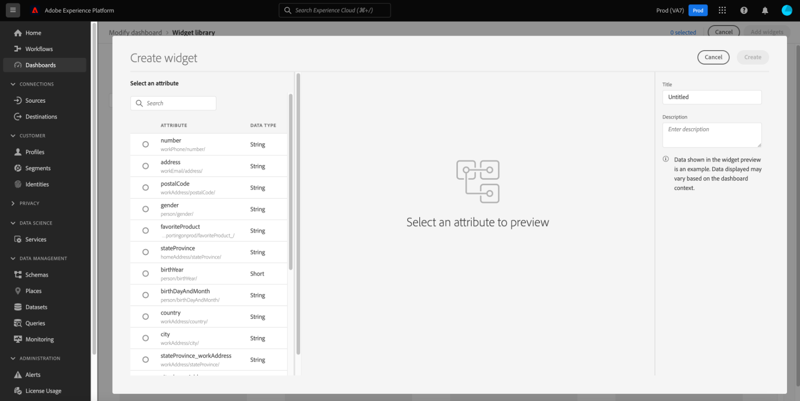

# Erstellen benutzerdefinierter Widgets für Dashboards

In Adobe Experience Platform können Sie die Daten Ihres Unternehmens mithilfe mehrerer Dashboards anzeigen und damit interagieren. Sie können bestimmte Dashboards auch aktualisieren, indem Sie Ihrer Dashboard-Ansicht neue Widgets hinzufügen. Zusätzlich zu den von Adobe bereitgestellten Standard-Widgets können Sie auch benutzerdefinierte Widgets erstellen und diese in Ihrem gesamten Unternehmen freigeben.

Dieses Handbuch enthält schrittweise Anweisungen zum Erstellen und Hinzufügen benutzerdefinierter Widgets zu den Dashboards [!UICONTROL Profile], [!UICONTROL Segmente] und [!UICONTROL Ziele] in der Platform-Benutzeroberfläche.

Weiterführende Informationen zu Standard-Widgets finden Sie im Handbuch zum Hinzufügen von Standard-Widgets zu Dashboards](standard-widgets.md).[

>[!NOTE]
>
>Die im Dashboard [!UICONTROL Lizenznutzung] angezeigten Widgets können nicht angepasst werden. Weitere Informationen zu diesem eindeutigen Dashboard finden Sie in der [Dashboard-Dokumentation zur Lizenzverwendung](../guides/license-usage.md).

## Widget-Bibliothek {#widget-library}

Dieses Handbuch erfordert Zugriff auf die [!UICONTROL Widget-Bibliothek] in Experience Platform. Um mehr über die Widget-Bibliothek und den Zugriff darauf über die Benutzeroberfläche zu erfahren, lesen Sie zunächst die [Übersicht über die Widget-Bibliothek](widget-library.md).

## Erste Schritte mit benutzerdefinierten Widgets

Innerhalb der Widget-Bibliothek können Sie mit dem Tab **[!UICONTROL Benutzerdefiniert]** Widgets erstellen und für andere Benutzer in Ihrer Organisation freigeben, um das Erscheinungsbild Ihrer Dashboards anzupassen.

>[!IMPORTANT]
>
>Ihr Unternehmen kann maximal 20 benutzerdefinierte Widgets in der Widget-Bibliothek erstellen.

Wählen Sie die Registerkarte **[!UICONTROL Benutzerdefiniert]** aus, um mit der Erstellung benutzerdefinierter Widgets zu beginnen oder benutzerdefinierte Widgets anzuzeigen, die bereits von Ihrem Unternehmen erstellt wurden.

## Benutzerdefiniertes Widget erstellen

Um ein benutzerdefiniertes Widget zu erstellen, wählen Sie **[!UICONTROL Erstellen]** aus der Mitte der Widget-Bibliothek aus. Wenn benutzerdefinierte Widgets bereits erstellt wurden, wählen Sie **[!UICONTROL Widget erstellen]** aus der oberen rechten Ecke der Widget-Bibliothek aus.

Im Dialogfeld **[!UICONTROL Widget erstellen]** können Sie einen Titel und eine Beschreibung für Ihr neues Widget angeben und das Attribut auswählen, das vom Widget angezeigt werden soll.

>[!NOTE]
>
>Die Liste der verfügbaren Attribute hängt vom für Ihr Unternehmen konfigurierten Schema ab. Weitere Informationen zur Attributauswahl und zur Schemakonfiguration finden Sie im Handbuch zum [Bearbeiten des Schemas zum Erstellen benutzerdefinierter Widgets](edit-schema.md).

Um ein Attribut auszuwählen, wählen Sie das Optionsfeld neben dem Attribut aus, das Sie hinzufügen möchten.

>[!NOTE]
>
>Pro Widget kann nur ein Attribut ausgewählt und pro Attribut kann nur ein Widget erstellt werden. Wenn bereits ein Widget für ein Attribut erstellt wurde, wird das Attribut grau ausgeblendet angezeigt.

## Anzeigen einer Vorschau eines benutzerdefinierten Widgets

Im Dialogfeld wird eine Vorschau des neuen Widgets angezeigt, in der ein horizontales Balkendiagramm mit nachgeahmten Daten angezeigt wird.

>[!NOTE]
>
>Die einzige Metrik, die derzeit für alle Attribute unterstützt wird, ist die Anzahl der Profile und die einzige Visualisierung, die derzeit für benutzerdefinierte Widgets unterstützt wird, ist ein horizontales Balkendiagramm.
>
>Die im Beispiel-Widget angezeigten Daten dienen nur zu Veranschaulichungszwecken. Die Vorschau zeigt keine tatsächlichen Daten aus Ihrer Organisation an.

Um Ihr neues Widget zu speichern und zur Registerkarte [!UICONTROL Benutzerdefiniert] zurückzukehren, wählen Sie **[!UICONTROL Erstellen]** aus. Ihr neues Widget kann jetzt zu einem Dashboard hinzugefügt werden, indem Sie das Widget aus der Bibliothek auswählen und **[!UICONTROL Widget hinzufügen]** auswählen.

## Benutzerdefiniertes Widget archivieren

Nachdem ein Widget zur Bibliothek hinzugefügt wurde, kann es mithilfe der Schaltfläche **[!UICONTROL Archivieren]** archiviert werden. Sie können das Widget auch bearbeiten, um die Titel- oder Beschreibungsfelder zu aktualisieren.

## Nächste Schritte

Nach dem Lesen dieses Dokuments können Sie auf die Widget-Bibliothek zugreifen und sie zum Erstellen und Hinzufügen benutzerdefinierter Widgets für Ihre Organisation verwenden. Informationen zum Ändern der Größe und Position von Widgets, die im Dashboard angezeigt werden, finden Sie im Handbuch [Dashboards ändern](modify.md).
